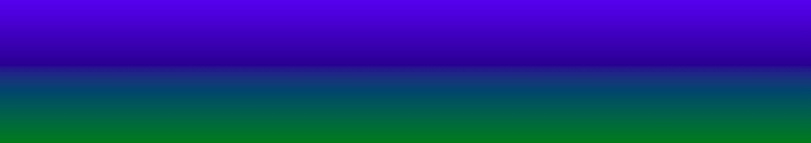
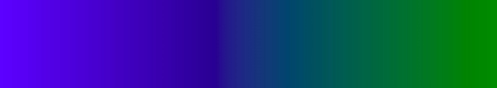
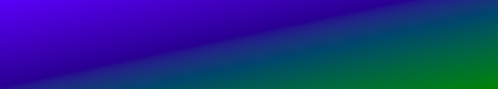
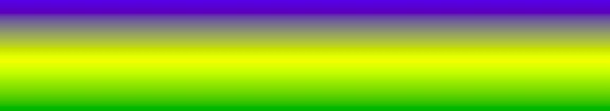

The CSS `linear-gradient` function creates an image that consists of a progressive transition between two or more colors along a straight line. The result is a data type object `gradient`, which is a special type `image`.

## Top to Bottom

In this example shows a linear gradient that starts at the top. It starts blue, transitioning green:

```css
background-image: linear-gradient(to bottom, blue, green);
```



## Left to Right

In this example shows a linear gradient that begins on the left. It starts blue, transitioning yellow:

```css
background-image: linear-gradient(to right, blue, green);
```



## Diagonal

You can make a gradient diagonally by specifying the horizontal and vertical starting position.

In this example shows a linear gradient that starts at the top left (and goes to the bottom right). It starts blue, transitioning yellow:

```css
background-image: linear-gradient(to bottom right, blue, green);
```



If you want to control the direction of the gradient more, you can define the angle instead of predefined directions (bottom, up, right, left, bottom right, etc.). A value of `0deg` is equivalent to to top. A value of `90deg` is equivalent `to right`. A value of `180deg` is equivalent `to bottom`.

```css
background-image: linear-gradient(135deg, blue, green);
```

## Multiple Color

In this example shows a linear gradient (from top to bottom) with multiple color stops:

```css
background-image: linear-gradient(to bottom, blue, yellow, green);
```


