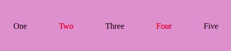

The `:nth-child` pseudo-class allows to select one and more elements based on their source order.
```html
<ul>
  <li>One</li>
  <li>Two</li>
  <li>Three</li>
  <li>Four</li>
  <li>Five</li>
</ul>
```
Let’s look at simple examples for how this can be do:

## Select the first list item
```css
li:nth-child(1) {
  color: red;
}
```
Also, you can use `first-child` pseudo-class for this
```css
li:first-child {
  color: red;
}
```


## Select the 5th list item
```css
li:nth-child(5) {
  color: red;
}
```


## Select every child elements whose index is odd
```css
li:nth-child(odd) {
  color: red;
}
```


## Select every child elements whose index is even
```css
li:nth-child(even) {
  color: red;
}
```


## Select every 3rd list item starting with first
```css
li:nth-child(3n — 2) {
  color: red;
}
```


## Select every 3rd list item starting with 2nd
```css
li:nth-child(3n — 1) {
  color: red;
}
```

  
## Select every 3rd child item
```css
li:nth-child(3n) {
  color: red;
}
```


## Select the first three items of the list
```css
li:nth-child(-n+3) {
  color: red;
}
```

      
## Select the last element of the list
```css
li:last-child {
  color: red;
}
```

 