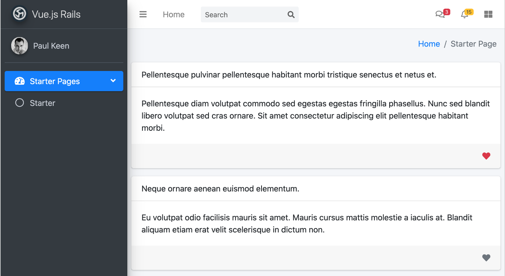

The logic of small applications can be present as a series of transactions. Using the Transaction Scripts pattern, we get an application that is easier to maintain, to cover with tests and to scale.


## The Problem Setup
There is a Ruby on Rails API application that has Post, User, and Like models. Users should be able to like posts.



Let’s add a controller that processes click on like buttons.

```ruby
module Api
  class LikesController < ApplicationController
    def update
      @user = User.find(params['user_id'])
      @post = Post.find(params['post_id'])
      
      like = @post.likes.find_or_initialize_by(user: @user)

      if like.persisted?
        like.destroy!
        render json: { isLiked: false }
      else
        like.save!
        render json: { isLiked: true }
      end
    end
  end
end
```
### The obvious disadvantages of this code are:
- The controller implements business logic, although controllers should be only coordinate the interaction between the user, the views, and the model.
- To cover this code with tests, you need to test the entire action of the controller. To test the controller, you usually need to do more preconditions.
- If you have two controllers for likes, you need to repeat code.

### The tests first
Let’s write a test and thus solve two problems:
- Define the service interface.
- Get the finished test.

```ruby
require 'test_helper'

class ToggleLikeActionScriptTest < ActiveSupport::TestCase
  def setup
    @user = users(:john_doe)
    @post = posts(:lorem_ipsum)
  end

  def test_it_creates_like
    result = ToggleLikeActionScript.new(@user, @post).perform

    assert result.value
    assert @user.likes.where(post: @post).present?
  end

  def test_it_destroys_like
    @user.likes.create(post: @post)

    result = ToggleLikeActionScript.new(@user, @post).perform

    assert_not result.value
    assert @user.likes.where(post: @post).blank?
  end

  def test_it_show_errros_on_fail_case
    result = ToggleLikeActionScript.new(@user, nil).perform

    assert_nil result.value
    assert_not_empty result.errors
  end
end
```
Now you have a test and you can implement Service.

## Service implementation
From the tests, you can see that the service is most closely follows the [Transaction Script pattern](https://martinfowler.com/eaaCatalog/transactionScript.html)	 or kind of Service Object.
> The Transaction Script should follow the Single Responsibility Principle.

```ruby
class ToggleLikeActionScript
  Result = Struct.new(:success?, :errors, :value)

  def initialize(user, post)
    @user = user
    @post = post
  end

  def perform
    like = @post.likes.find_or_initialize_by(user: @user)

    if like.persisted?
      like.destroy!
      Result.new(true, [], false)
    else
      like.save!
      Result.new(true, [], true)
    end
  rescue StandardError => e
    Result.new(false, [e], nil)
  end
end
```
So, we have a service and test. Let’s, clean up the controller:

```ruby
module Api
  class LikesController < ApplicationController
    def update
      @user = User.find(params["user_id"])
      @post = Post.find(params["post_id"])

      result = ToggleLikeActionScript.new(@user, @post).perform

      if result.success?
        render json: { isLiked: result.value }
      else
        render json: { errors: result.errors }
      end
    end
  end
end
```
As you can see, our controller has now looked cleaner. 'toggle like' functionality now takes only one line and by the name of the class, we can immediately understand what is happening in Transaction Script.

## Recommended transaction script structure
- The initialization method with incoming arguments.
- The single public method that runs the action.
- OpenStruct with a success? and either a payload or an error as a result. (This item is desirable but not required)

## When to use the Transaction Scripts
- The action is complex
- The action involves multiple models
- Using internal services
- When you are going to add ActiveRecord callback but only for one case

## The pros of the transaction script usage
- The controller does not deal with business logic
- The code could be reused without duplication
- Easier to test, a test environment reproduction is not difficult
- The application structure becomes cleaner and easier to maintain