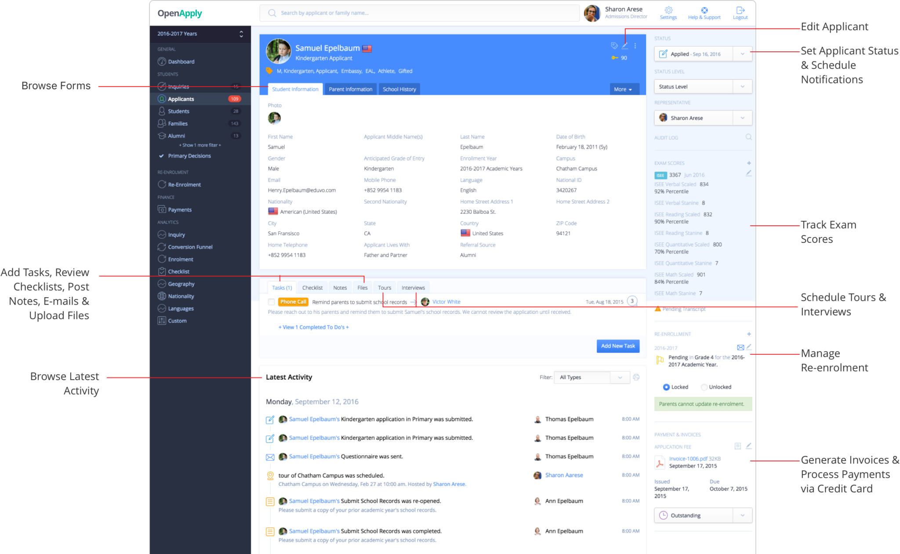
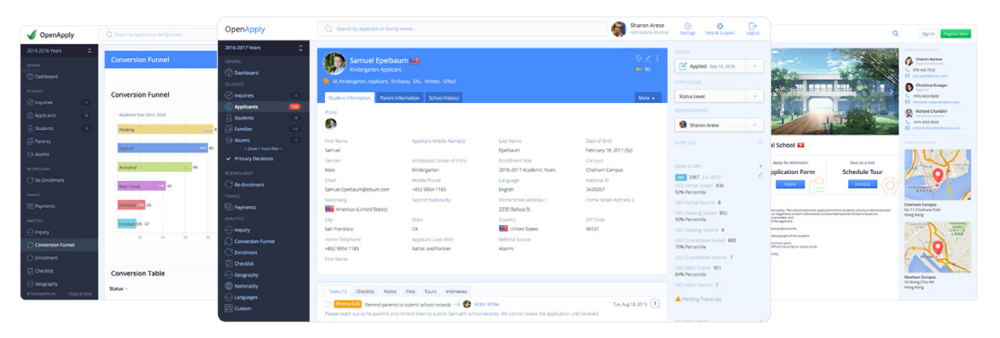
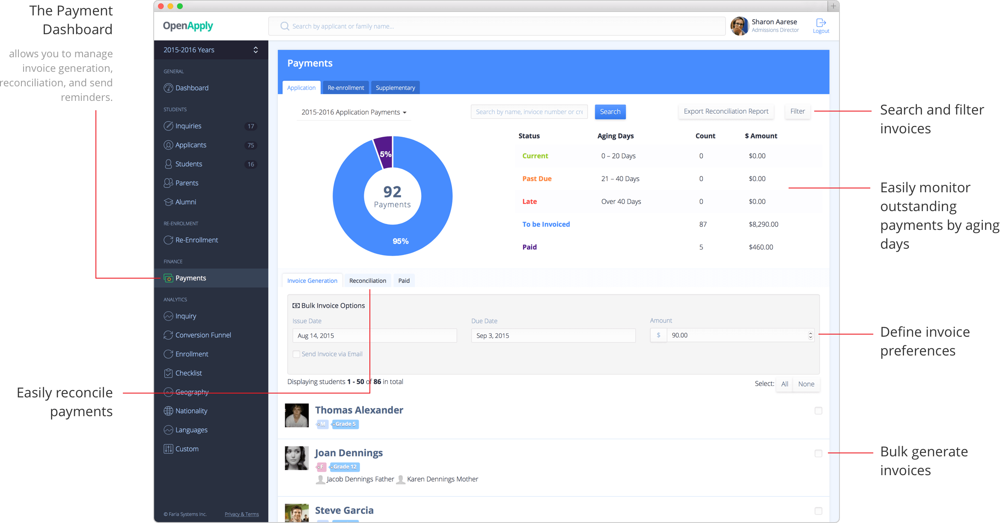

 on [Unsplash](https://unsplash.com/search/photos/education?utm_source=unsplash&utm_medium=referral&utm_content=creditCopyText)](file_0.jpeg)

***As its client base grew, Faria Education Group (FEG) needed to ensure its [OpenApply](https://openapply.com/) product could accommodate increasing demand. The problem? There were a lot (and we mean…a lot) of bugs within the code, and FEG didn’t have any governing project management structure or unified documentation processes in place to address the growing issue.***

If you’ve ever gone through a school admissions process, you know just how arduous it can be. You have to deal with paperwork, essays, tests, interviews, and likely much more. It can be overwhelming — and that’s not even considering the anxiety of waiting to find out if you got in.

With all of that in mind, [FEG](https://www.fariaedu.com/) created [OpenApply](https://openapply.com/), an online platform to help simplify the admissions and enrollment processes for applicants around the world. [OpenApply](https://openapply.com/) supports international schools by providing a paperless, integrated, and seamless online system that helps ease the stress of everyone involved.

But as [FEG’s](https://www.fariaedu.com/) customer base grew, the company became increasingly frustrated. They were running into various bugs in the code and needed developers with ideas for how to implement new solutions that would solve them. They needed a team on board to stop regressions, build a foundation, and scale feature development for faster growth. They couldn’t find the right team for the job — until they hired [JetThoughts](https://www.jetthoughts.com/).

## Debugging, Building, and Increasing Profits

To begin, we had to tackle the unstable code containing hundreds of [bugs](https://en.wikipedia.org/wiki/Software_bug). We ensured quality work by treating it as if we were constructing a complex tower, knowing that each line of code was like a brick — and each brick was crucial to the overall stability of the final product.

We rewrote and redesigned the entire user interface, contending with a very tight timeline, and we upgraded the existing code within [Ruby on Rails](https://rubyonrails.org/), including all dependencies that were previously unsupported and thus creating security risks for the product.

Additionally, we created a backend solution enabling new features and/or new changes to go live within two days (improved from the existing two-week period, which significantly reduced operational costs for the client).

## Technical Challenges and Solutions

Taking into account all of the above, plus the installation of new tools for added confidence, this work took a total of 6 months. Afterward, we saw drastic improvements in the performance of the product.

And, of course, with better efficiency and a more user-friendly product, [FEG](https://www.fariaedu.com/) experienced an immediate increase in existing customer satisfaction and retention, as well as new customer growth leading to profits directly tied to our work.

Below are some technical highlights from our work with FEG:

* Enhanced code readability to set the product up for current and future success. Our code quality rank on [Quality by Code Climate](https://codeclimate.com/quality/) was raised from level F to A.

* Significantly reduced bug risks by introducing code practices and efficient tests. Whereas a single test used to take up to 2 minutes to launch, they now take just 25 seconds.

* Reduced product application launch from 2 minutes to 20 seconds.

* Reduced average request processing time from 3 seconds to 0.2 seconds and the average page rendering time dropped from 600 ms to 200 ms.

* Optimized automated workflow that reduced project setup time for new employees from 2 weeks to just 20 minutes.

## Streamlined Processes for Growth

Technical bugs obviously cause technical issues. But beyond that, they cause internal project and team management issues, as well. In order to maximize a team’s time, there need to be processes in place to ensure all members are on the same page and working toward common goals efficiently.

We added performance analytics so the FEG team can assess interface performance and prevent regressions. We also established project management processes that eliminated role-related confusion and allowed managers and developers to work within realistic time- and workload-frameworks.

## Team Expansion

As a result of our work restructuring OpenApply’s development processes, [FEG](https://www.fariaedu.com/) asked us to build out its internal development team for the platform. The team has doubled in 3 months (from 10 to 20 developers), and the level of Bus Factor was raised from 1 person to 5.

Additionally, we reduced the time required to onboard new employees and initiated a plan to make a softer barrier of entry so that developers could not only get hired but also add safe and tested code very quickly. This helped reduce the client’s training, development, and support costs without sacrificing quality.

***With the addition of a more empowered workforce, an established system for streamlined growth, and an improved overall product, OpenApply is now able to more efficiently help both students and schools throughout the admissions and enrollment processes, easing the stress of everyone involved.***

**Paul Keen** is an Open Source Contributor and a Chief Technology Officer at [JetThoughts](https://www.jetthoughts.com). Follow him on [LinkedIn](https://www.linkedin.com/in/paul-keen/) or [GitHub](https://github.com/pftg).
>  If you enjoyed this story, we recommend reading our [latest tech stories](https://jtway.co/latest) and [trending tech stories](https://jtway.co/trending).
