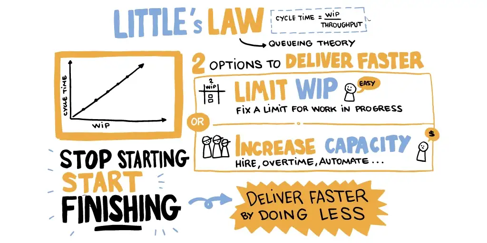

A work-in-progress (WIP) limit is used in agile project management to improve team effectiveness. The idea behind WIP limits is to limit the number of tasks a team works on at any given time. By limiting the work in progress, teams can focus on completing tasks more efficiently and effectively.

Here are some ways in which WIP limits can help to improve team effectiveness:

#### Increased focus:

With a WIP limit, team members are less likely to be overwhelmed by multiple tasks and can focus more on completing each task to the best of their abilities. This can lead to higher quality work and more efficient use of time.

#### Better prioritization:

WIP limits force teams to prioritize their work and focus on the most critical tasks. This can help teams avoid wasting time on low-priority tasks and instead focus on the tasks that will have the most significant impact.

#### Improved collaboration:

WIP limits encourage team members to collaborate to complete tasks more quickly. This can help foster a sense of collaboration and teamwork, leading to better communication and coordination within the team.

#### Reduced multitasking:

WIP limits discourage multitasking and encourage team members to focus on one task at a time. This can help to reduce the harmful effects of multitasking, such as increased stress and lower productivity.

---

Overall, WIP limits can be a valuable tool for improving team effectiveness. By limiting the work in progress at any given time, teams can focus on completing tasks more efficiently and effectively, leading to better results and improved collaboration.