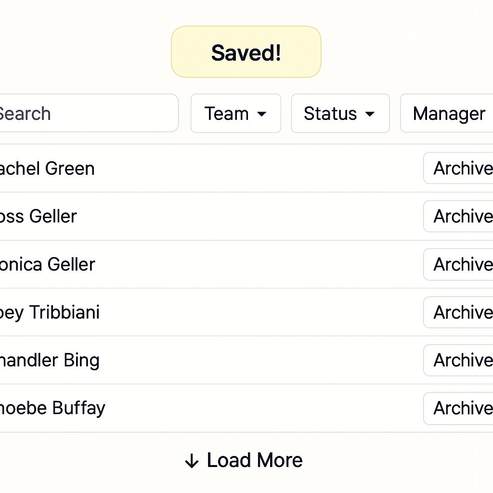

Despite [Hotwire's](https://hotwired.dev/) growing popularity, many developers struggle with implementing it correctly. Common pitfalls lead to broken interactions, performance bottlenecks, or unmaintainable code. In this guide, I'll walk you through the idiomatic integration of Hotwire for the most common use case: a browse page with instant search, infinite scrolling, dynamic per-record actions, and cursor-based pagination—all with minimal JavaScript and maximum performance.

> **TL;DR:** This post shows you how to build an interactive employee directory with instant search, dynamic forms, and infinite scrolling using just Hotwire (minimal JS).

## 5-Minute Quick Start Guide

For the impatient developers, here's the executive summary:

1. **Create Search Form with Dynamic Fields**: Encapsulate search logic outside your controller 
2. **Structure your HTML with Turbo Frames**: Wrap your search form and results table in frames
3. **Add auto-submission with Stimulus**: Create a 5-line controller to debounce input events
4. **Setup infinite scrolling**: Use auto-loading next pages with lazy loading turbo frames
5. **Respond with Turbo Streams**: Update just what changed, not the entire page

Now let's dive into the details!

## Understanding When to Use Turbo Frames vs. Streams

Before we implement anything, let's clarify which Hotwire tool fits each job:

| When to use Turbo Frames | When to use Turbo Streams |
|--------------------------|---------------------------|
| Updating a single, isolated section | Updating multiple parts of the page at once |
| Natural parent-child relationships | Non-hierarchical updates (flash messages) |
| Simple replacements | Complex operations (append, prepend, remove) |
| Lazy-loading content | Real-time updates from broadcasts |

For our search functionality, we'll use both: frames for the overall structure and streams for the dynamic updates.

## The Technical Patterns We'll Cover

This guide focuses on implementing these key patterns with minimal JavaScript:

1. **Instant search with on-keyup events**
2. **Dynamic filtering with dropdowns**
3. **Efficient pagination without page reloads**
4. **Flash message updates**
5. **Conditional action links and toggles**

We'll use an employee listing page as our practical example.

## 1. The Search: Form Object Pattern in 3 Steps

Let's be honest—no one wants a 200-line controller method full of filtering logic. Here's how we corral that filter chaos into a single object:

```ruby
# app/models/employee/filter.rb
class Employee::Filter
  include ActiveModel::Model
  
  PERMITTED_PARAMS = [:query, :team_id, :status, :manager_id]
  
  attr_accessor *PERMITTED_PARAMS
  
  def initialize(attributes = {})
    super(attributes || {})
  end
  
  def apply(scope)
    scope
      .then { |s| query.present? ? s.search(query) : s }
      .then { |s| team_id.present? ? s.where(team_id:) : s }
      .then { |s| status.present? ? s.where(status:) : s }
      .then { |s| manager_id.present? ? s.where(manager_id:) : s }
  end
  
  def to_param
    {
      query: query,
      team_id: team_id,
      status: status,
      manager_id: manager_id
    }.compact # Removes nil values
  end
  
  def blank?
    to_param.empty?
  end
end
```

> **🧠 Why use a [Form Object](https://thoughtbot.com/ruby-science/introduce-form-object.html)?** Without this, your controller becomes a dumping ground for filter logic or your model gets bloated with scopes that only apply to this specific UI. Form objects give you:
> - **Testability**: Unit test filters without controller overhead
> - **Reusability**: The same filter works across different views or APIs
> - **Clean parameters**: Explicit whitelist prevents mass assignment vulnerabilities

## 2. Implementing Controller Logic That Won't Make You Cry

Your controller should be thin and focused on coordination. Here's how we keep it simple:

```ruby
# app/controllers/admin/employees_controller.rb
module Admin
  class EmployeesController < BaseController
    before_action :set_filter, only: [ :index, :search ]
    # ... other before_actions ...

    def index
      @teams = Team.ordered
      @managers = Employee.visible.managers
    end

    def search
      employees = @filter.apply(employees_collection)

      @pagy, @employees = pagy_keyset(employees)

      respond_to do |format|
        format.turbo_stream
      end
    end

    # ... other actions ...

    private

    def employees_collection
      # Base query with eager loading to avoid N+1 issues
      Employee
        .featured
        .includes(:manager, :team, direct_reports: { snippets: :week })
        .order(email: :asc)
    end

    def set_filter
      @filter = Employee::Filter.new(filter_params)
    end

    def filter_params
      params[:employee_filter].permit(*Employee::Filter::PERMITTED_PARAMS) if params[:employee_filter]
    end
  end
end
```

> **🚀 Performance Tip:** Notice the `includes` to eager load associations? This prevents N+1 queries that would kill your server under load. Always profile with the Bullet gem if you're filtering large datasets.

## 3. Building the Interactive Search Form That Updates as You Type

Here's the magic ingredient - a search form that submits automatically when the user types or changes a dropdown:

```html+erb
<%# app/views/admin/employees/_search_and_filters.html.erb %>
<section id="name_filter">
  <%= form_with(
        model: filter, 
        url: admin_employees_path, 
        role: "search", 
        method: :get, 
        local: false,  # This is key for AJAX form submission
        data: {
          controller: "auto-submit",  # Stimulus controller
          turbo_frame: :filtered_employees,  # Target frame to update
          action: "input->auto-submit#submit change->auto-submit#submit",  # Events that trigger submission
          auto_submit_delay_value: 300  # Debounce delay in milliseconds
        }
      ) do |form| %>
    <fieldset role="group">
      <%= form.search_field(:query, placeholder: true, autofocus: true) %>
      <%= link_to "Clear",
        admin_employees_path(employee_filter: Employee::Filter.new.to_param),
        class: "secondary", role: "button",
        data: { turbo_frame: :categorized_employees } %>
    </fieldset>

    <div class="grid">
      <%= form.select(:status, employee_statuses_choices, { include_blank: "Non-Archived" }) %>
      <%= form.collection_select(:team_id, teams, :id, :name, { include_blank: "All Teams" }) %>
      <%= form.collection_select(:manager_id, @managers, :id, :name, { include_blank: "All Managers" }) %>
    </div>
  <% end %>
</section>
```

The secret sauce is this tiny Stimulus controller that debounces input events:

```javascript
// app/javascript/controllers/auto_submit_controller.js
import { Controller } from "@hotwired/stimulus"

export default class extends Controller {
  static values = { delay: { type: Number, default: 300 } }
  
  submit() {
    clearTimeout(this.timeout)
    
    this.timeout = setTimeout(() => {
      this.element.requestSubmit()
    }, this.delayValue)
  }
}
```

> **⚠️ Usability Warning:** Don't set the delay too low! A 300ms delay prevents hammering your server while still feeling instant to users. Test with real users before tweaking this value.

## 4. Structuring Your HTML Tables with Turbo (Without Breaking Them)

HTML tables require special care with Turbo. You can't wrap `<tr>` elements directly with Turbo Frames as it breaks HTML validity. Here's how to do it right:

```html
<%# app/views/admin/employees/_employees_list.html.erb %>
<%= turbo_frame_tag :categorized_employees do %>
  <%= render "search_and_filters", filter: @filter, teams: @teams %>

  <%= turbo_frame_tag :filtered_employees do %>
    <table class="striped">
      <thead>
        <tr>
          <th>Email</th>
          <th>Name</th>
          <!-- Other headers -->
          <th>Actions</th>
        </tr>
      </thead>
      <tbody id="employees_table_rows">
        <% if employees.empty? %>
          <tr>
            <td colspan="6">No items found.</td>
          </tr>
        <% else %>
          <%= turbo_frame_tag(
                :employees_first_page,
                src: search_admin_employees_path(employee_filter: @filter.to_param, format: :turbo_stream),
                loading: :lazy,
                data: { turbo_cache: false }
              ) %>
        <% end %>
      </tbody>
    </table>
  <% end %>
<% end %>
```

> **🔍 Key Concept:** Notice our nested frame structure:
> - Outer frame `:categorized_employees` contains search + results
> - Inner frame `:filtered_employees` holds just the table
> - We use `turbo_cache: false` to prevent stale results

### The Dynamic Search Form

An important architectural decision is wrapping both the search form and results in a single Turbo Frame. This isn't just organizational—it's essential for dynamic fields that depend on search context:

1. **Interdependent Filters**: When selecting a team should filter available managers, both components need updating together.

2. **Context-Aware Options**: Some filter options may only be relevant based on other selections (e.g., team-specific statuses).

3. **Efficiency in Re-rendering**: When certain filter changes require rebuilding multiple form elements, a shared frame ensures consistent updates.

4. **State Preservation**: On larger changes, preserving the relationship between filters and their results prevents UI inconsistency.

For example, imagine selecting "Engineering" team changes available manager options. With a single frame, one request can update both the managers dropdown and the filtered results without awkward intermediate states:

```erb
<%# In your controller response %>
<%= turbo_stream.update :categorized_employees do %>
  <%= render "search_and_filters", filter: @filter, teams: @teams, managers: @filtered_managers %>
  <%= render "filtered_results", employees: @employees %>
<% end %>
```

Without this pattern, managing dependent form fields becomes a complicated chain of individual updates.

## 5. Handling Turbo Stream Responses Without the Headaches

When the search form is submitted, your controller responds with this elegant Turbo Stream:

```erb
<%# app/views/admin/employees/search.turbo_stream.erb %>
<%= turbo_stream.update "employees_table_rows" do %>
  <%= render partial: "admin/employees/employee", collection: @employees %>
  <%= render "load_next_employees" if @pagy.next %>
<% end %>
```

See how this updates just the table rows without refreshing anything else? That's what makes the interaction feel native and smooth.

## 6. Implementing "Load More" for Infinite Scrolling (No More Page Numbers!)

For a modern UX, forget about page numbers. Here's how to implement a "Load More" button:

```erb
<%# app/views/admin/employees/_load_next_employees.html.erb %>
<tr id="load_more">
  <td colspan="6" class="text-center">
    <%= link_to "Load More", 
                search_admin_employees_path(
                  employee_filter: @filter.to_param, 
                  after: @employees.last.id, 
                  format: :turbo_stream
                ),
                class: "button outline", 
                data: { turbo_stream: true } %>
  </td>
</tr>
```

When clicking "Load More", we append new rows instead of replacing existing ones:

```erb
<%# app/views/admin/employees/search_more.turbo_stream.erb %>
<%= turbo_stream.remove "load_more" %>
<%= turbo_stream.append "employees_table_rows" do %>
  <%= render partial: "admin/employees/employee", collection: @employees %>
  <%= render "load_next_employees" if @pagy.next %>
<% end %>
```

> **💡 Pro Tip:** Traditional offset pagination is terrible for performance on large datasets. Use keyset pagination (based on IDs or timestamps) for dramatically faster queries when implementing "Load More" patterns.

## 7. Flash Messages That Update Without Page Refreshes

Flash messages should feel seamless too. Here's the pattern:

```erb
<%# app/views/shared/_flash.html.erb %>
<%= turbo_frame_tag :flash do %>
  <% flash.each do |type, message| %>
    <% next if message.blank? %>
    <article class="<%= type %>">
      <span class="content"><%= message %></span>
      <button class="close" onclick="this.parentElement.remove()" aria-label="Close">✕</button>
    </article>
  <% end %>
<% end %>
```

Then in your controller actions:

```ruby
def destroy
  @employee.destroy!
  
  respond_to do |format|
    format.html { redirect_to admin_employees_path, notice: "Employee was successfully removed." }
    format.turbo_stream do
      flash.now[:notice] = "Employee was successfully removed."
      render turbo_stream: [
        turbo_stream.remove(@employee),
        turbo_stream.update("flash", partial: "shared/flash")
      ]
    end
  end
end
```



## 8. Common Gotchas and How to Fix Them

### ❌ Don't Put Turbo Frames Around Table Rows

```erb
<!-- DON'T DO THIS: It breaks HTML validity -->
<%= turbo_frame_tag "employee_row" do %>
  <tr>...</tr>
<% end %>

<!-- DO THIS INSTEAD: Frame inside table cell -->
<tr id="<%= dom_id(employee) %>">
  <td>...</td>
  <td>
    <%= turbo_frame_tag employee, :actions do %>
      <!-- Action buttons inside a frame in the TD -->
    <% end %>
  </td>
</tr>
```

### ❌ Don't Forget About Flash Messages

Always include flash updates in your Turbo Stream responses when actions change state.

### ❌ Don't Redirect Inside Turbo Stream Responses

Redirects in Turbo Stream responses don't work as expected. Instead, render the appropriate streams directly.

## 9. Troubleshooting Your Hotwire Implementation

### "My Turbo Stream response isn't updating the DOM—why?"

Check these common causes:
- Did you respond with `format.turbo_stream`?
- Is your target element ID correct?
- Are you using `turbo_stream.update` when you should be using `append`/`prepend`?

### "Filters work, but pagination breaks after search"

This usually happens when your pagination isn't properly integrated with your filter parameters. Make sure:
- All filter params are passed to pagination links
- Your controller maintains filter state between requests
- Pagination links include the correct format (turbo_stream)

### "My form submits but nothing happens"

Common fixes:
- Check browser console for JavaScript errors
- Ensure `local: false` is set on your form
- Verify you have a matching `turbo_frame` id in a response

## 10. Real-World Performance Considerations

When implementing these patterns in production, keep these tips in mind:

- **Index Everything**: Add database indexes for all filtered columns
- **Query Monitoring**: Watch for N+1 queries with the Bullet gem
- **Fragment Caching**: Consider Russian-doll caching for complex partials
- **Debounce Searches**: Don't hit your database on every keystroke
- **Frontend Performance**: Use the Chrome Network tab to spot redundant requests

## Take It to the Next Level: Your Challenge

Now it's your turn! Add a "Sort by Date" button using Turbo Streams to your employee listing.
Bonus points if you make it toggle between ascending and descending order with a single click.

Tweet your solution to [@JetThoughts](https://x.com/jetthoughts) for a code review from our team!

## Resources

- [Hotwire Official Documentation](https://hotwired.dev/)
- [Stimulus Handbook](https://stimulus.hotwired.dev/handbook/introduction)
- [Ruby on Rails Documentation](https://guides.rubyonrails.org/)

