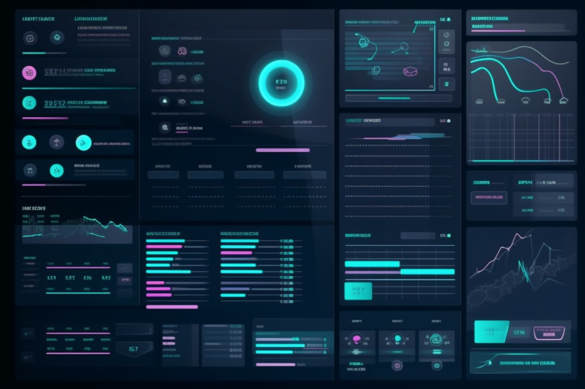

Have you ever encountered random failing tests using the Ruby on Rails system tests? If so, you may be surprised to learn that animations could be the culprit. We’ll explain why animations can cause random failing tests and how disabling them can improve test performance.



## Understanding the problem

Animations introduce an unpredictable timing factor that complicates test control. During testing, animations may take longer to finalize than anticipated, resulting in failures. This can frustrate developers trying to build reliable and efficient test suites.

In addition to driving failing tests, animations can also impact test performance. The playback time of an animation can add up throughout a test suite, leading to slower test execution times.

This can be a problem for teams that value quick feedback and continuous integration.

## Disabling animations in Ruby on Rails

Fortunately, disabling most of the animations in the Ruby on Rails test suite could be achieved by a minor layout update:
```ruby
    <% if Rails.env.test? %>
      <script>
        $.fx.off = true
        $.ajaxSetup({ async: false })
      </script>
    
      <style>
        *, *::after, *::before {
          animation: none !important; /* 0*/
          animation-duration: 1ms !important; /* 1 */
          animation-delay: -1ms !important; /* 2 */
          animation-iteration-count: 1 !important; /* 3 */
          transition-duration: 1ms !important; /* 4 */
          transition-delay: -1ms !important; /* 5 */
        }
      </style>
    <% end %>
```
Those disabling animations might cause specific tests to fail if they hinge on animation timing. Nevertheless, these tests can be revamped to utilize alternate timing mechanisms such as sleep or wait.

## Benefits of disabling animations

Disabling animations can have several benefits for test suites. First and foremost, it can prevent random failing tests caused by animation timing.

Additionally, it can improve test performance by reducing the playback time of animations.

This can lead to faster test execution times and quicker feedback for developers.

## Conclusion

If you’re experiencing issues with failing tests or slow test execution times, we encourage you to try disabling animations in your test suites. With a little effort, you can create more reliable and efficient test suites that help you ship better code faster.

**Paul Keen** is an Open Source Contributor and a Chief Technology Officer at [JetThoughts](https://www.jetthoughts.com). Follow him on [LinkedIn](https://www.linkedin.com/in/paul-keen/) or [GitHub](https://github.com/pftg).

We recommend reading our [latest](https://jtway.co/latest) and [trending tech stories](https://jtway.co/trending) if you enjoyed this story.
