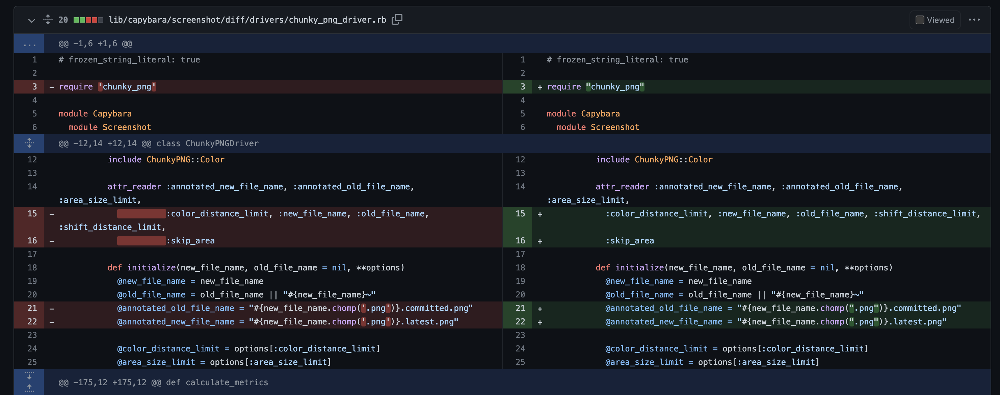

How do you apply new lint rules to the legacy project with active development? Have you added `standard` gem recently, and now you are required to change a lot of files but could not apply them at once.



I got the same problem, and we could not add a massive amount of the small changes because it would require regular rebasing while this PR is on review, or even some safe changes could cause annoying problems.

### Most common solution

Ask developers to add cosmetic changes for all changed files in the PR in separate commits. Which adds some problems for Code Reviewer in finding business logic changes.

PRs Authors and Code Reviewers without big enthusiasm will follow this.

So, I decided to delegate this annoying problem to the machine!


> _Photo by [Thierry K](https://unsplash.com/@thielypics?utm_source=unsplash&utm_medium=referral&utm_content=creditCopyText)_
  
## Approach

I added a simple periodical job on Continuous Integration (GitHub Actions):

1. Checkout repository,
2. Select several random files,
3. Run safe lint auto-corrections,
4. Create PR with new changes

### Open PR with auto-corrections changes

```bash
#!/usr/bin/env bash

set -e

echo "-----Create and switch to new branch-----"

current_date=$(date +"%Y%m%d%H%M")
new_branch_name="auto-fix-lint-${current_date}"
git checkout -b "$new_branch_name"

git config user.name "jt-bot"
git config user.email "bot@jetthoughts.com"

echo "-----Run Rubocop-----"

# shellcheck disable=SC2046
bin/rubocop --no-server --fail-level "E" -a $(bin/rubocop --no-server -L **/*.rb | sort -R | head -n 5 | tr "\n" " ")

echo "-----Commit Updates-----"

git add .

commit_message="Auto-fix lint warnings ${current_date}"

git commit -am "$commit_message" ||
  (bin/rubocop -aF --fail-level "A" && exit 1) ||
  git commit -am "$commit_message" ||  exit 1

if [[ -z "${GITHUB_TOKEN}" ]]; then
  echo "No Pull Request, because no GITHUB_TOKEN passed!"
  exit 1
else
  git push "https://${GITHUB_TOKEN}@github.com/${GITHUB_USERNAME}/${GITHUB_REPONAME}.git" -f

  curl -X POST \
    -H "Authorization: token ${GITHUB_TOKEN}" \
    -d '{"title":"'"$commit_message"'","base":"develop","head":"'"$GITHUB_USERNAME"':'"$new_branch_name"'"}' \
    "https://api.github.com/repos/${GITHUB_USERNAME}/${GITHUB_REPONAME}/pulls"
fi
```

#### By Lines

```bash
current_date=$(date +"%Y%m%d%H%M")
new_branch_name="auto-fix-lint-${current_date}"
git checkout -b "$new_branch_name"
```

Create a unique branch to store our changes.

```bash
git config user.name "jt-bot"
git config user.email "bot@jetthoughts.com"
```

Set up Git to make commits.

```bash
bin/rubocop --no-server --fail-level "E" -a $(bin/rubocop --no-server -L **/*.rb | sort -R | head -n 5 | tr "\n" " ")
```

This line finds all supported by Rubocop files, shuffle and take top 5 (you can update it).

```bash
git commit -am "$commit_message" ||
  (bin/rubocop -aF --fail-level "A" && exit 1) ||
  git commit -am "$commit_message" ||  exit 1
```

If there are no changes from the previous step, we try to find the first file with changes.

```bash
git push "https://${GITHUB_TOKEN}@github.com/${GITHUB_USERNAME}/${GITHUB_REPONAME}.git" -f

  curl -X POST \
    -H "Authorization: token ${GITHUB_TOKEN}" \
    -d '{"title":"'"$commit_message"'","base":"develop","head":"'"$GITHUB_USERNAME"':'"$new_branch_name"'"}' \
    "https://api.github.com/repos/${GITHUB_USERNAME}/${GITHUB_REPONAME}/pulls"
```

Pushes and creates PR with changes.

### 2. GitHub Action Flow with Scheduler

> _**Need to use Personal Tokens only for GitHub** to get it you should use [GitHub Docs: Creating a personal access token](https://docs.github.com/en/authentication/keeping-your-account-and-data-secure/creating-a-personal-access-token)._ And more details why we need to use Personal Tokens: [GitHub Docs: Triggering a workflow from a workflow](https://docs.github.com/en/actions/using-workflows/triggering-a-workflow#triggering-a-workflow-from-a-workflow)

```yaml
