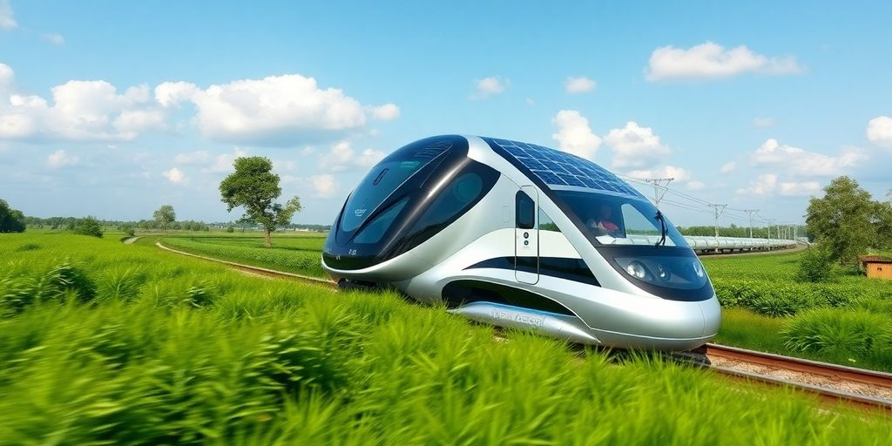
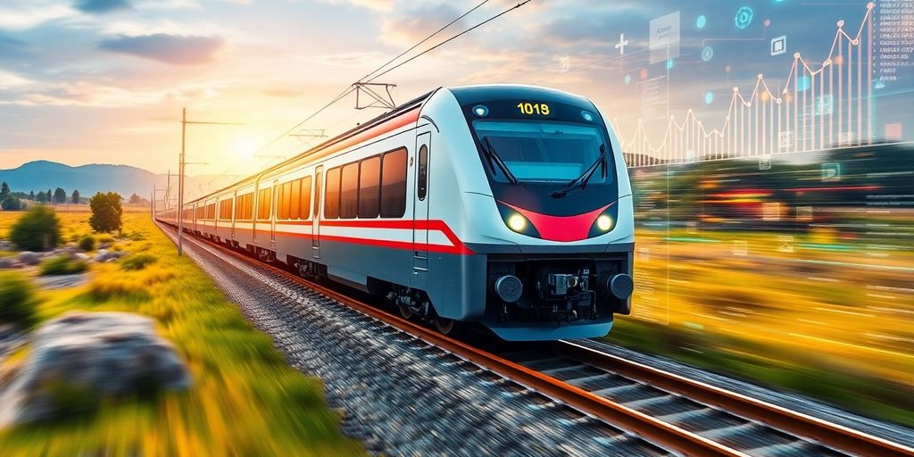
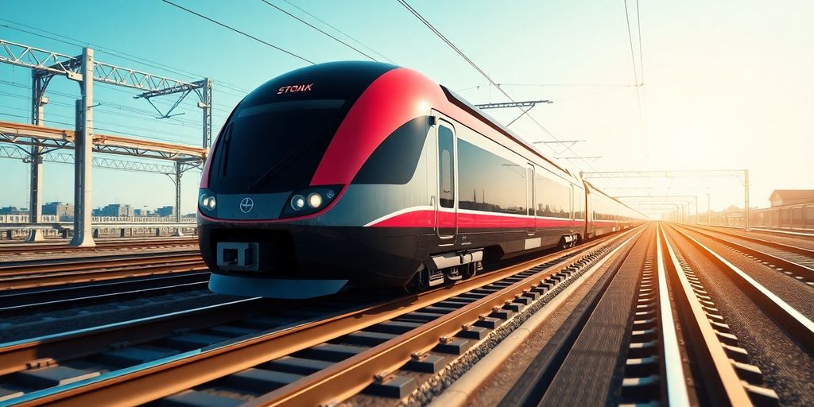

In 2025, the rail industry is buzzing with innovation, and it's the rails companies at the forefront who are making waves. These companies are not just riding the tech wave; they're leading it. From AI to green technologies, they're transforming how we think about trains and rail systems. This article dives into the exciting advancements and the companies behind them, setting the stage for a new era in rail travel.

### Key Takeaways

*   Rails companies are driving major tech changes in the rail industry.
*   Green tech is becoming a big part of rail solutions.
*   AI is playing a crucial role in modern rail systems.
*   Cybersecurity is a top priority for protecting rail networks.
*   Startups are shaking up the traditional rail industry landscape.

## Trailblazing Rails Companies Redefining the Future

### How They're Changing the Game

When you think of innovation, _ruby on rails_ might not be the first thing that pops into your head. But let me tell you, it’s shaking things up. Companies are using it to craft seamless web applications. They’re rewriting the rules of efficiency and speed. With frameworks like _elixir_ and _golang_, these companies are pushing boundaries even further. They're not just sticking to the old ways; they’re exploring new tech like _react_ to enhance the _dev experience_.

### Innovations That Set Them Apart

What sets these companies apart? **It's their commitment to software development best practices.** They focus on creating a stellar developer experience. This means they’re not just about the code, but also about making life easier for the developers. They use _rails services_ to streamline processes and improve productivity. It's about working smart, not hard.

### Success Stories from the Frontlines

These trailblazers have stories that inspire. They've faced challenges head-on and emerged victorious. Here are a few ways they've succeeded:

*   Implementing cutting-edge technologies to reduce operational costs.
*   Creating user-friendly applications that enhance customer satisfaction.
*   Building resilient systems that withstand the test of time.

> The journey of these companies shows that innovation isn't just about new ideas. It's about making those ideas work in the real world.

## Pioneers in Sustainable Rail Solutions

### Green Technologies Transforming Railways

You're probably wondering how trains are going green. Well, it's happening, and it's pretty cool. **Hydrogen fuel cell trains** are leading the charge. They run on hydrogen and oxygen, leaving behind just water vapor. This means cleaner air and less pollution. Then there's regenerative braking. It turns the energy from stopping trains back into electricity. This helps cut down on power use. Solar panels are also popping up along tracks and stations. They soak up the sun to power signals, lights, and even charge trains.

### Leading the Charge in Eco-Friendly Travel

Rail companies are stepping up their game. They're finding ways to make travel cleaner. Electric trains are more common, using less energy than before. Some companies are even testing biofuels to replace diesel. This means fewer emissions and healthier air. Rail operators are also looking at ways to cut down on waste. Recycled materials are used in construction and maintenance. It's all about making rail travel as green as possible.

### Case Studies of Sustainable Success

Let's look at some success stories. In Germany, a rail company switched to hydrogen trains on non-electrified routes. They cut emissions and improved air quality. In the UK, a company used solar power to run parts of their network. This move saved energy and reduced costs. Another example is in Japan, where trains use energy-efficient tech to slash power use by 20%. These stories show that going green is not just a dream—it's happening now.

> Trains are not just about speed anymore. They're about clean, green travel. The rail industry is proving that you can move fast and care for the planet at the same time. It's a journey worth taking.

## The Rise of AI in Rail Companies

### AI-Powered Innovations in Rail

AI is not just a buzzword in rail anymore. It's the engine driving real change. AI uses sensor data to predict equipment failures and optimize train schedules. This means less downtime and smoother rides for everyone. Imagine trains that know when they need a check-up before anything goes wrong. That's AI at work, making rail travel safer and more efficient.

### Transforming Operations with Machine Learning

Machine learning is like a super-smart assistant for rail companies. It analyzes passenger flow and operational data to create the best possible train schedules. This means fewer delays and more reliable service. With AI, rail companies can adapt to changes quickly, keeping everything running smoothly.

### Real-World Applications of AI in Rail

AI is already making waves in the rail industry with some cool applications:

*   Real-Time Fault Prediction: AI monitors rail track conditions in real time, predicting faults before they happen. This reduces downtime and keeps trains running safely.
*   _Optimized Scheduling_: AI analyzes data to optimize train schedules, improving service and reducing delays.
*   Automated Inspections: Drones and sensors use AI to inspect rail infrastructure quickly and accurately, ensuring timely maintenance and safety.

> AI is transforming railways, making them safer and more efficient. It's like having an invisible guardian watching over every journey, ensuring everything runs smoothly.

AI is not just about technology; it's about creating a better travel experience. With AI, rail companies are stepping into the future, offering a smarter, safer way to travel.

## Cybersecurity Titans Protecting Rail Networks

### Guardians of the Digital Rail Frontier

Ever wonder how rail companies keep their systems safe from cyber threats? It's a big deal, especially with all the new tech like IoT and AI. Rail networks are like digital fortresses. They use firewalls and secure communication protocols to protect train control systems. Imagine it like a digital shield, blocking anyone who shouldn't be there. **Encryption techniques and multi-factor authentication** keep passenger data safe, so you don't have to worry about your info getting snatched.

### Innovative Security Solutions in Action

Rail companies are stepping up their game with some cool tech. Real-time threat detection is huge. With AI and machine learning, they can spot weird activities right away. It's like having a digital watchdog that never sleeps. Blockchain is another player, making sure transactions remain tamper-proof. And with systems like SIEM in place, they're not just reacting to threats but predicting them.

### How They're Keeping Railways Safe

Keeping railways safe isn't just about tech. It's about being smart with resources. Companies are integrating tools like [1Password into the Rails Foundation](https://jetthoughts.com/blog/jason-meller-welcomes-1password-rails-foundation/) to streamline security measures. They focus on three big areas:

*   **Control Systems Protection**: Using firewalls and intrusion detection to safeguard train controls.
*   **Passenger Data Security**: Encrypting data and using secure payment methods.
*   **Real-Time Monitoring**: Watching out for threats and responding quickly.

> Rail networks today face more digital threats than ever. But with the right tools and strategies, they're turning these challenges into opportunities to innovate and improve security.

By staying ahead of the game, rail companies ensure safe and smooth journeys for everyone. That's something we can all appreciate, right?

## Connectivity Revolution: Rail Companies at the Forefront

### 5G and Beyond: The Future of Rail Connectivity

Railways are stepping into a new era with _5G technology_. It's not just about faster internet. It's about real-time communication, which means trains talk to control centers without delay. This helps in managing traffic better and makes the whole system safer. **5G combined with ethernet and time-sensitive networking (TSN)** ensures data moves fast and without hiccups. This is crucial for keeping trains on track and passengers safe.

### Enhancing Passenger Experience with Tech

Passengers now expect more than just a ride. Wi-Fi and private LTE networks are making sure you stay connected while traveling. This isn't just for browsing the web. It's about enhancing your journey with real-time updates and personalized services. Imagine getting instant alerts about your train's schedule or accessing digital tickets with ease. Rail companies are working hard to make your travel as smooth as possible.

### Real-Time Data and Its Impact on Rail Operations

Data is the new oil, and railways are tapping into it. With advanced signaling systems like CBTC and ERTMS, trains communicate continuously with control centers. This means trains can run closer together, improving capacity and safety. Vehicle-to-everything (V2X) communication is another game-changer, letting trains talk to each other and the tracks. This reduces collisions and manages traffic better, especially in busy urban areas.

> Railways are not just about tracks and trains anymore. They're becoming smart networks, connecting everything from passengers to control centers. This connectivity is reshaping how we travel, making it safer, faster, and more efficient.

## Robotics and Automation: The New Rail Workforce

### Robots on the Rails: A New Era

Imagine robots cruising down the tracks, doing jobs humans once did. Sounds like sci-fi, right? But it's real. In 2025, robots are all over the rail industry, especially in places like maintenance and inspections. **These machines work tirelessly, ensuring everything runs smoothly.** They're not just cool gadgets; they're a game-changer. They handle dangerous tasks, keeping humans safe. Plus, they operate with precision, reducing errors.

Here's a quick look at what they do:

*   **Autonomous Inspection:** Robots check tracks for cracks and misalignments. They use cameras and sensors to spot issues early.
*   **Robotic Welding:** Automated arms perform welding tasks, ensuring precision and speed.
*   **Autonomous Train Operations:** Some trains now run without human drivers, thanks to advanced robotics.

### Automation Transforming Rail Maintenance

Automation isn't just a buzzword; it's transforming rail maintenance. Imagine a world where robots handle routine checks and repairs. They use _programming_ languages like Python to operate efficiently. This shift means fewer delays and more reliable services. Automated systems catch problems before they turn into big issues. This proactive approach saves time and money.

Here's how automation is making a difference:

*   **Real-Time Monitoring:** Systems track train conditions constantly, providing instant feedback.
*   **Predictive Maintenance:** Data analysis predicts when parts will need fixing, preventing breakdowns.
*   **Improved Safety:** Automation reduces human error, making rail travel safer.

### Success Stories in Robotic Rail Solutions

Some companies are leading the charge with innovative solutions. Startups like NXTGEN Industries are at the forefront. They're developing systems that revolutionize how we think about rail safety and efficiency. Their autonomous inspection systems use high-tech tools to find defects quickly.

> Rail companies embracing robotics aren't just keeping up—they're setting the pace. They're proving that with the right tech, the future of rail is bright.

With these advancements, the rail industry is on the brink of a new era. Robotics and automation aren't just trends; they're the future. And for those in the industry, it's time to jump on board or get left behind.

## Big Data and Analytics: Driving Rail Efficiency

### Harnessing Data for Smarter Railways

Imagine trains that know when they need fixing before they even break. That's the power of big data in rail. By analyzing data from sensors on trains and tracks, rail companies can predict problems and fix them before they cause delays. This means fewer breakdowns and a smoother ride for everyone.

### Predictive Analytics in Action

With predictive analytics, rail companies can keep everything running smoothly. They analyze patterns and predict when equipment might fail. This proactive approach means less downtime and happier passengers. Plus, it saves money on emergency repairs.

### Case Studies of Data-Driven Success

Some rail companies are already seeing big wins with data. They've used analytics to cut delays and improve service. For example, by studying travel patterns, they can adjust schedules to better meet demand. It's all about using data to make things better for passengers and the company.

> Big data isn't just a buzzword—it's a game-changer for rail efficiency. By turning data into action, rail companies are making travel smoother and more reliable.

_Want to see this in action? Check out some [innovative Ruby on Rails projects](https://jetthoughts.com/blog/innovative-ruby-on-rails-projects-boost-your-development-skills-in-2024/) that are enhancing development skills and building robust applications._

## Startups Shaking Up the Rail Industry

### Meet the Disruptors: Startups to Watch

Startups are flipping the rail industry on its head. They’re not just tweaking old systems; they’re building new ones. Companies like Shift5 are at the forefront. They develop platforms that give real-time data and insights across rail networks. This isn’t just about making trains run on time. It’s about using _technology_ to transform how we think about rail travel. These startups are the ones to watch if you’re curious about the future of rail.

### Innovative Solutions from Emerging Companies

Emerging companies are crafting solutions that tackle big rail challenges. Think cybersecurity, predictive maintenance, and operational efficiency. They’re using AI and IoT to connect every part of the rail system. This means smarter trains and safer journeys. It’s not just about getting from A to B; it’s about doing it better and faster. These innovations are paving the way for a new era in rail travel.

*   AI-powered systems for predictive maintenance
*   IoT solutions for real-time data sharing
*   Cybersecurity platforms to protect rail networks

### How Startups Are Changing the Rail Game

Startups are not just part of the rail industry—they’re reshaping it. They bring fresh ideas and tech-driven solutions that make rail travel more efficient and eco-friendly. By leveraging new technologies, these startups are creating a more sustainable and connected rail system. **Their efforts have the potential to significantly enhance how we move in the future**. If you’re not paying attention to these disruptors, you’re missing out on the next big thing in rail.

## Investment Trends Fueling Rail Innovation

### Where the Money's Going in Rail Tech

Ever wonder where all the cash in rail tech goes? **Investors are pouring money into game-changing areas** like AI, IoT, and sustainable technologies. Big names like EIT Urban Mobility and Y Combinator are backing these innovations. They're not just throwing cash around; they're making smart moves with seed and early-stage investments. This funding is crucial for pushing the boundaries of what's possible in rail.

### Key Players in Rail Investment

Who’s leading the charge in rail investments? Think Kleiner Perkins and 8VC. These guys have a keen eye for potential and aren’t afraid to take risks. They’re the ones spotting the next big thing in rail tech. And it's not just about the money. It's about strategic partnerships that drive the industry forward.

### How Funding is Shaping the Future of Rail

Funding is the fuel for innovation. Without it, new ideas can't take off. In the rail sector, investment is shaping everything from eco-friendly trains to [5G connectivity](https://jetthoughts.com/blog/tags/changelog/). It's not just about keeping up with the times; it's about leading the way. With more cash flowing into startups, the future of rail looks pretty exciting.

> In a world where technology moves fast, staying ahead means more than just keeping up. It means setting the pace and leading the charge. Investment in rail tech is not just about money. It's about vision and the courage to innovate.

## Cleantech Innovations Leading the Rail Revolution

### Zero-Emission Trains: A Reality Check

Ready to ditch diesel? Zero-emission trains are here to save the day. **Hydrogen fuel cell trains** are making waves. They mix hydrogen and oxygen to make electricity, leaving only water vapor behind. Perfect for those routes where electric lines aren't around yet. These trains cut down on greenhouse gases big time.

### Energy-Efficient Technologies in Rail

Saving energy is the name of the game. Check out these cool techs:

*   _Regenerative braking systems_ turn a train’s stopping power into electricity. This energy can charge batteries or even go back to the grid.
*   Solar panels along tracks and at stations soak up the sun, powering lights, signals, and even trains.
*   Lightweight materials like carbon fiber make trains use less energy.

### Success Stories in Cleantech Rail Solutions

Some folks are leading the charge in green rail tech. Austrian startup SWS Power Solutions is one to watch. Their SWS-PowerBox keeps freight wagons cool without emissions. It uses smart lithium-ion batteries and charges up fast.

> "Rail tech is getting greener by the day, and it's not just about saving the planet—it's smart business too."

With these innovations, railways are not just moving people and goods—they're moving towards a cleaner future. And as [software development evolves](https://jetthoughts.com/blog/innovative-software-development-tools-techniques-for-2025/) with tools like AI and blockchain, the rail industry stands to benefit even more. Imagine trains that are not only green but also smart, thanks to tech advancements. Railways are on the brink of a transformation, and it's an exciting ride ahead.

## Digital Twins: The Future of Rail Planning

### How Digital Twins Are Transforming Rail

Ever wondered how railways keep getting smarter? **Digital twins are the game-changers**. They create a virtual model of real-world rail systems. This tech helps in understanding and predicting how railways work. With digital twins, you can simulate different scenarios. Want to know how a storm might affect train schedules? Run a simulation! This way, you can prepare for the unexpected.

### Real-World Applications of Digital Twins

Digital twins have some cool real-world uses. Here's a quick list:

*   **Reducing Downtime:** By monitoring train parts like wheels and brakes, digital twins help predict when maintenance is needed. This means fewer breakdowns and smoother rides.
*   **Infrastructure Management:** They combine building information modeling (BIM) with geographic information systems (GIS). This gives a detailed view of rail assets, helping in planning and maintenance.
*   **Optimized Rail Scheduling:** Using AI tools, digital twins can optimize train schedules. They consider factors like weather and passenger flow to reduce delays.

### The Impact on Rail Infrastructure Planning

In planning rail infrastructure, digital twins are super handy. They allow planners to test out different designs and layouts virtually. This saves time and money by spotting potential issues before construction begins. Plus, with [integrated digital twins](https://www.bcg.com/publications/2025/route-to-a-fully-digitized-rail-system), you get a real-time view of the infrastructure. This approach boosts predictive maintenance and operational efficiency.

> Railways are stepping into the future with digital twins. This tech isn't just about keeping trains on track. It's about making the whole system smarter and more efficient.

Whether you're into _javascript_ or _typescript_, the backend magic of digital twins is fascinating. They are changing how we think about rail planning and management. So next time you hop on a train, remember there's a digital twin working behind the scenes to make your ride smooth.

Digital twins are changing how we plan for rail systems. By creating virtual models of real-world assets, we can predict issues before they happen and make smarter decisions. This technology not only saves time but also helps in reducing costs. If you want to learn more about how [digital twins can transform your rail planning](https://jetthoughts.com), visit our website today!

## Wrapping Up: The Future of Rails

So, there you have it. The world of rail tech is buzzing with innovation, and it's only getting more exciting. From AI-driven inspections to eco-friendly trains, companies are pushing the boundaries of what's possible. It's like watching a sci-fi movie unfold, but in real life. These trailblazers are not just changing how we travel; they're setting the stage for a greener, smarter future. As we roll into 2025, keep an eye on these tech pioneers—they're the ones steering us into a new era of railways. And who knows? Maybe one day, we'll look back and wonder how we ever got by without them.

## Frequently Asked Questions

### What are the new tools and technologies for rail developers?

Developers are using AI, big data, and IoT to solve common rail problems. These tools help make operations smoother and more efficient.

### How is AI changing the rail industry?

AI is helping rail companies improve safety, manage schedules better, and predict maintenance needs before problems happen.

### What is cleantech in railways?

Cleantech involves using green technologies like hydrogen fuel cells and regenerative braking to reduce pollution and save energy in railways.

### Why is cybersecurity important for rail networks?

Cybersecurity protects rail systems from hackers and keeps passenger information safe, ensuring trains run smoothly without disruptions.

### How do startups impact the rail industry?

Startups bring fresh ideas and innovative solutions, helping to make rail travel more efficient and eco-friendly.

### What role does big data play in railways?

Big data helps rail companies analyze lots of information to improve train schedules, maintenance, and overall service.

### How is 5G technology used in railways?

5G provides fast and reliable internet for trains, improving communication and making travel more enjoyable for passengers.

### What are digital twins in rail planning?

Digital twins are virtual models of rail systems that help planners test changes and improve infrastructure without real-world risks.