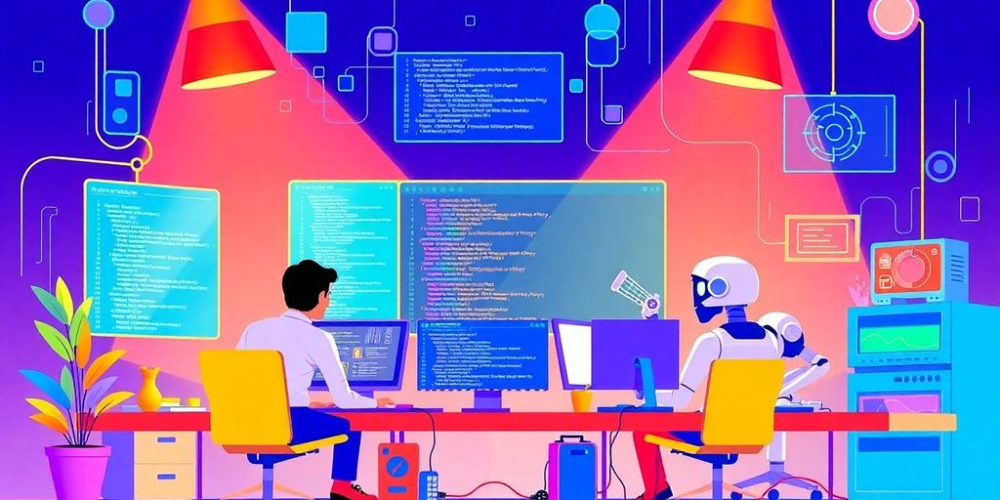

As we look ahead to 2025, the landscape of software development is evolving rapidly. New techniques and tools are emerging that promise to enhance coding standards and streamline the development process. This article explores innovative software development practices that can help developers create cleaner, more efficient, and maintainable code. Whether you're a seasoned professional or just starting out, these practices can elevate your coding game and keep you ahead of the curve.

### Key Takeaways

*   Functional programming can simplify complex code and improve predictability.
*   AI-powered tools are transforming how we write and debug code, making development faster and easier.
*   Establishing clear coding standards helps maintain code quality and readability across teams.
*   Adapting coding practices to specific industries ensures that software meets unique business and user needs.
*   Focusing on code readability through clear naming and structure makes it easier for teams to collaborate and maintain code.

## Embracing Functional Programming Techniques

Functional programming? Sounds fancy, right? It's not as scary as it seems. It's about writing code in a way that's easier to understand and less prone to errors. Think of it as a way to make your code more... well, _functional_!

### Simplifying Complex Logic

Tired of tangled code that's hard to follow? Functional programming can help. It breaks down complex problems into smaller, manageable pieces. This makes your code easier to read, test, and maintain. No more spaghetti code!

### Making Code Predictable

**One of the biggest benefits of functional programming is predictability.** When you use pure functions (functions that always return the same output for the same input and have no side effects), you can be sure that your code will behave as expected. This makes debugging a whole lot easier. Functional programming effectively manages [persistent data structures](https://configr.medium.com/functional-programming-is-an-great-approach-for-managing-persistent-data-structures-6889a66ca766) by emphasizing immutability.

### Enhancing Readability

Let's face it: nobody likes reading code that's hard to understand. Functional programming encourages you to write code that's clear and concise. By using functions as building blocks, you can create code that's easy to read and reason about. Plus, it makes it easier for other developers (or even your future self) to understand what's going on.

> Functional programming isn't a silver bullet, but it's a powerful tool that can help you write better code. Give it a try and see how it can improve your development process.

Here's a quick comparison of imperative vs. functional approaches:

| Feature | Imperative Programming | Functional Programming |
| --- | --- | --- |
| State | Mutable | Immutable |
| Side Effects | Common | Avoided |
| Control Flow | Explicit | Implicit |
| Data Handling | Modifying in place | Transforming data |

So, ready to jump into the world of functional programming? It might just change the way you code forever!

## The Rise of AI-Powered Development Tools

Remember when debugging felt like searching for a needle in a haystack? Well, say hello to 2025! _AI_ is changing the game. It's not just autocomplete anymore. It's like having a super-smart pair programmer that never sleeps.

### Transforming Code Creation

AI tools are now writing code. I know, crazy, right? They can generate boilerplate, suggest improvements, and even handle complex tasks. Think of it: less grunt work, more time for the fun stuff. **This means faster development cycles and higher code quality.**

*   AI can generate code from natural language descriptions.
*   It can also suggest code improvements in real-time.
*   AI can automate repetitive coding tasks.

> AI isn't replacing developers; it's augmenting them. It lets us focus on solving real problems.

### Boosting Productivity

Imagine cutting your development time in half. AI can help with that. It automates testing, streamlines code reviews, and even predicts bugs before they happen. More value, less time. Who wouldn't want that? Check out these [developer experience tools](https://jetthoughts.com/blog/enhancing-productivity-ultimate-developer-experience-tool-for-2024/).

### Streamlining Debugging Processes

Debugging used to be a pain. Now, AI can identify errors, suggest fixes, and even explain the root cause of issues. It's like having a debugging guru on call 24/7. No more late nights staring at the screen!

| Feature | Benefit |
| --- | --- |
| Error Detection | Identifies bugs automatically |
| Fix Suggestions | Suggests solutions to fix errors |
| Root Cause Analysis | Explains the cause of the problem |

## Establishing Code Quality Standards

Okay, let's talk about code quality. It's not just about making things _work_; it's about making them work _well_. Think of it like this: you could build a house out of cardboard, and it might stand for a day, but is that really what you want? Probably not. You want something solid, reliable, and maybe even a little bit stylish. Same goes for code.

### Implementing Coding Rules

First up, rules. I know, I know, nobody likes rules. But hear me out. Coding rules are like the guardrails on a winding road. They keep you from driving off a cliff. **These rules help catch bugs early.** Think of it as a pre-emptive strike against future headaches. Plus, they make sure everyone on the team is speaking the same language. It's about consistency, my friend. It's about avoiding those moments where you stare at someone else's code and think, "What in the world is this supposed to do?"

### Ensuring Readability

Readability is key. If you can't read it, you can't maintain it. And if you can't maintain it, you're in trouble. Imagine trying to fix a leaky faucet in the dark. Not fun, right? Well, trying to debug unreadable code is just as bad. Use comments, clear variable names, and keep your functions short and sweet. Your future self (and your teammates) will thank you. You can improve [code maintainability](https://eluminoustechnologies.com/blog/software-development-best-practices/) by ensuring readability.

### Prioritizing Defect Resolution

Bugs happen. It's a fact of life. But what you do about them is what matters. Don't just sweep them under the rug and hope they go away. They won't. Prioritize them. Fix the big, nasty ones first. The ones that cause crashes and data loss. Then, move on to the smaller, more annoying ones. Think of it like triage in a hospital. You gotta deal with the life-threatening stuff first. Here's a simple way to think about it:

*   Critical: Fix immediately.
*   Major: Fix ASAP.
*   Minor: Fix when you have time.

> Ignoring defects is like ignoring a ticking time bomb. It might not explode today, or tomorrow, but eventually, it will go off. And when it does, it's gonna be messy.

So, there you have it. Code quality standards. Not the most exciting topic, but definitely one of the most important. Embrace the rules, write readable code, and squash those bugs. Your projects (and your sanity) will be better for it.

## Adopting Industry-Specific Coding Practices

Think about it: coding for a medical device is way different than coding for a video game. You can't just use the same rules everywhere. Let's talk about making sure your code fits the job.

### Tailoring Standards to Fit

Each industry has its own quirks. _Finance_ needs super secure code. Games need code that runs fast. **Figure out what your industry cares about most**, and then adjust your coding style to match. It's like wearing the right shoes for the job – you wouldn't wear flip-flops to climb a mountain, right?

### Meeting Business Requirements

Your code isn't just for you. It needs to help the business do its thing. That means understanding what the business needs and making sure your code delivers. It's not enough to write _great_ code; it needs to solve a problem. Think of it as building a custom tool for a specific task.

### Aligning with User Needs

Ultimately, your code is for the user. If they can't use it, what's the point? Make sure your code is easy to use and does what the user expects. This might mean doing user testing or getting feedback early and often. It's like building a house – you want to make sure the people living there are happy. Good [coding practices](https://jetthoughts.com/blog/elevating-your-code-embracing-good-software-engineering-practices-for-success/) are essential for success.

> Industry-specific coding practices are not just about following rules; they're about understanding the unique needs of your industry and users. By tailoring your approach, you can create software that is both effective and valuable.

## Focusing on Code Readability

Okay, let's talk about making your code less of a cryptic puzzle and more of a friendly chat. You want other developers (and future you) to look at your work and think, "Wow, that's clear," not, "What in the world does this do?".

### Using Clear Naming Conventions

Names matter. Think of variable and function names as labels. If you name a variable `x`, nobody knows what `x` holds. But if you name it `userAge`, suddenly things become clear. **Good names save time and reduce confusion.** Use names that tell you exactly what something is or does. It's like naming your dog—you wouldn't call him 'Dog,' would you? (Okay, some people might.)

### Structuring Code Effectively

Structure is key. Imagine trying to read a book where all the sentences are jumbled together. You need paragraphs, chapters, and maybe even some illustrations. Code is the same. Use indentation, spacing, and comments to break things up. Group related code together. Make it easy on the eyes. Think of it as interior design for your code. A well-structured code is like a well-organized room; everything is in its place, and you can find what you need without tripping over things. Consider using [effective code review practices](https://www.codeant.ai/blogs/code-review-best-practices) to ensure your code is well-structured.

### Avoiding Lengthy Functions

Long functions are a drag. Nobody wants to scroll through hundreds of lines of code to figure out what's going on. Keep your functions short and sweet. If a function does too much, break it down into smaller, more manageable pieces. Each function should do one thing and do it well. It's like cooking: you wouldn't throw all the ingredients into one pot and hope for the best, would you? (Unless you're making stew, maybe.) Aim for functions that are easy to understand at a glance. _Short functions_ are easier to test, easier to reuse, and easier to debug.

> Writing readable code is not just about making it understandable to others; it's about making it understandable to your future self. You'll thank yourself later when you revisit code you wrote months or years ago and can still easily grasp its purpose and functionality.

Here's a quick guide to keep in mind:

*   Keep functions under 20 lines if possible.
*   Use comments to explain complex logic.
*   Break down large tasks into smaller functions.

## Leveraging Modern Development Frameworks

Okay, so you're still writing code in Notepad? Just kidding... mostly. Seriously though, it's 2025. If you aren't using a modern development framework, you're making life way harder than it needs to be. Frameworks handle a lot of the grunt work, so you can focus on the fun stuff. Let's talk about how to make the most of them.

### Choosing the Right Framework

Picking a framework is like picking a car. Do you need a truck, a sedan, or a sports car? It all depends on what you're building. _React_ might be great for a fancy web app, but overkill for a simple script. Think about your project's needs. Consider these points:

*   Project size and complexity
*   Team's existing skills
*   Community support and documentation

> Don't just pick the shiniest new thing. Pick the tool that fits the job. A good framework should make your life easier, not harder.

### Maximizing Efficiency

So, you picked a framework. Great! Now, don't just use the basic features. Dig deep. Learn the advanced stuff. Frameworks often have tools and libraries that can save you tons of time. For example, use built-in components instead of writing your own. Understand the framework's architecture. This will help you write better code and [improve code quality](https://jetthoughts.com/blog/essential-development-best-practices-for-modern/).

### Staying Updated with Trends

Frameworks change fast. What's hot today might be old news tomorrow. Keep learning. Read blogs, watch tutorials, and go to conferences. Stay on top of the latest trends. This doesn't mean you have to jump on every new bandwagon. But, you should know what's out there. This way, you can make smart choices about when and how to update your skills. Here are some ways to stay current:

*   Follow industry leaders on social media.
*   Read documentation for new releases.
*   Experiment with new features in side projects.

## Collaborative Coding and Peer Reviews

Okay, let's talk about teamwork. You know, coding isn't a solo sport. It's more like a band. You need everyone playing in tune. That's where collaborative coding and peer reviews come in. It's all about getting better code and a stronger team.

### Encouraging Team Feedback

First, make feedback normal. Not a scary thing. Create a space where people can share ideas without fear. Think of it as a jam session, not a courtroom. Use tools that make it easy to comment on code. Tools like pull requests are great. Make sure everyone knows how to use them. Set clear rules for giving feedback. Be specific. Be kind. And always focus on the code, not the coder. Remember, [regular code reviews](https://jetthoughts.com/blog/10-essential-developer-best-practices-for/) are key.

### Improving Code Quality

**Peer reviews catch bugs early.** It is cheaper than fixing them later. Fresh eyes spot mistakes you might miss. Plus, you learn from each other. You see different ways to solve problems. It's like getting free lessons from your teammates. This leads to cleaner, more reliable code. And that makes everyone's life easier. _Code quality_ goes up, stress goes down.

### Building a Supportive Culture

> A supportive culture is key. It's about trust and respect. When people feel safe, they share more. They ask questions. They challenge ideas. This leads to better code and a stronger team. Celebrate successes. Learn from failures. And always remember, you're all in this together.

Here are some ways to build that culture:

*   Recognize good feedback.
*   Encourage questions.
*   Be open to change.

Working together on code and giving each other feedback is a great way to learn and improve. When you collaborate with others, you can share ideas and catch mistakes that you might miss on your own. This teamwork not only helps you grow as a coder but also makes your projects better. Want to learn more about how to enhance your coding skills through collaboration? Visit our website today!

## Wrapping It Up

So, there you have it! As we gear up for 2025, keeping your coding game sharp is more important than ever. Whether you're just starting out or you've been in the game for a while, these practices can seriously help you write better code. Remember, it’s all about making your life easier and your code cleaner. So, don’t be afraid to try out new tools and techniques. Stay curious, keep learning, and who knows? You might just find a new favorite way to code. Happy coding!

## Frequently Asked Questions

### What are functional programming techniques?

Functional programming techniques help make code simpler and easier to understand by breaking down complex tasks into smaller, manageable parts.

### How can AI tools improve coding?

AI tools can help developers write code faster, find mistakes more easily, and automate repetitive tasks, making the coding process smoother.

### Why are coding standards important?

Coding standards help ensure that code is clean, easy to read, and free of errors, making it easier for developers to work together and maintain the code.

### What does it mean to focus on code readability?

Focusing on code readability means writing code that is clear and easy to understand, which helps other developers read and use it without confusion.

### How can I choose the right development framework?

Choosing the right framework involves considering the specific needs of your project, the tools you are comfortable with, and the latest trends in software development.

### What is the benefit of peer reviews in coding?

Peer reviews allow team members to give feedback on each other's code, which can improve code quality and help create a supportive team environment.
