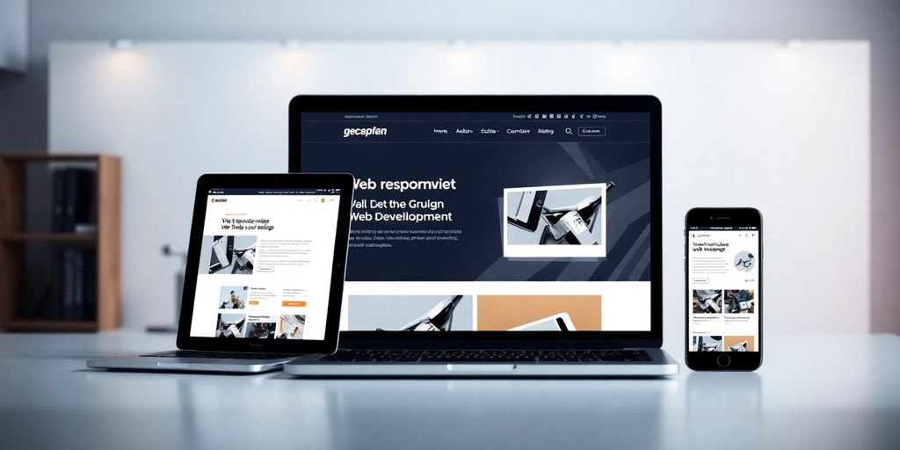

In 2025, the world of website development for startups is buzzing with new ideas and techniques. Startups are finding themselves in a rapidly changing environment where standing out is more important than ever. With tech evolving at lightning speed, businesses have to think outside the box to catch the eye of both customers and investors. This article dives into innovative strategies that startups can use to build their online presence, from using AI to crafting a unique brand story. If you're looking to make your mark in the digital world, read on for some fresh insights.

### Key Takeaways

*   AI and automation are changing how websites are built and used.
*   A strong brand story can set your startup apart online.
*   Data analytics helps startups make smarter decisions.
*   Scalability and sustainability are key for long-term success.
*   Interactive design boosts user engagement.

## Embracing AI and Automation in Web Development

### How AI is Revolutionizing User Experience

AI is changing how users interact with websites. It's not just about chatbots anymore. AI tools can analyze user behavior and customize their journey. This makes websites more intuitive and engaging. Imagine a site that knows what you need before you do. That's the power of AI. It's like having a personal assistant on every webpage.

### Automation Tools for Streamlined Development

Automation tools are a game-changer for developers. They help in cutting down repetitive tasks. This means more time for creativity and innovation. With tools like _typescript_ and _ruby on rails_, you can automate testing and deployment. This speeds up the development process. Plus, it reduces human error. Embracing automation is key to staying competitive.

### Balancing Human Touch with Technology

While AI and automation are great, they can't replace the human touch. It's important to keep the personal element in web development. Users appreciate a site that feels human. This means using AI to enhance, not replace, human interaction. **Balancing tech with a personal touch creates a more engaging user experience.**

> In the world of AI and automation, finding the right balance is crucial. It's about making technology work for you, not against you. This harmony leads to more satisfied users and a successful website.

## Crafting a Unique Brand Identity Online

### The Role of Storytelling in Branding

Creating a brand isn't just about a logo or a catchy tagline. It's about weaving a story that connects with people. Think about what makes your startup tick. Is it your mission, your values, or maybe how you started? Share these stories. People love a good tale, and it makes your brand relatable. **A strong narrative can turn casual visitors into loyal fans.**

### Designing for Emotional Impact

Design isn't just about looks; it's about feelings. Your website should make visitors feel something. Use colors, fonts, and layouts that reflect your brand's personality. A warm, welcoming design can make people feel at home, while a sleek, modern look might appeal to tech enthusiasts. Don't forget, [hiring a freelance logo graphic designer](https://www.fiverr.com/resources/guides/digital-marketing/brand-identity) can help create a unique brand identity that attracts customers.

### Building Trust Through Transparency

Trust is the backbone of any brand. Be open about who you are and what you do. Share your journey, your successes, and even your failures. It makes you human. Use testimonials, case studies, and reviews to show you're reliable. When people trust you, they're more likely to stick around.

> Building a brand is like making a friend. Be genuine, be consistent, and most importantly, be yourself.

## Leveraging Data Analytics for Smarter Decisions

### Understanding User Behavior with Analytics

Ever wondered what your users really want? By using analytics, you can track every click, scroll, and pause on your site. This data helps you understand what grabs attention and what falls flat. **Analytics gives you a peek into the minds of your users.** With this insight, you can tweak your site to keep visitors engaged. It's like having a map to navigate user preferences without guesswork.

### Predictive Analytics for Future-Proofing

Imagine knowing what's coming next for your startup. That's what predictive analytics offers. By analyzing past data, you can spot trends and prepare for future demands. This isn’t just about keeping up; it’s about staying ahead. Predictive tools help you make informed decisions, ensuring your startup isn't just reactive but proactive.

### Turning Data into Actionable Insights

Data is everywhere, but what do you do with it? Turning numbers into action is key. Start by setting clear goals. Then, use your data to find patterns and draw conclusions. Make changes based on these insights and watch your startup grow. It's not enough to collect data; you need to act on it to see real results.

> In 2025, relying on intuition alone is a thing of the past. Data-driven decisions give you the edge in the competitive startup world. Embrace the change and let data guide your way to success.

## Building Scalable and Sustainable Websites

### Choosing the Right Tech Stack

Picking the right tech stack is like choosing the right tools for a job. It can make or break your website's scalability. **Startups in 2025 must prioritize a scalable tech stack** to adapt to evolving demands. Consider using _PHP_ for server-side scripting; it's robust and widely supported. Evaluate your options based on your project needs, team expertise, and future growth plans. Don't just go for the trendiest technology—pick what's sustainable for your business.

### Incorporating Green Technologies

Going green isn't just a trend; it's a necessity. Integrate green technologies to reduce your carbon footprint. Opt for energy-efficient hosting solutions and streamline your site's code to use fewer resources. This not only helps the planet but can also cut costs and improve performance. Customers are more environmentally conscious than ever, so showing your commitment to sustainability can also boost your brand image.

### Ensuring Long-Term Scalability

Long-term scalability means planning for the future. Think about how your website will handle increased traffic and data. Use scalable cloud solutions and modular designs that allow for easy updates and expansions. Regularly audit your systems to identify bottlenecks and optimize performance. This proactive approach ensures your site remains efficient and reliable as your startup grows.

> Building a scalable and sustainable website isn't just about technology—it's about creating a foundation for future growth. By focusing on the right tech stack, incorporating green practices, and planning for scalability, you set your startup up for success.

## Enhancing User Engagement with Interactive Design

### The Power of Interactive Elements

Interactive elements are like the secret sauce for your website. They aren't just flashy add-ons but essential tools for keeping users hooked. Think of sliders, hover effects, and clickable graphics. They make your site feel alive. **These elements invite users to explore more, turning casual visitors into engaged fans.**

### Creating Immersive User Experiences

Immersive experiences aren't just for video games. Your website can offer them too. Use tools like _React_ to build dynamic interfaces. It helps create a seamless flow, making navigation feel natural. Imagine a site where each click feels like turning a page in a captivating story. That's the goal.

### Using Feedback Loops to Improve Design

Feedback loops are your best friend in design. They tell you what works and what doesn't. Use them to tweak and refine your site. Ask your users what they like, what confuses them, and what they wish was different. It's like having a mini focus group at your fingertips.

> Building an engaging site isn’t just about adding flashy features. It’s about creating a journey that users want to take. Your dev team should think about how each element contributes to the overall developer experience. The right mix can make your site an irresistible destination.

Here’s a quick checklist to get started:

1.  Identify key interactive elements you want to include.
2.  Use tools like _Elixir_ and _React_ for a smooth development process.
3.  Set up feedback mechanisms to continuously improve.

For more on interactive design strategies, check out [insightful articles on design and startup strategies](https://jetthoughts.com/blog/tags/design/). They offer tips on making your site both engaging and effective.

## Navigating SEO and Content Marketing in 2025

### SEO Strategies for Startups

In 2025, SEO isn't just about keywords. It's about creating meaningful content that search engines can understand. With AI and machine learning, search engines now focus on context. This means your content needs to be more relevant and engaging than ever.

*   Voice Search Optimization: With the rise of smart speakers, optimizing for voice search is crucial. Focus on natural language and question-based queries.
*   _Augmented Reality (AR)_: AR is becoming a part of search results. Consider how your content can integrate with AR to enhance user experience.
*   Local SEO: Ensure your business is visible locally. Use location-based keywords and maintain your Google My Business profile.

### Crafting Content that Captivates

Creating content that resonates with your audience is key. It's not just about what you say, but how you say it.

*   Storytelling: Use storytelling to connect emotionally with your audience. People remember stories, not stats.
*   Visual Content: Incorporate visuals like infographics and videos. They grab attention and are more likely to be shared.
*   Consistency: Regularly update your content to keep it fresh and relevant.

> In 2025, content is king, but context is queen. Understanding your audience's needs and delivering what they want is crucial.

### Staying Ahead of Content Trends

The digital landscape changes fast. Keeping up with trends is essential to stay relevant.

*   Interactive Content: Engage users with quizzes, polls, and interactive infographics.
*   AI Tools: Use AI to analyze content performance and optimize for better engagement.
*   Sustainability: Highlight eco-friendly practices in your content. It's a growing concern for many consumers.

For startups, choosing the right partner is vital. [Choosing the right software development company](https://jetthoughts.com/blog/choosing-right-software-development-company-for-startups-2024-guide/) can make all the difference in your digital strategy. Prioritize partners who understand your goals and offer scalable solutions.

Incorporating these strategies can set your startup on the path to success in the digital world of 2025.

## Collaborating with Other Startups for Mutual Growth

### Benefits of Startup Collaborations

Teaming up with other startups can be a game-changer. It opens doors to innovation and helps expand your market reach. By sharing tools, technologies, and experiences, you can cut costs and boost efficiency. Imagine launching a product with shared resources—it's not just cost-effective, it's smart. **Collaboration isn't just about sharing; it's about growing together.**

### Sharing Resources and Expertise

Startups often face similar hurdles. Joining forces allows you to overcome these challenges more easily. You can share knowledge, pool resources, and even combine marketing efforts. For example, co-hosting webinars or workshops can be a great way to reach broader audiences. This not only saves money but also amplifies your brand's voice.

### Case Studies of Successful Partnerships

Many startups have thrived through collaboration. Consider a [software company NYC](https://jetthoughts.com/blog/essential-strategies-hire-developers-for-your-startup-in-2025/) that partnered with a tech startup to co-develop a new app. They shared the workload and split the profits. This kind of partnership showcases how mutual growth can be achieved. It’s not just about the end product; it's about the journey and the learning that comes with it.

> By working with others, you're not just building a product; you're building a community. This community can support you, challenge you, and help you grow in ways you never imagined.

In 2025, the landscape of software development services for startups will be more competitive than ever. By collaborating, you can tap into new markets and innovate faster. Whether you're looking for software engineer startup jobs or exploring the services of a software company, partnerships can provide the edge you need.

Working together with other startups can lead to amazing growth for everyone involved. By sharing ideas and resources, you can create new opportunities and tackle challenges more effectively. If you're ready to take your startup to the next level, [visit our website to learn how we can help you succeed!](https://jetthoughts.com)

## Wrapping It Up: The Road Ahead for Startups

So, there you have it, folks! As we look towards 2025, it's clear that the world of website development for startups is buzzing with potential. It's not just about having a flashy site anymore; it's about creating an experience that speaks to your audience and stands out in a crowded digital space. Whether you're a tech whiz or just starting out, remember that innovation is your best friend. Keep things fresh, stay flexible, and don't be afraid to try new things. The digital landscape is always changing, and those who adapt will thrive. Here's to building something awesome and making your mark in the startup world!

## Frequently Asked Questions

### How is AI changing web development?

AI is making web development smarter by helping create better user experiences and automating tasks, making it easier and faster to build websites.

### What are the benefits of automation in web development?

Automation tools can speed up the development process, reduce errors, and allow developers to focus on more creative tasks.

### Why is having a unique brand identity important for startups?

A unique brand identity helps startups stand out, connect with their audience emotionally, and build trust.

### How can data analytics help startups make better decisions?

Data analytics can show startups how users behave, predict future trends, and provide insights that lead to smarter business choices.

### What does it mean for a website to be scalable and sustainable?

A scalable website can handle more users as it grows, while a sustainable one is built with eco-friendly practices and long-term use in mind.

### How can startups improve user engagement on their websites?

Startups can use interactive designs, like games or quizzes, to make their websites more engaging and fun for users.