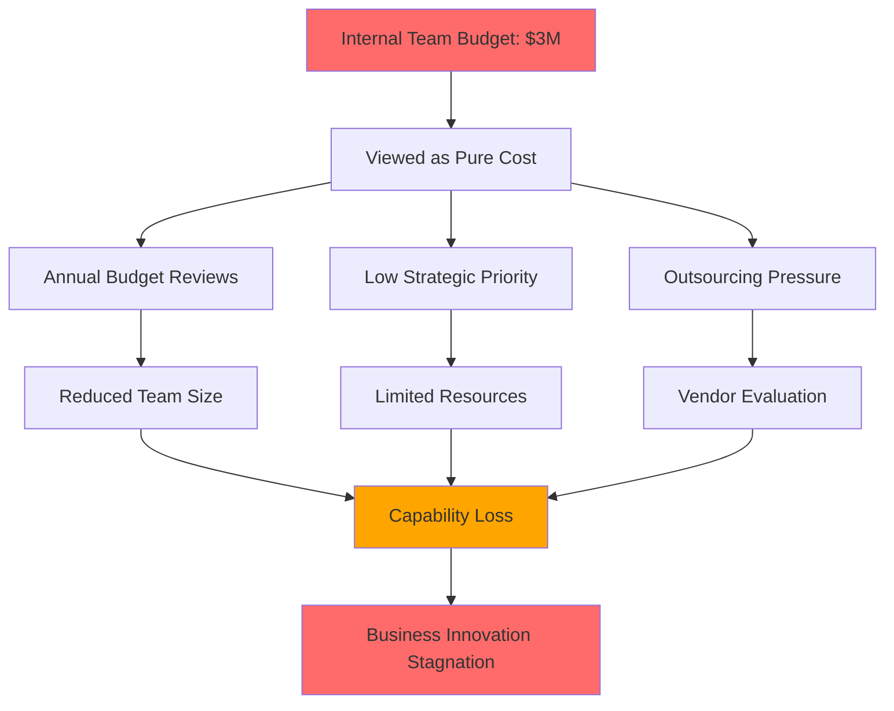

Your internal product team costs $3M annually. The CFO wants to outsource everything. Your development backlog is 18 months deep. Business stakeholders are questioning every feature request.

Sound familiar?

If you're leading internal products at a large corporation, you've probably been in this exact situation. We've worked with dozens of internal product leaders who face the same challenge: proving that their teams create real business value, not just technical overhead.

Here's what we've learned after helping internal teams at Fortune 500 companies prove their worth: your team isn't actually a cost center. You're just measuring the wrong things.

## The perception problem that's killing internal teams

When executives look at internal product teams, they see budget allocation without clear returns. It's not their fault. Traditional business metrics don't capture the real value these teams create.

We recently worked with a Fortune 500 company whose CFO was ready to eliminate their 15-person internal development team. The team had built critical customer service tools, inventory management systems, and data analytics platforms. But when budget season came around, all leadership saw was $2.8M in annual costs.

The problem wasn't performance—it was perception.

## The hidden value your team already creates

Before we dive into measurement frameworks, let's identify the value that's already there but invisible to traditional accounting.

### Operational efficiency that doesn't show up on P&L statements

Your internal tools probably save hundreds of hours every month across different departments. A customer service platform that reduces ticket resolution time from 6 hours to 2 hours doesn't just improve customer satisfaction—it multiplies your support team's capacity.

Here's what we found when we audited one client's internal tools:
- Customer service platform: 40% reduction in resolution time = 15 FTE hours saved weekly
- Inventory management system: 60% reduction in stock discrepancies = $230K annual waste prevention
- Employee onboarding portal: 75% reduction in HR processing time = 8 FTE hours saved weekly

None of these appeared in traditional ROI calculations because they were "soft savings." But when you multiply hourly rates by time saved, you're looking at real money. That's $467K in annual value from just three tools.

### Revenue enablement that's hard to track

Internal products often enable revenue that wouldn't exist otherwise. A sales configuration tool might help close deals 20% faster. A marketing automation platform might improve lead conversion by 15%. A custom analytics dashboard might help identify $500K in operational improvements.

The challenge is attribution. How do you prove that your internal CRM enhancement contributed to a 12% increase in deal closure rates?

### Risk mitigation value that's invisible until something breaks

Security frameworks, compliance tools, and monitoring systems prevent catastrophic failures. The value of not having a data breach is enormous, but it's hard to quantify prevention.

We worked with a client whose internal security monitoring platform detected and prevented 47 potential security incidents in one year. The estimated cost of just one successful breach would have been $2.3M in fines, remediation, and lost business.

## The ROI measurement framework that changes everything

Traditional cost-benefit analysis doesn't work for internal products because the benefits are distributed across the organization and often realized over time. You need a multi-dimensional value framework.

### The four pillars of internal product value

**Pillar 1: Operational Efficiency Value**
- Time savings across departments (measured in FTE hours)
- Error reduction and rework prevention
- Process automation impact
- Resource optimization

**Pillar 2: Revenue Enablement Value**
- Sales cycle acceleration
- Customer satisfaction improvements
- Market expansion capabilities
- Product quality enhancements

**Pillar 3: Risk Mitigation Value**
- Compliance automation savings
- Security incident prevention
- Audit preparation efficiency
- Regulatory risk reduction

**Pillar 4: Innovation Enablement Value**
- Platform capabilities for future development
- Data accessibility for business intelligence
- Integration capabilities with external systems
- Scalability foundations

### Calculating real ROI with distributed benefits

Here's a practical framework for measuring ROI when benefits are distributed across multiple departments:

**Step 1: Baseline Current State**
Document current process costs, error rates, and time investments before your tools existed. If you don't have historical data, run controlled experiments with and without your tools.

**Step 2: Quantify Direct Savings**
Calculate the most obvious, attributable savings:
- Hours saved × average hourly cost = direct labor savings
- Errors prevented × average error cost = quality savings
- Automation × manual process cost = efficiency savings

**Step 3: Estimate Indirect Value**
Use conservative multipliers for indirect benefits:
- Customer satisfaction improvements: 1.5x direct service cost savings
- Sales enablement: 20% of attributed revenue increase
- Risk prevention: 10% of potential incident cost

**Step 4: Calculate Total Economic Impact (TEI)**
TEI = (Direct Savings + Indirect Value + Risk Prevention) - Development Costs

For our Fortune 500 client, this looked like:
- Direct savings: $2.1M annually
- Indirect value: $1.8M annually
- Risk prevention: $800K annually
- Development costs: $3M annually
- **Net TEI: $1.7M (57% ROI)**

## Stakeholder communication that wins budget battles

The best ROI framework in the world won't help if you can't communicate value to non-technical executives. Here's how to translate technical impact into business language.

### Executive dashboards that actually matter

Most internal product teams show the wrong metrics to executives. Instead of deployment frequency and story points, focus on business impact metrics:

**For the CFO:**
- Cost per business outcome achieved
- Operational expense reduction
- Risk mitigation value
- Capital efficiency improvements

**For the CEO:**
- Revenue enablement contribution
- Competitive advantage creation
- Strategic initiative support
- Customer satisfaction impact

**For the COO:**
- Process efficiency improvements
- Cross-departmental productivity gains
- Quality improvements
- Scalability foundations

### Quarterly business reviews that build trust

Transform your standard development updates into business impact reviews:

**Traditional Update:**
"We completed 47 story points this quarter, deployed 23 features, and reduced our bug count by 15%."

**Business Impact Update:**
"Our platform improvements this quarter enabled the sales team to close deals 22% faster, reduced customer service costs by $180K, and prevented an estimated $400K in compliance risks. Here's how we're planning to scale these improvements next quarter."

The second approach connects your work directly to business outcomes that executives care about.

### Success story documentation that builds credibility

Document specific examples of business value creation. Instead of general statements, use concrete examples:

**Weak Example:**
"Our customer service platform improves efficiency."

**Strong Example:**
"The customer service platform we built reduced average ticket resolution time from 4.5 hours to 1.8 hours. For our 200 daily tickets, this saves 540 hours monthly, worth $32K in labor costs. Customer satisfaction scores increased from 3.2 to 4.1, and we've seen a 28% reduction in escalated cases."

## Case study: How a 12-person team created $5M in value

Let's look at a real example of transformation. A mid-size financial services company had a 12-person internal development team that was constantly defending their budget.

**The Challenge:**
- $2.8M annual team cost
- Increasing pressure to outsource
- No clear business value measurement
- Competing with external vendors on cost alone

**The Transformation:**
We helped them implement a comprehensive value measurement framework and stakeholder communication strategy.

**Value Creation Breakdown:**

*Efficiency Gains: $2.4M annually*
- Loan processing automation: 65% time reduction = $900K
- Compliance reporting automation: 80% time reduction = $650K
- Customer onboarding optimization: 45% time reduction = $420K
- Internal workflow improvements: Various = $430K

*Revenue Enablement: $1.8M annually*
- Faster loan approvals increased customer satisfaction and referrals
- Sales configuration tools reduced quote generation time by 60%
- Customer portal improvements reduced churn by 8%

*Risk Mitigation: $800K annually*
- Compliance automation prevented estimated $600K in potential fines
- Security monitoring prevented estimated $200K in incident costs

**Total Value Created: $5M**
**Investment: $2.8M**
**Net ROI: 79%**

**The Result:**
Instead of facing budget cuts, the team received approval for 3 additional developers and a $400K platform modernization project.

The key wasn't just measuring value—it was communicating that value in terms executives understood and cared about.

## Practical implementation: Your 90-day transformation plan

Ready to transform your internal team from cost center to profit driver? Here's a practical implementation plan.

### Month 1: Establish baseline measurement

**Week 1-2: Current state assessment**
- Document all systems and tools your team maintains
- Identify key stakeholders and their pain points
- Gather baseline performance data where available

**Week 3-4: Value identification workshop**
- Run sessions with each business department your tools serve
- Quantify current process costs and pain points
- Identify potential value creation opportunities

### Month 2: Build measurement frameworks

**Week 5-6: ROI calculation model**
- Implement the four-pillar value framework
- Create tracking mechanisms for key metrics
- Establish data collection processes

**Week 7-8: Stakeholder dashboard creation**
- Build executive-focused dashboards
- Create department-specific value reports
- Establish regular reporting cadence

### Month 3: Communication and optimization

**Week 9-10: First business impact review**
- Present initial ROI findings to leadership
- Gather feedback and refine measurement approach
- Identify highest-value optimization opportunities

**Week 11-12: Optimization planning**
- Create roadmap focused on highest-ROI initiatives
- Align team priorities with business value creation
- Plan resource allocation for maximum impact

## Common pitfalls and how to avoid them

We've seen internal product leaders make the same mistakes repeatedly. Here's how to avoid them:

**Pitfall 1: Focusing on technical metrics instead of business impact**
*Solution:* Always connect technical improvements to business outcomes. Instead of "reduced deployment time by 40%," say "faster deployments enable us to respond to business needs 40% quicker."

**Pitfall 2: Overestimating soft benefits**
*Solution:* Use conservative estimates and focus on measurable impacts. It's better to under-promise and over-deliver than to lose credibility with inflated claims.

**Pitfall 3: Not involving business stakeholders in value measurement**
*Solution:* Make stakeholders partners in defining and measuring value. When they help create the metrics, they're more likely to believe the results.

**Pitfall 4: Measuring value only during budget season**
*Solution:* Establish continuous value measurement and regular communication. Quarterly business reviews work better than annual budget justifications.

## Building long-term strategic value

Once you've established credible value measurement, you can start positioning your internal team as a strategic asset rather than operational support.

### The evolution from efficiency to innovation

Most internal teams start by proving efficiency value—that's the easiest to measure. But the real transformation happens when you start creating competitive advantages.

**Level 1: Operational Excellence**
Your team eliminates inefficiencies and automates manual processes. Value is measured in cost savings and time reduction.

**Level 2: Strategic Enablement**
Your platforms enable new business capabilities that wouldn't be possible otherwise. Value includes revenue enablement and competitive differentiation.

**Level 3: Innovation Platform**
Your technology foundation becomes a platform for rapid business innovation. Value includes market expansion and future capability creation.

### Cross-department collaboration that multiplies impact

The most successful internal product teams don't just serve other departments—they partner with them to create compounded value.

**Marketing Partnership Example:**
Instead of just building marketing automation tools, partner to identify how technology can create new marketing capabilities. The result might be personalization engines that increase conversion rates by 35%.

**Sales Partnership Example:**
Beyond CRM improvements, collaborate on predictive analytics that help identify high-value prospects. The result might be a 28% improvement in deal closure rates.

**Operations Partnership Example:**
Move beyond process automation to intelligent operations platforms that adapt to changing business conditions. The result might be 40% better resource utilization.

## Your transformation starts now

You don't need to wait for the next budget cycle to start proving value. Begin with measurement, focus on communication, and build credibility through consistent delivery.

Remember: your internal development team isn't a cost center. You're a value creation engine that's been using the wrong metrics.

The executives questioning your budget aren't wrong to ask for ROI. They're wrong to measure your impact using traditional cost accounting methods. Your job is to show them the real value you create using frameworks that capture distributed benefits and long-term strategic impact.

Start with the 90-day transformation plan. Implement the four-pillar value framework. Build stakeholder dashboards that matter. Document success stories that build credibility.

Most importantly, make this transformation a team effort. Get your developers involved in understanding business impact. Make value creation part of your culture, not just your reporting process.

The CFO who wanted to outsource everything? After implementing these frameworks, they ended up approving a $2M platform modernization project and expanding the team by 40%.

Your transformation is possible. It just requires measuring and communicating the right things.

---

## Ready to prove your team's value?

Download our **Internal Product ROI Calculator** to start quantifying your team's business impact today. This spreadsheet template includes:

- Four-pillar value calculation framework
- Executive dashboard templates
- Stakeholder communication guides
- 90-day implementation timeline
- Real-world calculation examples



*No email required. Instant download.*

---

*Need help implementing value measurement for your internal team? Our engineering management consultants have helped dozens of internal product leaders prove ROI and secure budget increases. [Schedule a consultation](/contact) to discuss your specific situation.*

---

**The JetThoughts Team** specializes in helping internal product organizations prove their business value and secure strategic investment. With 18+ years of experience in product development and business transformation, we've guided teams from cost center perception to profit driver recognition. Connect with us on [LinkedIn](https://linkedin.com/company/jetthoughts) for more insights on internal product management.