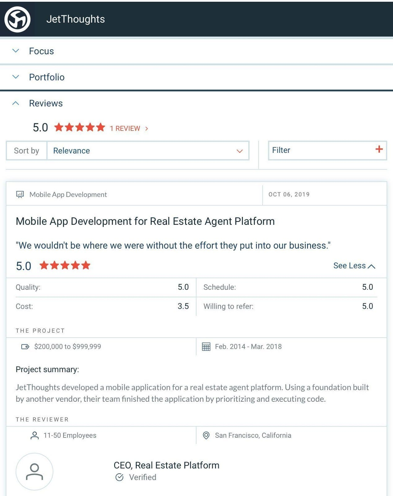

Our team at JetThoughts has an expertise of the [Ruby on Rails](https://rubyonrails.org/) development service line, and we’re excited we could have offered that to our real estate platform client. This web application framework streamlines the processes for building our clients’ apps that stand out in the crowd.

We’ve recently received on the first review from this client on Clutch, [an evaluation-based platform](https://clutch.co/developers/ruby-rails) for B2B companies. This five-star review means a lot to us personally, but it also means a lot for the future of JetThoughts.

Here’s what the CEO of the real estate platform had to say about us on our [Clutch profile](https://clutch.co/profile/jetthoughts):

> # ***“JetThoughts is definitely a good partner. We do not see them as a contractor or outsourcing. We wouldn’t be where we are without the effort they put into our business. The other thing is that they put a lot of importance on understanding our business on a granular level, and they were deeply embedded in our culture and our successes.”***
>
> # ***“JetThought was effectively our partner — building our product and fulfilling the R&D team for the duration of our engagement. We ran our full-cycle product development process with them, from planning all the way through to writing code. This included prioritization, scoping, and executing the code at the end of that process.”***
>
> # ***“They are very accurate with their projections and estimates, even though we’ve always iterated on the idea due to feedback and the constantly changing nature of a startup. With their help, we were able to scale up into our market and land new clients quickly.***”

We are looking forward to building out apps for companies using our Ruby on Rails techniques we’ve mastered through our work with other clients. These reviews will help us gain more traction against our competition in Florida, which means we can take on more projects and stay on top of the development industry.

Clutch sites — The Manifest and Visual Objects — help us find us find potential buyers through [a company listings resource](https://themanifest.com/web-development/ruby-on-rails/companies#jetthoughts) and [a visual portfolio sharing site](https://visualobjects.com/web-development/top-web-developers/), so our prospective clients can see what we bring to the table.

We are so thankful for the support we’ve received on our Clutch profile, and it’s only going to lead to more support along the way. Be sure to send us a message if you’re ready to start a project with the JetThoughts team!

**Adam Cisco ***is the Key Account Project Manager at [JetThoughts](http://jetthoughts.com/). Follow him on [*LinkedIn](https://www.linkedin.com/in/ad-cis/)*.*

*This article was created featuring Emily Clark and the Clutch team! Thanks for your support!*
> *If you enjoyed this story, we recommend reading our[latest tech stories](https://jtway.co/latest) and trending [tech stories](https://jtway.co/trending).*
