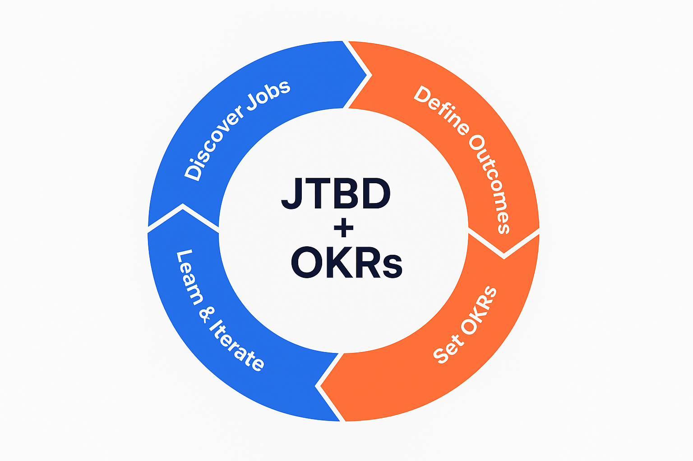
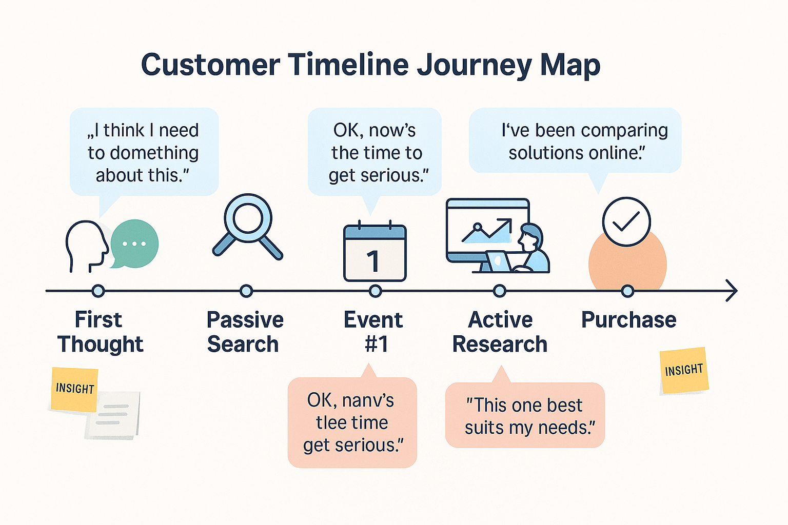
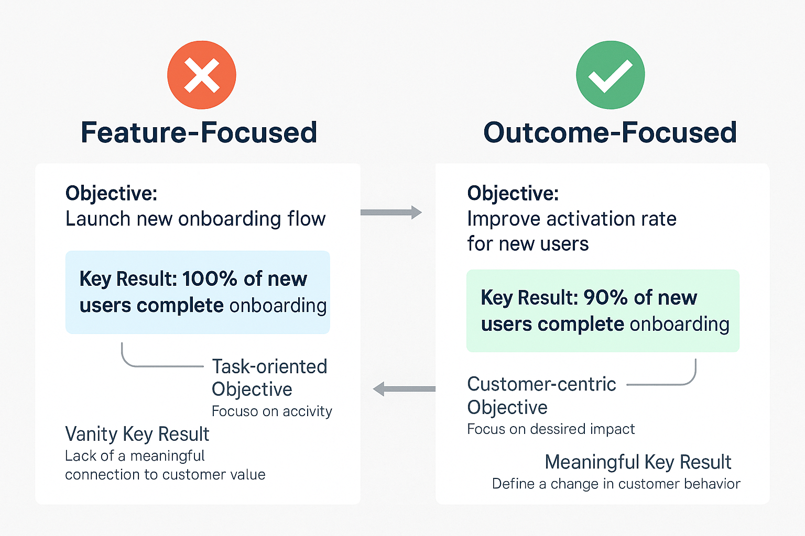
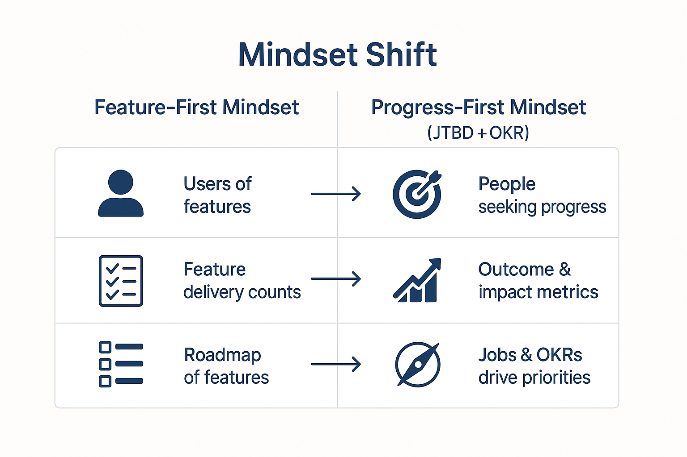

*Stop building features nobody wants. Start with customer jobs, then measure what matters.*

## You've Been Here Before

Your team ships a new feature. Everyone high-fives. Six weeks later, usage data comes in.

Nobody's using it.

Why? Because we build what WE think customers want, not what THEY actually need.

This guide shows you how to fix this problem by combining two powerful frameworks:

1. **Jobs-to-be-Done (JTBD)**: Discover what customers truly need
2. **Objectives and Key Results (OKRs)**: Measure outcomes that matter

Let's dive in.

## What Are Jobs-to-be-Done?

People don't buy products. They hire them to make progress in their lives.

This isn't just semantic wordplay. It changes everything.

The classic example: People don't want a quarter-inch drill. They want a quarter-inch hole.

This shift forces you to think about outcomes, not features. Ask "What progress is our customer trying to make?" instead of "What should we build next?"

Some real-world examples:

- Spotify's job isn't "play music" but "find the right music for my mood right now"
- A food delivery app's job isn't "deliver food" but "get dinner on the table with no hassle"

Jobs have multiple dimensions:

- **Functional**: The practical task (complete a project)
- **Emotional**: How they want to feel (confident, not stressed)
- **Social**: How they want others to see them (organized, professional)

Understand these dimensions and you'll build products people actually want to use.

## What Are OKRs?

OKRs turn your strategy into measurable targets.

An **Objective** is where you want to go. It should be clear and inspiring.

**Key Results** are how you'll know you're getting there. They must be specific and measurable.

Good OKRs have these traits:

- **Focused**: 1-3 objectives per team, 2-5 key results per objective
- **Outcome-oriented**: Measure results, not tasks
- **Measurable**: "Increase X from Y to Z by date"
- **Ambitious but achievable**: Push yourself without setting impossible goals

The biggest OKR mistake? Turning them into a task list.

"Launch feature X" is not a Key Result. "Increase user retention from 20% to 30%" is.

## Why These Frameworks Work Better Together

JTBD gives you direction. OKRs give you a map.

JTBD shows what customers need. OKRs track how well you're meeting those needs.

Together, they create a system where:

1. Customer jobs inform what goals matter
2. OKRs track progress toward enabling those jobs
3. Success means actual customer outcomes, not shipped features

Now, let's put this into practice.

## How to Uncover Jobs: The Timeline Interview

The best way to discover jobs is through customer interviews that focus on their decision journey.

Here's how to do it right:

### Step 1: Find the Right People

Talk to customers who recently:

- Started using your product
- Switched from a competitor
- Stopped using your product

Recent decisions yield fresher memories. Five to ten interviews will show clear patterns.

### Step 2: Map Their Timeline

Start at the end (purchase) and work backward to the first moment they realized they had a problem.

Ask these key questions:

**Purchase Moment:**
"When did you sign up for our product? Where were you? What made you decide that day?"

**First Thought:**
"When did you first realize you needed something to help with this problem?"

**Passive Phase:**
"After that first thought, did you look for solutions right away or think about it for a while?"

**Active Search:**
"What pushed you to get serious about finding a solution? How did you research options?"

**Decision:**
"What made you choose our product over others? What almost stopped you?"

Keep asking "Why was that important?" and "How did that make you feel?"

Your goal: Understand their story, not confirm your assumptions.

### Step 3: Create a Journey Map

After interviews, map each customer's journey:

1. **First Thought**: What triggered their need
2. **Passive Looking**: Initial casual research
3. **Event #1**: What pushed them to serious search
4. **Active Research**: How they evaluated options
5. **Decision Criteria**: What mattered most to them
6. **Event #2**: Final trigger to purchase
7. **Purchase & Outcome**: Did it solve their problem?

This visual timeline reveals patterns and highlights key moments in their decision process.

### Step 4: Extract Jobs and Desired Outcomes

Now identify:

1. The primary job statement: What progress was the customer trying to make?
2. Desired outcomes: How would they measure success?

For example:

- Job: "Help me coordinate team work so nothing falls through cracks"
- Outcomes: "Minimize time spent tracking status," "Maximize confidence that nothing is overlooked"

These outcomes will form the foundation for your OKRs.

## Turning Jobs into OKRs

Once you understand customer jobs and outcomes, translate them into OKRs:

### Step 1: Define Your Customer-Centric Vision

Create a simple job statement that captures your product's purpose.

Example: "Our product helps team leads organize projects so they never miss deadlines."

### Step 2: Select Top Desired Outcomes

From your interviews, pick the outcomes that:

- Multiple customers mentioned
- Are currently underserved
- Would provide a competitive advantage

Focus on 2-3 key outcomes. Don't try to tackle everything at once.

### Step 3: Turn Outcomes into Objectives

Phrase objectives as customer outcomes, not features.

Instead of "Launch automation features," try "Make project coordination effortless for our customers."

Good objectives are:

- Customer-focused
- Clear but inspiring
- Ambitious but achievable

### Step 4: Define Measurable Key Results

For each objective, create 2-4 key results that measure success:

**User behavior metrics:**
"Reduce average time to set up a project from 1 hour to 30 minutes"

**Satisfaction metrics:**
"Increase ease-of-use rating from 7/10 to 9/10"

**Business metrics tied to customer success:**
"Increase 30-day retention from 40% to 60%"

Each KR needs:

- Current baseline
- Target number
- Deadline

A complete OKR might look like:

**Objective:** Make project tracking simple for team leads

- **KR1:** Reduce weekly coordination time from 5 hours to 2 hours by Q4
- **KR2:** Improve task completion rate from 70% to 90% by Q4
- **KR3:** Increase NPS for project leads from 30 to 50 by Q4

Notice how each KR links directly to a customer outcome from your research.

### Step 5: Track and Learn

Review progress weekly:

- Are metrics improving?
- If not, what might work better?
- What new customer insights have we found?

At quarter's end, evaluate:

- Did we hit our targets?
- Did improving these metrics actually delight customers?
- What new jobs or outcomes have we discovered?

Use these insights to set your next round of OKRs.

## Common Pitfalls to Avoid

Here are the biggest mistakes teams make:

### JTBD Interview Mistakes

**Leading questions:**
Bad: "Don't you think our app is great for collaboration?"
Better: "How did you compare different options?"

**Hypothetical scenarios:**
Bad: "Would you use a feature that did X?"
Better: "Tell me about the last time you tried to do X."

**Ignoring emotions:**
Bad: Only asking about features used
Better: "How did you feel when that happened?"

### OKR Mistakes

**Task-based Key Results:**
Bad: "Launch feature X"
Better: "Increase metric Y by Z%"

**Too many objectives:**
Bad: 5 objectives with 5 KRs each
Better: 1-2 objectives with 3-4 KRs total

**Set and forget:**
Bad: Creating OKRs then never discussing them
Better: Weekly check-ins on progress

The goal isn't perfect OKRs. The goal is better customer outcomes.

## Real-World Examples

Here's how real companies used JTBD + OKRs to transform their products:

### The Healthcare App

A medical software company had poor adoption. Their JTBD interviews revealed doctors weren't looking for "clinic management" – they wanted to "finish paperwork quickly and see more patients."

They set a new objective: "Make our software the time-saving assistant for every clinic doctor."

Key results included:

- Reduce documentation time from 10 to 7 minutes
- Cut reported errors by 50%
- Raise doctor satisfaction from 75 to 85 NPS

Results: Documentation time dropped 25%. NPS rose 10 points. New clinic adoption increased 20%.

The team learned that small improvements (faster login, better templates) mattered more than flashy features.

### The Fitness App

A fitness app had poor retention despite many tracking features. JTBD interviews revealed users weren't hiring the app to log data – they wanted "help staying motivated to live healthier."

Their new objective: "Become our users' personal motivator for healthy living."

Key results:

- Increase 4-week retention from 20% to 50%
- Achieve 4.5/5 motivation rating (up from 3)
- Increase users hitting weekly goals from 40% to 70%

Instead of adding more tracking features, they focused on motivation through streaks, celebrations, and social features.

Results: Retention more than doubled to 45%. App store reviews shifted from complaints to praise. Marketing messages changed from features to motivation.

## The Mindset Shift: From Outputs to Outcomes

The real power of JTBD + OKRs is the mindset shift they create.

You stop asking: "What features should we build?"

You start asking: "What progress are customers trying to make?"

This shift changes everything:

- Product decisions prioritize customer outcomes over technical interest
- Marketing speaks to progress, not features
- Teams rally around customer success, not shipping deadlines

You measure success by customer outcomes, not your outputs.

Did the customer solve their problem faster, easier, more affordably? That's what matters, not whether you shipped on time.

## Your Action Plan

Ready to implement JTBD + OKRs? Start here:

1. Schedule 5 customer interviews using the timeline approach
2. Map their journeys and identify common jobs and outcomes
3. Craft a primary job statement for your product
4. Select 1-2 key outcomes to focus on
5. Create customer-centric objectives and measurable key results
6. Track weekly and adjust as needed

This isn't a one-time exercise. Markets evolve. Customer needs shift. Your product grows.

Make JTBD + OKRs an ongoing practice. Keep listening. Keep measuring what matters.

## Bottom Line

Stop building features. Start enabling progress.

When you understand what job customers hire your product to do, and measure success by how well you help them do that job, you build products people actually want.

And that's what drives sustainable growth – one delighted customer at a time.
