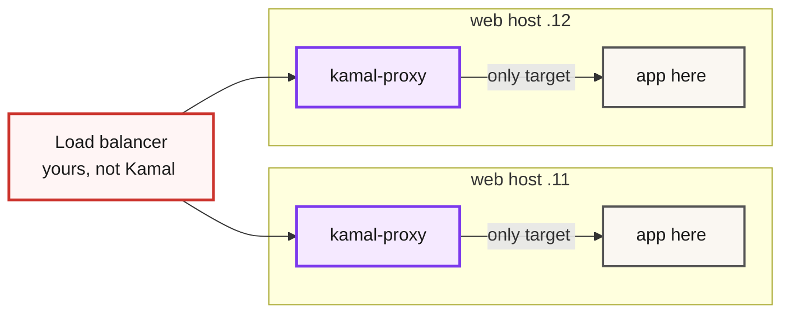

Add a second host under `servers:` and run `kamal deploy`. If your proxy config has `ssl: true`, the deploy dies before Kamal opens a single SSH connection:

```
SSL is only supported on a single server unless you provide custom certificates, found 2 servers for role web
```

That's a hard `ConfigurationError`, raised during validation. It's also the first of several things that were free on one box and aren't on two. Kamal won't warn you about most of the others, and that error gets its answer further down, in the TLS section.

Every default and error message below was read out of the Kamal 2.12.0 source, because the docs skip most of them.

We assume a working single-server deploy. If you're starting from zero, [our Kamal walkthrough](/blog/deploying-ruby-on-rails-applications-with-kamal-devops-docker/) covers server prep and the first `kamal setup` - it predates Kamal 2, so read its `.env` advice as today's `.kamal/secrets`.

## Kamal does not load-balance across hosts

kamal-proxy routes traffic on the host it runs on, and only to containers on that host.

During boot, every host runs its own kamal-proxy container, and each proxy gets exactly one target - the app container on that same host. You can watch it happen in `lib/kamal/cli/app/boot.rb`: each host captures its own container id and passes it to `kamal-proxy deploy --target <id>`. A second web host gives you a second, fully independent proxy that has never heard of the first.

The proxy binary itself can do more. kamal-proxy gained round-robin across multiple targets in April 2025 ([issue #15](https://github.com/basecamp/kamal-proxy/issues/15), closed by [PR #124](https://github.com/basecamp/kamal-proxy/pull/124), explicitly aimed at multi-host Kamal). As of Kamal 2.12.0, that capability still isn't wired up. No `deploy.yml` key sets more than one target, and Kamal always passes a single [`--target=<container-id>:<port>`](https://github.com/basecamp/kamal/blob/v2.12.0/lib/kamal/configuration/proxy.rb#L97) per host.

So traffic distribution is your job. In the order we reach for them:

- A cloud load balancer (ALB, Hetzner LB, DigitalOcean LB) in front of the web hosts. This is what the kamal-proxy maintainer recommends in [discussion #142](https://github.com/basecamp/kamal-proxy/discussions/142): terminate TLS at the balancer, send plain HTTP to the hosts.
- A small Caddy or HAProxy box you run yourself. Cheaper, and one more thing to patch.
- DNS round-robin, if you can live with clients pinning to a dead host until the TTL expires.



## Splitting hosts into roles

A bare array under `servers:` implicitly becomes the `web` role. Multi-server configs use the hash form:

```yaml
servers:
  web:
    hosts:
      - 10.0.0.11
      - 10.0.0.12
  job:
    hosts:
      - 10.0.0.21
    cmd: bin/jobs
    stop_timeout: 60
    options:
      memory: 2g
      cpus: 2
```

Same image everywhere; the role changes only the command and the container options. Here `web` runs Rails behind kamal-proxy while `job` runs Solid Queue workers with a longer SIGTERM grace, so an in-flight job gets 60 seconds to finish instead of Kamal's 30-second `drain_timeout` default.

Three defaults bite here.

- The proxy is enabled by default on the primary role and disabled on every other role. Job hosts get no proxy, which is what you want.
- Kamal expects a role named `web`. If you genuinely have none, set `primary_role:` at the root.
- Role-level `env:` works, but env `tags:` are top-level only. Per-host env goes through host tags (`- 10.0.0.12: canary`) resolved in the root `env: tags:` block.

Once workers live on their own hosts, queue concurrency and retry behavior stop being things you can tune by eyeballing one machine - the worker-side half of that story is in [Solid Queue: retries, concurrency, monitoring](/blog/solid-queue-advanced-patterns-retries-concurrency/).

## What a multi-host deploy actually does

`kamal deploy` builds the image once, pushes it, and pulls it on every app host before anything else happens. The Dockerfile side of that - multi-stage builds, layer caching - doesn't change at N hosts; [our Rails 8 Docker production guide](/blog/rails-8-docker-deployment-production-guide/) covers it.

Next, Kamal stages assets and SSL certs onto every host in a separate pass. Only then does booting start, and one detail here saves you a confused hour: non-primary roles wait. Kamal creates a health barrier, and job hosts block until the first web container reports healthy - the log says `Waiting for the first healthy web container before booting job on 10.0.0.21...`. If that first web container never turns healthy, your job hosts never boot at all. The image gets tagged `latest` only after every host is up.

Health checks also differ by role. Web containers get polled by kamal-proxy on `/up` once a second until `deploy_timeout` (default 30s). Job containers have no proxy, so Kamal uses the Docker `HEALTHCHECK` from your image - and if there isn't one, it waits `readiness_delay` (7 seconds) and declares victory. A worker that crashes at second 8 still counts as a successful deploy, which is worth fixing with a real `HEALTHCHECK` before you trust rolling deploys. When a deploy stalls on "target failed to become healthy", [we wrote a full debugging guide for that error](/blog/solving-kamals-target-failed-become-healthy/).

One more thing lives in exactly one place: the deploy lock, held over SSH on the primary host only. If the primary host is down, you can't take the lock, which means you can't deploy the healthy hosts either. [2.12.0](https://github.com/basecamp/kamal/releases/tag/v2.12.0) added `--lock-wait` for the other lock problem - two CI runs racing each other - which pairs well with [deploying from GitHub Actions](/blog/automate-your-deployments-with-kamal-2-github-actions-devops-development/).

## When a deploy dies halfway through the fleet

Hosts 1 and 2 boot fine, host 3 never goes healthy, and the deploy raises.

Kamal does not roll back the hosts that already succeeded. They keep serving the new release while host 3 serves the old one, and your balancer keeps sending traffic to all three. Nothing in the tool notices the mismatch.

What does happen is that `latest` never moves. The [tagging step runs after the boot loop finishes](https://github.com/basecamp/kamal/blob/v2.12.0/lib/kamal/cli/app.rb#L34), so a failed deploy leaves `latest` pointing at the release you were replacing - which is exactly why the migration hook below needs `$KAMAL_VERSION` rather than trusting `latest`.

Recovery is manual and you have to name the version:

```bash
kamal app containers                 # find the version you want
kamal rollback <version>             # boot that version everywhere
```

`kamal rollback` checks that the container still exists on every app host before booting it, and pruning keeps the last `retain_containers` releases (default 5), so you have a few deploys of runway rather than unlimited. Practically: keep the split-version window short by deploying with `boot: limit: 1` while you still trust the release, and make sure your balancer's own health check can pull a bad host out on its own. Kamal has no cordon, no drain, and no failover - that part is yours.

## Rolling deploys: boot limit and wait

By default Kamal boots all hosts in parallel. At two hosts that's usually fine. Past that, roll:

```yaml
boot:
  limit: 1     # hosts per group - use an integer, see below
  wait: 10     # seconds slept after each group
```

The percentage form computes against the wrong denominator, and the docs don't mention it. [`Kamal::Configuration::Boot`](https://github.com/basecamp/kamal/blob/v2.12.0/lib/kamal/configuration/boot.rb#L8) counts all hosts including dedicated accessory hosts, while the boot groups [slice only app hosts](https://github.com/basecamp/kamal/blob/v2.12.0/lib/kamal/cli/app.rb#L365). With 4 web hosts and 2 accessory-only hosts, `limit: "50%"` boots 3 app hosts per group, not 2. Use an integer.

`wait:` sleeps after the last group too, which is also undocumented. The [`sleep` sits inside the group loop](https://github.com/basecamp/kamal/blob/v2.12.0/lib/kamal/cli/app.rb#L31) rather than between iterations, so `wait: 30` across four groups adds 120 seconds to every deploy rather than 90.

The limit also slices app hosts across all roles combined. Web and job hosts share one grouping, and there is no per-role limit.

## TLS when you have more than one web host

Back to the error at the top. Kamal's `ssl: true` means automatic Let's Encrypt on the host itself, and the challenge only works when the DNS name points at the single machine answering it. With two hosts behind one name, the challenge lands wherever DNS sends it, so Kamal [refuses the config outright](https://github.com/basecamp/kamal/blob/v2.12.0/lib/kamal/configuration/role.rb#L161) unless you bring your own certificates.

You have three ways out.

Terminating TLS at the load balancer is what the maintainer recommends. The balancer holds the certificate, and app hosts speak plain HTTP on the private network:

```yaml
proxy:
  app_port: 3000
  ssl: false
  forward_headers: true
```

Set `forward_headers` explicitly even though `true` happens to be the default when `ssl` is false. The default flips whenever `ssl` changes, and you don't want client-IP headers silently changing behavior during a TLS migration.

If you'd rather keep TLS on the hosts, `ssl:` accepts a certificate and key as secret names, resolved from `.kamal/secrets`:

```yaml
proxy:
  host: app.example.com
  app_port: 3000
  ssl:
    certificate_pem: CERTIFICATE_PEM
    private_key_pem: PRIVATE_KEY_PEM
```

```bash
# .kamal/secrets
CERTIFICATE_PEM=$(cat certs/fullchain.pem)
PRIVATE_KEY_PEM=$(cat certs/privkey.pem)
```

Note these are secret names, not file paths. Renewal becomes your problem, and the docs are blunt that a missing or invalid cert fails the deploy.

Or stay on one web host - the case for that gets its own section below.

## Accessories on their own host

An accessory can target `host:`, `hosts:`, `role:`, or `tag:`, and the host doesn't need to appear under `servers:` at all. The mistake to avoid is copying the port binding from single-server tutorials:

```yaml
accessories:
  db:
    image: postgres:17
    host: 10.0.0.31
    port: "10.0.0.31:5432:5432"   # NOT 127.0.0.1 - your app hosts are remote
    env:
      clear:
        POSTGRES_USER: myapp
      secret:
        - POSTGRES_PASSWORD
    directories:
      - data:/var/lib/postgresql/data
```

The docs' own example binds `127.0.0.1:3306:3306`, which is correct when app and database share a machine and connection-refused when they don't. Docker networks don't span machines either - the default `kamal` network is host-local, so an app container on host A can't reach `myapp-db` by container name on host B. Bind the published port to the private-network IP and firewall it there, never `0.0.0.0` on a public interface.

Also, straight from the [shipped docs](https://github.com/basecamp/kamal/blob/v2.12.0/lib/kamal/configuration/docs/accessory.yml): accessories "are not updated when you deploy, and they do not have zero-downtime deployments." `kamal setup` boots them once; `kamal deploy` never touches them again. Upgrading Postgres means `kamal accessory reboot db`, and that reboot has downtime - schedule it.

## Run migrations once, not once per host

Rails 8's generated Docker entrypoint runs `db:prepare` whenever the container command is `./bin/rails server`:

```bash
#!/bin/bash -e
if [ "${@: -2:1}" == "./bin/rails" ] && [ "${@: -1:1}" == "server" ]; then
  ./bin/rails db:prepare
fi
exec "${@}"
```

Boot three web hosts in parallel and `db:prepare` fires three times concurrently. Rails wraps migrations in an advisory lock, so nothing corrupts - the losers raise `ActiveRecord::ConcurrentMigrationError` and exit. But a container that exits never passes its health check, so a perfectly good release fails because two hosts raced the third. Job hosts sit this out entirely: `bin/jobs` doesn't match the entrypoint's test, so they never migrate.

The clean fix runs the migration exactly once, before any host boots, from a `pre-deploy` hook:

```bash
# .kamal/hooks/pre-deploy
#!/bin/sh
kamal app exec --primary --version "$KAMAL_VERSION" "bin/rails db:migrate"
```

The `--version` is not optional, and this is the part that bites. Bare `kamal app exec` resolves to the `latest` tag, but Kamal only moves `latest` after every host has booted. During a `pre-deploy` hook, `latest` on that host still points at the release you are replacing, so the migration would run with the old code and quietly do nothing. Hooks get the real version in `KAMAL_VERSION`, so pass it.

Don't add `--reuse` either: that execs into the currently running container, which is also the old release. Then strip `db:prepare` from the entrypoint so the web hosts stop trying.

`boot: limit: 1` is the lazier alternative. Serialized hosts can't race, and `db:prepare` is idempotent, so each host just re-runs a no-op. You pay for it in deploy time.

## What breaks quietly when you go from one host to N

Recurring jobs survive the split. Every enqueue writes a row to `solid_queue_recurring_executions`, [unique-indexed on task key and run time](https://github.com/rails/solid_queue/blob/main/app/models/solid_queue/recurring_execution.rb), so three job hosts still fire your nightly billing run once.

That guarantee holds "as long as you keep the jobs around" ([Solid Queue README](https://github.com/rails/solid_queue)) - `preserve_finished_jobs` must stay on, and pruning must be less aggressive than your schedule. To make it structural instead, give the scheduler its own role with `cmd: bin/jobs --only-recurring` on one host and `--skip-recurring` on the rest. A `whenever`-generated crontab has no such guard - it lives on each host and fires on each host, so a second job host genuinely double-fires. [Sidekiq-Cron](https://github.com/sidekiq-cron/sidekiq-cron) does coordinate: a Redis sorted set lets only the first process to ask enqueue a given run.

Uploads on local disk do not. Kamal `volumes:` and accessory `directories:` are plain per-host bind mounts. An upload written by web-1 404s when the next request lands on web-2. Move Active Storage to S3, R2, or GCS before adding the second web host, not after the first support ticket.

Assets skew mid-deploy. Kamal's `asset_path:` bridges old and new fingerprinted assets per host, built from that host's own containers. Behind a round-robin balancer with no sticky sessions, a browser can fetch HTML from an already-updated host and then request the new CSS from a host that hasn't updated yet. `boot: limit: 1` with a short `wait` shrinks the window; a CDN in front of assets removes it.

Then there's the connection arithmetic. Total database connections scale as web hosts times Puma workers times threads, plus the same product for job hosts. Going from 1 web host to 3 triples the first term with zero config changes on the database side. Run that multiplication against your Postgres `max_connections` while you're still editing `deploy.yml`. The failure mode if you skip it is a `too many clients already` page.

Anything database-backed survives the split, Solid Cache and Solid Queue included, which is an underrated argument for the DB-backed stack we compared in [Solid Trifecta vs Redis](/blog/solid-trifecta-hybrid-redis-rails-8/). In-process memoization and host-local file caches don't. Cookie sessions need no stickiness. Action Cable is the exception, since each host holds its own WebSocket connections and needs a shared adapter like `solid_cable` or Redis.

## Operating on part of the fleet

Every command takes host and role filters, wildcards included:

```bash
kamal deploy --hosts 10.0.0.11              # just this host
kamal deploy --roles web                    # just this role
kamal app logs --roles 'job*'               # worker logs only, wildcards allowed
kamal app exec -i --reuse "bin/rails console"   # console on the primary host's live container
kamal proxy reboot --rolling                # proxies one host at a time
kamal deploy --lock-wait                    # 2.12.0+: queue behind a running deploy
```

Destinations split fleets by environment: `kamal deploy -d staging` merges `config/deploy.staging.yml` over the base file. One secrets trap comes with it - when a destination is selected, Kamal reads `.kamal/secrets-common` and `.kamal/secrets.staging`, and the plain `.kamal/secrets` file is skipped entirely. Destinations plus a server pool also power [per-PR review apps on Kamal](/blog/own-heroku-review-apps-with-github-actions-kamal-2-devops-development/).

## When multi-server is the wrong call

Price what the single box gives you before you leave it: `ssl: true` works with free renewal, the generated entrypoint migrates safely, Active Storage Disk works, assets never skew, there's no balancer to run or pay for, and the connection math stays put. A big modern VPS runs a lot of Rails - before adding hosts, check how much headroom per-host tuning buys you; [our Falcon production tuning post](/blog/falcon-web-server-production-tuning-benchmarks/) is that exercise for the web tier.

Two triggers justify the move. You can't tolerate a single host going down - kernel reboots alone force that conversation eventually. Or you've genuinely hit the ceiling of the biggest instance you can rent. Growth you haven't hit yet doesn't qualify, because scaling out later is a config change plus this post, not a rewrite.

There's also a middle option: one large web host plus one job host. You get the separation that matters - worker deploys can't take down web serving, a leaking job process can't starve Puma, `stop_timeout` tuned per role - while keeping one web host. And one web host means `ssl: true` still works, migrations still run once, and no balancer appears on the bill.

Add the second web host and the sharp edges show up. Add a job host and almost none of them do.

## The whole deploy.yml

Here's the reference config for 2 web hosts, 1 job host, and Postgres on its own machine, TLS at the balancer:

```yaml
service: myapp
image: myorg/myapp

servers:
  web:
    hosts:
      - 10.0.0.11
      - 10.0.0.12
  job:
    hosts:
      - 10.0.0.21
    cmd: bin/jobs
    stop_timeout: 60

proxy:
  app_port: 3000
  ssl: false            # TLS terminates at the load balancer
  forward_headers: true
  healthcheck:
    path: /up
    interval: 3
    timeout: 5

registry:
  server: ghcr.io
  username: myorg
  password:
    - KAMAL_REGISTRY_PASSWORD

env:
  clear:
    DB_HOST: 10.0.0.31
    SOLID_QUEUE_IN_PUMA: "false"
  secret:
    - RAILS_MASTER_KEY
    - POSTGRES_PASSWORD

accessories:
  db:
    image: postgres:17
    host: 10.0.0.31
    port: "10.0.0.31:5432:5432"
    env:
      clear:
        POSTGRES_USER: myapp
      secret:
        - POSTGRES_PASSWORD
    directories:
      - data:/var/lib/postgresql/data

boot:
  limit: 1
  wait: 10

ssh:
  user: deploy

deploy_timeout: 60
```

Plus the `pre-deploy` migration hook from above, and a load balancer in front of `10.0.0.11` and `10.0.0.12` that you provision separately. Kamal rejects unrecognized keys at validation time, so if this file parses on your machine, every key in it is real for your version.

Versions move: everything here was verified against Kamal 2.12.0 (June 2026). The load-balancing gap in particular is the kind of thing a future release could close - check the [release notes](https://github.com/basecamp/kamal/releases) before treating it as permanent.

*Single-server setup is covered in [Deploying Rails with Kamal](/blog/deploying-ruby-on-rails-applications-with-kamal-devops-docker/), and CI wiring in [Kamal 2 with GitHub Actions](/blog/automate-your-deployments-with-kamal-2-github-actions-devops-development/).*

<!-- Reference cadence: thoughtbot -->
