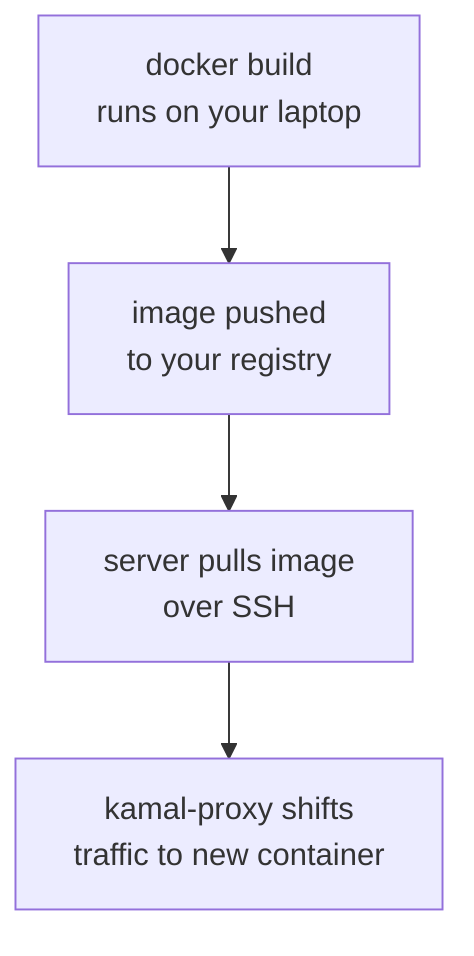

Kamal 2 moved the pieces that most published Kamal tutorials spend their time on. Copy one of those configs forward and the deploy stops before it opens an SSH connection:

```
ERROR (Kamal::ConfigurationError): unknown key: traefik
```

Kamal validates every top-level key, so a stale config fails at once instead of misbehaving quietly. That part is a gift. The catch is that the error names what died without naming its replacement, and `traefik` is only the first key you'll hit.

This walks a first deploy onto one server against Kamal 2.12, with each moved piece mapped to what replaced it.

## What `kamal init` actually creates

Add the gem and initialize:

```ruby
# Gemfile
gem "kamal", "~> 2.0"
```

```bash
bundle install
bundle exec kamal init
```

Three things land, and one of them is the one old guides miss:

```
config/deploy.yml     # main configuration
.kamal/secrets        # secret references - safe to commit
.kamal/hooks/         # sample deploy hooks
```

There is no `.env.erb`. If you're hunting for one because a tutorial promised it, that file belonged to Kamal 1 and hasn't shipped since 2.0. `bin/kamal` doesn't appear either unless you pass `--bundle`, which defaults to false.

Rails 8 ships Kamal in new apps already, so `kamal init` may be redundant for you - [we covered that change when it landed](/blog/kamal-integration-in-rails-8-by-default-ruby/).

## Secrets moved to `.kamal/secrets`

`.kamal/secrets` is built to be committed, because it holds *references* rather than values:

```bash
# .kamal/secrets
KAMAL_REGISTRY_PASSWORD=$KAMAL_REGISTRY_PASSWORD
RAILS_MASTER_KEY=$(cat config/master.key)
```

Each line either reads an environment variable or shells out. The file carries no credentials itself, which is why the generated template opens with "DO NOT ENTER RAW CREDENTIALS HERE! This file needs to be safe for git."

Already keeping secrets in a password manager? Kamal will fetch them:

```bash
SECRETS=$(kamal secrets fetch --adapter 1password --account my-account \
  --from MyVault/MyItem KAMAL_REGISTRY_PASSWORD RAILS_MASTER_KEY)
KAMAL_REGISTRY_PASSWORD=$(kamal secrets extract KAMAL_REGISTRY_PASSWORD $SECRETS)
```

Adapters ship for 1Password, LastPass, and Bitwarden.

## The config that gets you deployed

Here's a working single-server `deploy.yml`, shorter than you'd expect:

```yaml
# config/deploy.yml
service: my-app
image: my-user/my-app

servers:
  web:
    - 192.168.0.1

proxy:
  ssl: true
  host: app.example.com
  # kamal-proxy talks to your container on port 80 by default
  # app_port: 3000

registry:
  server: ghcr.io
  username: my-user
  password:
    - KAMAL_REGISTRY_PASSWORD

builder:
  arch: amd64

env:
  clear:
    DB_HOST: 192.168.0.2
  secret:
    - RAILS_MASTER_KEY
```

The `proxy:` block sits where Traefik used to. Kamal 2 runs [kamal-proxy](https://github.com/basecamp/kamal-proxy) instead, and it handles Let's Encrypt itself - `ssl: true` plus a `host:` is the entire TLS setup on one server.

Notice what `env:` looks like now. Plain values go under `clear:`, and anything sensitive goes under `secret:` as a *name* that resolves out of `.kamal/secrets`.

Health checks moved too. They live under `proxy:`, not at the top level:

```yaml
proxy:
  ssl: true
  host: app.example.com
  healthcheck:
    path: /health
    interval: 3
    timeout: 3
```

A top-level `healthcheck:` block with `port:` and `max_attempts:` is Kamal 1 syntax, and it earns you the same treatment as `traefik:`:

```
ERROR (Kamal::ConfigurationError): unknown key: healthcheck
```

Useful property to lean on while you port a config: if your `deploy.yml` validates on your machine, every key in it is real for your version. Work through the errors one at a time and Kamal will name each dead key for you.

## Sizing the box

Kamal publishes no minimum RAM figure, and it can't - your app decides that number, not the deploy tool.

What Kamal does decide is *where the build happens*, and that's the part people size wrong. `builder.local` defaults to `true`, so `docker build` runs on your laptop and Kamal pushes the finished image to your registry. Your server pulls it.

Asset precompilation, bundle install, and the whole Node toolchain never touch the production box. Size the server for your app's runtime plus whatever accessories share it, not for a build.

Set `builder.remote` to offload builds elsewhere and the arithmetic changes - but that's a deliberate choice, not the default.

Kamal will install Docker for you, so skip the `curl get-docker.sh` step older guides open with:

```bash
bundle exec kamal server bootstrap
```

## The first deploy

First time out, you want `setup`, not `deploy`:

```bash
bundle exec kamal setup
```

`setup` installs Docker on the servers, then runs a deploy with accessories booted. Every deploy after that is `kamal deploy`, and once servers are already bootstrapped, `kamal redeploy` skips the bootstrap and proxy work.



That local-build step is why a slow home connection hurts a Kamal deploy more than a slow server does.

## When the first deploy stalls

A health check that never goes green is the failure we see most on first deploys, and the error names the target rather than the cause. We wrote up [that specific error and how to read it](/blog/solving-kamals-target-failed-become-healthy/) separately, because it has more causes than fit here.

Three commands do most of the diagnosis:

```bash
bundle exec kamal app logs -f      # application output
bundle exec kamal proxy logs       # kamal-proxy, formerly where you'd read Traefik
bundle exec kamal config           # roles, hosts, image, builder, accessories
```

One caveat on `kamal config`, because its own help text oversells it. The command prints a redacted subset - roles, hosts, resolved image and version, builder, accessories - and leaves out `env` and `proxy` entirely. Mistype a secret name and `kamal config` still exits 0 with unchanged output, so it will not confirm your secrets wiring. Its job is telling you which hosts and image a deploy resolved to.

There's also `kamal docs proxy` - the gem ships its configuration reference offline, so you can check a key without leaving the terminal.

## Rolling back

```bash
bundle exec kamal rollback 9f8a2c1
```

Rollback is a container swap, not a rebuild, and it takes a real version rather than a placeholder. Kamal checks that a *container* still exists for the version you named, which is the constraint that catches people: `kamal prune` keeps only the last five containers by default, so five deploys after a bad one, that version is no longer a rollback target. Run `kamal app containers` to see what's actually still there.

Worth knowing before you need it: rollback swaps the code, not your database. A deploy that ran a destructive migration doesn't become safe because you rolled the container back.

## Coming from Kamal 1

Don't hand-edit your way across. Kamal ships the migration:

```bash
bundle exec kamal upgrade
```

It confirms once, then replaces Traefik with kamal-proxy and restarts accessories. Rename two files before you run it: Kamal 2 refuses any config carrying `pre-traefik-reboot` or `post-traefik-reboot` hooks, and the error tells you what it wants - "these should be renamed to (pre|post)-proxy-reboot". Rename them rather than deleting; the hooks themselves still run.

## When Kamal is the wrong call

Running one app on one box, with traffic that fits in a small droplet? Kamal earns its keep fast. The calculus shifts as you add servers.

Kamal doesn't load-balance across hosts, and `ssl: true` raises a `ConfigurationError` the moment you list a second web server. Neither is a bug - that's the boundary where you're expected to bring a load balancer. [The multi-server post covers that transition](/blog/kamal-2-multi-server-deployment-complete-guide/), including the roles split and the TLS answer.

Skip Kamal entirely if you want zero infrastructure ownership. Somebody on your team now patches a Linux box, and a PaaS bill is often cheaper than the hours that takes.

For deploys triggered on push rather than from your laptop, [wire it into GitHub Actions](/blog/automate-your-deployments-with-kamal-2-github-actions-devops-development/) - and if you want per-PR environments, [review apps work the same way](/blog/own-heroku-review-apps-with-github-actions-kamal-2-devops-development/).

Further reading:

- [Kamal documentation](https://kamal-deploy.org/) - official guides and the full configuration reference
- [Kamal on GitHub](https://github.com/basecamp/kamal) - source, changelog, and the 2.x release notes
- [kamal-proxy](https://github.com/basecamp/kamal-proxy) - the proxy that replaced Traefik in 2.0
- [Configuration reference](https://kamal-deploy.org/docs/configuration/) - every key, including the ones this post skipped
- [Rails 8 release notes](https://guides.rubyonrails.org/8_0_release_notes.html) - where Kamal became the default deploy path
