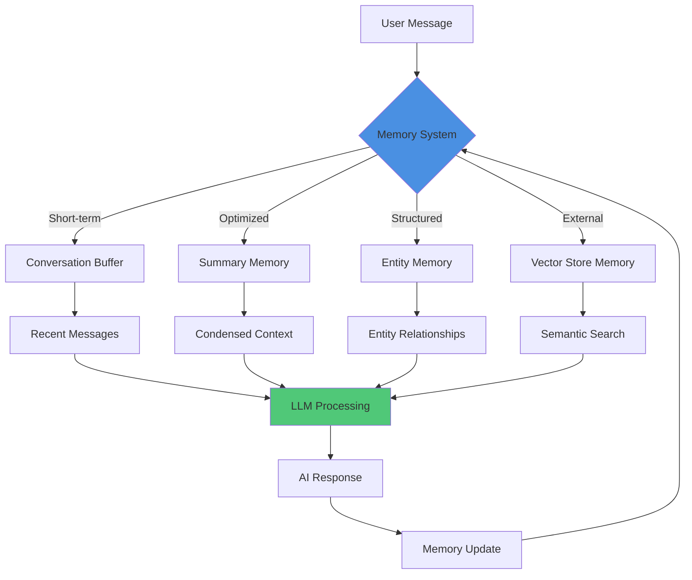

## The Challenge: Conversations Without Memory

You've built a sophisticated LLM-powered chatbot using LangChain. It works brilliantly for single-turn questions. But when users ask follow-up questions like "Can you elaborate on that?" or "What did I ask you 5 minutes ago?", your bot draws a blank.

Without memory, every conversation starts from scratch. Your AI can't remember context, track user preferences, or maintain conversation flow across multiple interactions.

## Our Approach: LangChain Memory Architecture

Let's build conversational AI that remembers—using LangChain's powerful memory systems combined with Rails persistence. We'll cover everything from in-memory conversation buffers to production-ready PostgreSQL/Redis storage that scales.

Have you ever wanted your AI agents to remember important details across conversations, maintain context over extended exchanges, or even build user profiles over time? LangChain's memory systems make this possible with clean abstractions and flexible storage backends.

Here's what makes this powerful: LangChain provides multiple memory types—each optimized for different use cases—from simple conversation buffers to sophisticated entity memory that tracks relationships and facts. And with Rails integration, you can persist these memories to PostgreSQL or Redis for production reliability.

Let's dive into building stateful conversational AI that users love.

---

## Understanding LangChain Memory Systems

Before jumping into code, let's understand the memory architecture that powers stateful conversations.

### Why Memory Matters for Conversational AI

Traditional LLM interactions are stateless—each API call is independent. This creates jarring user experiences:

**Without Memory:**
```
User: What's the weather in New York?
AI: It's 72°F and sunny in New York City.

User: How about tomorrow? [AI has no context]
AI: I need more information. What location are you asking about?
```

**With Memory:**
```
User: What's the weather in New York?
AI: It's 72°F and sunny in New York City.

User: How about tomorrow? [AI remembers New York context]
AI: Tomorrow in New York will be 68°F with scattered clouds.
```

Memory transforms disconnected exchanges into natural conversations.

### LangChain Memory Architecture Overview

LangChain provides four primary memory types, each serving distinct use cases:



**Memory Type Selection Matrix:**

| Memory Type | Use Case | Context Size | Storage Cost | Best For |
|------------|----------|--------------|--------------|----------|
| **Conversation Buffer** | Short conversations | Full history | Low | Customer support chats |
| **Conversation Summary** | Long conversations | Condensed | Medium | Multi-session consultations |
| **Entity Memory** | Relationship tracking | Extracted facts | Medium | CRM, personal assistants |
| **Vector Store Memory** | Semantic search | Embedded chunks | High | Knowledge base Q&A |

---

## Short-Term Memory: Conversation Buffers

The foundation of conversational AI—maintaining context across message exchanges.

### Basic Conversation Buffer Memory

The simplest memory type stores the complete conversation history:

**Python Implementation with LangChain:**

```python
from langchain.memory import ConversationBufferMemory
from langchain.chains import ConversationChain
from langchain_openai import ChatOpenAI
import os

# Initialize memory system
memory = ConversationBufferMemory(
    return_messages=True,
    memory_key="chat_history"
)

# Create conversation chain with memory
llm = ChatOpenAI(
    model="gpt-4-turbo-preview",
    temperature=0.7,
    api_key=os.getenv("OPENAI_API_KEY")
)

conversation = ConversationChain(
    llm=llm,
    memory=memory,
    verbose=True  # Shows memory operations
)

# Multi-turn conversation with context
response1 = conversation.predict(input="I'm planning a trip to Japan")
print(f"AI: {response1}")

response2 = conversation.predict(input="What's the best time to visit?")
print(f"AI: {response2}")
# Memory automatically provides Japan context

response3 = conversation.predict(input="What about visa requirements?")
print(f"AI: {response3}")
# Memory maintains full conversation context

# Inspect memory contents
print("\n=== Conversation History ===")
print(memory.load_memory_variables({}))
```

**Memory Output Example:**

```json
{
  "chat_history": [
    {
      "role": "human",
      "content": "I'm planning a trip to Japan"
    },
    {
      "role": "ai",
      "content": "That's exciting! Japan offers incredible experiences..."
    },
    {
      "role": "human",
      "content": "What's the best time to visit?"
    },
    {
      "role": "ai",
      "content": "For your Japan trip, the best times are spring (March-May)..."
    }
  ]
}
```

### Conversation Buffer Window Memory

For long conversations, limit memory to recent messages to control context size:

**Windowed Memory Implementation:**

```python
from langchain.memory import ConversationBufferWindowMemory

# Keep only last 3 message exchanges (6 messages total)
windowed_memory = ConversationBufferWindowMemory(
    k=3,  # Number of exchanges to remember
    return_messages=True,
    memory_key="chat_history"
)

conversation = ConversationChain(
    llm=llm,
    memory=windowed_memory
)

# Simulate long conversation
messages = [
    "I'm interested in machine learning",
    "What's the difference between supervised and unsupervised learning?",
    "Can you explain neural networks?",
    "How do convolutional neural networks work?",
    "What about recurrent neural networks?",  # Oldest messages drop off
    "Tell me about transformers"  # Only recent context maintained
]

for msg in messages:
    response = conversation.predict(input=msg)
    print(f"User: {msg}")
    print(f"AI: {response[:100]}...\n")

# Memory contains only last 3 exchanges
print(f"Memory window size: {len(windowed_memory.load_memory_variables({})['chat_history'])}")
```

**Why Window Memory Matters:**

- **Context Control:** Prevent LLM context limits (4K-128K tokens depending on model)
- **Cost Optimization:** Fewer tokens = lower API costs
- **Performance:** Faster processing with smaller context windows
- **Focus:** Recent context is often most relevant

---

## Optimized Memory: Conversation Summarization

For extended conversations, summarize history to maintain context while controlling token usage.

### Conversation Summary Memory

Automatically condenses conversation history using LLM summarization:

**Summary Memory Implementation:**

```python
from langchain.memory import ConversationSummaryMemory
from langchain_openai import ChatOpenAI

llm = ChatOpenAI(temperature=0, model="gpt-4-turbo-preview")

# Create summary memory
summary_memory = ConversationSummaryMemory(
    llm=llm,
    return_messages=False,
    memory_key="history"
)

# Create conversation with summary memory
conversation = ConversationChain(
    llm=llm,
    memory=summary_memory,
    verbose=True
)

# Long conversation about software architecture
conversation.predict(input="I'm designing a microservices architecture")
conversation.predict(input="What's the best way to handle inter-service communication?")
conversation.predict(input="Should I use REST or gRPC?")
conversation.predict(input="How do I manage distributed transactions?")
conversation.predict(input="What about service discovery?")

# View summarized memory instead of full history
print("\n=== Summarized Conversation ===")
print(summary_memory.load_memory_variables({})['history'])
```

**Summary Output Example:**

```
The human is designing a microservices architecture and has inquired about
inter-service communication patterns. We discussed REST vs gRPC trade-offs,
with gRPC recommended for internal services due to performance benefits.
For distributed transactions, we covered the saga pattern and eventual
consistency approaches. Service discovery discussion included Consul and
Kubernetes service mesh patterns.
```

### Conversation Summary Buffer Memory

Combine windowed messages with summarization for optimal context management:

**Hybrid Summary Buffer Implementation:**

```python
from langchain.memory import ConversationSummaryBufferMemory

# Keep recent messages + summarize older ones
hybrid_memory = ConversationSummaryBufferMemory(
    llm=llm,
    max_token_limit=500,  # When to start summarizing
    return_messages=True,
    memory_key="chat_history"
)

conversation = ConversationChain(
    llm=llm,
    memory=hybrid_memory
)

# Simulate extensive technical discussion
topics = [
    "Explain database indexing strategies",
    "What's the difference between B-tree and hash indexes?",
    "How do I optimize query performance?",
    "What about database sharding?",
    "Explain horizontal vs vertical partitioning",
    "How do I handle database migrations at scale?",
    "What's your recommendation for database backups?",
]

for topic in topics:
    response = conversation.predict(input=topic)

# Memory contains: summary of old messages + recent full messages
memory_data = hybrid_memory.load_memory_variables({})
print(f"Total memory messages: {len(memory_data['chat_history'])}")
print(f"Memory includes summary: {hybrid_memory.moving_summary_buffer}")
```

**Memory Structure:**

```json
{
  "summary": "The conversation covered database indexing with B-tree and hash comparison, query optimization techniques including index usage and query planning...",
  "recent_messages": [
    {
      "role": "human",
      "content": "How do I handle database migrations at scale?"
    },
    {
      "role": "ai",
      "content": "For large-scale migrations, use blue-green deployment..."
    },
    {
      "role": "human",
      "content": "What's your recommendation for database backups?"
    }
  ]
}
```

---

## Structured Memory: Entity Tracking

Track entities (people, places, concepts) and their attributes across conversations.

### Entity Memory Implementation

Extract and maintain structured information about entities:

**Entity Memory with LangChain:**

```python
from langchain.memory import ConversationEntityMemory
from langchain.chains import ConversationChain
from langchain_openai import ChatOpenAI

llm = ChatOpenAI(temperature=0, model="gpt-4-turbo-preview")

# Create entity memory
entity_memory = ConversationEntityMemory(
    llm=llm,
    return_messages=True,
    memory_key="history"
)

conversation = ConversationChain(
    llm=llm,
    memory=entity_memory,
    verbose=True
)

# Conversation with multiple entities
conversation.predict(
    input="I'm working with Sarah on the Phoenix project. She's the lead developer."
)

conversation.predict(
    input="We're using Ruby on Rails and PostgreSQL for this project."
)

conversation.predict(
    input="Sarah mentioned the project deadline is next month."
)

conversation.predict(
    input="What do you know about the Phoenix project?"
)

# Inspect entity memory
print("\n=== Entity Memory ===")
print(entity_memory.entity_store.store)
```

**Entity Store Output:**

```json
{
  "Sarah": {
    "attributes": [
      "Lead developer",
      "Working on Phoenix project",
      "Mentioned project deadline"
    ],
    "relationships": [
      "Collaborates with the user",
      "Technical lead"
    ]
  },
  "Phoenix project": {
    "attributes": [
      "Uses Ruby on Rails",
      "Uses PostgreSQL",
      "Deadline next month",
      "Sarah is lead developer"
    ],
    "context": "Software development project"
  }
}
```

### Custom Entity Memory with Rails Models

Integrate entity memory with Rails for production persistence:

**Rails Entity Memory Integration:**

```ruby
# app/models/conversation_entity.rb
class ConversationEntity < ApplicationRecord
  belongs_to :conversation

  # Store entity attributes as JSONB
  # Columns: name:string, entity_type:string, attributes:jsonb

  validates :name, presence: true
  validates :entity_type, presence: true

  # Update entity attributes
  def update_attribute_value(key, value)
    self.attributes ||= {}
    self.attributes[key] = value
    save!
  end

  # Query entity knowledge
  def self.find_by_attribute(key, value)
    where("attributes ->> ? = ?", key, value)
  end
end

# app/services/langchain_entity_memory_service.rb
class LangchainEntityMemoryService
  def initialize(conversation_id)
    @conversation = Conversation.find(conversation_id)
  end

  def extract_entities(message)
    # Use LangChain entity extraction
    response = OpenAI::Client.new.chat(
      parameters: {
        model: "gpt-4-turbo-preview",
        messages: [
          {
            role: "system",
            content: entity_extraction_prompt
          },
          {
            role: "user",
            content: message
          }
        ],
        temperature: 0
      }
    )

    entities = JSON.parse(response.dig("choices", 0, "message", "content"))

    # Persist entities to Rails database
    entities.each do |entity_data|
      entity = @conversation.conversation_entities.find_or_initialize_by(
        name: entity_data["name"],
        entity_type: entity_data["type"]
      )

      entity.attributes = entity.attributes.merge(entity_data["attributes"])
      entity.save!
    end

    entities
  end

  def get_entity_context(entity_names)
    @conversation.conversation_entities
      .where(name: entity_names)
      .map { |e| "#{e.name} (#{e.entity_type}): #{e.attributes.to_json}" }
      .join("\n")
  end

  private

  def entity_extraction_prompt
    <<~PROMPT
      Extract entities from the conversation along with their attributes.
      Return JSON format:
      [
        {
          "name": "Entity Name",
          "type": "person|project|technology|location|other",
          "attributes": {
            "key1": "value1",
            "key2": "value2"
          }
        }
      ]
    PROMPT
  end
end
```

**Using Rails Entity Memory:**

```ruby
# In your Rails controller
class ConversationsController < ApplicationController
  def send_message
    conversation = Conversation.find(params[:id])
    entity_service = LangchainEntityMemoryService.new(conversation.id)

    # Extract entities from user message
    entities = entity_service.extract_entities(params[:message])

    # Get entity context for LLM
    entity_context = entity_service.get_entity_context(entities.map { |e| e["name"] })

    # Build LLM prompt with entity context
    prompt = build_prompt_with_entity_context(
      message: params[:message],
      entity_context: entity_context,
      conversation_history: conversation.messages.last(5)
    )

    # Get LLM response with entity awareness
    response = call_langchain_with_memory(prompt)

    render json: { response: response, entities: entities }
  end

  private

  def build_prompt_with_entity_context(message:, entity_context:, conversation_history:)
    <<~PROMPT
      You are a helpful AI assistant with memory of entities from previous conversations.

      === Entity Context ===
      #{entity_context}

      === Recent Conversation ===
      #{conversation_history.map { |m| "#{m.role}: #{m.content}" }.join("\n")}

      === Current Message ===
      User: #{message}

      Respond naturally while incorporating entity knowledge when relevant.
    PROMPT
  end
end
```

---

## External Memory: Vector Store Integration

For semantic search over large knowledge bases, use vector store memory with embedding models.

### Vector Store Memory with Redis

Combine conversation memory with semantic search capabilities:

**Redis Vector Store Setup:**

```python
from langchain.memory import VectorStoreRetrieverMemory
from langchain.embeddings import OpenAIEmbeddings
from langchain.vectorstores import Redis
from langchain.chains import ConversationChain
from langchain_openai import ChatOpenAI
import os

# Initialize Redis vector store
embeddings = OpenAIEmbeddings(api_key=os.getenv("OPENAI_API_KEY"))

vectorstore = Redis.from_texts(
    texts=[],  # Start with empty store
    embedding=embeddings,
    redis_url=os.getenv("REDIS_URL", "redis://localhost:6379"),
    index_name="conversation_memory"
)

# Create retriever for memory
retriever = vectorstore.as_retriever(
    search_kwargs={"k": 4}  # Retrieve 4 most relevant memories
)

# Vector store memory
vector_memory = VectorStoreRetrieverMemory(
    retriever=retriever,
    memory_key="chat_history",
    input_key="input"
)

# Create conversation with vector memory
llm = ChatOpenAI(model="gpt-4-turbo-preview", temperature=0)
conversation = ConversationChain(
    llm=llm,
    memory=vector_memory
)

# Store diverse conversation topics
topics = [
    "I love hiking in the Rocky Mountains during summer",
    "My favorite programming language is Python for data science",
    "I work as a machine learning engineer at a fintech startup",
    "I'm interested in learning more about LangChain memory systems",
    "I usually exercise at 6 AM before work"
]

for topic in topics:
    conversation.predict(input=topic)
    print(f"Stored: {topic}")

# Semantic retrieval - finds relevant context even with different wording
response = conversation.predict(input="What do you know about my outdoor activities?")
print(f"\nAI Response: {response}")
# AI will retrieve "hiking in Rocky Mountains" memory

response = conversation.predict(input="What's my technical background?")
print(f"\nAI Response: {response}")
# AI will retrieve "Python", "machine learning engineer" memories
```

### Rails Integration with PostgreSQL pgvector

For production Rails applications, use PostgreSQL's pgvector extension:

**Rails Vector Memory Implementation:**

```ruby
# Gemfile
gem 'pgvector'
gem 'ruby-openai'

# db/migrate/20251015_create_conversation_memories.rb
class CreateConversationMemories < ActiveRecord::Migration[7.1]
  def change
    enable_extension 'vector'

    create_table :conversation_memories do |t|
      t.references :conversation, null: false, foreign_key: true
      t.text :content, null: false
      t.vector :embedding, limit: 1536  # OpenAI ada-002 embedding size
      t.jsonb :metadata, default: {}
      t.timestamps

      t.index :embedding, using: :ivfflat, opclass: :vector_cosine_ops
    end
  end
end

# app/models/conversation_memory.rb
class ConversationMemory < ApplicationRecord
  belongs_to :conversation

  has_neighbors :embedding, dimensions: 1536

  validates :content, presence: true
  validates :embedding, presence: true

  # Generate embedding for content
  def self.create_with_embedding(conversation:, content:, metadata: {})
    embedding = generate_embedding(content)

    create!(
      conversation: conversation,
      content: content,
      embedding: embedding,
      metadata: metadata
    )
  end

  # Semantic search over memories
  def self.semantic_search(query, limit: 5)
    query_embedding = generate_embedding(query)

    nearest_neighbors(
      :embedding,
      query_embedding,
      distance: "cosine"
    ).limit(limit)
  end

  private

  def self.generate_embedding(text)
    client = OpenAI::Client.new(access_token: ENV['OPENAI_API_KEY'])

    response = client.embeddings(
      parameters: {
        model: "text-embedding-ada-002",
        input: text
      }
    )

    response.dig("data", 0, "embedding")
  end
end

# app/services/vector_memory_service.rb
class VectorMemoryService
  def initialize(conversation_id)
    @conversation = Conversation.find(conversation_id)
  end

  def store_message(content, role: "user")
    ConversationMemory.create_with_embedding(
      conversation: @conversation,
      content: content,
      metadata: {
        role: role,
        timestamp: Time.current.iso8601
      }
    )
  end

  def retrieve_relevant_context(query, limit: 5)
    memories = ConversationMemory
      .where(conversation: @conversation)
      .semantic_search(query, limit: limit)

    memories.map do |memory|
      {
        content: memory.content,
        role: memory.metadata["role"],
        timestamp: memory.metadata["timestamp"],
        relevance_score: memory.neighbor_distance
      }
    end
  end

  def build_context_prompt(query)
    relevant_memories = retrieve_relevant_context(query)

    context = relevant_memories.map do |memory|
      "#{memory[:role].capitalize} (#{memory[:timestamp]}): #{memory[:content]}"
    end.join("\n\n")

    <<~PROMPT
      You are a helpful AI assistant with memory of previous conversations.

      === Relevant Context from Past Conversations ===
      #{context}

      === Current Query ===
      User: #{query}

      Respond using relevant context when helpful, but always prioritize accuracy.
    PROMPT
  end
end
```

**Using Vector Memory in Rails Controllers:**

```ruby
# app/controllers/api/v1/conversations_controller.rb
class Api::V1::ConversationsController < ApplicationController
  def send_message
    conversation = Conversation.find(params[:id])
    vector_service = VectorMemoryService.new(conversation.id)

    # Store user message with embedding
    vector_service.store_message(params[:message], role: "user")

    # Build prompt with relevant context
    prompt = vector_service.build_context_prompt(params[:message])

    # Get LLM response
    response = call_openai_with_prompt(prompt)

    # Store AI response with embedding
    vector_service.store_message(response, role: "assistant")

    render json: {
      response: response,
      relevant_context_count: vector_service.retrieve_relevant_context(params[:message]).size
    }
  end

  private

  def call_openai_with_prompt(prompt)
    client = OpenAI::Client.new

    response = client.chat(
      parameters: {
        model: "gpt-4-turbo-preview",
        messages: [{ role: "user", content: prompt }],
        temperature: 0.7
      }
    )

    response.dig("choices", 0, "message", "content")
  end
end
```

---

## Production Patterns: Memory Persistence and Management

Building reliable conversational AI requires robust memory persistence strategies.

### PostgreSQL Memory Persistence

Store conversation memory in Rails with PostgreSQL for production reliability:

**Complete Rails Memory System:**

```ruby
# db/migrate/20251015_create_memory_system.rb
class CreateMemorySystem < ActiveRecord::Migration[7.1]
  def change
    # Conversations table
    create_table :conversations do |t|
      t.references :user, null: false, foreign_key: true
      t.string :conversation_type, default: "general"
      t.jsonb :metadata, default: {}
      t.timestamps
    end

    # Messages table - stores all conversation turns
    create_table :messages do |t|
      t.references :conversation, null: false, foreign_key: true
      t.string :role, null: false  # 'user' or 'assistant'
      t.text :content, null: false
      t.jsonb :metadata, default: {}
      t.timestamps

      t.index [:conversation_id, :created_at]
    end

    # Memory summaries - condensed conversation history
    create_table :memory_summaries do |t|
      t.references :conversation, null: false, foreign_key: true
      t.text :summary, null: false
      t.integer :message_count, default: 0
      t.datetime :summarized_up_to
      t.timestamps
    end

    # Entity memory - structured knowledge extraction
    create_table :conversation_entities do |t|
      t.references :conversation, null: false, foreign_key: true
      t.string :name, null: false
      t.string :entity_type, null: false
      t.jsonb :attributes, default: {}
      t.timestamps

      t.index [:conversation_id, :name], unique: true
    end
  end
end

# app/models/conversation.rb
class Conversation < ApplicationRecord
  belongs_to :user
  has_many :messages, dependent: :destroy
  has_many :memory_summaries, dependent: :destroy
  has_many :conversation_entities, dependent: :destroy
  has_many :conversation_memories, dependent: :destroy

  # Get recent conversation context
  def recent_context(limit: 10)
    messages.order(created_at: :desc).limit(limit).reverse
  end

  # Get or create current summary
  def current_summary
    memory_summaries.order(created_at: :desc).first
  end

  # Check if conversation needs summarization
  def needs_summarization?(threshold: 20)
    last_summary = current_summary
    return true if last_summary.nil? && messages.count > threshold

    return false if last_summary.nil?

    messages.where("created_at > ?", last_summary.summarized_up_to).count > threshold
  end
end

# app/services/conversation_memory_manager.rb
class ConversationMemoryManager
  attr_reader :conversation

  def initialize(conversation)
    @conversation = conversation
  end

  # Add message and manage memory
  def add_message(role:, content:)
    message = conversation.messages.create!(
      role: role,
      content: content
    )

    # Trigger summarization if needed
    summarize_if_needed

    # Extract entities from message
    extract_entities(content) if role == "user"

    message
  end

  # Get conversation context for LLM
  def build_llm_context(max_messages: 10)
    summary = conversation.current_summary
    recent_messages = conversation.recent_context(limit: max_messages)
    entity_context = get_entity_context

    {
      summary: summary&.summary,
      recent_messages: recent_messages.map do |msg|
        { role: msg.role, content: msg.content }
      end,
      entities: entity_context
    }
  end

  private

  def summarize_if_needed
    return unless conversation.needs_summarization?

    ConversationSummarizationJob.perform_later(conversation.id)
  end

  def extract_entities(content)
    EntityExtractionJob.perform_later(conversation.id, content)
  end

  def get_entity_context
    conversation.conversation_entities.map do |entity|
      {
        name: entity.name,
        type: entity.entity_type,
        attributes: entity.attributes
      }
    end
  end
end

# app/jobs/conversation_summarization_job.rb
class ConversationSummarizationJob < ApplicationJob
  queue_as :default

  def perform(conversation_id)
    conversation = Conversation.find(conversation_id)
    last_summary = conversation.current_summary

    # Get messages since last summary
    messages_to_summarize = if last_summary
      conversation.messages.where("created_at > ?", last_summary.summarized_up_to)
    else
      conversation.messages
    end

    return if messages_to_summarize.empty?

    # Build summarization prompt
    conversation_text = messages_to_summarize.map do |msg|
      "#{msg.role.capitalize}: #{msg.content}"
    end.join("\n\n")

    prompt = build_summarization_prompt(
      previous_summary: last_summary&.summary,
      new_messages: conversation_text
    )

    # Call OpenAI for summarization
    client = OpenAI::Client.new
    response = client.chat(
      parameters: {
        model: "gpt-4-turbo-preview",
        messages: [{ role: "user", content: prompt }],
        temperature: 0.3
      }
    )

    summary_text = response.dig("choices", 0, "message", "content")

    # Store new summary
    conversation.memory_summaries.create!(
      summary: summary_text,
      message_count: messages_to_summarize.count,
      summarized_up_to: messages_to_summarize.last.created_at
    )
  end

  private

  def build_summarization_prompt(previous_summary:, new_messages:)
    if previous_summary
      <<~PROMPT
        You are summarizing an ongoing conversation. Here's the previous summary:

        === Previous Summary ===
        #{previous_summary}

        === New Messages ===
        #{new_messages}

        Create an updated summary that combines the previous context with new information.
        Focus on: key topics discussed, important decisions, user preferences, and action items.
      PROMPT
    else
      <<~PROMPT
        Summarize the following conversation. Focus on: key topics discussed,
        important decisions, user preferences, and action items.

        === Conversation ===
        #{new_messages}
      PROMPT
    end
  end
end
```

### Redis Session Memory for Real-Time Performance

Use Redis for fast, session-based memory with automatic expiration:

**Redis Memory Implementation:**

```ruby
# app/services/redis_memory_service.rb
class RedisMemoryService
  EXPIRATION_TIME = 24.hours.to_i

  def initialize(conversation_id)
    @conversation_id = conversation_id
    @redis = Redis.new(url: ENV['REDIS_URL'])
  end

  # Store message in Redis
  def add_message(role:, content:, ttl: EXPIRATION_TIME)
    message_data = {
      role: role,
      content: content,
      timestamp: Time.current.to_i
    }

    # Add to sorted set (ordered by timestamp)
    @redis.zadd(messages_key, message_data[:timestamp], message_data.to_json)

    # Set expiration
    @redis.expire(messages_key, ttl)

    message_data
  end

  # Get recent messages
  def get_recent_messages(limit: 20)
    # Get last N messages from sorted set
    messages_json = @redis.zrevrange(messages_key, 0, limit - 1)

    messages_json.map { |json| JSON.parse(json, symbolize_names: true) }.reverse
  end

  # Store conversation summary
  def store_summary(summary, ttl: EXPIRATION_TIME)
    @redis.setex(summary_key, ttl, summary)
  end

  # Get conversation summary
  def get_summary
    @redis.get(summary_key)
  end

  # Clear conversation memory
  def clear_memory
    @redis.del(messages_key, summary_key, entities_key)
  end

  # Store entity data
  def store_entity(name:, entity_type:, attributes:)
    entity_data = {
      name: name,
      type: entity_type,
      attributes: attributes,
      updated_at: Time.current.to_i
    }

    @redis.hset(entities_key, name, entity_data.to_json)
    @redis.expire(entities_key, EXPIRATION_TIME)
  end

  # Get all entities
  def get_entities
    entities_hash = @redis.hgetall(entities_key)

    entities_hash.transform_values { |json| JSON.parse(json, symbolize_names: true) }
  end

  private

  def messages_key
    "conversation:#{@conversation_id}:messages"
  end

  def summary_key
    "conversation:#{@conversation_id}:summary"
  end

  def entities_key
    "conversation:#{@conversation_id}:entities"
  end
end

# Usage in controller
class Api::V1::MessagesController < ApplicationController
  def create
    redis_memory = RedisMemoryService.new(params[:conversation_id])

    # Store user message in Redis
    redis_memory.add_message(
      role: "user",
      content: params[:message]
    )

    # Get recent context from Redis (fast!)
    recent_context = redis_memory.get_recent_messages(limit: 10)
    summary = redis_memory.get_summary
    entities = redis_memory.get_entities

    # Build LLM prompt with Redis context
    prompt = build_prompt_with_context(
      message: params[:message],
      summary: summary,
      recent_messages: recent_context,
      entities: entities
    )

    # Get AI response
    response = call_langchain_llm(prompt)

    # Store AI response in Redis
    redis_memory.add_message(
      role: "assistant",
      content: response
    )

    # Optionally persist to PostgreSQL for long-term storage
    persist_to_database(params[:conversation_id], params[:message], response)

    render json: { response: response }
  end

  private

  def persist_to_database(conversation_id, user_message, ai_response)
    PersistConversationJob.perform_later(conversation_id, user_message, ai_response)
  end
end
```

---

## Testing LangChain Memory Systems

Reliable conversational AI requires comprehensive memory testing strategies.

### Unit Testing Memory Operations

Test memory storage, retrieval, and context building:

**RSpec Memory Tests:**

```ruby
# spec/services/conversation_memory_manager_spec.rb
RSpec.describe ConversationMemoryManager do
  let(:user) { create(:user) }
  let(:conversation) { create(:conversation, user: user) }
  let(:manager) { described_class.new(conversation) }

  describe '#add_message' do
    it 'stores messages in database' do
      expect {
        manager.add_message(role: 'user', content: 'Hello AI')
      }.to change(conversation.messages, :count).by(1)
    end

    it 'triggers summarization when threshold reached' do
      # Create 19 existing messages (threshold is 20)
      create_list(:message, 19, conversation: conversation)

      expect(ConversationSummarizationJob).to receive(:perform_later)
        .with(conversation.id)

      manager.add_message(role: 'user', content: 'Message 20')
    end
  end

  describe '#build_llm_context' do
    before do
      # Create conversation history
      create(:message, conversation: conversation, role: 'user', content: 'First message')
      create(:message, conversation: conversation, role: 'assistant', content: 'First response')
      create(:message, conversation: conversation, role: 'user', content: 'Second message')

      # Create summary
      create(:memory_summary,
        conversation: conversation,
        summary: 'User discussed topic X',
        summarized_up_to: 1.hour.ago
      )

      # Create entities
      create(:conversation_entity,
        conversation: conversation,
        name: 'Ruby on Rails',
        entity_type: 'technology',
        attributes: { 'framework_type' => 'web' }
      )
    end

    it 'includes summary in context' do
      context = manager.build_llm_context

      expect(context[:summary]).to eq('User discussed topic X')
    end

    it 'includes recent messages' do
      context = manager.build_llm_context(max_messages: 2)

      expect(context[:recent_messages].size).to eq(2)
      expect(context[:recent_messages].last[:content]).to eq('Second message')
    end

    it 'includes entity context' do
      context = manager.build_llm_context

      expect(context[:entities]).to include(
        hash_including(
          name: 'Ruby on Rails',
          type: 'technology',
          attributes: { 'framework_type' => 'web' }
        )
      )
    end
  end
end

# spec/services/redis_memory_service_spec.rb
RSpec.describe RedisMemoryService do
  let(:conversation_id) { 123 }
  let(:service) { described_class.new(conversation_id) }

  before do
    # Clear Redis before each test
    service.clear_memory
  end

  describe '#add_message and #get_recent_messages' do
    it 'stores and retrieves messages in order' do
      service.add_message(role: 'user', content: 'First')
      service.add_message(role: 'assistant', content: 'Second')
      service.add_message(role: 'user', content: 'Third')

      messages = service.get_recent_messages(limit: 10)

      expect(messages.size).to eq(3)
      expect(messages.map { |m| m[:content] }).to eq(['First', 'Second', 'Third'])
    end

    it 'respects message limit' do
      5.times { |i| service.add_message(role: 'user', content: "Message #{i}") }

      messages = service.get_recent_messages(limit: 3)

      expect(messages.size).to eq(3)
      expect(messages.last[:content]).to eq('Message 4')
    end
  end

  describe '#store_summary and #get_summary' do
    it 'stores and retrieves conversation summary' do
      summary_text = 'User discussed Rails and LangChain integration'

      service.store_summary(summary_text)

      expect(service.get_summary).to eq(summary_text)
    end
  end

  describe '#store_entity and #get_entities' do
    it 'stores and retrieves entity data' do
      service.store_entity(
        name: 'PostgreSQL',
        entity_type: 'database',
        attributes: { version: '15', use_case: 'vector storage' }
      )

      entities = service.get_entities

      expect(entities['PostgreSQL']).to include(
        name: 'PostgreSQL',
        type: 'database',
        attributes: { version: '15', use_case: 'vector storage' }
      )
    end
  end
end
```

### Integration Testing with LangChain

Test complete memory workflows with real LangChain interactions:

**Python Integration Tests:**

```python
import pytest
from langchain.memory import ConversationBufferMemory
from langchain.chains import ConversationChain
from langchain_openai import ChatOpenAI
import os

@pytest.fixture
def memory():
    """Create fresh memory for each test"""
    return ConversationBufferMemory(return_messages=True)

@pytest.fixture
def conversation(memory):
    """Create conversation chain with memory"""
    llm = ChatOpenAI(
        model="gpt-4-turbo-preview",
        temperature=0,
        api_key=os.getenv("OPENAI_API_KEY")
    )
    return ConversationChain(llm=llm, memory=memory)

def test_memory_maintains_context(conversation):
    """Test that memory maintains context across turns"""
    # First interaction
    response1 = conversation.predict(input="My name is Alice")
    assert response1  # Got a response

    # Second interaction - should remember name
    response2 = conversation.predict(input="What's my name?")
    assert "alice" in response2.lower(), "AI should remember user's name"

def test_memory_stores_multiple_turns(conversation, memory):
    """Test that memory stores multiple conversation turns"""
    conversation.predict(input="I like Python")
    conversation.predict(input="I also like Ruby")
    conversation.predict(input="JavaScript is great too")

    # Check memory contains all messages
    memory_vars = memory.load_memory_variables({})
    messages = memory_vars["chat_history"]

    assert len(messages) >= 6  # 3 user + 3 AI messages

    # Check content is preserved
    user_messages = [m.content for m in messages if m.type == "human"]
    assert any("Python" in msg for msg in user_messages)
    assert any("Ruby" in msg for msg in user_messages)

def test_windowed_memory_limits_context():
    """Test that windowed memory respects size limits"""
    from langchain.memory import ConversationBufferWindowMemory

    windowed_memory = ConversationBufferWindowMemory(
        k=2,  # Only keep 2 exchanges
        return_messages=True
    )

    llm = ChatOpenAI(model="gpt-4-turbo-preview", temperature=0)
    conversation = ConversationChain(llm=llm, memory=windowed_memory)

    # Generate 4 exchanges
    conversation.predict(input="Message 1")
    conversation.predict(input="Message 2")
    conversation.predict(input="Message 3")
    conversation.predict(input="Message 4")

    # Memory should only contain last 2 exchanges (4 messages)
    memory_vars = windowed_memory.load_memory_variables({})
    messages = memory_vars["chat_history"]

    assert len(messages) == 4, "Should only keep last 2 exchanges"

    # Verify oldest messages were dropped
    user_messages = [m.content for m in messages if m.type == "human"]
    assert "Message 1" not in user_messages
    assert "Message 3" in user_messages
    assert "Message 4" in user_messages
```

---

## Ready to Build Stateful Conversational AI?

Building conversational AI with memory transforms disconnected exchanges into natural, context-aware interactions. The patterns we've covered—from simple conversation buffers to sophisticated entity memory with Rails persistence—provide the foundation for production-ready AI assistants.

The key is matching memory type to your use case: conversation buffers for short chats, summary memory for extended sessions, entity memory for relationship tracking, and vector stores for semantic search over large knowledge bases. With Rails integration via PostgreSQL and Redis, you can scale these patterns to handle millions of conversations reliably.

## Next Steps

**Start building stateful AI today:**

1. Implement conversation buffer memory for your first chatbot
2. Add Redis session storage for real-time performance
3. Integrate PostgreSQL persistence for long-term memory
4. Experiment with entity memory for user profile building
5. Add vector store memory for semantic knowledge retrieval

**Download Our Memory Architecture Template:**

Get our production-ready Rails + LangChain memory system repository with:
- Complete Rails models for conversation persistence
- Redis integration for session memory
- PostgreSQL pgvector setup for semantic search
- RSpec test suite for memory operations
- Background job patterns for summarization
- API endpoints for memory management

[**Download Memory Architecture Template →**](https://github.com/jetthoughts/langchain-memory-rails-template)

**Need expert help building conversational AI?**

At JetThoughts, we've built production AI systems that handle millions of conversations with sophisticated memory management. We know the patterns that scale and the pitfalls to avoid.

Our conversational AI services include:
- LangChain memory architecture design
- Rails + AI integration and optimization
- Vector database implementation (PostgreSQL pgvector, Redis)
- Testing strategies for AI applications
- Production deployment and monitoring
- Performance optimization and scaling

Ready to build AI that remembers? [Contact us for a conversational AI consultation](https://jetthoughts.com/contact/) and let's discuss your project requirements.

## Related Resources

Want to dive deeper into LangChain and conversational AI? Check out these related guides:

- [LangGraph Workflows: Building State Machines for AI Agents](/blog/langgraph-workflows-state-machines-ai-agents/)
- [Building Scalable Rails APIs: Architecture and Design Patterns](/blog/building-scalable-rails-apis-architecture-design-patterns/)
- [Ruby on Rails Performance Optimization: 15 Proven Techniques](/blog/rails-performance-optimization-15-proven-techniques/)

---

**The JetThoughts Team** has been building AI-powered applications and sophisticated Rails systems for 18+ years. Our engineers have architected conversational AI systems serving millions of users with advanced memory management and real-time performance. Follow us on [LinkedIn](https://linkedin.com/company/jetthoughts) for more AI and Rails insights.
