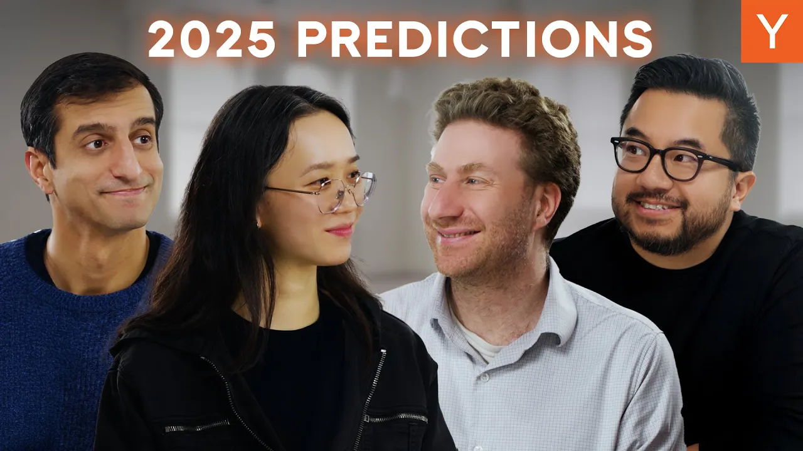

Happy New Year! In this mini-episode, the Lightcone hosts ring in 2025 with their predictions for startups, AI, and crypto. They share insights on how these fields will evolve and what we can expect in the coming year.

### Key Takeaways

*   AI is expected to win more Nobel prizes.
*   Crypto will go mainstream with stable coins.
*   Interest rates and government spending will impact crypto prices.
*   AI will enhance virtual interactions significantly.

### AI's Impact on Science

Last year was a big one for AI. It won two Nobel prizes. Jeff Hinton took home the Nobel Prize in Physics for his work on deep neural networks. Demis Hassabis and his team won in Chemistry for AlphaFold, which revolutionized protein folding. This shows how **AI is pushing boundaries** in science and technology.

There are still four more Nobel prizes to be awarded. Who knows? Maybe one will go to math or economics. Collaborations between AI and mathematicians are happening. It could lead to some interesting breakthroughs.

### Crypto Goes Mainstream

Now, let’s talk about crypto. One bold prediction is that by this time next year, everyone will have bought something using a stable coin. Imagine walking into your local coffee shop and paying with USDC. Sounds wild, right?

Here’s why this could happen:

*   **Payment Networks as Marketplaces**: Payment systems are like marketplaces. You have vendors and consumers. Once you solve the chicken-and-egg problem, you create a sticky business.
*   **Stable Coins**: They are becoming a practical way to make purchases. Many people now have crypto wallets, and stable coins are a great way to buy everyday items.
*   **Merchant Adoption**: The next step is getting more merchants to accept stable coins. This is easier than it sounds. It’s just a matter of traditional sales efforts.

### The Role of Interest Rates

Interest rates play a huge role in the economy. If Dogecoin’s initiative to cut government waste works, it could lower interest rates. Lower rates might boost the economy and, in turn, crypto prices. It’s all connected.

Here’s a simple breakdown:

1.  **Lower Interest Rates**: Could lead to higher GDP growth.
2.  **Crypto Prices**: They often rise when interest rates fall.
3.  **Government Spending**: If spending is controlled, it can stabilize the economy.

### AI and Virtual Interactions

AI is not just about numbers and data. It’s also about how we interact. In 2024, we saw the potential for phone calls with AI. Next year, we might have Zoom calls with AI avatars that feel real. Imagine chatting with a virtual person who responds naturally.

This could change how we communicate. The technology is getting better. The latency issues are being solved, making interactions smoother. It’s like a 3D Turing test, where you can’t tell if you’re talking to a human or an AI.

### Conclusion

As we step into 2025, the landscape of AI and crypto looks promising. With potential Nobel prizes in the mix and the mainstreaming of stable coins, it’s an exciting time. Let’s see how these predictions unfold. Happy New Year, and here’s to a year full of innovation!