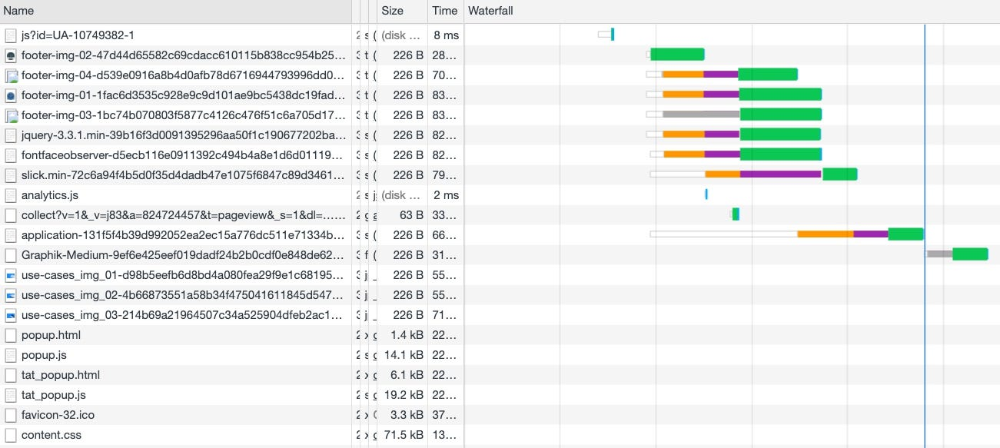

How to improve the website load time without much effort? What optimizations and improvements can help to speed up page loading? Consider a web page as an example and prove that downloading in less than one second is possible.

 on [Unsplash](https://unsplash.com?utm_source=medium&utm_medium=referral)](file_0.jpeg)

## What reduces site performance?

The main reason for a long page load is the downloading of third-party files (styles, scripts, pictures, fonts).

Let’s take a look at what happens when you visit the page:



Each file that was connected at the head or body takes precious milliseconds and sometimes seconds of time while the page is loading. And the pictures used on the page were loaded all at once, although we still haven’t scrolled to them.

## What can be optimized?

### CSS

Make compression your stylesheets, and insert them inline directly in the HTML document.


### Scripts

Try to use as few third-party JavaScript libraries as possible, but if you can not do without them, then use the minified versions.

```
    <script src="/assets/slick.min-72c6a94....js"></script>
```

### Fonts

You should also understand that any custom font that you connect adds to half a second to the page loading time. Therefore it is strongly recommended to use fonts by default.

But if you can’t do with default fonts, it is better to upload them after the page loads. You can do this with the help of [*Font Face Observer](https://fontfaceobserver.com/).*

### SVG

You can specify all SVG files on the page as an HTML element and paste them inline into your HTML document.


### Images

The first thing you can do is compress all images. Some pictures can be compressed without losing quality. To do this, we can use the online service *[TinyPNG](https://tinypng.com/).*

Not necessary to download all images at once. We can upload images when the user scrolls page and images appear on the page. Let’s write a simple script for this:

Just getting all images of the page with class names .lazy

```js
    var lazyImages = [].slice.call(document.querySelectorAll('img.lazy'));

Our function is to substitute data attributes

    var lazyLoad = function() {
        if (active === false) {
          active = true;

    setTimeout(function() {
            lazyImages.forEach(function(lazyImage) {
              lazyImage.src = lazyImage.dataset.src;
              lazyImage.srcset = lazyImage.dataset.srcset;
              lazyImage.classList.remove('lazy');

    document.removeEventListener('scroll', lazyLoad);
              window.removeEventListener('resize', lazyLoad);
              window.removeEventListener('orientationchange', lazyLoad);
            });

    active = false;
          }, 500);
        }
      };
```

Add addEventListener for scroll, resize and orientationchange

```js
    document.addEventListener('scroll', lazyLoad);
    window.addEventListener('resize', lazyLoad);
    window.addEventListener('orientationchange', lazyLoad);
```

Now when you go to the page you will not waste time downloading all pictures that are not in the user’s field of view. But when the user scrolls our page, pictures will be loaded without loss load time.

## Summary

Web sites today have become much more complex and diverse. But despite this, they can still boot in less than one second. Just adhere to the described optimization steps.

**Andriy Parashchuk** is a Software Engineer at [JetThoughts](https://www.jetthoughts.com/). Follow him on [LinkedIn](https://www.linkedin.com/in/andriy-parashchuk-3aa56468/) or [GitHub](https://github.com/andriyParashchuk).
> *If you enjoyed this story, we recommend reading our [latest tech stories](https://jtway.co/latest) and [trending tech stories](https://jtway.co/trending).*
