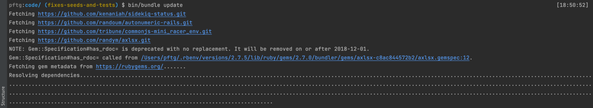
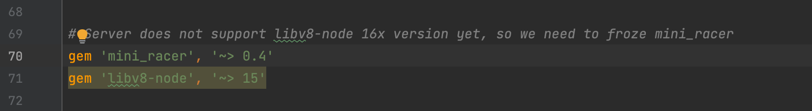

Have you seen that bundler stuck on finding how to upgrade your gems? What to do if there is a new breaking version of the indirect dependency, causing deployment fails?

 
Sometimes we got broken deploy, because of the not supported version of the gem, and it has been used automatically as an indirect dependency.

Or bundler could find any upgrade because of conflict of the indirect dependencies.

So what can we do? How could we help bundler find better versions for indirect dependencies?

## Migrate from indirect to direct dependency status
Yep, that's all. We just need to add indirect dependency as direct. And do not forget to add a notice comment to ensure that this gem is required only for assigning version constraints.

With explicit version constraints assigned for indirect (and now direct) dependency, the bundler will have to satisfy them and will change other gems.

---

**Paul Keen** is an Open Source Contributor and a Chief Technology Officer at [JetThoughts](https://www.jetthoughts.com). Follow him on [LinkedIn](https://www.linkedin.com/in/paul-keen/) or [GitHub](https://github.com/pftg).
