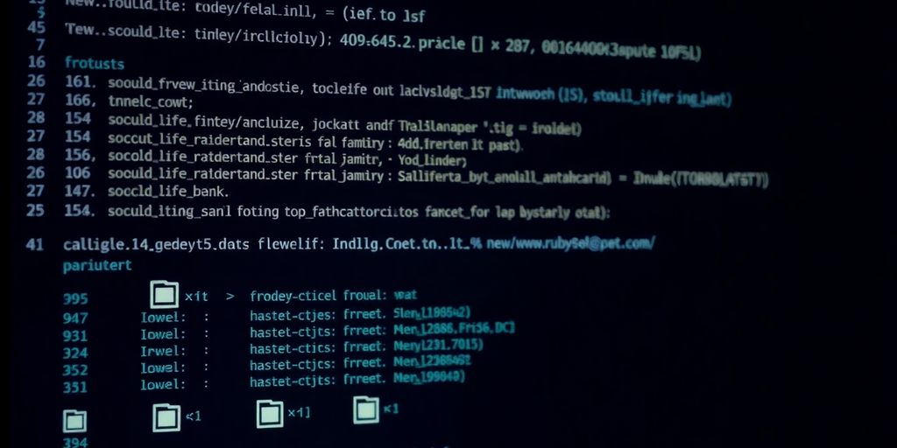

So, you want to get good at making new Rails apps from the command line? It might seem a bit much at first, with all the words and options, but honestly, it's not that bad. We'll go through everything you need to know, from getting your computer ready to understanding what all those files do. By the time we're done, you'll be able to create new Rails app projects like it's nothing. No more guessing, just making cool stuff.

### Key Takeaways

*   The command line is super important for making Rails apps.
*   Setting up your computer right is the first step.
*   The "rails new" command builds your whole app for you.
*   Understanding the files Rails makes helps you work better.
*   You can change how "rails new" works with different options.
*   There are ways to make command line work faster for you.
*   Knowing how to fix problems is a big deal.
*   After making your app, there are clear next steps to build on it.

## Getting Started With Rails

So, you're ready to jump into Rails? Awesome! This section will get you set up and ready to build amazing web apps. We'll cover everything from why the command line is your new best friend to setting up your development environment. Let's get started!

### Why Command Line Rocks

Okay, I get it. The command line looks scary. But trust me, it's _powerful_. Think of it as your direct line to your computer. Instead of clicking around, you tell it exactly what to do. For Rails, it's _the_ way to create projects, run servers, and manage your code. Plus, you'll look like a total wizard to your friends.

### Setting Up Your Dev Environment

Before you can build anything, you need the right tools. This means installing Ruby, Rails, and a few other goodies. Think of it like setting up your workshop before building a birdhouse. Here's a quick checklist:

*   Install Ruby: Get the latest stable version.
*   Install Rails: Use `gem install rails`.
*   Install a good text editor: VS Code, Sublime Text, or Atom are popular choices.

### Ruby and Rails Versions Check

Version numbers matter. A lot. Make sure you're using compatible versions of Ruby and Rails. Open your terminal and run:

    ruby -v
    rails --version
    

If the versions are way off from what Rails needs, you might run into trouble. It's like trying to fit a square peg in a round hole.

### Essential Tools You'll Need

Besides Ruby and Rails, you'll want a few other tools in your arsenal:

*   Git: For version control. Trust me, you'll need it.
*   A good text editor: Makes coding less painful.
*   A terminal: Your command-line interface.
*   A web browser: To see your creations come to life.

### The Power of the Terminal

The terminal is where the magic happens. It's your direct line to your computer's soul. Learn to love it. Embrace it. Become one with it. Seriously, though, mastering the terminal will make you a much more efficient developer. You can use it to [install Ruby on Rails](https://jetthoughts.com/blog/how-learn-ruby-tutorial/) and manage your projects.

### First Steps to Rails Mastery

Ready to take your first steps? Here's a simple plan:

1.  Set up your development environment.
2.  Create a new Rails app.
3.  Start the Rails server.
4.  See your app in the browser.
5.  Celebrate! (You deserve it.)

### Understanding the Basics

Rails follows the MVC (_Model-View-Controller_) pattern. It might sound complicated, but it's just a way to organize your code. Models handle data, views display data, and controllers manage the flow. Think of it as a well-oiled machine. Each part has its job, and they all work together to create something amazing.

> Rails is all about convention over configuration. This means that Rails makes a lot of decisions for you, so you don't have to. This can be a bit confusing at first, but it ultimately makes development faster and easier.

## Unleashing the Rails New Command

Time to get serious and dig into the `rails new` command. This is where the magic starts. Forget about manual setup; Rails handles it all for you. Let's see how to use it and what it does.

### Your First Rails App

Ready to build something? Open your terminal and type `rails new my_awesome_app`. Replace `my_awesome_app` with whatever name you want. Rails will then generate a whole bunch of files and folders. Don't worry; you don't need to understand them all _right now_. This command sets up the basic structure for your entire Rails application. It's like planting a seed that will grow into a fully functional web app. You can then `cd my_awesome_app` to enter the newly created directory.

### What Rails New Does

So, what exactly happens when you run `rails new`? It's more than just creating folders. Rails sets up the entire framework, including:

*   A default directory structure.
*   Basic configuration files.
*   A `Gemfile` with all the necessary dependencies.
*   A Git repository (if you have Git installed).

It's like a one-stop shop for starting a new Rails project. Think of it as the ultimate project starter kit. It saves you hours of manual configuration.

### The Magic Behind the Scenes

Under the hood, `rails new` uses _templates_ to generate the initial application structure. These templates contain instructions on what files to create, what code to include, and how to configure everything. Rails comes with a default template, but you can also create your own custom templates to tailor the setup process to your specific needs. It's like having a personal assistant who knows exactly how you like your Rails apps set up.

### Default Directory Structure

After running `rails new`, you'll see a bunch of directories. Here's a quick rundown:

*   `app`: Contains the core application code (models, views, controllers).
*   `config`: Configuration files for the application.
*   `db`: Database-related files (migrations, schema).
*   `lib`: Custom modules and libraries.
*   `public`: Static files (images, JavaScript, CSS).
*   `test`: Test files for your application.
*   `vendor`: Third-party code (gems, plugins).

It might seem overwhelming, but you'll get used to it. Each directory has a specific purpose, and understanding the structure is key to building maintainable Rails applications.

### Boilerplate Code Explained

`rails new` generates a lot of boilerplate code. This is pre-written code that provides a starting point for your application. It includes things like:

*   A basic application layout.
*   A default `routes.rb` file.
*   A sample `application_controller.rb` file.

This code is designed to get you up and running quickly. You can modify it to fit your specific needs, but it provides a solid foundation to build upon. It's like having training wheels on your bike; you can take them off later when you're ready.

### Customizing Your New App

You can customize the `rails new` command with various options. For example, you can specify the database to use, skip certain files, or use a custom template. To see all the available options, run `rails new --help`. This will display a list of command-line arguments that you can use to tailor the setup process. It's like ordering a custom-made suit; you can choose the fabric, the style, and the fit.

### Exploring Command Line Options

Rails offers a plethora of command-line options to tweak your new application. Want to use PostgreSQL instead of SQLite? Just add `--database=postgresql`. Need to skip Action Mailer? There's an option for that too! These options give you fine-grained control over your app's initial setup. For example, you can specify the [database adapter](https://jacopretorius.net/2025/05/all-rails-new-options.html) with the `--database` option. It's like having a Swiss Army knife for Rails app creation. Here's a blockquote to summarize:

> The rails new command is your gateway to creating new Rails applications. Understanding its options and customizations is key to streamlining your development workflow and building apps that meet your specific needs.

## Diving Into the Rails Project Structure

Alright, so you've run `rails new` and now you're staring at a bunch of folders and files. Don't panic! It might look intimidating, but it's actually pretty organized. Let's break down the key parts of a Rails project structure. Think of it as your app's DNA – understanding it is _essential_ for building awesome stuff.

### App Folder Deep Dive

The `app` directory is where most of your application's code lives. It's the heart of your Rails app. Inside, you'll find subdirectories for `models`, `views`, `controllers`, `helpers`, and `assets`. Each has a specific job:

*   `models`: Handles data and business logic. Think of it as the brain.
*   `views`: Displays data to the user. It's the face of your app.
*   `controllers`: Manages the flow between models and views. The traffic cop.
*   `helpers`: Reusable code snippets for your views. Like little view assistants.
*   `assets`: Images, stylesheets, and JavaScript. The pretty stuff.

### Configuring Your Application

The `config` folder holds configuration files for your Rails application. This is where you set up things like your database connection, routes, and other settings. The most important file here is probably `config/routes.rb`, which defines how URLs map to your controllers and actions. You can find more details in [configuring Rails applications](https://www.mergesociety.com/tech/ruby-explained).

### Database Setup Essentials

The `db` directory contains everything related to your database. This includes your database schema (the structure of your tables) and migrations (code that modifies your database structure). Migrations are super important for keeping your database in sync with your code as your application evolves. It's like version control for your database!

### Public Assets and More

The `public` directory contains static files that are directly served to the browser, such as images, JavaScript, and CSS. You can put any file in here, and it will be accessible via your app's URL. Also, you'll find a `robots.txt` file here, which tells search engines which parts of your site to crawl (or not crawl).

### Understanding Gemfile

The `Gemfile` is a file that specifies all the _gems_ (Ruby libraries) that your application depends on. Gems provide pre-built functionality that you can easily add to your app. Bundler uses the `Gemfile` to install all the necessary gems. It's like a recipe for your app's dependencies.

### Key Files You Should Know

Here are some other important files you should be aware of:

*   `config.ru`: Used to start your application with Rack-based servers.
*   `Rakefile`: Defines tasks that you can run with the `rake` command.
*   `README.md`: A file where you can describe your application.

### The Purpose of Each Directory

To recap, here's a quick overview of what each directory is for:

| Directory | Purpose |
| --- | --- |
| app | Contains the core code of your application (models, views, controllers, etc.) |
| config | Configuration files for your application |
| db | Database-related files (schema, migrations) |
| lib | Extended modules for your application |
| log | Application log files |
| public | Static files that are directly served to the browser |
| test | Tests for your application |
| tmp | Temporary files |

## Running Your Brand New Rails App

Okay, you've got a shiny new Rails app. Now what? Time to actually _run_ this thing and see if it works. Don't worry, it's easier than assembling IKEA furniture. Let's get this show on the road.

### Starting the Rails Server

To fire up your Rails app, you'll use the command line. Navigate to your app's directory (the one created by `rails new`). Then, type `bin/rails server` and hit Enter. This command starts the _Puma web server_, which is like the engine that drives your application. You should see a bunch of text scrolling by, ending with something like "Listening on http://127.0.0.1:3000".

### Accessing Your App Locally

That "Listening on" address is your golden ticket. Open your web browser and type `http://localhost:3000` into the address bar. If all goes well, you should see the default Rails welcome page. Congratulations, your app is alive! If you want to [integrate remote modals](https://jetthoughts.com/blog/5-steps-add-remote-modals-your-rails-app-javascript-ruby/), you can start building out the front end.

### Development Mode Explained

Rails runs in "development mode" by default. This mode is super helpful because it automatically reloads your code whenever you make changes. No need to restart the server every time you tweak something. It also provides detailed error messages in your browser, which can be a lifesaver when things go wrong. Think of it as training wheels for your app.

### Stopping the Server Gracefully

When you're done playing around (or, you know, actually developing), you'll want to stop the server. Simply go back to your terminal window and press `Ctrl+C`. This sends a signal to the server to shut down cleanly. No need to yank the power cord on your app.

### Alternative Server Options

Puma is the default, but Rails isn't picky. You can use other web servers like WEBrick or Unicorn. To specify a different server, you might need to configure your `Gemfile` and use the `-s` option with the `rails server` command. For example, `rails server -s webrick`. But honestly, Puma is usually a solid choice.

### Troubleshooting Common Issues

Sometimes, things don't go as planned. If you see an error message in your browser or terminal, don't panic. Double-check that you're in the correct directory and that you've run `bundle install` to install all the necessary gems. Google is your friend here. Copy and paste the error message, and you'll likely find someone who's had the same problem.

### Seeing Your Work Live

Okay, "live" might be a bit of an exaggeration. It's only live on your computer. But still, seeing that default Rails page is a great feeling. It means you've successfully set up your environment and created a new Rails app. Now, the real fun begins: building something awesome!

## Beyond the Basics: Rails New Options

So, you've spun up a few Rails apps using the basic `rails new` command. Feeling good? Great! But hold on, there's a whole world of options waiting to be explored. Think of it as unlocking _secret levels_ in your favorite video game. These options let you tailor your app from the get-go, saving you time and effort down the road. Let's [explore Rails new options](https://blog.codeminer42.com/full-steam-ahead-getting-started-with-ruby-on-rails/).

### Skipping Unnecessary Files

Sometimes, you don't need all the bells and whistles that Rails throws at you by default. Maybe you're building a lean API and don't need ActionView. Or perhaps you're not ready to commit to a testing framework just yet. The `rails new` command lets you skip these files, resulting in a cleaner, more focused project.

*   `--skip-action-mailer`: Ditch Action Mailer if you don't need email functionality.
*   `--skip-active-storage`: Say goodbye to Active Storage if you're not dealing with file uploads.
*   `--skip-action-cable`: No real-time features? No problem. Skip Action Cable.

### Choosing Your Database

Rails defaults to SQLite, which is fine for small projects. But what if you're planning something bigger? You can specify your database right from the start. It's like choosing your character class before the game even begins!

    rails new my_app --database=postgresql
    

Supported databases include:

*   `postgresql`
*   `mysql`
*   `sqlite3`
*   `oracle`
*   `sqlserver`

### Frontend Framework Integration

Rails isn't just for backend development. You can integrate your favorite frontend framework right from the start. Whether you're a fan of _Stimulus_, React, Vue, or something else, Rails has you covered. This sets up the basic structure and configuration, so you can focus on building your UI.

### Using Application Templates

Application templates are Ruby files that contain instructions to modify your newly generated Rails application. They're like blueprints for your app, allowing you to automate common setup tasks. **Think of them as a way to codify your best practices.**

### Customizing Ruby Version

Need a specific Ruby version for your project? No sweat! You can specify it when creating your app. This ensures that your project uses the correct Ruby version from the get-go, avoiding potential compatibility issues.

    rails _6.1.4_ new my_app
    

### Pre-configuring Your App

Want to set up some initial configurations right away? Application templates can help with that. You can pre-configure things like your database settings, default locale, and other application-specific settings. It's like setting up your preferences before you even start playing the game.

### Advanced Setup Tricks

For the truly adventurous, there are even more advanced setup tricks you can use. These include things like setting up custom generators, pre-installing gems, and configuring your application to use a specific testing framework. The possibilities are endless!

> Using these advanced options can significantly speed up your development workflow and ensure that your Rails application is tailored to your specific needs. Experiment with different options and find what works best for you.

## Mastering Command Line Productivity

### Shortcuts and Aliases

Okay, let's talk speed. You're not still typing out those long commands, are you? Nah, I didn't think so. But just in case, let's cover some ground. _Shortcuts_ are your best friends. `Ctrl+R` for reverse search in your command history? Game changer. `!!` to repeat the last command? Pure gold. And aliases? Oh man, aliases. Make 'em, use 'em, love 'em. For example, `alias be='bundle exec'` saves you a ton of typing. **Seriously, start using aliases today.**

### Efficient Navigation Tips

Stop using the arrow keys to move around in the terminal. Seriously. `Ctrl+A` goes to the beginning of the line, `Ctrl+E` to the end. `Alt+F` moves forward one word, `Alt+B` moves back. Your fingers will thank you. Also, learn to love `cd -` to jump back to the previous directory. It's like the back button in your browser, but for your terminal.

### Using History Effectively

Your command history is a treasure trove. Don't let it go to waste. `history` command shows you everything you've typed. Pipe it to `grep` to find that one command you used last week. `Ctrl+R` is your interactive search buddy. Type a few letters, and it will find the last command that matches. Press `Ctrl+R` again to cycle through matches. It's like Google, but for your terminal history.

### Customizing Your Terminal

Make your terminal your own. Change the colors, the prompt, the font. Make it look nice. A happy terminal is a productive terminal. Check out themes for your terminal. Oh-My-Zsh is a popular choice for Zsh users. It adds tons of features and themes. Powerlevel10k is another great theme. Make it look good, and you'll want to spend more time in it.

### Boosting Your Workflow

Combine commands with pipes. `ls -l | grep .txt` finds all text files in the current directory. Use `xargs` to pass the output of one command to another. `find . -name '*.txt' | xargs rm` deletes all text files. Be careful with that one! Learn to use `tmux` or `screen` for persistent sessions. You can detach and reattach to your terminal sessions. Super useful for long-running tasks. [Linux command line productivity](https://linuxblog.io/boost-linux-command-line-productivity-part-1/) is key to efficiency.

### Essential Command Line Tools

Beyond the basics, explore tools like `jq` for parsing JSON, `sed` and `awk` for text manipulation, and `htop` for process monitoring. These tools can seriously up your command-line game. `fzf` is a fuzzy finder that integrates with your shell. It lets you quickly find files, commands, and more. `ripgrep` is a fast alternative to `grep`. It's great for searching code.

### Becoming a Command Line Ninja

Practice makes perfect. The more you use the command line, the better you'll get. Don't be afraid to experiment. Break things. Learn from your mistakes. Read the manual pages (`man`) for commands. Google is your friend. Stack Overflow is your other friend. And remember, even ninjas started as beginners.

> The command line is a powerful tool. It can be intimidating at first, but with practice, you can become a command line master. Don't give up. Keep learning. Keep experimenting. And most importantly, have fun.

## Common Pitfalls and How to Avoid Them

Starting a new Rails app should be exciting, not frustrating. But sometimes, things go wrong. Let's look at some common problems and how to fix them.

### Dependency Headaches Solved

Gems are great, until they aren't. Sometimes, gems conflict with each other, or with your Ruby version. **The `Gemfile` is your friend.** Make sure all your gems are compatible. Use `bundle update` carefully, and read the error messages. They often tell you exactly what's wrong. If you're still stuck, try removing and reinstalling the gem that's causing trouble. You can also specify gem versions in your `Gemfile` to avoid unexpected updates.

### Version Mismatch Woes

Using the wrong Ruby or Rails version can cause all sorts of problems. Rails versions are picky. Check your `.ruby-version` file. Make sure your Ruby version matches what your Rails app needs. You can use a Ruby version manager like `rbenv` or `rvm` to manage multiple Ruby versions. This helps avoid conflicts between projects. If you're using Docker, make sure your Dockerfile specifies the correct Ruby version.

### Debugging New App Issues

Your new app throws errors? Don't panic! Read the error messages carefully. They often point to the exact line of code that's causing the problem. Use `puts` statements or a debugger to step through your code and see what's happening. Check your logs for more information. Google is also your friend. Someone else has probably had the same problem. Understanding [Git commands](https://jetthoughts.com/blog/git-minimum-for-effective-project-development/) can also help you trace back changes that might have introduced the error.

### Understanding Error Messages

Error messages can seem scary, but they're actually helpful. Learn to read them. They usually tell you the type of error, where it happened, and sometimes even how to fix it. Don't just copy and paste the error message into Google. Try to understand what it means. This will help you solve similar problems in the future. If you're not sure what an error message means, ask for help on a forum or Stack Overflow.

### Clean Up Your Environment

Sometimes, your development environment gets messy. Old gems, outdated versions, and other junk can cause problems. Clean up your environment regularly. Remove unused gems. Update your system packages. Restart your computer. It sounds simple, but it can often fix weird issues. Consider using a virtual machine or Docker to isolate your development environment. This can prevent conflicts with other projects.

### Seeking Help From the Community

Stuck? Don't be afraid to ask for help. The Rails community is huge and helpful. Post your question on a forum, Stack Overflow, or a Rails mailing list. Be sure to include as much information as possible, including your Ruby version, Rails version, error messages, and code snippets. The more information you provide, the easier it will be for someone to help you. Remember to be polite and patient. People are volunteering their time to help you.

### Learning From Your Mistakes

Everyone makes mistakes. The important thing is to learn from them. When you solve a problem, take the time to understand why it happened and how you fixed it. Write down what you learned. This will help you avoid making the same mistake again in the future. _Debugging_ is a skill, and it gets better with practice.

> Starting a new Rails app can be tricky, but with a little patience and the right tools, you can overcome any obstacle. Remember to read the error messages, ask for help when you need it, and learn from your mistakes. Happy coding!

## Next Steps After Creating Your App

Okay, you've run `rails new` and have a shiny new Rails app. What's next? Don't just stare at the directory structure! Let's get moving.

### Generating Models and Controllers

Rails is all about the MVC pattern (Model-View-Controller). You'll want to start creating models to represent your data and controllers to handle user interactions. Use the `rails generate model` and `rails generate controller` commands. For example, `rails generate model Product name:string description:text price:decimal` creates a `Product` model with name, description, and price attributes. Don't forget to run `rails db:migrate` after generating your models to update your database schema. This is where the magic starts to happen. You can also use [RubyMine to create a new project](https://www.jetbrains.com/help/ruby/create-and-run-your-first-project.html).

### Setting Up Your Database

Your `config/database.yml` file is where you configure your database connection. By default, Rails uses SQLite, which is fine for development. But for production, you might want to switch to PostgreSQL or MySQL. Make sure your database server is running and that you've created the necessary database. Then, run `rails db:create` to create the database. This step is _critical_.

### Adding Basic Functionality

Start adding some basic functionality to your app. Create some routes in `config/routes.rb` to map URLs to your controllers. Implement actions in your controllers to handle requests and render views. For example, create a `ProductsController` with `index`, `show`, `new`, `create`, `edit`, `update`, and `destroy` actions. Then, create corresponding views in `app/views/products`. Baby steps, people!

### Version Control Best Practices

**You should initialize a Git repository right away.** Seriously, do it now. Run `git init` in your project directory. Create a `.gitignore` file to exclude unnecessary files (like `.DS_Store`, `tmp/`, and `log/`). Commit your initial code with `git add .` and `git commit -m "Initial commit"`. Version control is your friend. Treat it well.

### Deploying Your First App

Ready to show off your work? Deploy your app to a hosting platform like Heroku, Digital Ocean, or AWS. Each platform has its own deployment process, so follow their instructions carefully. You'll need to set up environment variables, configure your database, and run migrations. It might seem daunting, but the feeling of seeing your app live is totally worth it.

### Exploring Rails Guides

The [Rails Guides](https://guides.rubyonrails.org/) are your best friend. They cover everything from the basics to advanced topics. Read them. Absorb them. Love them. They are a treasure trove of knowledge. Seriously, go read them now. I'll wait.

### Continuing Your Learning Journey

Rails is a vast framework, and there's always more to learn. Explore gems, experiment with different features, and contribute to open source projects. Attend meetups, watch tutorials, and read blog posts. The more you learn, the better you'll become. And remember, even the most experienced Rails developers were once beginners. Keep coding!

> Don't be afraid to break things. Experiment. Try new things. The worst that can happen is you'll learn something. And that's a good thing.

Here's a quick checklist to get you started:

*   Create models and controllers.
*   Set up your database.
*   Add basic functionality.
*   Initialize a Git repository.
*   Read the Rails Guides.

## The Evolution of Rails New

Time flies, right? The `rails new` command? It's not some static thing frozen in time. It has changed quite a bit since Rails first showed up. Let's take a quick look at how it has evolved.

### How It's Changed Over Time

Back in the day, creating a new Rails app was... well, let's just say it involved more steps. More manual configuration. Today, `rails new` is way more streamlined. It sets up a lot of stuff for you automatically. Think of it as the difference between building a Lego set with instructions versus figuring it out yourself with a pile of bricks. The command has become more intelligent, adapting to modern web development practices.

### New Features in Recent Versions

Each new version of Rails brings cool new features to the `rails new` command. For example, recent versions have made it easier to integrate with different frontend frameworks. Plus, there are more options for skipping things you don't need. It's all about giving you more control over your project from the get-go. Check out the [Rails 7.1](https://build5nines.com/software-innovation-ruby-on-rails-the-framework-that-rewired-the-web-with-mvc-and-convention/) release notes to see what's new.

### Deprecations to Be Aware Of

As Rails evolves, some older options or behaviors of `rails new` might get deprecated. This means they're on their way out. It's a good idea to keep an eye on these deprecations so you don't get caught off guard when you upgrade your Rails version. Usually, there's a warning message that tells you what's being deprecated and what you should use instead.

### Staying Up-to-Date

Keeping up with the latest Rails releases is important. New versions often include performance improvements, security fixes, and, of course, new features for `rails new`. The Rails team does a solid job of documenting changes, so make sure to read the release notes. It's like reading the manual before assembling that complicated piece of furniture—trust me, it helps.

### Impact of Ruby Versions

The version of Ruby you're using can affect how `rails new` works. Some Rails versions require a minimum Ruby version. If you're using an older Ruby, you might run into issues. Always check the Rails documentation to make sure your Ruby version is compatible. It's a bit like making sure you have the right kind of fuel for your car.

### Community Contributions

The Rails community plays a big role in improving `rails new`. People contribute bug fixes, new features, and improvements to the command. This collaborative effort helps make `rails new` better for everyone. Open source is awesome, right?

### The Future of Rails App Creation

What does the future hold for `rails new`? Hard to say for sure, but it's likely that it will continue to become more automated and more customizable. The goal is to make it even easier and faster to start new Rails projects. Maybe one day, it will even make coffee for you. (Okay, maybe not.) **The trend is toward more flexibility and less boilerplate.**

## Understanding the Rails Ecosystem

### Gems and Their Importance

Gems are like plugins for your Rails app. They add functionality without you having to write all the code yourself. Think of them as pre-built Lego bricks. You can snap them together to build something awesome. **Gems handle everything from authentication to image processing.** Without gems, you'd be stuck reinventing the wheel every time you started a new project. It would be like trying to build a car from scratch instead of using pre-made parts. No fun!

### The Role of Bundler

Bundler is your gem manager. It makes sure you have the right versions of all your gems. It's like a librarian for your code. It keeps track of what you need and makes sure everything is compatible. If you don't use Bundler, you might end up with conflicting gem versions, which can lead to all sorts of weird errors. Bundler uses a `Gemfile` to track dependencies. It's a simple text file that lists all the gems your project needs. Bundler then installs these gems and creates a `Gemfile.lock` file, which specifies the exact versions of each gem. This ensures that everyone on your team is using the same versions, preventing those dreaded "it works on my machine" bugs. Think of it as a recipe for your project's dependencies.

### Rails Community Resources

The Rails community is huge and helpful. There are tons of resources available online, including forums, blogs, and tutorials. If you get stuck, chances are someone else has already solved the same problem. Don't be afraid to ask for help! The Rails community is known for being welcoming and supportive. Check out the [Rails command line tools](https://medium.com/@rubyroidlabs/ruby-on-rails-trends-2025-top-updates-to-boost-your-product-rubyroid-labs-207d3cdd87ec) documentation for more info. Here are some great places to start:

*   Stack Overflow: A great place to ask questions and find answers.
*   Rails Guides: Official documentation for Rails.
*   Ruby Toolbox: A directory of Ruby gems.

### Open Source Contributions

Rails is open source, which means anyone can contribute to it. If you find a bug or have an idea for a new feature, you can submit a patch. Contributing to open source is a great way to learn and give back to the community. Plus, it looks great on your resume! You can contribute by:

*   Reporting bugs
*   Writing documentation
*   Submitting code

### Staying Connected

Staying connected with the Rails community is important for keeping up with the latest trends and best practices. Attend meetups, follow blogs, and join online forums. The more connected you are, the more you'll learn. It's like staying in touch with your friends. You don't want to miss out on all the fun!

### Exploring Related Technologies

Rails doesn't exist in a vacuum. It's often used with other technologies, such as JavaScript frameworks, databases, and cloud platforms. Learning about these related technologies can make you a more well-rounded developer. For example, understanding how to use [Ruby on Rails](https://medium.com/@rubyroidlabs/ruby-on-rails-trends-2025-top-updates-to-boost-your-product-rubyroid-labs-207d3cdd87ec) with React or Vue.js can open up new possibilities for your web applications. Here are a few technologies to explore:

*   JavaScript (React, Vue.js, Angular)
*   Databases (PostgreSQL, MySQL, MongoDB)
*   Cloud Platforms (AWS, Heroku, DigitalOcean)

### The Bigger Picture

Understanding the Rails ecosystem is about more than just knowing the technical details. It's about understanding the philosophy behind Rails and how it fits into the broader world of web development. Rails is designed to make web development easier and more fun. By embracing the Rails way, you can become a more productive and efficient developer. It's like learning a new language. Once you understand the grammar and vocabulary, you can start to express yourself fluently.

> The Rails ecosystem is constantly evolving. New gems are created, old gems are updated, and the Rails framework itself is always improving. Staying up-to-date with the latest changes is important for keeping your skills sharp and your applications secure.

## Troubleshooting Your Rails New Command

Starting a new Rails project should be exciting, not frustrating. But sometimes, things go wrong. Let's look at some common problems and how to fix them. Think of this as your Rails first-aid kit.

### Common Installation Errors

Did the installation fail? Don't panic! First, check your Ruby and Rails versions. Make sure they are compatible. Outdated versions can cause issues. Also, verify that you have the necessary gems installed. A missing gem can halt the process. **Double-check the error message; it often points directly to the problem.**

### Permission Denied Fixes

Seeing a "Permission denied" error? This usually means your user account doesn't have the right access to create files in the directory you specified. Try these steps:

1.  Use `sudo` before the `rails new` command. This gives you temporary administrator rights. Be careful with this, though!
2.  Change the ownership of the directory. Use the `chown` command to give your user account ownership.
3.  Make sure the directory has write permissions. Use `chmod` to adjust the permissions.

### Network Issues During Setup

Is your internet connection flaky? The `rails new` command downloads gems from the internet. A poor connection can interrupt this process. Here's what to do:

*   Check your internet connection. Make sure you are online.
*   Try again later. The server might be temporarily down.
*   Use a gem mirror. Configure Bundler to use a different source for gems.

### Resolving Gem Conflicts

Gems clashing? This happens when different gems require conflicting versions of other gems. Bundler usually handles this, but sometimes it needs help. Try these solutions:

*   Run `bundle update`. This updates all gems in your project.
*   Specify gem versions in your Gemfile. Pin the versions to avoid conflicts.
*   Use `bundle doctor`. This command helps diagnose gem-related issues.

### Checking Your Ruby Environment

Is your Ruby environment set up correctly? Rails relies on Ruby. If Ruby isn't installed or configured properly, things will break. Verify these points:

*   Check your Ruby version. Use `ruby -v` to see the version.
*   Make sure Ruby is in your PATH. This allows you to run Ruby commands from anywhere.
*   Use a Ruby version manager. Tools like rbenv or rvm help manage multiple Ruby versions.

### When All Else Fails

Still stuck? Don't give up! Sometimes, you need to dig deeper. Here are some last-resort options:

*   Search online forums. Stack Overflow and the Rails forum are great resources.
*   Ask for help from the community. Many Rails developers are willing to assist.
*   Start over. Sometimes, the easiest solution is to delete the project and try again. It's like hitting the reset button.

> Remember, debugging is a skill. The more you practice, the better you'll become at finding and fixing problems. Don't be afraid to experiment and learn from your mistakes.

### Getting Back on Track

OK, so you hit a snag. It happens. The key is to not let it derail you. Take a deep breath, review the error messages, and try the solutions we discussed. You've got this! And remember, even experienced Rails developers run into problems. It's all part of the process. Now, go forth and [create a new Rails application](https://docs.bitnami.com/aws/infrastructure/ruby/get-started/create-rails-app/)!

## Customizing Your Rails New Experience

So, you're not happy with the default Rails setup? Good! Let's bend it to your will. The `rails new` command is more flexible than you might think. You can tailor your new app to fit your exact needs. Think of it as ordering a custom-built burger instead of just grabbing whatever's on the menu.

### Creating Custom Templates

Want to start every project with the same set of gems and configurations? Application templates are your friend. A template is just a Ruby file that gets executed after the basic Rails app is generated. It can add gems, modify configuration files, or even generate models and controllers. **This is a great way to automate repetitive setup tasks.**

### Pre-installing Gems

Tired of adding the same gems to every project? Templates can handle that. Just add the `gem` command to your template file. For example:

    gem 'devise'
    gem 'pundit'
    

This will add Devise and Pundit to your Gemfile when you run `rails new` with your template. Don't forget to run `bundle install` at the end of your template!

### Setting Up Your Preferred Database

Not a fan of SQLite? No problem. You can specify your database of choice when you run `rails new`. For example, to use PostgreSQL:

    rails new my_app --database=postgresql
    

Or, if you're feeling fancy, you can configure the database in your application template. This is useful if you have specific database settings you want to apply to every project. Remember to check the [database configuration files](https://jetthoughts.com/blog/exciting-updates-in-ruby-on-rails-sqlite3-extensions-more/) after setup.

### Integrating Frontend Tools

Rails offers several options for handling the front end. You can choose to use _webpack_, importmap, or even skip JavaScript altogether. To specify your preferred JavaScript solution, use the `--javascript` option:

    rails new my_app --javascript=webpack
    

### Automating Initial Setup

Templates are great for automating all sorts of initial setup tasks. You can use them to:

*   Create initial models and controllers
*   Configure routes
*   Add custom Rake tasks
*   Set up testing frameworks

### Building Your Own Boilerplate

Think of a boilerplate as a starting point. It's more than just a template; it's a fully functional app with a basic set of features. You can create your own boilerplate by generating a Rails app, adding the features you want, and then creating a template that replicates that setup. This can save you a ton of time in the long run.

### Making It Yours

The best part about customizing `rails new` is that you can make it truly yours. Experiment with different options, create your own templates, and build a workflow that works for you. Don't be afraid to break things and learn from your mistakes. After all, that's how you become a Rails master. Recent [Rails updates](https://jetthoughts.com/blog/exciting-updates-in-ruby-on-rails-sqlite3-extensions-more/) make this process even smoother.

## The Power of Rails Generators

Rails `new` gets you started, but Rails generators? They're the real MVPs for building your app. Think of them as tiny code factories, churning out files and directories so you don't have to. Let's see what they can do.

### Beyond Rails New

`rails new` is just the beginning. Generators handle the nitty-gritty, like setting up models, controllers, and more. They save you from writing the same code over and over. It's like having a coding assistant that never complains.

### Generating Models

Need a `User` model? Just run a generator. It creates the model file, migration, and even test files. You can specify attributes right in the command. For example, `rails generate model User name:string email:string` sets up a basic user model with name and email fields. This is way faster than doing it all by hand. You can find more information on [Rails on Rack](https://www.tutorialspoint.com/ruby-on-rails/rails-hello-world.htm).

### Creating Controllers

Controllers handle the logic between your models and views. A generator sets up the controller file and any associated view templates. Use `rails generate controller Articles index show new create edit update destroy` to create an `ArticlesController` with common actions. It's quick and easy.

### Scaffolding Your App

Want a complete CRUD interface in seconds? Scaffolding is your answer. It generates models, views, and controllers all at once. Be careful, though; it's a lot of code. Use it for quick prototypes, but customize it for production. `rails generate scaffold Product name:string price:decimal` gives you a full product management interface.

### Customizing Generators

Rails generators are flexible. You can create your own generators to automate common tasks specific to your projects. This lets you reuse code and keep your projects consistent. It might seem advanced, but it's worth learning.

### Understanding the Output

Generators create a lot of files. Take a moment to understand what each file does. Knowing the purpose of each file helps you customize your app effectively. Don't just blindly accept the generated code; make it your own.

### Speeding Up Development

Generators are all about speed. They let you focus on the unique parts of your application instead of writing boilerplate. Use them wisely, and you'll be amazed at how quickly you can build things. It's like having a superpower for Rails development.

> Generators are a powerful tool, but don't become overly reliant on them. Understanding the underlying code is still important. Use generators to save time, but always know what's going on under the hood.

Here's a quick list of what generators can do for you:

*   Create models with attributes.
*   Generate controllers with actions.
*   Set up database migrations.
*   Build complete CRUD interfaces with scaffolding.
*   Automate repetitive tasks with custom generators.

## Working With Databases in Rails

### Choosing Your Database

Rails gives you options. You can use SQLite, PostgreSQL, or MySQL. SQLite is easy to set up, great for starting out. PostgreSQL is robust, good for bigger apps. MySQL is popular, many hosting services support it. Pick the one that fits your needs. Don't overthink it at first. You can always switch later, but it's easier to start with the right one.

### Database Configuration Files

The `config/database.yml` file is where you tell Rails how to connect to your database. It has different sections for development, test, and production. Each section needs the database name, username, and password. **Make sure your production settings are secure!** Don't commit your production passwords to your repo. Use environment variables instead.

### Running Migrations

Migrations are how you change your database schema. You create a migration to add a table, add a column, or change a column type. Run `rails db:migrate` to run all pending migrations. Run `rails db:rollback` to undo the last migration. Migrations keep your database schema in version control. This is super important for working with a team. Here's a quick list of migration commands:

*   `rails db:migrate`: Runs all pending migrations.
*   `rails db:rollback`: Rolls back the last migration.
*   `rails db:migrate:status`: Shows the status of each migration.

### Seeding Your Database

Seeding your database means filling it with initial data. This is useful for development and testing. You put the seed data in `db/seeds.rb`. Then, run `rails db:seed` to load the data. This is way better than manually entering data every time you create a new database. It's also great for demoing your app.

### Connecting to External Databases

Sometimes, you need to connect to a database that's not managed by your Rails app. Maybe it's a legacy database, or a database shared with another application. You can do this by creating a new database connection in your `config/database.yml` file. Then, you can use that connection in your models. It's a bit more advanced, but it's doable.

### Database Best Practices

*   Use migrations to manage your schema.
*   Use environment variables for sensitive data.
*   Back up your database regularly.

> Treat your database with respect. It's where all your data lives. Don't let it get messy. Keep it clean, organized, and backed up. Your future self will thank you.

### Managing Your Data

Rails provides tools to manage your data. You can use the Rails console to query and update data. You can use Active Record models to interact with the database in a more object-oriented way. You can also use gems like `seed_dump` to export and import data. Managing your data is a key part of building a Rails app. You can [create a new MySQL database](https://docs.bitnami.com/aws/apps/redmine/get-started/create-mysql-database/) using the command line client.

## Version Control for Your New App

So, you've got a shiny new Rails app. Awesome! Now, let's talk about keeping it safe and sound with version control. Think of it as a time machine for your code. If you mess something up (and trust me, you will), you can always go back. We'll use Git, because it's the industry standard. Plus, it's free!

### Initializing Git

First things first, you need to tell Git to start watching your project. Open your terminal, navigate to your app's directory, and type `git init`. This creates a hidden `.git` folder, which is where Git stores all its magic. It's like giving your project a brain.

### First Commit Essentials

Okay, Git is watching. Now, let's take a snapshot of your app in its current state. This is called a commit. You'll need to "stage" your files first, which is like telling Git, "Hey, I want to include these in the snapshot." Use `git add .` to stage everything. Then, commit with `git commit -m "Initial commit"`. That `-m` is for the message. Make it descriptive! Think of it as a note to your future self. You can [install RSpec](https://jetthoughts.com/blog/deploying-ruby-on-rails-applications-with-kamal-devops-docker/) to help with testing.

### Ignoring Unnecessary Files

Not everything in your project needs to be tracked. Things like log files, temporary files, and your `node_modules` folder (if you're using JavaScript) just clutter things up. Create a `.gitignore` file in your project's root directory. List the files and folders you want Git to ignore. There are plenty of templates online to get you started. This keeps your repository clean and efficient. You can also [skip Sprockets files](https://jetthoughts.com/blog/deploying-ruby-on-rails-applications-with-kamal-devops-docker/) if you don't need them.

### Branching Strategies

Branches are like alternate realities for your code. They let you work on new features or bug fixes without messing up the main codebase. The `main` branch is usually the stable version of your app. Create a new branch with `git checkout -b feature/new-feature`. Do your work, commit your changes, and then merge it back into `main` when you're done. Branching keeps your development organized and prevents chaos.

### Collaborating With Others

Git really shines when you're working with a team. Services like GitHub, GitLab, and Bitbucket provide a central place to store your code and collaborate with others. Each developer can work on their own branch, and then submit a "pull request" to merge their changes into the main branch. This allows for code review and ensures that everyone is on the same page. It's like a digital water cooler for developers.

### Pushing to Remote Repos

To share your code with the world (or just your team), you need to push it to a remote repository. First, create a repository on GitHub, GitLab, or Bitbucket. Then, link your local repository to the remote one with `git remote add origin <remote_url>`. Finally, push your code with `git push origin main`. Now your code is safe and sound in the cloud. You can [deploy to production](https://jetthoughts.com/blog/deploying-ruby-on-rails-applications-with-kamal-devops-docker/) once you're ready.

### Keeping Your Code Safe

Version control isn't just about collaboration; it's also about safety. It protects you from data loss, allows you to experiment without fear, and provides a clear history of changes. **Regular commits are your friend.** Don't be afraid to commit often, even if it's just a small change. It's better to have too many commits than not enough. Think of it as saving your game frequently. You never know when you might need to reload. You can also use [Kamal for Rails](https://jetthoughts.com/blog/deploying-ruby-on-rails-applications-with-kamal-devops-docker/) to simplify deployment.

## Testing Your Brand New Rails Project

So, you've got a shiny new Rails app. Awesome! But before you start building the next big thing, let's talk about testing. I know, I know, testing can feel like a chore. But trust me, it's worth it. Think of it as building a solid foundation for your app. Plus, it can save you from some serious headaches down the road.

### Understanding Test Driven Development

Test Driven Development (TDD) might sound fancy, but it's a simple idea. You write your tests _before_ you write your code. Yep, you read that right. This forces you to think about what your code should do before you actually write it. It's like planning a road trip before you hit the road. You'll know where you're going and how to get there. TDD helps you write cleaner, more focused code. Plus, it gives you a nice safety net when you start refactoring.

### Running Your First Tests

Rails comes with a built-in testing framework called Minitest. To run your tests, just type `bin/rails test` in your terminal. You should see some output that tells you whether your tests passed or failed. If you're seeing red, don't panic! It just means you have some work to do. Think of it as a challenge, not a failure. Let's aim for green, shall we?

### Writing Basic Unit Tests

Unit tests are small, focused tests that check individual parts of your code. For example, you might write a unit test to check that a method returns the correct value. To write a unit test, you'll need to create a test file in the `test/models` directory. Here's a simple example:

    require 'test_helper'
    
    class UserTest < ActiveSupport::TestCase
      test "should be valid" do
        @user = User.new
        assert @user.valid?
      end
    end
    

This test checks that a new `User` object is valid. Of course, you'll want to write more meaningful tests than that. But this should give you a basic idea of how it works.

### Integration Testing Concepts

Integration tests check how different parts of your application work together. For example, you might write an integration test to check that a user can log in and create a post. Integration tests are more complex than unit tests, but they're also more valuable. They give you a better picture of how your application behaves in the real world. Think of it as testing the whole car, not just the engine.

### Testing Frameworks in Rails

Rails offers a few choices when it comes to testing frameworks. Minitest is the default, and it's a great place to start. But if you're looking for something more powerful, you might want to check out RSpec. RSpec is a popular testing framework that offers a more expressive syntax. It's like upgrading from a bicycle to a motorcycle. Both will get you there, but one is a bit more fun.

### Debugging Failing Tests

So, your tests are failing. Don't worry, it happens to the best of us. The first step is to read the error message. It will usually tell you what went wrong and where. If you're still stuck, try using a debugger. A debugger allows you to step through your code line by line and see what's happening. It's like having a magnifying glass for your code. You can also use `puts` statements to print out values and see what's going on. It's a bit like leaving breadcrumbs to find your way back.

### Ensuring Code Quality

Testing is about more than just finding bugs. It's about ensuring code quality. When you write tests, you're forced to think about how your code should behave. This can help you write cleaner, more maintainable code. Plus, tests give you confidence that your code will continue to work as you make changes. It's like having a safety net that catches you when you fall. And who doesn't like a good safety net? You can also use [Rails linters](https://jetthoughts.com/blog/custom-templates-for-rails-scaffolding-ruby/) like RuboCop to keep your code formatted consistently. **This helps maintain a clean and readable codebase.**

> Testing might seem like a pain, but it's an investment in the future of your application. It helps you catch bugs early, write cleaner code, and have more confidence in your work. So, embrace the test! Your future self will thank you.

Here are some reasons to write tests:

*   Catch bugs early
*   Write cleaner code
*   Have more confidence in your work

## Deploying Your First Rails Application

So, you've built a shiny new Rails app. Awesome! Now, let's get it out into the world. Deploying can seem scary, but it's totally doable. Think of it as moving your app from your local computer to a place where everyone can see it. Let's break it down.

### Choosing a Hosting Platform

First, you need a place to host your app. There are tons of options, each with its own pros and cons. Some popular choices include:

*   Heroku: Super easy to use, great for beginners. It's like the training wheels of deployment.
*   DigitalOcean: More control, slightly more complex, but very affordable. You get a virtual server and do things yourself.
*   AWS (Amazon Web Services): Powerful and scalable, but can be overwhelming at first. It's like the advanced class.
*   [Convox for deployment](https://medium.com/convox/deploy-your-saas-startups-infrastructure-in-under-60-minutes-the-complete-guide-f06093e53b1b): A platform that simplifies deploying to AWS, making it easier to manage your application stack.

Consider your budget, technical skills, and how much control you want. Heroku is often the easiest starting point.

### Preparing for Production

Before you deploy, you need to prep your app for the real world. This means:

*   Setting `RAILS_ENV=production`: This tells Rails to use the production environment settings.
*   Running `rails assets:precompile`: This combines and minifies your CSS and JavaScript files for faster loading.
*   Ensuring your database is ready: You'll need a production database (PostgreSQL is a good choice) and make sure your app can connect to it.

> Think of this as packing your suitcase for a big trip. You want to make sure you have everything you need before you leave home.

### Setting Up Environment Variables

Environment variables are like secret keys that your app needs to function. They store sensitive information like database passwords, API keys, and other configuration settings. Never hardcode these values into your code! Set them up on your hosting platform instead. This keeps your secrets safe and makes your app more configurable.

### Database Provisioning

Your app needs a database to store its data. Most hosting platforms offer managed database services. This means they handle the setup, maintenance, and backups for you. Provisioning a database is usually as simple as clicking a button or running a command. Make sure your app is configured to connect to the new database.

### Continuous Integration Basics

Continuous Integration (CI) is a fancy term for automatically testing and building your app every time you make a change. This helps you catch bugs early and ensures that your app is always in a deployable state. Services like Travis CI, CircleCI, and GitHub Actions can automate this process. Set up a CI pipeline to run your tests and build your app whenever you push code to your repository.

### Monitoring Your Deployed App

Once your app is live, you need to keep an eye on it. Monitoring tools like New Relic, Datadog, and Sentry can help you track performance, identify errors, and get alerts when something goes wrong. Set up monitoring to get notified of any issues so you can fix them quickly.

### Getting Your App Live

Finally, the moment of truth! Deploy your app to your hosting platform. This usually involves pushing your code to a Git repository or using a deployment tool provided by the platform. Once the deployment is complete, your app should be live and accessible to the world. Celebrate your success! **You've officially deployed your first Rails app.** Now go tell everyone you know!

## Optimizing Your Rails Development Workflow

Let's talk about making your Rails development smoother and faster. It's not just about writing code; it's about writing code _efficiently_. Think of it as leveling up your developer skills. Ready to become a Rails wizard?

### Using a Code Editor Effectively

Your code editor is your best friend. Get to know it well. Learn the shortcuts, explore the plugins, and customize it to fit your style. A good editor can save you hours each week. Seriously, hours. Don't underestimate the power of a well-configured editor. For example, VS Code is a popular choice, but find what works for you.

### Keyboard Shortcuts for Speed

Ditch the mouse! Okay, maybe not entirely, but learn those keyboard shortcuts. Copy, paste, save, find—all at your fingertips. It might seem slow at first, but muscle memory kicks in, and you'll be flying. **Think of it as learning a new language for your fingers.**

### Debugging Tools and Techniques

Bugs happen. It's part of the job. But knowing how to squash them quickly is key. Learn to use the debugger in your editor. Understand how to read error messages. Practice makes perfect. And remember, rubber duck debugging is a real thing. Explain the problem to a rubber duck (or any inanimate object), and you might just find the solution.

### Automating Repetitive Tasks

Don't repeat yourself! If you're doing the same thing over and over, automate it. Use scripts, rake tasks, or editor macros. Your future self will thank you. Plus, it frees you up to focus on the interesting stuff. Think about automating tasks like running tests or deploying code.

### Leveraging IDE Features

Your IDE is packed with features you probably don't even know about. Code completion, refactoring tools, and integrated testing are just the start. Take some time to explore what your IDE can do. You might be surprised. For example, many IDEs offer [advanced Rails new options](https://rubyroidlabs.com/blog/2025/05/how-to-scale-a-ruby-on-rails-application-for-high-traffic/) to streamline project setup.

### Staying Organized

A clean workspace is a happy workspace. Keep your files organized, your code well-commented, and your tasks tracked. Use a project management tool if you need to. A little organization goes a long way. Trust me, you don't want to spend hours searching for that one file you need.

### Maximizing Your Efficiency

Efficiency is a mindset. Be aware of how you're spending your time. Identify bottlenecks and find ways to eliminate them. Experiment with different tools and techniques. And don't be afraid to ask for help. The Rails community is full of smart people who are happy to share their knowledge.

> Optimizing your workflow is an ongoing process. It's about finding what works best for you and continuously improving. Don't be afraid to experiment and try new things. The goal is to make your development experience more enjoyable and productive.

## Exploring Advanced Rails New Options

Ready to level up your Rails app creation? The `rails new` command has more tricks than you might think. Let's explore some advanced options to tailor your projects exactly how you want them. It's like having a secret menu for your Rails apps!

### Skipping Test Frameworks

Don't need those default test files? No problem! You can skip the default test framework with a simple flag. Maybe you're planning to use a different testing library, or perhaps you're just feeling _bold_. Whatever the reason, `rails new my_app --skip-test` will keep those test files away. It's a clean slate for your testing preferences.

### Disabling Action Mailer

If your app won't be sending emails, why include Action Mailer? Save some space and processing power by disabling it. Use `rails new my_app --skip-action-mailer` and say goodbye to those unnecessary mailer files. It's all about keeping things lean and mean. You can always add it later if your app decides to get chatty.

### Omitting Active Storage

Active Storage is great for handling file uploads, but not every app needs it. If you're not dealing with user-uploaded images or documents, skip Active Storage with `rails new my_app --skip-active-storage`. This keeps your app lighter and simpler. Think of it as decluttering before you even start building. If you change your mind, you can always add it later.

### Choosing a JavaScript Runtime

Rails lets you pick your favorite JavaScript runtime. Want to use importmaps instead of the default? Specify it during app creation. For example, `rails new my_app --javascript importmap` sets up your app with importmaps from the get-go. It's like choosing your starter Pokémon, but for JavaScript. You can also use `webpacker` or `esbuild`.

### Pre-configuring Webpack

Speaking of JavaScript, you can pre-configure Webpack with specific settings. This is useful if you have a preferred setup or need to integrate with existing tools. While the exact options might vary depending on your Rails version, look for flags related to Webpack configuration during the `rails new` command. It's like having a custom-built toolbox ready from the start.

### Integrating with API Only Mode

Building an API? Rails has you covered with the `--api` flag. This sets up your app with a streamlined configuration, perfect for serving data without the overhead of full-blown views. Use `rails new my_api --api` to create an API-only application. It's like ordering the express version of your Rails app.

### Fine-Tuning Your Setup

Beyond these options, explore other flags to fine-tune your setup. Skip _git_? `--skip-git`. Skip bundle? `--skip-bundle`. The `rails new --help` command is your friend. It reveals all the available options, letting you customize your app creation process to perfection. It's like having a Swiss Army knife for Rails app creation.

> Remember, the goal is to create an app that fits your needs perfectly. Don't be afraid to experiment with these options and find the combination that works best for you. Happy coding!

By using these advanced options, you can create Rails applications that are tailored to your specific needs, saving time and resources in the long run. Don't be afraid to [explore Rails 7 features](https://www.fullstack.com/labs/resources/blog/evaluation-of-new-ruby-on-rails-features) and customize your setup!

## The Community Around Rails New

Rails isn't just code; it's a group of people! You're not alone on this journey. Let's look at how to get involved.

### Online Forums and Resources

Need help? Got a question? Online forums are your friend. Stack Overflow, Reddit's r/rails, and the official Rails forum are great places to start. You can find answers to common problems and get advice from experienced developers. Don't be shy; ask away! You'll find that the [Rails community](https://medium.com/@reinteractivehq/why-ruby-on-rails-is-the-best-first-framework-for-new-developers-07659a1a0907) is welcoming.

### Attending Meetups and Conferences

Want to meet other Rails developers in person? Check out local meetups and larger conferences like RailsConf. These events are a great way to learn new things, network, and maybe even find a job. Plus, free swag! Who doesn't love that?

### Contributing to Open Source

Feeling ambitious? Contribute to Rails itself or one of the many open-source gems in the ecosystem. It's a great way to improve your skills and give back to the community. Even small contributions can make a big difference. Think of it as leveling up your _developer_ karma.

### Learning from Others

One of the best ways to learn is by studying other people's code. Check out open-source Rails projects on GitHub. See how they solve problems and implement features. You can learn a lot by reading well-written code. Plus, you might find some cool new gems to use in your own projects.

### Sharing Your Knowledge

Once you've gained some experience, share your knowledge with others. Write blog posts, give talks, or answer questions on forums. Teaching is a great way to reinforce your own understanding and help others learn. Plus, it makes you look smart!

### Finding Mentors

Having a mentor can be a game-changer. A mentor can provide guidance, answer questions, and help you avoid common pitfalls. Look for experienced Rails developers who are willing to share their knowledge. Don't be afraid to reach out and ask for help. Most developers are happy to help newcomers.

### Being Part of the Ecosystem

Being part of the Rails ecosystem means more than just writing code. It means participating in the community, sharing your knowledge, and helping others. It means contributing to the overall health and growth of the framework. So, get involved, be active, and help make Rails even better! **It's a rewarding experience.**

The community around Rails is super helpful and always growing. It's a great place to learn and get support. If you want to see [how we help teams build awesome stuff](https://jetthoughts.com), check out our website!

## Conclusion

So, there you have it! Getting a new Rails app up and running from the command line isn't too bad once you get the hang of it. It might seem like a lot of steps at first, but honestly, it's pretty straightforward. Just remember those basic commands, and you'll be building cool stuff in no time. Keep practicing, and soon enough, you'll be a pro at this whole Rails thing. Happy coding!

## Frequently Asked Questions

### Why is the command line so useful for building Rails apps?

The command line is super important for making Rails apps because it lets you tell your computer exactly what to do. It's like having a direct chat with your computer to build and manage your projects.

### What does the 'rails new' command actually do?

The 'rails new' command is like a magic button that sets up a brand new Rails project for you. It creates all the basic files and folders you need, so you don't have to start from scratch.

### What kind of files and folders does 'rails new' create?

When you use 'rails new', it creates a bunch of folders and files. These include places for your app's code, settings, and even a spot for your database information. It's like getting a pre-built house with all the rooms ready.

### How do I see my new Rails app working?

After you make your app, you can start it up by typing 'rails server' in your command line. This makes your app run on your computer so you can see it in your web browser.

### Can I change how my new Rails app is set up when I create it?

Yes, you can! When you use 'rails new', there are special options you can add to change things. For example, you can pick a different database or skip parts you don't need, like email features.

### What if I run into problems when making a new Rails app?

Sometimes things go wrong, like if you have the wrong version of Ruby or Rails. The best way to fix these is to check your versions, read the error messages carefully, and sometimes ask for help online.

### What should I do right after I create my new Rails app?

After your app is created, you'll want to add more to it! You can make new parts like pages (controllers) and data storage (models). You'll also want to use Git to keep track of your code changes.

### How has the 'rails new' command changed over the years?

Rails has changed a lot over time, always getting better and adding new features. It's important to keep your Rails version updated to get the latest tools and fixes.

### What are 'gems' and 'Bundler' in the Rails world?

The Rails ecosystem includes 'gems' which are like small helper programs that add features to your app. 'Bundler' helps manage these gems. There's also a big community of developers who share tips and help each other.

### My 'rails new' command isn't working. What should I check?

If you get errors, first check your internet connection and make sure you have the right permissions. Sometimes, uninstalling and reinstalling Ruby or Rails can also fix tricky problems.

### Can I make my own special setup for new Rails apps?

You can make your own templates for 'rails new' to set up your app exactly how you like it. This means you can pre-install your favorite tools and gems every time you start a new project.

### What are Rails generators and how do they help?

Rails has 'generators' that are like mini-commands to quickly create parts of your app, like new pages or database tables. They save you a lot of typing and help keep your code organized.