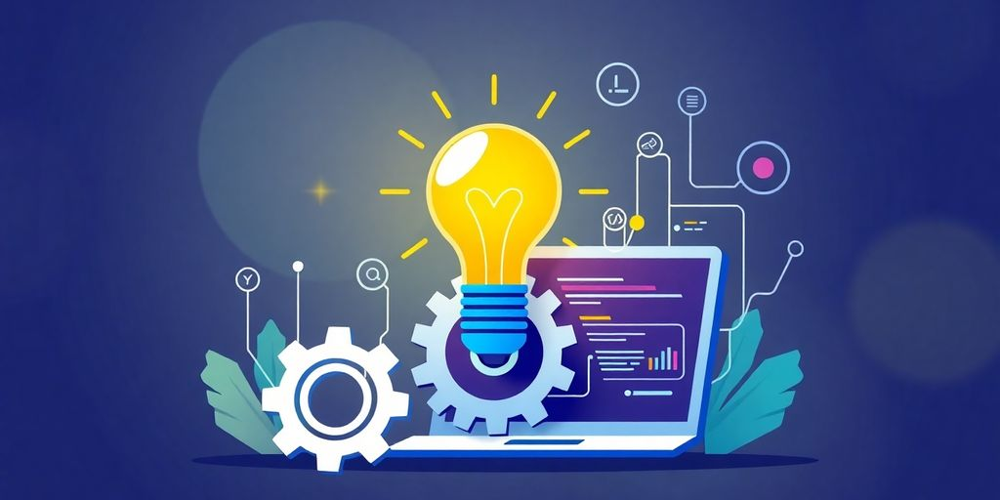

Creating a Minimum Viable Product (MVP) is a vital step for anyone looking to launch a new software project. It’s about finding that sweet spot where you can test your ideas with real users without going overboard on features and costs. This guide will walk you through essential strategies for MVP software design, helping you to build a product that not only meets market needs but also evolves based on user feedback.

### Key Takeaways

*   Focus on the core features that solve a specific problem for your users.
*   Gather feedback from early adopters to shape future iterations of your MVP.
*   Use a lean development approach to keep things simple and effective.
*   Understand your target audience to prioritize what features matter most.
*   Stay flexible and ready to adapt your MVP based on user insights and market changes.

## Essential Strategies for Effective MVP Development

So, you're building an MVP? Cool. It's not just about throwing something together. It's about being smart. Here are some strategies to make sure your MVP actually works.

### Focusing on Your Core Value Proposition

What's the _one_ thing your product does really, really well? That's your core value proposition. **Stick to it.** Don't get distracted by shiny objects or features that sound cool but don't actually solve the main problem. Think laser focus. This [focused approach](https://www.f22labs.com/blogs/mvp-development-guide/) helps you validate your idea faster.

### Solving a Central Problem for Your Target Audience

Your MVP needs to solve a real problem for real people. I mean, duh, right? But it's easy to get caught up in building something _you_ think is cool, instead of something your _users_ actually need. Talk to your target audience. Figure out their pain points. Then, build a product that addresses those pain points directly. No fluff.

### Embracing Lean Development and Iterative Design

Think of your MVP as a living thing. It's going to evolve. That's where lean development and iterative design come in. Start small, get feedback, and then iterate. Don't try to build the perfect product right out of the gate. It's a waste of time and resources. Instead, build something that's good enough to get started, and then improve it over time. This is where [agile development](https://www.example.com) shines.

> Lean development is all about minimizing waste and maximizing value. Iterative design is all about getting feedback early and often, and using that feedback to improve your product. Together, they're a powerful combination for building successful MVPs.

## Utilizing User Feedback and Iterating the Minimum Viable Product

So, you've launched your MVP. Congrats! But the journey doesn't end there. In fact, it's just beginning. Now it's time to listen to your users and make your product even better. Think of it as sculpting. You've got the basic shape, now you need to refine it.

### Gathering Insights from Early Users

Okay, how do you actually get this feedback? Don't just sit around and wait for it to magically appear. You need to be proactive. Here are a few ideas:

*   **In-app feedback tools:** These are super handy. Users can give you feedback right when they're using the product. Easy peasy.
*   **Surveys:** Keep them short and sweet. No one wants to spend 30 minutes answering questions. Offer a small incentive if you can.
*   **User interviews:** Chat with your users. Ask them about their experience. What do they love? What do they hate? What could be better? This is where you can really [understand MVP](https://www.protonshub.com/blogs/the-role-of-user-feedback-in-mvp-development) development.
*   **Focus groups:** Get a group of users together and have a discussion. This can be a great way to get a variety of perspectives.

> Remember, the goal is to understand what your users really think. Don't just listen to what they say, pay attention to what they do.

### Making Data-Driven Decisions

So, you've got all this feedback. Now what? Don't just make changes based on a gut feeling. Use the data to guide your decisions. Look for patterns and trends. What are the most common complaints? What features are people using the most?

Here's a simple example:

| Feature | User Rating | Usage Frequency |
| --- | --- | --- |
| Feature A | 4.5 stars | High |
| Feature B | 2 stars | Low |
| Feature C | 3 stars | Medium |

Based on this data, you might want to focus on improving Feature B. Or maybe even scrap it altogether. Ouch!

### Creating a Feedback Loop for Continuous Improvement

This isn't a one-time thing. You need to create a _feedback loop_ so you can continuously improve your product. Here's how:

1.  **Collect feedback:** Use the methods we talked about earlier.
2.  **Analyze the data:** Look for patterns and trends.
3.  **Make changes:** Implement the changes that you think will have the biggest impact.
4.  **Measure the results:** Did the changes actually improve the product? Are users happier? Are they using the product more?
5.  **Repeat:** Keep collecting feedback and making changes. It's an ongoing process. **This iterative approach is key to a successful MVP.**

And that's it! Now go forth and iterate! Your users will thank you for it.

## Understanding MVP in Software Development

So, you're diving into the world of MVPs? Cool. Let's break down what they're all about. It's not just some fancy tech term; it's a smart way to build stuff.

### The Basics of MVP Software Design

Okay, so what _is_ an MVP? Think of it as the most basic version of your product. **It has just enough features to solve a core problem for your early users.** It's not about building everything at once. It's about getting something out there, testing the waters, and seeing what sticks. The whole point is to learn fast and avoid wasting time and money on features nobody wants. It's about [startup success](https://jetthoughts.com/blog/tags/agile/), not perfection.

### Agile Development Approach

Agile and MVPs? They're like peanut butter and jelly. Agile is all about flexibility and quick changes. You build in short bursts, test, get feedback, and then tweak. This works great with MVPs because you're constantly learning and improving. It helps you to define the critical features and steps for crafting an MVP. It's about [effective task management](https://jetthoughts.com/blog/tags/agile/) and adapting as you go, not sticking to some rigid plan that might be wrong.

### Key Benefits of MVPs

Why bother with an MVP? Here's the deal:

*   **Saves Time and Money:** You're not building a ton of features nobody asked for.
*   **Validates Ideas:** You get real feedback from real users early on.
*   **Reduces Risk:** You find out what works before investing big bucks.

> An MVP lets you test your assumptions without betting the farm. It's about learning what your users actually want, not what you think they want. It's a way to create a Minimum Viable Product that people will actually use.

Plus, it helps you focus. You're not trying to do everything at once. You're focusing on the core value and making sure that's solid. Think of it as building a house one room at a time, instead of trying to build the whole thing at once and ending up with a mess. It's about [team transitions](https://jetthoughts.com/blog/tags/agile/) and making smart choices.

## Crafting Your MVP Strategy: Key Steps

So, you're ready to build an MVP? Awesome! But hold your horses. You can't just jump in. You need a plan. Think of it as a treasure map, but instead of gold, you're hunting for product-market fit. Let's break down the key steps to crafting a solid MVP strategy.

### Identifying the Problem to Solve

First things first: What problem are you _actually_ solving? Don't just assume you know. Dig deep. Talk to potential users. Figure out their pain points. Is it a minor annoyance or a screaming need? **Your MVP should laser-focus on solving one core problem.** If you try to do too much, you'll end up doing nothing well. Think of it like trying to juggle chainsaws while riding a unicycle – impressive if you can pull it off, but probably not the best idea.

### Defining Your Target Audience

Who are you building this for? _Knowing your audience_ is super important. Are they tech-savvy millennials or retired librarians? Their needs and expectations will be wildly different. Create user personas. Give them names, backstories, and favorite coffee orders. The more you know, the better you can tailor your MVP to their specific needs.

### Mapping Out the User Experience

Imagine your user's journey. How will they interact with your MVP? What steps will they take to solve their problem? Map out the user flow. Keep it simple. Every step should be intuitive and easy to follow.

> Think of your MVP as a first date. You want to make a good impression, but you don't want to overwhelm them with your entire life story. Keep it concise, engaging, and leave them wanting more.

Here are some things to keep in mind:

*   Keep the number of steps to a minimum.
*   Make each step clear and intuitive.
*   Focus on the core functionality.

By following these steps, you'll be well on your way to crafting an MVP strategy that sets you up for success. Remember, it's all about learning and iterating. Don't be afraid to experiment and adjust your approach as you go. Good luck!

Consider these [simple steps](https://www.f22labs.com/blogs/what-is-mvp-and-how-to-build-one-in-6-steps/) to create an MVP.

## Real-World Examples of Successful MVPs

Ever wonder if the MVP thing _really_ works? Spoiler alert: it does. Plenty of companies started super small and grew into giants. Let's look at a few.

### Case Studies That Inspire

Think about Instagram. It didn't launch with all those filters and features. Nope. It started as a basic photo-sharing app. **Focusing on one core function let them nail the user experience before adding more stuff.** They proved people wanted to share photos. Now look at them!

Or take Airbnb. They didn't start with millions of listings. The founders rented out air mattresses in their apartment. Simple, right? It tested the idea that people would pay to stay in someone's home. It worked! Now, it's a global phenomenon. These [MVP prototyping](https://jetthoughts.com/blog/tags/design/) examples show how a small start can lead to big success.

### Lessons Learned from MVP Launches

So, what can we learn from these MVP stories?

*   **Keep it simple:** Don't try to do everything at once.
*   **Focus on the core:** What's the one thing your product _must_ do?
*   **Get feedback early:** Talk to your users. Find out what they like and don't like.

> MVPs aren't about building a perfect product. They're about learning what your users want. It's about testing your assumptions and iterating quickly.

### What Worked and What Didn’t

Sometimes, MVPs don't go as planned. That's okay! It's still valuable. For example, a company might launch an MVP with a certain feature set, only to find out users don't care about half of it. That's useful information! It tells you where _not_ to spend your time and money. It helps you refine your [software projects](https://jetthoughts.com/blog/tags/design/) and focus on what matters. Failure is just a stepping stone, right?

## Future Trends in MVP Software Design

Okay, let's peek into the crystal ball and see what's coming for MVPs. It's not just about getting something out there fast anymore. The game is changing, and you need to keep up. Think smarter, not just faster.

### Emerging Technologies to Watch

Forget what you know, because tech moves fast. Here's the deal:

*   _Low-code/No-code_ platforms are getting seriously powerful. You can build MVPs faster than ever. It is like using building blocks instead of writing code from scratch.
*   AI is becoming a co-pilot. Expect AI to help with everything from generating code to predicting user behavior. It is like having a smart assistant that knows what your users want before they do.
*   Blockchain is finding its niche. Think secure data and transparent processes. It is not just for crypto anymore; it is about trust and security.

> The future MVP will be built with a mix of these technologies, making development faster, smarter, and more secure. It is about using the right tools for the job, not just the tools you know.

### Shifts in User Expectations

Users are not as forgiving as they used to be. A basic MVP is not enough. People expect polish, even in early versions. Here is what to keep in mind:

*   Personalization is key. Users want experiences tailored to them. It is not enough to just solve a problem; you need to solve it in a way that feels personal.
*   Mobile-first is non-negotiable. If your MVP does not work great on mobile, you are already behind. People live on their phones, so your MVP needs to as well.
*   Accessibility matters. Make sure your MVP is usable by everyone, regardless of ability. It is not just the right thing to do; it is also good business.

### The Role of AI in MVP Development

AI is not just a buzzword; it is a game-changer. Here is how AI will impact MVPs:

*   AI can automate testing. Find bugs faster and ensure quality. It is like having a tireless QA team that never sleeps.
*   AI can analyze user feedback. Understand what users really want. It is like having a super-powered focus group that gives you insights in real-time.
*   AI can personalize the user experience. Make your MVP more engaging and effective. It is like having a personal assistant that tailors the experience to each user.

**AI will help you build better MVPs, faster.** It is about using AI to augment your team, not replace it. Consider [interactive prototypes](https://jetthoughts.com/blog/typical-day-at-jetthoughts-agile-remote/) to accelerate revenue generation.

As we look ahead, [the future of MVP software design](https://jetthoughts.com) is all about being quick and smart. New tools and methods are making it easier for teams to create products that meet user needs faster than ever. By focusing on user feedback and using advanced technology, businesses can build better MVPs that stand out in the market. If you want to learn more about how to improve your software development process, visit our website today!

## Wrapping It Up

So, there you have it! Building a Minimum Viable Product isn’t just about throwing together some features and hoping for the best. It’s about really understanding your users, keeping things simple, and being ready to adapt based on feedback. Remember, your MVP is a learning tool, not just a product. Take the time to focus on what matters most, and don’t be afraid to iterate. It’s all part of the process. Now, go out there and start creating something awesome!

## Frequently Asked Questions

### What is a Minimum Viable Product (MVP)?

A Minimum Viable Product (MVP) is a basic version of a product that has just enough features to satisfy early users. It helps developers test their ideas and get feedback quickly.

### Why is user feedback important for MVP development?

User feedback is crucial because it helps developers understand what users like and dislike about the product. This feedback guides improvements and ensures the product meets user needs.

### How can I identify the core features for my MVP?

To find the core features for your MVP, focus on the main problem your product solves and what users need most. Prioritize features that deliver the most value with the least complexity.

### What are some common mistakes to avoid when creating an MVP?

Some common mistakes include adding too many features, not listening to user feedback, and failing to test the product with real users. Keeping it simple and focused is key.

### How can I make sure my MVP is successful?

To ensure your MVP is successful, focus on solving a real problem, gather user feedback, and be ready to make changes based on what you learn from users.

### What role does technology play in MVP development?

Technology helps in building the MVP efficiently. Using the right tools and practices can speed up development and improve the quality of the product.