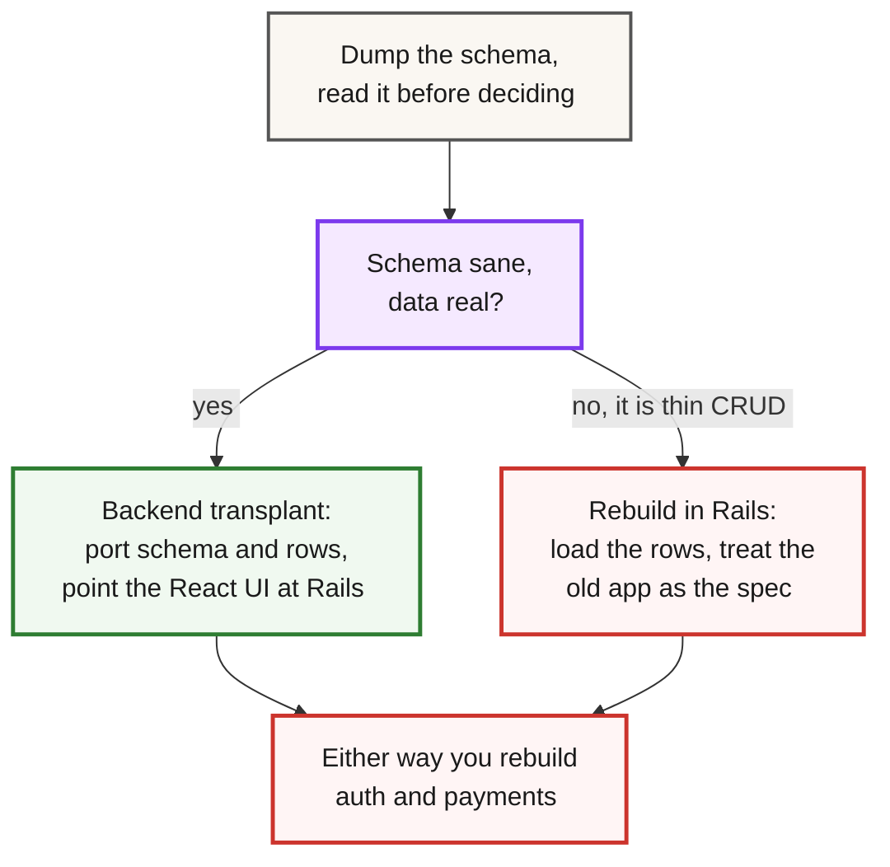

Before you migrate a Lovable app to Rails, open the network tab on the app you have today. You'll usually find the Supabase URL and a key labeled `anon` sitting in the client bundle. That key is meant to be public. What makes it dangerous is what's behind it: if row-level security was never turned on, that key reads the whole table.

```bash
curl 'https://<project>.supabase.co/rest/v1/profiles?select=*' \
  -H "apikey: <anon-key-from-the-bundle>"
```

A researcher ran a version of that check across Lovable's own showcase in early 2025 and found [303 endpoints on 170 projects returning data to anyone with the public key](https://www.superblocks.com/blog/lovable-vulnerabilities) - emails, addresses, in some cases API keys. The finding became [CVE-2025-48757](https://nvd.nist.gov/vuln/detail/CVE-2025-48757) in May 2025, a record the vendor disputes and one the NVD scopes to Lovable-generated sites through April 15, 2025. So read the scan as context rather than a verdict on today's Lovable. What it demonstrates is what a missing row-level security policy looks like from the outside, and that part applies to any Supabase-backed app. If you're reading this, you probably already know your app has a problem like it, and you're deciding whether to move to production-grade Rails or keep patching.

## First figure out what to keep

The honest answer to "how much of this transfers" depends on which part you're looking at, and the parts age very differently.

Your database schema and the data in it are the durable part. Tables, columns, foreign keys, the actual rows your users created - that ports cleanly, because it's just Postgres underneath. The generated React front end is often worth keeping: it renders, it's typed, and rebuilding pixel-perfect UI by hand is a poor use of a rescue budget.

Auth and payments almost never survive. The tools can wire them up, but "looks wired up" and "actually enforces the rule" are different states, and they look identical in a demo.

Here's how it usually splits:

| Layer | Verdict |
|---|---|
| Database schema | **Transfers.** It's Postgres, so `pg_dump` and you're done. |
| Data (rows) | **Transfers.** Same export. Watch the auth foreign keys. |
| Uploaded files | **Transfers separately.** They're in Storage, not the dump. |
| Business logic | **Sometimes.** Read every line, port what's real. |
| Edge functions (Deno) | **Port.** They become Rails controller actions or jobs. |
| Front end (React) | **Often.** It renders. Point it at a new API. |
| Auth | **Rarely.** Stubbed or hardcoded, with no real sessions. |
| Payments | **Rarely.** Stripe checkout exists; webhooks don't. |

One decision drives everything else. If the schema is sane and the data is real, you're doing a backend transplant and keeping the UI. If the schema is a mess and the "logic" is a thin wrapper over AI-generated CRUD, you're rebuilding, and the old app is a spec, not a codebase.

"Sane" is checkable in ten minutes without a database background. Open `schema.sql` (the dump command that produces it is in the next section) and look for real foreign keys - `REFERENCES` lines connecting tables - and typed columns a human would name, like `due_date date`, instead of grab-bag `jsonb` blobs carrying half the data model. Then check for near-duplicate tables (`projects`, `projects_new`, `projects_v2` left behind by regeneration runs), and peek at the Supabase table editor for row counts that look like your actual users, not seed data. Two or more misses and you're on the rebuild branch - the schema is telling you the logic behind it was regenerated CRUD.



We wrote a longer field guide to that call in [the vibe coding crisis: AI code debt](/blog/vibe-coding-crisis-ai-code-debt/). Read the schema before you decide. Everything downstream forks here.

This is also the point where you decide whether to run the migration yourself. If your team reads Postgres comfortably and has shipped auth before, keep going. If not, [our vibe code rescue service](/services/vibe-code-rescue/) opens with a 48-hour audit and quotes a fixed price from it.

## What these tools actually generate

The popular tools cluster into three shapes, and the shape decides how much of this playbook applies.

Lovable, Bolt, and Replit generate a real, ownable codebase. [Lovable ships a React + Vite front end with Supabase behind it](https://docs.lovable.dev/introduction/faq) - Postgres, Supabase Auth, Storage, and Deno edge functions. Bolt defaults to React in a StackBlitz WebContainer and [connects Supabase as the backend](https://support.bolt.new/integrations/supabase). Replit gives you a full Linux container with whatever the agent wrote.

In all three, you can export the code and take the Postgres database with you.

Base44 is the one to check carefully. It's a hosted platform ([Wix acquired it in June 2025](https://www.wix.com/press-room/home/post/wix-further-expands-into-vibe-coding-with-acquisition-of-base44-a-hyper-growth-startup-that-simplif)), and [its data export is per-collection CSV files](https://docs.base44.com/Building-your-app/Managing-your-app-data), not a Postgres dump - the auth and backend services keep running on Base44's infrastructure. The exported code still calls those services through the Base44 SDK, so migrating means replacing managed auth, data, and backend functions, not just porting files - you rebuild the backend from the UI and the CSVs.

v0 is frontend-first - [it can scaffold Next.js route handlers and database integrations now](https://v0.app/docs/full-stack-apps), but the database and auth are still yours to bring, so there's less to export and less to untangle.

## Get the schema and data out first

Supabase is Postgres, so `pg_dump` does the work.

Grab the direct connection string from the Supabase dashboard under Settings, then Database. Use port 5432, not the pooled 6543 - [pg_dump breaks through the transaction pooler](https://supabase.com/docs/guides/platform/migrating-within-supabase/backup-restore). One catch: the direct hostname `db.<project>.supabase.co` is IPv6-only, so on an IPv4-only network use the session pooler instead - same port 5432, on the pooler hostname.

Take two dumps: the schema to read, the data to load. Keep the password out of the connection URI - embedded there it lands in shell history and `ps` output - so put it in `~/.pgpass` (mode 600) or let `pg_dump` prompt for it:

```bash
pg_dump "postgresql://postgres@db.<project>.supabase.co:5432/postgres" \
  --schema=public --schema-only \
  --no-owner --no-privileges \
  --file=schema.sql

pg_dump "postgresql://postgres@db.<project>.supabase.co:5432/postgres" \
  --schema=public --data-only \
  --no-owner --no-privileges \
  --file=data.sql
```

The split matters because the two files have different destinies. Your new schema comes from Rails migrations, so `schema.sql` never touches the new database - replaying Supabase DDL into a Rails-managed schema would either fight the migrations or bypass them. `data.sql` is the only file you load. It's also your users' production data sitting in plaintext on your laptop: keep it off shared drives and delete it when the migration is done.

The `--schema=public` flag matters too. Supabase keeps its own machinery in `auth`, `storage`, and `realtime` schemas, and you don't want that machinery - you're replacing it. Dump `public`, read `schema.sql` in a text editor, and you'll have your real data model in front of you for the first time.

Those dumps have one hole in them: your users. Supabase stores accounts - emails and bcrypt password hashes - in `auth.users`, which `--schema=public` skips. [Export them separately](https://supabase.com/docs/guides/troubleshooting/migrating-auth-users-between-projects) before you go further, from `psql` on the same connection string:

```sql
\copy (SELECT id, email, encrypted_password, created_at FROM auth.users)
  TO 'auth_users.csv' WITH CSV HEADER
```

Two restore traps follow from that split. Rows in `public` tables still reference `auth.users` ids, so import the accounts into your new `users` table before you load `data.sql` - the foreign keys your Rails migrations declare will reject the orphaned rows otherwise. And keep the exported `id` values: they're the UUIDs every other table references.

Replit apps take the same route with fewer detours. Replit hands the app its own Postgres connection string as `DATABASE_URL`, so `pg_dump` runs against that one and the `--schema=public` filter stops mattering - there's no separate Supabase `auth` schema holding the accounts apart. Whatever table the agent wrote users into comes out with the rest of the dump, so you can skip the CSV export and both restore traps above.

Then translate `schema.sql` to Rails migrations. The tables map almost one-to-one; the friction is at the edges. Supabase uses UUID primary keys by default, so tell Rails the same instead of fighting it:

```ruby
create_table :projects, id: :uuid do |t|
  t.references :owner, type: :uuid, foreign_key: { to_table: :users }
  t.string :name, null: false
  t.timestamps
end
```

Watch two things. The foreign keys that pointed at `auth.users` get re-created here against your new `users` table - that seam is where the old auth hands off to the new one, and the `users` table itself arrives in the next section, with a UUID primary key you have to ask for. And columns Supabase filled with `auth.uid()` defaults need a Rails-side equivalent, usually set in the model or controller.

Loading runs in the order the foreign keys point: accounts first, then everything that references them. Import the users with `insert_all`, which writes the bcrypt hashes straight into `password_digest` without fighting model validations:

```ruby
# bin/rails runner import_users.rb
require "csv"
rows = CSV.read("auth_users.csv", headers: true).map do |r|
  { id: r["id"], email: r["email"],
    password_digest: r["encrypted_password"],
    created_at: r["created_at"], updated_at: Time.current }
end
User.insert_all(rows)
```

Then load the data dump in one transaction, with triggers and foreign-key checks relaxed so the dump's internal insert order can't fight you:

```bash
psql "$DATABASE_URL" --single-transaction \
  --set=ON_ERROR_STOP=on \
  -c "SET session_replication_role = replica;" \
  -f data.sql
```

Finish with the cheapest proof the transplant took: `bin/rails runner 'puts User.count; puts Project.count'` and compare against the table counts the Supabase dashboard showed you. Matching counts before you touch anything else turns every later bug from "did the data survive?" into "what did I wire wrong?" - a much better class of problem. If they don't match, compare the table lists first: a table the dump skipped is far more common than lost rows.

Files are a separate export. Lovable apps lean on [Supabase Storage](https://supabase.com/docs/guides/storage) for uploads - avatars, attachments, anything users added through the UI - and none of it is in the SQL dump. Pull each bucket down with the Supabase CLI or a script against the Storage API, move the files into Active Storage or straight to S3, and rewrite the stored URLs as you load the rows. Skip this step and the rescued app boots with every image broken.

Edge functions are the last thing to export. Any Deno functions the tool wrote (Lovable keeps them in `supabase/functions/`) carry real business logic often enough that each one deserves a read. They port as Rails controller actions when they answered requests, and as jobs when they ran on a schedule or reacted to events.

## Rebuild the auth they faked

Auth bites hardest, so budget for it honestly. Behind the open endpoints from the intro, nothing was enforcing who-can-see-what - the RLS policies meant to do it were never written.

Rails moves that enforcement to the server, which is where a founder can actually reason about it. Rails 8 ships a built-in authentication generator - no gem required for the common case:

```bash
bin/rails generate authentication
```

That gives you a `User` model with `has_secure_password`, a `Session` model, sign-in and sign-out, and password reset wired to the mailer.

Make two edits before you run its migration. The generated `users` table uses a bigint primary key - if your dump used UUIDs, change it to `id: :uuid`, or every foreign key you just migrated points at nothing. And the generator ships sign-in and password reset but no sign-up flow: fine for the rows you're importing, but new users can't register until you build that screen.

Now load the accounts - from Supabase, that's the `auth_users.csv` you exported earlier, and the `insert_all` script above does the import. The `encrypted_password` column holds bcrypt hashes, and they move straight into `password_digest` because Rails uses bcrypt too - users keep their passwords and never notice. If any hashes are a format `has_secure_password` can't read, force a password reset on first login rather than trying to translate them.

One subset needs different handling: anyone who signed in with Google or GitHub has no password hash at all - `encrypted_password` is empty for them. A reset email is the wrong fix for a password that never existed. Wire the same provider into Rails with OmniAuth when you reach the Devise decision below, and match the accounts by email - the imported `id` keeps all their rows attached in the meantime.

If you need OAuth, roles, or multi-tenancy beyond what the generator covers, that's the Devise conversation. We compared the [Rails 8 authentication generator against Devise](/blog/rails-8-authentication-generator-devise-migration/) for exactly this decision - start on the generator and reach for Devise when a real requirement shows up.

The test that matters: log in as user A and try to read user B's data by guessing an ID. In the old app that curl worked. After the migration, the controller should refuse it, because a scope like `current_user.projects.find(params[:id])` now decides what's visible.

## Payments: the webhooks nobody wired up

Payments fail the same way auth does - the checkout flow is real and the accounting behind it was never built.

A Stripe Checkout button is a redirect to a page Stripe hosts, so the generated version works: the customer pays and comes back.

The Stripe side of the ledger survives the migration untouched - the account and its customers and subscriptions live with Stripe, not in your app, so nothing needs exporting. What the new Rails app brings is a webhook endpoint to register and a signing secret in credentials. Test the whole loop locally with `stripe listen --forward-to localhost:3000/stripe_webhooks` before production ever sees it.

What's missing is the webhook handler, the part where Stripe tells your server that a payment cleared or a subscription ended. Without it, someone can pay and get nothing, or cancel and keep access, and your database never learns the difference. Nothing in the UI shows the gap; it surfaces when someone reconciles the app against the Stripe dashboard.

Rails handles the webhook as a plain controller action. The two rules that keep it honest: verify the signature so nobody can forge events, and make it idempotent because Stripe retries:

```ruby
class StripeWebhooksController < ApplicationController
  # raise: false - in API mode the CSRF filter may not exist to skip
  skip_before_action :verify_authenticity_token, raise: false

  def create
    event = Stripe::Webhook.construct_event(
      request.body.read,
      request.env["HTTP_STRIPE_SIGNATURE"],
      Rails.application.credentials.stripe[:webhook_secret]
    )

    # stripe_events has a unique index on event_id - the idempotency guard
    StripeEvent.create!(event_id: event.id, payload: event.to_h)
    StripeWebhookJob.perform_later(event.id)

    head :ok
  rescue ActiveRecord::RecordNotUnique
    head :ok # Stripe retried an event we already accepted
  rescue Stripe::SignatureVerificationError
    head :bad_request
  end
end
```

The unique index is the whole idempotency story: a retried delivery raises `RecordNotUnique` and gets a 200 without running anything twice. The job is where `Subscriptions::Activate` and `Subscriptions::Revoke` actually run - the controller only records the event and acknowledges it, so slow work can't make Stripe time out and retry a delivery you're still processing. The [quality tax of an AI-built MVP](/blog/quality-tax-ai-mvp-cost/) puts payments at the center for a reason. This is also where a real test suite earns its cost, because you cannot manually click your way through "card declined on renewal after three successful months."

## The front end: keep it or replace it

Here the default advice is often wrong. The generated React works, and your users already know it.

If you're keeping React, run Rails in API mode and point the front end at it. Swap the `@supabase/supabase-js` calls for `fetch` to your Rails endpoints, move auth to the session cookie your new backend issues, and delete the Supabase client. The UI keeps working against a new data source.

One catch: `rails new --api` strips the exact middleware that cookie advice needs - no `ActionDispatch::Cookies`, no session store, no CSRF protection. Add them back:

```ruby
# config/application.rb - API mode leaves these out
config.middleware.use ActionDispatch::Cookies
config.middleware.use ActionDispatch::Session::CookieStore,
  key: "_app_session", same_site: :none, secure: true

# config/initializers/cors.rb - credentialed CORS for the SPA origin
Rails.application.config.middleware.insert_before 0, Rack::Cors do
  allow do
    origins "https://app.yourdomain.com"
    resource "*", headers: :any, methods: %i[get post put patch delete],
      credentials: true
  end
end

# app/controllers/application_controller.rb - CSRF is off in API mode
class ApplicationController < ActionController::API
  include ActionController::Cookies
  include ActionController::RequestForgeryProtection
  protect_from_forgery with: :exception
end
```

The `same_site: :none, secure: true` pair and the CORS block exist only because the SPA lives on a different domain than the API - serve both from one domain and the defaults do the job.

If you'd rather consolidate to one framework and one deploy, Hotwire lets you rebuild the interface in server-rendered Rails without a separate frontend build. That's the right call when the team is Ruby-first and the React was mostly forms and tables. It's the wrong call when the front end is genuinely interactive and rewriting it burns weeks to remove a working thing.

Either way you now own a deployable app. [Our Rails 8 Docker production guide](/blog/rails-8-docker-deployment-production-guide/) covers containerizing it, and when one box stops being enough, [the Kamal 2 multi-server guide](/blog/kamal-2-multi-server-deployment-complete-guide/) takes it across hosts.

## Cutover: take a fresh dump

The dumps you migrated with go stale the moment you take them - users keep creating rows in the old app while you build against a copy. Treat the switch as its own step. Put the old app into read-only mode, or pick your quietest hour and accept a few minutes of downtime. Take a fresh `data.sql` and `auth_users.csv`, load them with the same commands as the practice run, re-sync any Storage uploads from the interim weeks, and only then point the domain at the Rails app. Keep the Supabase project alive but idle for a couple of weeks afterwards: it is your rollback and your audit trail if anyone reports a missing row. Because you already loaded the stale dump once, the real cutover is a rerun, not a first attempt.

## When not to migrate to Rails

Rails is the right rebuild target often enough that it's worth naming when it isn't, because forcing it costs more than picking correctly.

Skip it if the app is a static marketing site with a form. That's a landing page and a form handler; Rails is a heavy answer to a light question.

It's also the wrong move when the product is genuinely realtime-first - a live collaborative editor, a multiplayer canvas, a trading view where every millisecond of push latency shows. Rails does realtime, but a design built around it from day one may be better served elsewhere, and honesty here saves a painful second migration.

The third reason to hold off: a team with zero Ruby experience and no runway to learn. A rescue that hands you a stack nobody can maintain just relocates the problem. One [pattern behind failed rebuilds](/blog/47-startups-failed-same-coding-mistake/) is choosing technology the team can't operate.

Rails wins when you have data worth keeping, business logic worth enforcing on a server, and someone who can read Ruby. Not every app that outgrew its AI builder clears that bar.

The migration itself is boring in the good way. Start with the dump; everything else follows from what you find in it.
