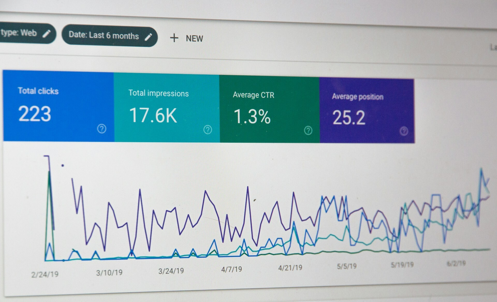

For a long time, we've been running a corporate blog on Medium, but recently, we've run into some problems:

**Problems with Google Indexes.**
   Google started flagging issues with the structure of our articles, causing them to fall out of the search index and negatively impacting our visibility in search results.

**They should have integrated Google Analytics.**
   We encountered the issue of Google Analytics disappearing for our blog on Medium, hindering our ability to track and analyze visitor data.

**Support sub-path /blog.**
   Having a blog as a path on our domain enhances our domain rank, a feature not achievable with Medium.

## Simplify subsequent blog migration through Headless CMS.

We have changed blog engines several times and spent much time on migration, and developers would not like to change tools each time. We decided to set up one CMS to store all our posts and sync those posts across different blog engines or platforms separately.

Considering the wide variety of Headless CMS options available today, categorized into self-hosted/cloud-hosted, API-based/git-based, and no headless(static), we have started exploring modern options for managing a technical blog.

Due to some of our articles already being on the dev.to, we decided to check whether this platform can be used as a Headless CMS. 

**So, what advantages have we found in using dev.to:**
- Free.
- Convenient API. We can receive an article in Markdown form and data for SEO optimization.
- Our authors are already familiar with the dev.to interface, and the process of writing posts has already been set up for them.
- dev.to can be used as a storage for media files for our articles.

It is handy to receive articles in Markdown format as we use **Hugo**, a static site generator for our corporate website. Hugo handles Markdown files, and it would be convenient if the blog also operated on Hugo, reducing the number of tools used.

##Migration approach

1. **Migrate posts from Medium to dev.to:** This can be done in various ways, including online tools, a browser extension, or a custom script.

2. **Add synchronization with dev.to:** Develop a script that runs at set intervals. It saves a dev.to articles with SEO metadata as Markdown files on our server.

3. **Update blog with new posts:** Thanks to Hugo, posts automatically appear on our blog after the synchronization script is triggered.

4. **Prevent SEO problems with migration:** Set up redirects so article links lead to the new blog.

We expect the new approach will help us increase website traffic and save time on publication. We will eliminate unnecessary tools. For our authors, nothing will change as the article writing process remains the same – they publish posts on dev.to while the rest of the process is automated. We will monitor how our SEO metrics change and write an article with the results.