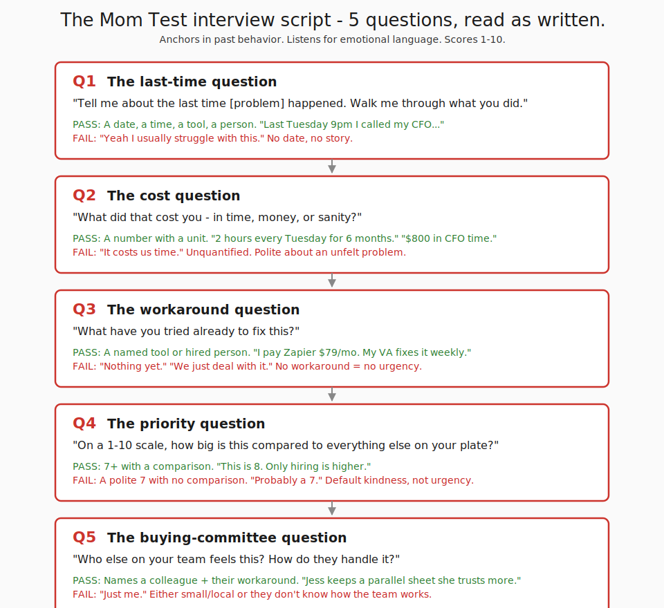
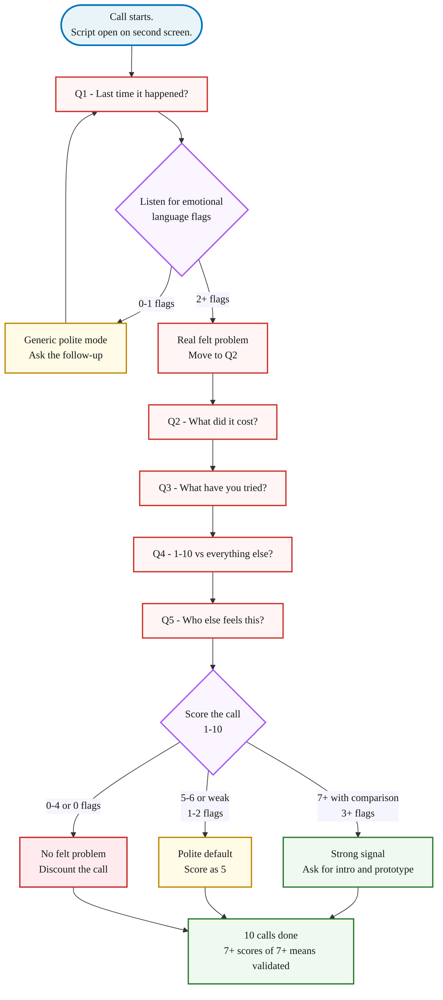
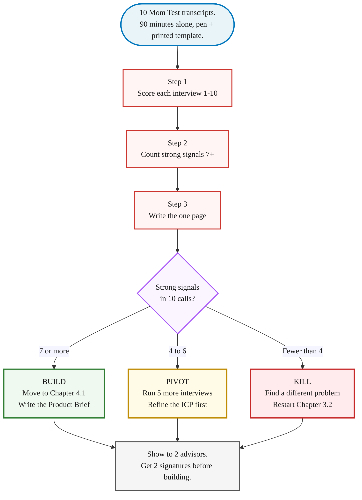

> **Module 3 · Step 3 of 4** · [Tech for Non-Technical Founders 2026](/blog/tech-for-non-technical-founders-2026/) course.
> Input: 10 interview slots booked (from Chapter 3.2). Output: 10 scored transcripts + a one-page validated problem statement signed by 2 advisors.

An ed-tech founder we picked up last quarter ran 11 customer interviews before launch. Nine said some version of "this is great, I would absolutely use this." She charged $49/month, opened on a Monday, finished the week with three signups - two of whom churned in 14 days. Every question was hypothetical ("would you pay for this?"); every answer was polite. Eleven friendly conversations, zero useful data.

For the verbatim script + reference card, see [Mom Test Interview Script](/blog/mom-test-interview-script/). This chapter explains *why* those five questions work and how to score each call. Before you book real interviews, sharpen your question list with [AI personas](/blog/ai-persona-pre-validation-mom-test-prep/) - Claude personas catch weak questions before you waste a real interview slot.

## Why this matters in 2026

The ed-tech founder above asked her network what they thought of the idea. The network, being nice people, said it sounded great. The market didn't lie - the questions did.

Rob Fitzpatrick's book [The Mom Test](https://www.momtestbook.com/) (2013) named the technique that prevents this failure: ask about past behavior, not future preference. "Tell me about the last time" is the lock-pick. "Would you pay for this?" is the kind smile that costs you a year. The five-question script below is what the interview becomes when you stop asking your mom whether your idea is a good one.

## The 5 questions

The script runs in order. Each question funnels the interviewee deeper into a real memory of the problem. Read the questions as written - small wording changes ("would you" instead of "did you") flip the answer back into hypothetical polite, which is exactly the failure mode you are paying 30 minutes to avoid.

#### Q1: "Tell me about the **last time** [problem] happened. Walk me through what you did."

- **What it catches**: whether the problem actually happens, how often, what mechanic the interviewee uses. A real story has a date and a tool.
- **Pass**: specific recent story. *"Last Tuesday at 9pm I spent 40 minutes copying numbers from three spreadsheets into a slide for the board."* Date, time, tool, duration, feeling.
- **Fail**: vague generality. *"Yeah I usually struggle with reporting."* No date, no mechanic - autopilot polite mode.
- **Follow-up**: *"Walk me through that specific Tuesday again. What did you do first?"*

#### Q2: "What did that **cost** you - in time, money, or sanity?"

- **What it catches**: whether the pain is quantifiable. Separates "this is annoying" from "I'd pay $200/month to make this stop."
- **Pass**: a number with a unit. *"Two hours every Tuesday for six months."* / *"My CFO bills $200/hour and spent four hours on it last week."*
- **Fail**: *"It costs us time."* / *"It's frustrating."* Unquantified. Polite about a problem they don't actually feel.
- **Follow-up**: *"If you had to put a dollar figure on it - or hours, or 'I'd quit my job over this' - what's the number?"*

#### Q3: "What have you **tried already** to fix this?"

- **What it catches**: existing workarounds. A hack, a paid tool, a hired VA, two spreadsheets duct-taped = real. Nothing tried = theoretical.
- **Pass**: a named tool, a hired person, a custom script. *"I pay $79/month for Zapier to copy QuickBooks to Google Sheets. It breaks every two weeks. My VA on Upwork fixes it."*
- **Fail**: *"Nothing yet."* / *"We just deal with it."* / *"I've been meaning to look into something."*
- **Follow-up**: *"What broke about the workaround? Why are you still talking to me about this?"* The crack is the gap your product would fill.

#### Q4: "On a scale of **1-10**, how big a problem is this compared to everything else on your plate?"

- **What it catches**: urgency against the interviewee's whole problem stack. A 9 is a sales conversation. A 4 is a pat on the head and zero dollars.
- **Pass**: a 7 or higher **with a comparison**. *"This is an 8. The only thing higher is hiring my next engineer."*
- **Fail**: a 5-6 with soft justification, or a bare "probably a 7" with no comparison (the polite-default 7 - treat as a 5 until Q5 proves otherwise).
- **Follow-up**: *"What's at 10 for you right now? What would have to happen for this to climb to that 10 spot?"*

#### Q5: "**Who else** on your team feels this? How do they handle it?"

- **What it catches**: the buying committee + workarounds other people in the company already built. In B2B, your interviewee is not the only nodder when the invoice arrives.
- **Pass**: a specific colleague named + their workaround. *"My ops manager Jess feels this worse than I do - she keeps a parallel Google Sheet because she doesn't trust the finance numbers from accounting."*
- **Fail**: *"I'm the only one who deals with this."* / *"Everyone else is fine."*
- **Follow-up**: *"Could you introduce me to Jess?"* An interviewee who won't make a 30-second intro probably won't pay you $49/month either.

## The 3 emotional-language flags

While the script runs, your job is to listen for three patterns. These flags do more work than the words "yes" and "no" the interviewee gives you.

**Frustration language.** "I hate this." "It drives me crazy." "Every single week." "I can't believe we still do it this way." If the interviewee uses words with feeling, the problem is felt. Polite interviewees suppress feeling, which is exactly why polite-mode answers are useless for validation.

**Workaround language.** "I've been meaning to..." "We hacked together..." "I pay [tool] $X for this." "My VA does it manually." Workarounds prove the problem is real because the interviewee already spent time or money on a solution that doesn't fully work. The workaround budget is the line item your product would replace.

**Urgency language.** "Last week." "This morning." "I missed my kid's birthday because of this." A problem that happened today is felt more sharply than a problem that happens "sometimes." Time-anchored urgency is the strongest signal in the set, stronger than a high Q4 score given without one.

A passing call has 3 or more flags spread across the five answers. A failing call has 0 or 1 - the interviewee is being polite to you. Two flags is ambiguous, treat as a 5/10 default.

## The interview flow

Stick to the order. Founders who improvise mid-call ("oh that reminds me of my product idea") usually contaminate the rest of the transcript - the interviewee starts answering the pitch instead of describing their own life. Read the questions as written, take notes by hand, score after.

## What to do tomorrow

Three actions. In order.

- **Print [the Mom Test interview script artifact](#the-mom-test-interview-script-artifact) and open it on a second screen during the call.** Read the questions as written. The wording does the work - if you paraphrase, you slip back into polite-yes mode and waste the call.
- **Take notes by hand, not by typing.** Hand-writing slows you down enough that you stop transcribing and start listening for the three emotional flags. Typing during a call turns you into a court reporter; pen-and-paper turns you into a listener. The Q4 score and the flag count are what you write down, not the full transcript.
- **Score the call 1-10 within 5 minutes of hanging up.** Use Q4 plus your emotional-flag count. Write the score in the same notes file. If you score later, you will round up. By interview 10 you have a validation total, not 10 unsorted transcripts.

If 7 of your 10 calls score 7+ with at least 3 emotional flags, the problem is validated and you move to the [Validated Problem Statement Template](/blog/validated-problem-statement-template/). If fewer than 5 calls score 7+, the problem is too weak - re-evaluate the ICP, the framing, or sometimes the question wording before booking another 10. Sometimes Q1 is wrong - the problem context is too narrow - and a broader framing wakes the interviewee up. The [stop-looking-for-product-market-fit guide](/blog/stop-looking-for-product-market-fit-startup-tutorial/) covers what the validation signal does and doesn't tell you about whether you have product-market fit (spoiler: a validated problem is necessary, not sufficient).

## The Mom Test interview script artifact

The artifact at **[/blog/mom-test-interview-script/](/blog/mom-test-interview-script/)** carries the same 5 questions verbatim, the follow-ups, the pass/fail signals, the 3 emotional-language flags, and the scoring rubric. Print it, keep it open on your second monitor, run all 10 interviews against it. The artifact is the screen-side reference - this post is the explanation of why it works.

After 10 calls, you have either 10 scored transcripts that converge on a real problem (proceed to Chapter 3.4, the clickable prototype) or 10 transcripts that don't (re-frame and run another 10). Founders who fake the convergence to start building anyway are the same founders who later post about wasted MVP spend - the [quality tax for AI MVPs](/blog/quality-tax-ai-mvp-cost/) is what happens when you ship against an unvalidated problem.

> Most customer interviews fail because the interviewees are polite. Better questions outperform better people. Anchor every question in a specific past moment - last Tuesday at 9pm, the last invoice, the last time the spreadsheet broke - and the polite-mode answers run out fast.

## Synthesis: Write Down What You Heard, Decide What's Next

After all 10 interviews are done, you have scored transcripts in a folder and a number. Synthesis is the 90-minute step that turns those transcripts into the one-page validated problem statement that anchors Chapter 4.1. Founders who skip this step and go straight to Lovable have not validated anything - they have a folder and a hypothesis.

### The 3-step synthesis

Synthesis runs on three moves. You don't need a framework. You need 90 minutes alone with the 10 transcripts, a printed template, and the willingness to write down a number that might be a 3.

**Step 1 - Score each interview 1-10.** Open the transcripts in order. For each call, read your handwritten Q4 score and your emotional-flag count from the script above. Combine the two into one number from 1 to 10. A score of 7+ means the interviewee gave you a 7 or higher on Q4 with a comparison (the polite-default 7 with no comparison rounds to 5) and at least 3 emotional-language flags across the five answers. A 4 to 6 means partial signal - a real story but a weak workaround, or a high Q4 score with zero frustration language. Below 4 means polite-yes mode: vague Q1 answers, "nothing yet" on Q3, a hedged Q4 number under 7. Write the number on the first page of each transcript within 5 minutes of hanging up. The score you write immediately is more honest than the one you'd write after a week of wanting the number to be higher.

**Step 2 - Count the strong signals.** On a single sheet of paper, list the 10 scores in a column. Circle every score that is 7 or higher. That circled count is your strong-signal number. The pattern matters more than the average. Eight 7+ scores and two 3s is a strong signal - you found a problem two ICPs share. Five 7+ scores and five 5s is muddled - the ICP definition is too broad. Three 9s and seven 4s is the dangerous one: you talked to your three best friends in the industry and they validated the idea while seven strangers told you the truth.

**Step 3 - Write the one page.** Open the [Validated Problem Statement Template](/blog/validated-problem-statement-template/) on a second screen. Fill it in within 30 minutes. Five sections, no exceptions: who has the problem (named persona, named industry, strong-signal count); what it costs them (time, money, and one specific quote from a real transcript - avoid "frustrating" and "time-consuming"); what they've tried (named workarounds and why each failed - these are your real competitors); why now (the trigger event or market shift that makes this solvable in 2026); how big is the pain (average score plus strong-signal count - print both, not just the average). A single side of paper. If you spill onto a second page, the persona is too broad or the pain is too vague.

### The decision: build / pivot / kill

Your strong-signal count from Step 2 routes you to one of three outcomes.

**7+ strong signals: build.** You have a problem that 70%+ of a stranger sample confirmed with felt urgency. The validated problem statement is your input to [The One-Page Product Brief](/blog/one-page-product-brief-vibe-prd/). Before you start writing code, run the 3 pre-orders test: ask 3 of your strongest-signal interviewees for a pre-order, a paid letter of intent, or a deposit. Strangers who told you their problem score is a 9 should be willing to put a small commitment behind it. If 3 of your top 5 say yes, you have validation with money attached - the strongest signal there is. If 0 of 5 say yes, the 7+ scores were politer than you thought.

**4-6 strong signals: pivot.** The signal is partial. Most often this is an ICP problem, not a problem problem. Pick the cleanest segment, sharpen the ICP definition, run 5 more interviews against that narrower group. Don't build yet. The 5 sharper interviews cost you a week. A built MVP against a fuzzy ICP costs you a quarter.

**Below 4 strong signals: kill.** Strangers were polite. The market said no in the only way the market knows how to say no before a launch: by not feeling the pain enough to put a number on it. Write down what you learned about the wrong ICP, the wrong framing, or the wrong trigger event. Start [Find 10 People With the Problem](/blog/find-10-people-with-problem-outreach-2026/) again with a different hypothesis.

### What good looks like vs what bad looks like

**Bad problem statement (vague, unfilled):**
> Founders need a better way to validate their startup ideas. Many of them waste time and money.

**Good problem statement (specific, named, signed):**
> Pre-seed B2B SaaS founders running their own discovery do customer interviews, but 9 of 10 (per our 10-call sample, Apr-May 2026) use hypothetical-future questions and get polite-yes answers. The average interviewee currently spends 6-12 hours running interviews and learns the problem wasn't real only after their first launch flops - typical sunk cost is 6 weeks of build time plus $15K-$30K of contractor spend. Workarounds tried: YC Library essays (too high-level), $1,500 SurveyMonkey panel (taught one founder I spoke with nothing in the survey style), free templates downloaded but not used. Why now: AI-built MVPs accelerated this failure mode - the prototype lands in 4 days instead of 12 weeks, so the validation gap surfaces faster. Pain average 7.6/10 across 10 calls, 8 strong signals.

The good answer has named industry, dated sample, named workarounds with named failure modes, a quantified cost, a why-now, and a strong-signal count. A peer can argue with it. If your statement has the word "many" or "a lot," cross it out.

> Writing the one-page statement is the validation step. Ten transcripts in a folder don't count - until you've scored them, counted the strong signals, and written down what the pattern says, you have raw material and a hypothesis, not a validated problem.

The [Validated Problem Statement Template](/blog/validated-problem-statement-template/) is the artifact for this section. Print it, fill it in 30 minutes, get 2 signatures, and the problem validation checkpoint is closed.

## Further reading

- Rob Fitzpatrick, [The Mom Test (book site)](https://www.momtestbook.com/) - the canonical reference. The book runs 130 pages and explains why "would you pay for X?" is the most popular question and the worst.
- Y Combinator, [How to Talk to Users (Startup Library)](https://www.ycombinator.com/library/6g-how-to-talk-to-users) - YC's distilled rules for the same conversation, free and 20 minutes.
- Steve Blank, [The Four Steps to the Epiphany - Customer Discovery](https://steveblank.com/category/customer-development/) - the original customer-development methodology Fitzpatrick's script sits inside.
- Teresa Torres, [Continuous Discovery Habits](https://www.producttalk.org/continuous-discovery-habits/) - what these interviews become after the validation phase, when you run them weekly forever.
- Mom Test summary by Yann Klis, [The Mom Test - 1-page summary](https://yannklis.com/posts/the-mom-test/) - a compressed cheat sheet for anyone who can't read the full book this week.
- Lenny Rachitsky, [Customer interviewing 101](https://www.lennysnewsletter.com/p/the-ultimate-guide-to-conducting) - the operational version of the Mom Test rules with sample scripts.

---

*Built by [JetThoughts](https://jetthoughts.com) as part of the [Tech for Non-Technical Founders 2026](/blog/tech-for-non-technical-founders-2026/) curriculum.*
