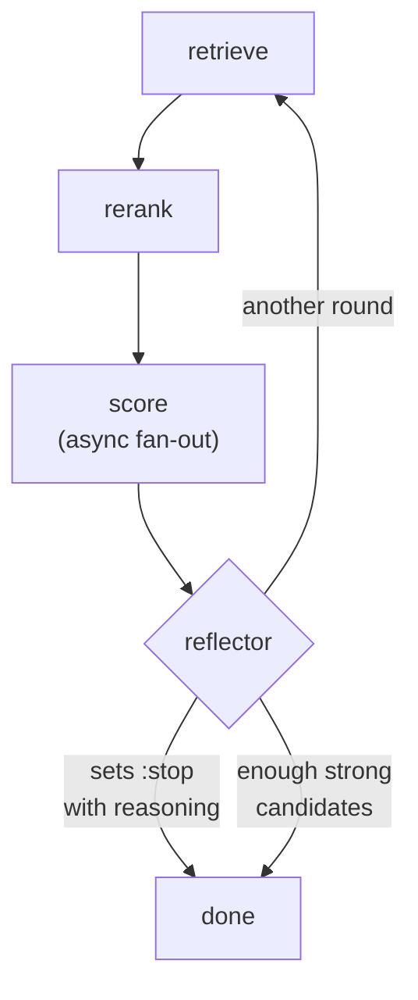

The multi-agent ecosystem wants to sell you an orchestration layer. Agent graphs, message buses, and somewhere a YAML file describing your "crew". We run a multi-agent LLM pipeline in Rails, in production, for a talent-matching product, and the entire framework underneath its eight agents is 37 lines of our own code on top of [RubyLLM](https://rubyllm.com/agents/): a 21-line base class and a 16-line loop.

The product matches candidates to open roles. One agent expands the search query, another reranks, a third scores each candidate against the role, and a reflector decides whether another round is worth running. Each of them is a plain Ruby class.

If you want the gem's chat and tool basics first, [our RubyLLM getting-started post](/blog/rubyllm-rails-getting-started/) covers them. This one stays a layer up: how the agents compose, and what broke when they did.

## The whole thing is 37 lines

RubyLLM ships an [`Agent` class](https://rubyllm.com/agents/): instructions, an optional schema, tools, and `ask`. Our base class adds exactly one idea to it - configuration the subclasses can override:

```ruby
class AgentBase < RubyLLM::Agent
  class_attribute :model_name, default: AgentConfig.default_model

  model { self.class.model_name }
  temperature 0.2
end
```

Twenty-one lines, in the real file.

The lazy block is the point: `model` accepts a block that resolves at call time, so pointing an agent at a different model is a class-attribute assignment that takes effect without reloading anything. Temperature gets no such block - the gem treats it as a static value, so subclasses that need a different one declare it directly.

Eight agents subclass it - a scorer, a reflector, a query expander, a scrubber, four more. Every one has the same shape: an instructions heredoc, a [Schematist](https://rubygems.org/gems/schematist) schema for structured output, and one public method that builds a prompt and returns `ask(prompt).content`. When a new step needs an agent, the diff is one small file.

Deploys don't trust the gem's live model list. A pinned registry in `config/ruby_llm/models.json`, loaded with `RubyLLM.models.load_from_json!`, means the models we reference exist on every boot, whether or not the registry upstream changed overnight. Dev and test run `qwen3:0.6b` on Ollama, a model small enough to answer in milliseconds on a laptop; production runs a large hosted model, and no agent code knows the difference.

Retries live in gem config too: `request_timeout 300`, `max_retries 10`, a 1.5x backoff. There is no hand-rolled retry loop anywhere in the eight agents, which is eight places a subtle retry bug can't live.

## Six bounded integers, summed in Ruby

Determinism matters most in the scorer, so it declares `temperature 0.0` while everything else stays at the 0.2 default. Its schema is the trick most worth stealing.

Ask a model for a 0-100 score and you get vibes. Bound six integer parts instead and you get something you can audit:

```ruby
class CandidateScorer < AgentBase
  temperature 0.0

  schema do
    integer :hard_skills_score, minimum: 0, maximum: 30
    integer :domain_score,      minimum: 0, maximum: 20
    # ...four more subscores, each with its own bounds
  end
end
```

The total never comes from the model. Ruby sums the parts with `.fetch`, so a missing key raises instead of quietly scoring a candidate on partial data, and the sum gets clamped to 0..100:

```ruby
SUBSCORE_KEYS.sum { |key| result.fetch(key) }.clamp(0, 100)
```

Models are unreliable at their own addition.

Give one both the subscores and the total to fill in, and sooner or later the parts won't add up to the number it wrote next to them. The schema bounds each part, and arithmetic stays in a language that has never hallucinated a sum.

Prompts fence user content the same defensive way. A resume goes into the prompt inside pseudo-XML tags - `<resume_markdown>...</resume_markdown>` - so instructions and data stay separable, and a resume containing "ignore previous instructions" reads as data to be scored, not orders to follow.

## A 16-line loop instead of an orchestrator

Coordinating all of this is a class called `Workflow`: 16 lines that would fit in a code review comment. It holds an array of step lambdas and reduces a context hash through them:

```ruby
class Workflow
  def initialize(steps)
    @steps = steps
  end

  def call(context)
    @steps.reduce(context) do |ctx, step|
      step.call(ctx, self)
    end
  end
end
```

Each step takes the context, does its work - retrieve, rerank, score - and returns the context with more in it. The outer loop runs that reduce up to `max_iterations` times:

```ruby
max_iterations.times do |n|
  context = workflow.call(context)
  break if context[:stop]
  break if enough_strong_candidates?(context)
end
```

Two exits, and only one is arithmetic. When enough candidates clear the score bar, the happy exit fires. The other belongs to the reflector: after each round it reads what the round produced and can set `context[:stop]` along with its reasoning, which we log as `"Stopping iterations at N: <reasoning>"`, so three weeks later you can read why the pipeline gave up on a hard role.



Seen-candidate IDs and already-used queries ride along in the context hash between rounds. Round two works down the list with fresh queries instead of re-scoring what round one already saw, which is the difference between iteration and an expensive infinite loop.

Retrieval itself is ordinary pgvector work; the how-to lives in [our RAG guide](/blog/building-rag-applications-rails-pgvector/).

## Fifteen fibers, ten connections

Most of the wall-clock goes to scoring, so it fans out: one async fiber per candidate, capped by a `score_limit` of 15, using the [async gem](https://github.com/socketry/async):

```ruby
Async do |task|
  candidates.first(score_limit).map { |candidate|
    task.async { scorer.score(candidate, role) }
  }.map(&:wait)
end
```

Fifteen multi-second LLM calls finish in roughly the time of the slowest one. Why fibers fit this shape of waiting is [its own post](/blog/fibers-async-ruby-llm-streaming-rails/); what belongs here is the morning they met our database pool.

On August 16, three minutes after a deploy, the shortlisting job started raising `ActiveRecord::ConnectionTimeoutError`. The deploy had wrapped the per-candidate scoring call in `ActiveRecord::Base.with_connection` as a defensive guard, and the wrapper had looked like harmless hygiene in review.

[`with_connection`](https://api.rubyonrails.org/classes/ActiveRecord/ConnectionAdapters/ConnectionPool.html) checks out a connection eagerly and holds it for the whole block - and our block was a multi-second LLM call that issues zero queries. Fifteen fibers each grabbed a connection from a pool of ten, or tried to. Five starved past the 5-second `checkout_timeout` and raised.

A 6-second non-DB call with a pool of ten gives `ok=10` and five timeouts when wrapped, `ok=15` and none unwrapped. Swap in a 1-second call and the bug vanishes, because every waiter gets served inside the checkout timeout - the block has to outlast the timeout to starve anyone, and a real scoring call does.

The fix deleted the wrapper and left the rule as a comment: a fiber that issues no query must hold no connection, and if a step ever needs the database mid-fan-out, wrap only that access. Under fiber concurrency, connection checkout is a per-block decision - thinking in whole requests is exactly what shipped the wrapper.

## The warts

One tool in the pipeline is clever, and its cleverness has a hole in it. A `RubyLLM::Tool` evaluates filter combinations for the search query; when the model picks skills that match nothing in the live vocabulary, `execute` returns the valid vocabulary in its result, and the model corrects itself on the next call instead of hallucinating filters that will never match.

The hole: the retry budget - "max 3 attempts" - lives as prose inside the prompt. Nothing enforces it.

The scorer's `.fetch` and `.clamp` are code-law: Ruby raises on a missing key and clamps the sum no matter what the model emits. The attempt cap is prompt-law, obeyed the way drivers obey a speed sign - if the model ignores it, no code notices.

Our messages table has token columns, every call logs its token counts into them, and no code has ever read them back - no cost dashboard, no alert, nothing. We are one bad prompt change away from discovering our spend on the invoice.

## When one agent is enough

Most products don't need eight agents.

A summarizer, a support-reply drafter, a RAG chat - each of those is one agent and maybe a loop, and adding more classes just adds more prompts to keep honest.

Reach for multiple agents when the steps need different settings from each other. Our scorer needs temperature 0.0 and bounded integers; the query expander needs room to be creative and returns a list of strings; one prompt can't hold both sets of rules.

And if what you want is a prebuilt vocabulary of chains, retrievers, and output parsers, [LangChain.rb exists](/blog/getting-started-langchain-ruby-complete-guide/) and is maintained. We went the other way because 37 lines we wrote is a smaller thing to debug than an abstraction stack we imported.

## Where to start

Start with one agent: a base class, one subclass, a Schematist schema with bounds on every number the model emits. Keep the arithmetic in Ruby from day one.

Add the loop when a second pass over the data is worth paying for. Before the first production deploy, pin the model registry and put retries in gem config so they exist in exactly one place. The 37 lines were the easy part; the work was deciding what the model never gets to do.

If you're composing LLM agents into a Rails product, our [app and web development team](/services/app-web-development/) has shipped this exact pipeline - outage and all.

Further reading:

- [RubyLLM agents guide](https://rubyllm.com/agents/) - instructions, schemas, and the `Agent` class
- [RubyLLM async guide](https://rubyllm.com/async/) - fiber-safe usage and rate limiting
- [ruby_llm on GitHub](https://github.com/crmne/ruby_llm) - source and changelog
- [async on GitHub](https://github.com/socketry/async) - the fiber concurrency gem underneath
- [Rails ConnectionPool docs](https://api.rubyonrails.org/classes/ActiveRecord/ConnectionAdapters/ConnectionPool.html) - `with_connection` semantics and `checkout_timeout`
- [Schematist](https://rubygems.org/gems/schematist) - the structured-output schema gem

<!-- Reference cadence: thoughtbot -->
