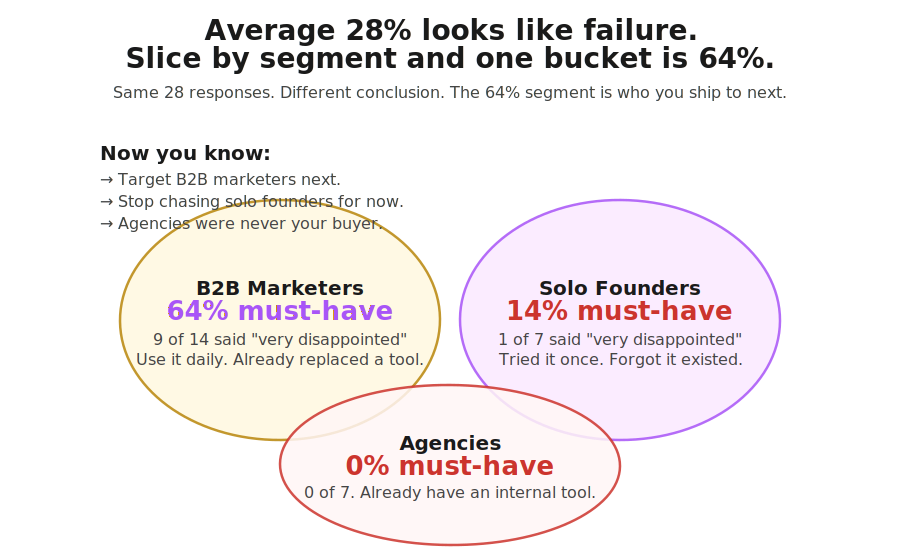
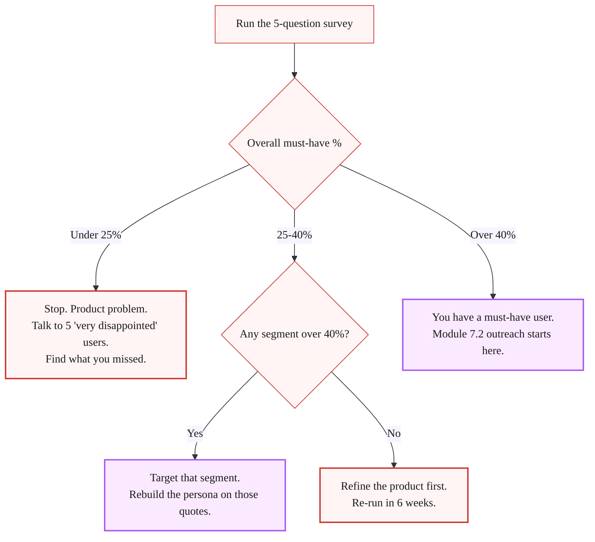

> **Module 7 · Step 1 of 4** · [Tech for Non-Technical Founders 2026](/blog/tech-for-non-technical-founders-2026/) course.
> Input: a live MVP and 10-30 users who touched it. Output: a written must-have-user persona with 3 verbatim quotes and one named segment to target.

Tuesday morning, 9:14 AM. A SaaS founder I spoke with last quarter opened her Meta Ads dashboard, saw a 0.4% conversion rate on $4,200 of spend, and refreshed it three times. Six weeks earlier she had taken her live MVP to forty users from a beta list, watched them poke around for two days, and decided the next move was "scale the top of funnel." She wrote the ad copy on a Friday, launched Monday, and by Wednesday the dashboard told her the same thing it would have told her if she had simply called five of those forty users: nobody opened the app twice. The $4,200 bought her a number she could have gotten for free.

Her instinct was the one every non-technical founder has after the MVP ships: build the audience. The real question is whether the people who already touched the MVP would notice if it vanished tomorrow. If less than 40% would be very disappointed, no amount of ad spend will turn that group into customers. Paid traffic will not fix a product problem; it just routes more users into something they will not return to.

## The 40% test, in one paragraph

Sean Ellis ran growth at Dropbox, LogMeIn, and Eventbrite. While he was building the playbook for those three, he kept noticing the same dividing line between products that ignited and products that needed life support. He surveyed every product's existing users with a single load-bearing question: "How would you feel if you could no longer use [product]?" The answer is one of four: very disappointed, somewhat disappointed, not disappointed, no longer use it. If at least 40% of users said "very disappointed," the product was almost always able to grow on outbound and word of mouth alone. Under 40%, growth stalled until the product changed. Ellis explained the cutoff and the survey wording on Lenny Rachitsky's podcast in 2023 ([transcript and replay here](https://www.lennysnewsletter.com/p/the-sean-ellis-test-for-product-market)).

The test is not a market-research instrument. It is a stop sign. Under 40% means the next thing on your calendar is not a Meta Ads brief. It is five user calls.


## Why you, the non-technical founder, get this wrong

The founder out of a dev-shop burn arrives at the MVP late, having spent $40K-$120K and six months getting there. The natural urge is to start collecting revenue numbers immediately - surveys feel like a delay, ads feel like progress. And because she cannot read the codebase, "the conversion rate is 0.4%" sounds like a UX problem (a thing a non-technical buyer can act on) instead of a product problem (a thing she cannot diagnose). Ad spend feels safer than going back into the build.

The Twitter threads make it worse. On day 90 of the MVP, every thread is some growth marketer explaining that the founder of a now-public company spent $4M on Meta in the first six months. The threads do not mention that the founder ran the 40% test in week one and got 56% on a sample of 22.

Across the 2026 dev-shop rescues we joined, the pattern repeats: founders who burned thousands on paid ads had a must-have rate they had never measured. Some were under 25% overall - genuine "no must-have user" territory. Others had a high rate in one segment and a low rate in another, but their ad spend targeted the wrong half because the high-need segment was harder to reach. Knowing the number before the ad spend is the difference between an expensive lesson and a cheap one.

## How to run the test, end to end

The whole process takes three hours of your time and 24-48 hours of waiting. The KISS path is a free Typeform or Tally form and a CSV export. No Rails webhook, no Postgres table, no engineer.

### Step 1 - Who you survey (1 hour of list work)

You need 30-100 responses from people who have used your product in the last two weeks. Pull the list from whatever you have:

- The MVP database (sign-up table). For a Lovable, Bubble, or Supabase build, export `users` as CSV.
- Your beta waitlist if it converted to active users.
- The trial list if you ran paid trials.

If you only have ten users, that is fine. Sean Ellis has written that even ten responses are directional. Ten of ten "very disappointed" is a louder signal than 40 of 100. You are not running a peer-reviewed study; you are looking for a dividing line.

Strip out two groups before you send:

- Anyone who signed up and never logged in twice. They never used the product, so the question is unanswerable.
- Friends and family who you onboarded as moral support. They will all say very disappointed and tell you nothing.

What is left is your sample. Annotate each row with the user's job title and company size before you send, so the CSV export later can be sliced by segment in one filter.

### Step 2 - The 5 questions, verbatim

Open Typeform or Tally. Five questions, in this order. Wording matters - changing a word changes the answer.

> **Q1.** How would you feel if you could no longer use [product]?
> *(Multiple choice: Very disappointed / Somewhat disappointed / Not disappointed / No longer use [product])*

> **Q2.** What type of person do you think would most benefit from [product]?
> *(Short text - 1 sentence. Reveals who the must-have segment thinks the target is.)*

> **Q3.** What is the main benefit you get from [product]?
> *(Short text - 1 sentence. The verbatim language for your next ad copy if you do run paid later.)*

> **Q4.** How have you tried to solve this problem before? What did you switch from?
> *(Short text - 2 sentences. Tells you the competitive set the user actually compares against.)*

> **Q5.** What is your job title and company size?
> *(Two short text fields. Drives the segment slice in step 4.)*

That is the survey. Do not add a sixth question. Do not change Q1 to "How disappointed would you be" - the original wording forces the user to pick a side. Founders who tinker with the question consistently report softer numbers because they introduced a hedge.

### Step 3 - Send it (5 minutes)

Email subject line that works in 2026: *"Quick 90-second question about [product]"*. Body, three lines:

> Hi [first name], building [product] and trying to figure out who really uses it. Would you spend 90 seconds on this? [link]
>
> No pitch. No follow-up. I read every response by hand.
>
> Thanks, [your name]

Send Tuesday morning, 9 AM local time to your largest user cluster. Re-send Thursday morning to anyone who has not opened. You will hit a 30-50% response rate on a list under 100, which is enough.

### Step 4 - Score it (30 minutes)

Export the CSV. Pivot on Q1 by segment from Q5. You are computing one number per segment:

```
must_have_pct = ("Very disappointed" count) / (total responses excluding "No longer use it")
```

The "no longer use it" answers come out of the denominator. They are churned users, not should-be-paying users.

Pull three numbers:

1. **Overall must-have %.** The headline figure.
2. **Per-segment must-have %.** Slice by job title and by company size. One segment will almost always be higher than the average. That is your must-have segment.
3. **Three verbatim Q2-Q3 quotes from your must-have segment.** Paste them into a Google Doc. Those quotes are your persona description, your ad copy, and your cold-email subject line for the next chapter.



### Step 5 - The decision tree



### Step 6 - The re-run schedule

The 40% number is not a one-time pass. Every product evolves, every segment matures, and the number drifts. Re-run the survey every 6 weeks while the must-have rate is climbing. Once it holds steady above 40% for two consecutive runs, you can stop running it monthly and shift to running it after every major release.

Under 40% on a re-run after you shipped changes means the changes did not move the line. Read the verbatim Q2-Q4 answers for the "somewhat disappointed" bucket - that is where the diagnostic is.

## What "under 40%" actually means

You do not have a marketing problem. You have one of three product problems, in order of frequency:

1. **You built for the wrong segment.** The product works, but the people you onboarded do not have the pain. Your Q5 slice will show this: one segment is at 55%, the rest are at 5%. You shipped a B2B-marketer tool to a solo-founder audience. The fix is to stop selling to the audience and start selling to the segment. Module 7.2 walks the personal-network outreach to the new segment.

2. **You built the right thing for the right people, but the product does not actually do the thing yet.** This is the most painful version. The Q3 verbatims will tell you - the "main benefit" answers will be hedged ("it is nice to have," "I would use it if it had X"). The fix is to go back into the build and finish the thing. Schedule a [Friday demo](/blog/friday-demo-rule-founder-progress/) with the next release.

3. **The pain is real, but your product is not the relief.** The Q4 verbatims will tell you - the "what did you switch from" answers will name a workaround that is already 80% of the job (a spreadsheet, an existing tool, a person they pay). The fix is harder: either niche into the 20% of the job the workaround does not cover, or pivot. The validated-problem statement from [Module 3.2](/blog/mom-test-ask-about-past-not-future/#synthesis-write-down-what-you-heard-decide-whats-next) is the right re-entry point.

## When founders should skip the test

Two cases.

**Under 10 users.** The sample is too small. The fix is not to run the test on 8 people. It is to go run [Module 3.1 outreach](/blog/find-10-people-with-problem-outreach-2026/) and book 10 more user calls this week. Once you have 10-30 users who actually touched the MVP, the test works.

**Pre-launch.** The test asks "if you could no longer use the product." If the user has never used it, the answer is meaningless. Pre-launch validation is the [Mom Test interview script](/blog/mom-test-interview-script/), not the 40% test.

## What to do this week

Monday morning, 9 AM:

1. Export your users CSV. Strip the friends-and-family and the never-returned users.
2. Open Typeform or Tally. Type the five questions verbatim.
3. Send the email to the list. Re-send Thursday.

Friday morning, 9 AM:

4. Export the responses CSV. Compute overall must-have % and per-segment must-have %.
5. Paste three Q2-Q3 verbatims from your top segment into a Google Doc.
6. If you are above 40% in any segment, move to [Module 7.2 - personal-network outreach](/blog/first-ten-customers-personal-network/). If you are below 40% across all segments, re-read [Module 3.2 Mom Test](/blog/mom-test-ask-about-past-not-future/) and book five "very disappointed" user calls for next week.

The full survey template (the 5 questions in a Typeform-import-ready format, the per-segment scoring spreadsheet, and the persona-writeup template) ships in [the First-Paying-Customer Operating Kit](/blog/first-paying-customer-operating-kit/).

## Advanced (optional sidebar)

Founders who have run the 40% test once and want to layer on more rigor can read Sean Ellis's original write-up in [*Hacking Growth*](https://hackinggrowth.org/) and the [Superhuman PMF Engine framework](https://review.firstround.com/how-superhuman-built-an-engine-to-find-product-market-fit/), which combines the 40% test with a structured segment-isolation workflow Rahul Vohra built to rescue Superhuman's launch. The main path above is enough to make the Module 7 decision. The advanced version is a project for after your first paid pilot ships.

## Further reading

- Lenny Rachitsky, [The Sean Ellis test for product/market fit](https://www.lennysnewsletter.com/p/the-sean-ellis-test-for-product-market) - the original 40% framing, with Sean's own commentary on what the number means and does not mean.
- Sean Ellis and Morgan Brown, [*Hacking Growth*](https://hackinggrowth.org/) - the book that explains the survey-driven north-star approach Ellis built at Dropbox, LogMeIn, and Eventbrite.
- Lenny Rachitsky, [How to win your first 10 B2B customers](https://www.lennysnewsletter.com/p/how-to-win-your-first-10-b2b-customers) - companion piece that maps the must-have-user concept to the first-ten-customer playbook.
- Steve Blank, [The Customer Development Manifesto](https://steveblank.com/2010/01/25/the-customer-development-manifesto-reasons-for-the-revolution-part-1/) - the foundational framing for "get out of the building and validate before building." The Sean Ellis test is the post-build analog.
- Rahul Vohra, [How Superhuman built an engine to find product-market fit](https://review.firstround.com/how-superhuman-built-an-engine-to-find-product-market-fit/) - the segment-isolation playbook layered on top of the 40% test.
- Rob Fitzpatrick, [*The Mom Test*](https://www.momtestbook.com/) - the pre-launch validation companion. Once your 40% test is above the line, the Mom Test questions are the ones you ask the 10 must-have users on their next call.
