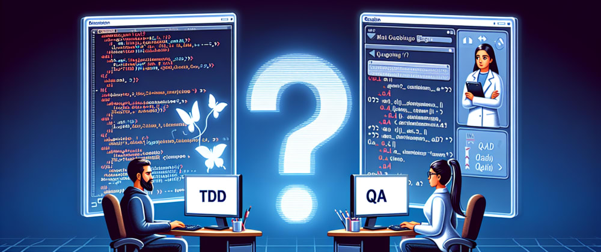

[Test-driven development](https://jtway.co/why-and-how-to-use-tdd-main-tips-976b3a6edebb) (TDD) is a cornerstone of agile methodology. It involves creating unit tests before writing the code to ensure functionality and efficiency[[1]](https://www.nan-labs.com/blog/Test-driven-development-agile/). This practice optimizes the development process and seamlessly integrates with agile techniques such as Scrum, extreme programming, and agile testing, making it a critical component in achieving built-in quality.

While TDD offers numerous advantages, including increased code coverage and fostering a refactor culture, it raises an intriguing question: Can it replace traditional quality assurance (QA) roles in software development [[1]](https://www.nan-labs.com/blog/Test-driven-development-agile/)? This article delves into the synergy between TDD and QA, exploring how they complement each other in enhancing software quality and facilitating effective collaboration within agile teams [[1]](https://www.nan-labs.com/blog/Test-driven-development-agile/).

## Understanding TDD

Test-Driven Development (TDD) is a disciplined approach to software development that integrates coding, testing (through unit tests), and design (via refactoring). The process is iterative, beginning with creating precise unit tests for functionality before any code is written. This methodology comprises three main phases:

 1. **Create Precise Tests**: Developers craft specific unit tests to verify the functionality of particular features, ensuring the code meets requirements and functions as intended [[8]](https://www.browserstack.com/guide/what-is-test-driven-development).

 2. **Correcting the Code**: If a test fails, minimal changes are made to the code until it successfully passes upon re-execution [[8]](https://www.browserstack.com/guide/what-is-test-driven-development).

 3. **Refactor the Code**: Post successful test execution, the code is examined for redundancy and optimized for performance, enhancing code quality and reliability [[8]](https://www.browserstack.com/guide/what-is-test-driven-development).

TDD's iterative nature fosters an environment where code is continuously tested, ensuring high quality and reducing the likelihood of bugs. It encourages developers to write more straightforward, readable code, reducing unintended side effects of changes [[3]](https://agilepainrelief.com/blog/test-driven-development-is-not-a-quality-assurance-technique.html). However, it's crucial to note that while TDD ensures the code functions as intended, it does not guarantee that it solves the specific business problem [[3]](https://agilepainrelief.com/blog/test-driven-development-is-not-a-quality-assurance-technique.html).

TDD can be scaled from unit testing to acceptance testing and BDD-style scenarios, demonstrating its flexibility and compatibility with Agile principles. This adaptability allows for applying Agile methodologies to TDD on a granular level, promoting a more efficient and reliable approach to software development [[5]](https://stackoverflow.com/questions/3138194/is-agile-different-from-tdd-if-so-what-are-the-main-differences).

## The Role of QA in Software Development

In the agile software development landscape, the role of Quality Assurance (QA) is multifaceted, ensuring the delivery of high-quality products through collaboration and expertise. Here's how QA integrates within a Test-Driven Development (TDD) environment:

* **Collaborative Efforts for Quality**: QA professionals work closely with developers from the start, defining test cases and ensuring the application meets both technical specifications and business requirements. This partnership is crucial for embedding quality into the codebase and fostering a culture of continuous improvement [[15]](https://firminiq.com/test-driven-development-tdd-and-its-impact-on-quality-assurance-qa/)[[18]](https://rubygarage.org/blog/quality-assurance-teams-in-agile)[[19]](https://www.quora.com/What-is-the-role-of-a-quality-assurance-engineer-in-Agile-Scrum).

* **Enhanced Testing Strategies**: QA's involvement in Agile projects goes beyond traditional testing. They engage in Acceptance Test-Driven Development (ATDD), where test cases are created upfront in collaboration with developers. This approach not only clarifies requirements but also ensures that all functionalities are tested against the business objectives they aim to achieve [[2]](https://www.xoriant.com/blog/extended-role-of-qa-in-test-driven-development-tdd)[[16]](https://www.linkedin.com/pulse/role-qa-strategy-agile-methodology-qa-touch)[[19]](https://www.quora.com/What-is-the-role-of-a-quality-assurance-engineer-in-Agile-Scrum).

* **Prevention and Detection**: QA's role is pivotal in preventing and identifying defects early in the development cycle. By participating in every stage of development, QA teams contribute to a faster feedback loop, enabling developers to make necessary adjustments promptly. This proactive involvement helps maintain the application's stability, reducing overall testing efforts and ensuring that the final product aligns with the client's needs [[16]](https://www.linkedin.com/pulse/role-qa-strategy-agile-methodology-qa-touch)[[18]](https://rubygarage.org/blog/quality-assurance-teams-in-agile)[[19]](https://www.quora.com/What-is-the-role-of-a-quality-assurance-engineer-in-Agile-Scrum)[[20]](https://sqa.stackexchange.com/questions/8057/role-of-quality-assurance-not-testing-in-agile).

QA's integration into the TDD process underscores the importance of a collaborative approach to software development, where quality is built into the product from the beginning.

## Comparing TDD and QA

When comparing Test Driven Development (TDD) and Quality Assurance (QA), it's essential to understand their distinct roles within the software development lifecycle. TDD is a coding practice emphasizing test-first development, where tests are written before the code. This approach ensures that the codebase is continuously tested, leading to higher code quality and reliability [[3]](https://agilepainrelief.com/blog/test-driven-development-is-not-a-quality-assurance-technique.html). On the other hand, QA focuses on the broader aspect of software quality, encompassing testing and practices aimed at improving the development process and ensuring that the final product meets the user's needs [[3]](https://agilepainrelief.com/blog/test-driven-development-is-not-a-quality-assurance-technique.html).

* **Purpose and Approach**:
*TDD:* Aims to ensure code functionality and reliability through continuous testing [[3]](https://agilepainrelief.com/blog/test-driven-development-is-not-a-quality-assurance-technique.html).
*QA: *Focuses on the overall quality of the software, including usability, performance, and compliance with requirements [[3]](https://agilepainrelief.com/blog/test-driven-development-is-not-a-quality-assurance-technique.html).

* **Collaboration and Tools**: TDD and QA can benefit from behavior-driven development (BDD), which fosters a common understanding among team members and encourages simpler, defect-free code through automated tests. However, BDD still needs to eliminate manual testing, underscoring the complementary nature of TDD and QA [[3]](https://agilepainrelief.com/blog/test-driven-development-is-not-a-quality-assurance-technique.html).

* [**Agile](https://jtway.co/tagged/agile) Integration**:
While TDD and Agile share similarities, such as the emphasis on flexibility and continuous improvement, Agile encompasses a broader scope, including project management and team collaboration. TDD, focusing on the technical aspects of coding and testing, fits within the Agile framework, enhancing the development process with its rigorous testing discipline [[5]](https://stackoverflow.com/questions/3138194/is-agile-different-from-tdd-if-so-what-are-the-main-differences).

In conclusion, TDD and QA serve different but complementary purposes in pursuing high-quality software development. Understanding and leveraging both approaches can lead to more efficient, reliable, and user-centric software projects [[3]](https://agilepainrelief.com/blog/test-driven-development-is-not-a-quality-assurance-technique.html)[[5]](https://stackoverflow.com/questions/3138194/is-agile-different-from-tdd-if-so-what-are-the-main-differences).

## Conclusion

Through exploring test-driven development (TDD) and quality assurance (QA) within agile methodologies, it becomes evident that both elements serve distinct yet integrative roles in fostering a high-quality [software development lifecycle](https://jtway.co/mock-everything-is-a-good-way-to-sink-b8a1284fb81f). TDD, with its emphasis on creating and refining code through iterative testing, complements the broader objectives of QA, which seeks to ensure that the final product meets technical specifications and aligns with user needs and business objectives. This synergy enhances the overall functionality, reliability, and user-centricity of software projects, illustrating the complementary nature of TDD and QA in pursuing excellence in software development.

Furthermore, integrating practices like Behavior-Driven Development (BDD) underscores the collaborative essence of agile methodologies, bringing together developers, QA professionals, and stakeholders to achieve common goals. As the software development landscape evolves, adopting a holistic approach that includes TDD and QA becomes imperative for teams striving for quality and efficiency. Please check out the [JTWay blog](https://jtway.com) for further insights into agile practices and the dynamic interplay between TDD and QA. This comprehensive understanding facilitates more resilient and adaptable software solutions and enhances the value delivered to clients and end-users alike.

## FAQs

**What is the function of Quality Assurance (QA) within Test-Driven Development (TDD)?**
In a Test-Driven Development environment, QA plays a crucial role by applying their comprehensive expertise in end-to-end testing to understand the system as a whole. The QA team should work alongside developers to integrate unit testing seamlessly into the application's core.

**What are some potential drawbacks of implementing TDD?**
Test-driven development (TDD) can have several disadvantages, such as the need for additional maintenance of test suites and possible dissatisfaction among developers if poorly written tests hinder the development process. TDD starts with writing software tests based on the client's requirements.

**Can you list the advantages of adopting Test-Driven Development?**
The advantages of Test-Driven Development include enhanced code quality, clear and useful documentation, the ability to confidently refactor code, quicker debugging, modular development, improved software design, increased stakeholder confidence, better team collaboration, predictability in development, regression prevention, simplified onboarding for new team members, and cost savings over the long term.

**Is there an alternative approach to Test-Driven Development?**
Behavior-Driven Development (BDD) serves as an alternative to Test-Driven Development. BDD is a development methodology based on agile principles that focuses on creating tests reflecting the expected behavior of an application, as per user expectations. Unlike TDD, which centers around passing tests, BDD emphasizes fulfilling business needs and user requirements.

## References

[1] — [https://www.nan-labs.com/blog/Test-driven-development-agile/](https://www.nan-labs.com/blog/Test-driven-development-agile/)
[2] — [https://www.xoriant.com/blog/extended-role-of-qa-in-test-driven-development-tdd](https://www.xoriant.com/blog/extended-role-of-qa-in-test-driven-development-tdd)
[3] — [https://agilepainrelief.com/blog/test-driven-development-is-not-a-quality-assurance-technique.html](https://agilepainrelief.com/blog/test-driven-development-is-not-a-quality-assurance-technique.html)
[4] — [https://www.linkedin.com/pulse/understanding-differences-between-bdd-tdd-qa-hasan-akdogan-g04ff?trk=article-ssr-frontend-pulse_more-articles_related-content-card](https://www.linkedin.com/pulse/understanding-differences-between-bdd-tdd-qa-hasan-akdogan-g04ff?trk=article-ssr-frontend-pulse_more-articles_related-content-card)
[5] — [https://stackoverflow.com/questions/3138194/is-agile-different-from-tdd-if-so-what-are-the-main-differences](https://stackoverflow.com/questions/3138194/is-agile-different-from-tdd-if-so-what-are-the-main-differences)
[6] — [https://extremeuncertainty.com/test-driven-development-vs-agile/](https://extremeuncertainty.com/test-driven-development-vs-agile/)
[7] — [https://www.axelerant.com/blog/what-makes-agile-qa-testing-different](https://www.axelerant.com/blog/what-makes-agile-qa-testing-different)
[8] — [https://www.browserstack.com/guide/what-is-test-driven-development](https://www.browserstack.com/guide/what-is-test-driven-development)
[9] — [https://www.agilealliance.org/glossary/tdd/](https://www.agilealliance.org/glossary/tdd/)
[10] — [https://scaledagileframework.com/test-driven-development/](https://scaledagileframework.com/test-driven-development/)
[11] — [https://www.spiceworks.com/tech/devops/articles/what-is-tdd/](https://www.spiceworks.com/tech/devops/articles/what-is-tdd/)
[12] — [https://www.linkedin.com/pulse/test-driven-development-tdd-agile-comprehensive-guide-mehbub-rabbani](https://www.linkedin.com/pulse/test-driven-development-tdd-agile-comprehensive-guide-mehbub-rabbani)
[13] — [https://www.guru99.com/test-driven-development.html](https://www.guru99.com/test-driven-development.html)
[14] — [https://www.geeksforgeeks.org/test-driven-development-tdd/](https://www.geeksforgeeks.org/test-driven-development-tdd/)
[15] — [https://firminiq.com/test-driven-development-tdd-and-its-impact-on-quality-assurance-qa/](https://firminiq.com/test-driven-development-tdd-and-its-impact-on-quality-assurance-qa/)
[16] — [https://www.linkedin.com/pulse/role-qa-strategy-agile-methodology-qa-touch](https://www.linkedin.com/pulse/role-qa-strategy-agile-methodology-qa-touch)
[17] — [https://www.accelq.com/blog/quality-assurance-in-agile-methodology/](https://www.accelq.com/blog/quality-assurance-in-agile-methodology/)
[18] — [https://rubygarage.org/blog/quality-assurance-teams-in-agile](https://rubygarage.org/blog/quality-assurance-teams-in-agile)
[19] — [https://www.quora.com/What-is-the-role-of-a-quality-assurance-engineer-in-Agile-Scrum](https://www.quora.com/What-is-the-role-of-a-quality-assurance-engineer-in-Agile-Scrum)
[20] — [https://sqa.stackexchange.com/questions/8057/role-of-quality-assurance-not-testing-in-agile](https://sqa.stackexchange.com/questions/8057/role-of-quality-assurance-not-testing-in-agile)
[21] — [https://drpicox.medium.com/qa-unit-tests-vs-agile-unit-tests-f437fbd3bc2c](https://drpicox.medium.com/qa-unit-tests-vs-agile-unit-tests-f437fbd3bc2c)
