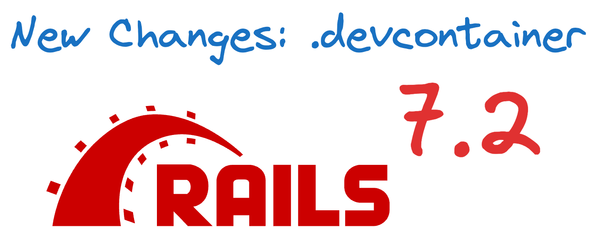

Exciting news from Rails! The latest Rails 7.2 has a new feature. When you create a new app, it now generates a `.devcontainer` folder.

What's in the `.devcontainer`?
----------------------------

This folder has everything. It helps you start and work on your app. It's made for remote containers. Here's what's inside:

1.  **Redis container**: For Kredis and ActionCable.
2.  **Database**: You can choose SQLite, Postgres, MySQL, or MariaDB.
3.  **Headless Chrome container**: For system tests.
4.  **Active Storage**: Uses local disk and preview features.

Why is this cool?
-----------------

This feature is a time-saver, making the setup process a breeze. You get all you need in one go, which is great for development. Everything is ready to use - no more manual setup.

Skipping parts
--------------

Don't need some of these? No problem! With the `--skip-devcontainer` option, you have the power to skip what you don't need. You choose what's best for your app, putting you in control of your development process.

Who benefits?
-------------

Whether you're new to Rails or a seasoned developer, this feature is designed to make your life easier. If you're new, it will help you start faster. If you're experienced, it will save you time. It's all about making your life easier, no matter your level of expertise.

Real-world use
--------------

Imagine you're building a new app. You don't want to set up each part. Rails 7.2 does it for you. You get Redis, a database, Chrome, and storage ready. Start coding right away. Focus on what matters. Less setup, more development.

Simple yet powerful
-------------------

Rails 7.2 keeps it simple. Yet, it's powerful. This feature shows that. It's designed to make work easier. Whether you're a newbie or a pro, this helps.

### How to use it

Create a new Rails app. Rails adds the .devcontainer. Need to skip it? Just add `--skip-devcontainer`. You're in control.

In summary
----------

Rails 7.2 brings a handy feature. The .devcontainer folder has all you need. It's easy to set up and ready to go. Skip what you don't need. It's simple, fast, and powerful - perfect for all developers.

This update is exciting. It's a small change, but it makes a significant impact. Enjoy coding with Rails 7.2!

Happy coding!