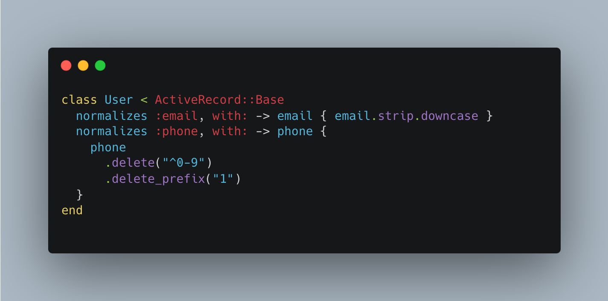

The new version of Ruby on Rails 7.1 has many new features, some of which make writing your own authorization system easier. Let’s take a closer look at these helpers: `normalizes`, `generates_token_for` and `authenticate_by`.

## normalizes
The `normalizes` method in Ruby on Rails 7.1 is added to simplify the process of normalizing attribute values of a model. This method allows you to specify a list of attributes that need to be normalized before saving them to the database.

Example usage of the normalizes method:
```ruby
class User < ApplicationRecord
  normalizes :email, with: -> email { email.strip.downcase }
  normalizes :phone, with: -> email { phone_number.gsub(/\D/, '') }
end
```
In the example above, when saving an instance of the User class, the values of the email and phone_number attributes will be automatically normalized, i.e., brought to a specific format.

Previously, before the introduction of the normalizes method, you had to use before_save or before_validation callbacks to normalize attribute values:
```ruby
class User < ApplicationRecord
  before_save :normalize_values
  def normalize_values
    self.email = email.downcase.strip
    self.phone_number = phone_number.gsub(/\D/, '')
  end
end
```

## generates_token_for
The `generates_token_for` method in Ruby on Rails 7.1 is added to automatically generate unique tokens for a specified attribute of a model. Tokens are commonly used to create unique identifiers or secret keys.

Example usage of the `generates_token_for` method:
```ruby
class User < ApplicationRecord
  generates_token_for :auth_token
end
```
In the example above, when creating a new instance of the User class, a unique token will be automatically generated for the auth_token attribute.

Previously, before the introduction of the generates_token_for method, you had to use before_create callbacks to generate unique tokens:
```ruby
class User < ApplicationRecord
  before_create :generate_auth_token
  def generate_auth_token
    self.auth_token = SecureRandom.urlsafe_base64
  end
end
```

## authenticate_by
The authenticate_by method in Ruby on Rails 7.1 is added to simplify the authentication process for users. This method allows you to specify the attribute to authenticate_by and automatically creates the necessary methods for checking the correctness of the entered password.

Example usage of the authenticate_by method:
```ruby
@user = User.authenticate_by(username: "...", password: "...")
```
In the example above, when calling the authenticate method on an instance of the User class, it will perform the authentication check by comparing the entered password with the value of the password attribute.

Previously, before the introduction of the authenticate_by method, you had to implement this logic manually:
```ruby
@user = User.find_by(email: params[:email])
@user.authenticate(params[:password]) if @user.present?
```
These are just a few changes and new methods introduced in Ruby on Rails 7.1. It is recommended to refer to the documentation for more detailed information.

