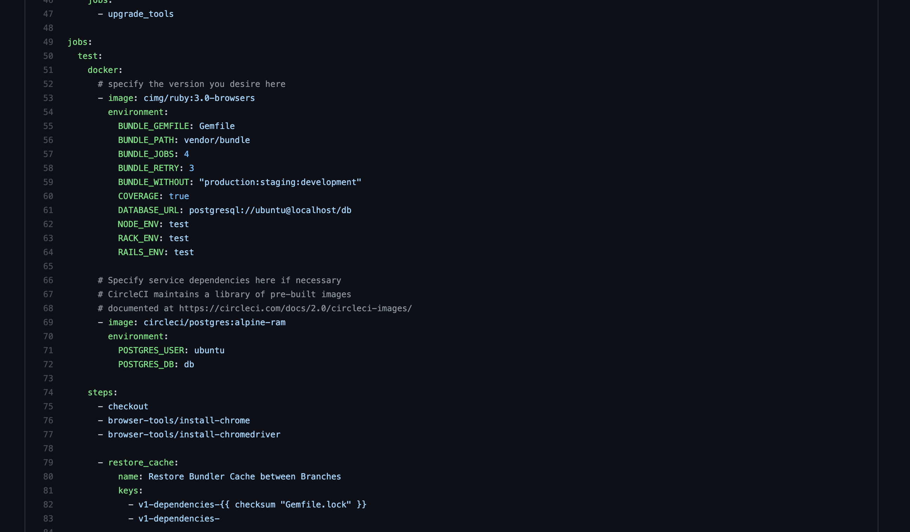

What solution should you apply to get the first results in a short time in the legacy project? What to do when it’s hard to change a project and you cannot inject dependencies? How to get some confidence in a reasonable time?

We will work not only with the legacy but with the team that loses belief in the tests. *Cultivating habits starts from the small wins.* And how to get one in such a complex environment.

We will cover the steps that you can use today. No investment, no requirements. Inspire other developers.

### Post Outline:

* What should we expect in a Legacy code base?

* Solution Highoverview

* Onboarding it

## What should we expect in a Legacy code base?

Legacy projects as usual projects which are hard to change.

Here are the most common problems which characterized legacy, which we need to take into account to design the simplest onboard solution.

 1. It’s hard to set up development/test/production environments for developers.

 2. Slow loading of the application and environments prevents developers run tests often.

 3. Developers are not confident with new changes. There is a big risk that new changes will introduce a new bug or break data. We should avoid big or complex refactorings of the business logic while integrating tests.

 4. Application logic is tightly coupled with different parts.
>  Schedule regular review those points to track intiative performance.

## Solution Highoverview

 1. Reproduce Test Environment

 2. Start from E2E tests

 3. Avoid E2E pitfalls

 4. What to test and how to get small wins?
>  E2E tests are cheap and cheerful!

## Reproduce Test Environment

Before making the test environment consistent, let’s think about where we are going to run them. Based on our legacy project context, loading the test environment will take so much time that developers will try to avoid it.

So you should set up a fast test environment for *CI/CD* first, and only after that think about how developers can have the same on the local machine.

Most *CI/CD* allows testing pipelines from the local machine, which will reduce the scope of work.
>  Select any cloud CI/CD with a feature to run pipeline on local machine

Today *CI/CD* uses containerization similar to *Docker Compose*, where you can define the test environment and all related services required for running it.
>  On CI/CD provide build and run tests

## Start from E2E tests

Tight coupling of the components and limited knowledge of the whole business logic prevents us to use any *Unit* testing frameworks without much investment in the refactoring.

The best tool which could be set up as a separate service is *E2E*. We do not need to inject in the middle of the request process. So you will add tests without changing business logic.
>  No 100% coverage goal. We will add minimum E2E tests to buy us some confidence for integrating Unit tests.

PROs:

* Simplify adding tests to tightly coupled systems

* More test coverage for fewer test examples

CONs:

* Slowness

* Flakiness (Randomly/unpredictably Failing)

*We have to learn how to avoid CONs of the E2E tests.*

## Avoid E2E pitfalls

### Slowness

*E2E* tests are much slower than *Unit* tests. But we do not need them much, so this is will be in a reasonable time, until we will be able to replace them with *Unit* tests.

A small number of tests and vertical scalling will reduce the slowness impact.

### Flakiness

This is Problem Number One in the Test World. And *E2E* tests have much more points to fail.

Most of the flakiness is related to the ability to have unexpected data while running tests, which is caused by concurrent and async updates pages or data.

Avoid testing tooltips, modals, date pickers, triggering animations, counters, slow pages/actions, or with a lot of parallel requests, etc.

## What to test and how to get small wins?

Schedule first common user journeys & new bugs

80% of all customers use only 20% of the features, so we need to prioritize them first.

Other the most common solution to onboard tests, is to cover part or whole scenarios from the bug reports. Start by adding tests to find the simplest bug, but allow to not cover the whole path, based on the tips below.

### 1. Test static data

 1. Start by checking links are working and pages are loaded correctly.

 2. Pages have correct content per fixture loaded in the tests.

Dumb browsing over the application will trigger a lot of logic.

### 2. Allow simulating of basic User interactions

 1. Start from Adding / Updating / Deleting behaviours

 2. Find the actions which can be easily verified on the page without async updates

Train your system to do simple actions like form filling and submitting.

### 3. Other tips

* Consistent starting point. Each test example should start from the same state (fixtures).

* *Use predefined fixtures loaded directly into the database.* Avoid setting context by simulating the whole user journey to come up with it.

* Explicit test input and output will help the next developers to learn the context.

* Check more from [Tips for writing readable system tests in Rails](https://jtway.co/best-tips-for-writing-integration-tests-in-rails-d1f56081f249?source=friends_link&sk=c616b62faabd053cc56fdaffb5f2c832).

Do not forget to have deterministic tests first

## Go, get’em!

Avoid any hacks and tricks. You will get the first results from the first commit!

Invest in the small wins, and you will find yourselves in a satisfied and stressless environment.

**Paul Keen** is an Open Source Contributor and a Chief Technology Officer at [JetThoughts](https://www.jetthoughts.com). Follow him on [LinkedIn](https://www.linkedin.com/in/paul-keen/) or [GitHub](https://github.com/pftg).
>  *If you enjoyed this story, we recommend reading our[ latest tech stories](https://jtway.co/latest) and trending [tech stories](https://jtway.co/trending).*
