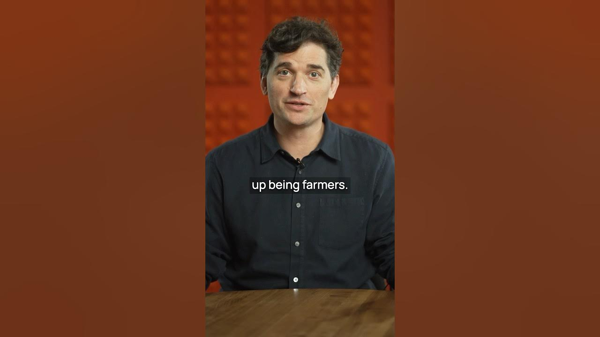

In a world where technology is changing fast, the job landscape is shifting too. Historically, when big tech changes happened, people found themselves in new roles. Often, these new jobs had better conditions and were more beneficial to society. This initiative aims to fund startups that can create a million jobs that only humans can do, without relying on AI.

### Key Takeaways

*   Technological changes lead to new job opportunities.
*   New careers often improve working conditions.
*   The goal is to create one million human-centric jobs.
*   Startups should focus on roles that AI cannot fulfill.

### The Shift in Job Roles

In the past, most people were farmers. Then, machines came along and changed everything. Fewer people needed to farm, and new jobs popped up. These jobs often had better conditions and were more meaningful. This pattern shows that change can be good.

### The Vision for the Future

The goal here is clear: **fund startups** that can create jobs for a million people. But there’s a twist. These jobs should be ones that need a human touch. No AI can do them. This means we’re looking for roles that require creativity, empathy, and personal interaction.

### What Kind of Jobs Are We Talking About?

Think about it. What jobs can only humans do? Here are some ideas:

1.  **Local Services**: Think of jobs that help communities, like local repair services or personal trainers.
2.  **Creative Roles**: Artists, writers, and musicians create things that machines can’t replicate.
3.  **Healthcare**: Nurses and caregivers provide care that requires human connection.
4.  **Education**: Teachers inspire and guide students in ways that AI can’t.
5.  **Entrepreneurial Ventures**: Startups that help people run their own businesses.

### Why This Matters

Many experts in AI are unsure about what the future holds for jobs. They can’t predict what roles will be available. This initiative wants to change that. By funding startups, we can create a roadmap for the future of work. It’s about finding solutions that benefit everyone.

### How to Get Involved

If you’re a founder with a great idea, this is your chance. The application for Y Combinator Winter 2025 is open. This is a platform that can help you turn your vision into reality. You could be part of a movement that shapes the future of work.

### Conclusion

The future of work is bright, but it needs human input. By focusing on jobs that require a human touch, we can create a better world. Let’s embrace this change and build a future where everyone can thrive. If you have an idea that fits this vision, don’t hesitate to apply. Together, we can make a difference!