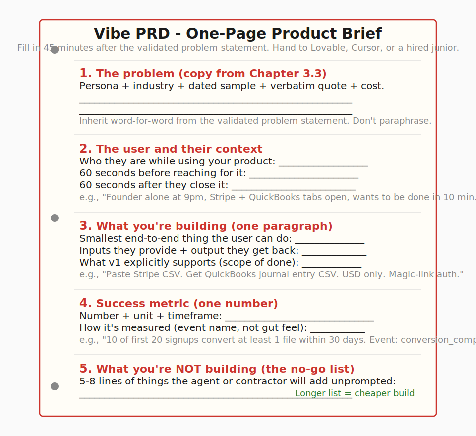
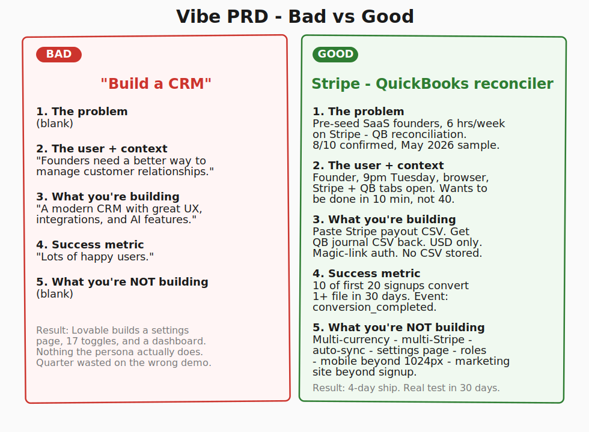
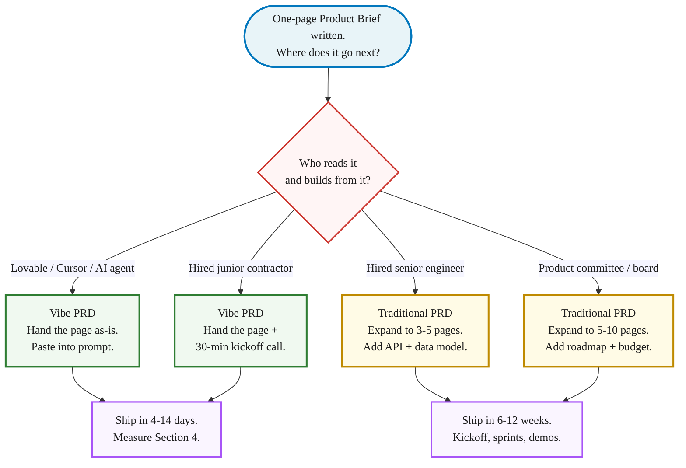

> **Module 4 · Step 1 of 2** · [Tech for Non-Technical Founders 2026](/blog/tech-for-non-technical-founders-2026/) course.
> Input: a one-page validated problem statement (from [Chapter 3.3](/blog/mom-test-ask-about-past-not-future/#synthesis-write-down-what-you-heard-decide-whats-next)). Output: a one-page Product Brief (Vibe PRD) you can hand to Lovable or a hired team.

*Founder anecdotes in this chapter use anonymized names; dollar amounts, timeframes, and technical specifics are exact.*

Drew Falkman charges $1,000 for a 4-week Maven cohort that teaches non-technical founders one core artifact - a "Vibe PRD" you hand to Lovable, Cursor, or a hired junior so the build matches the problem. The cohort is excellent. The single most useful thing inside it is a one-page template you could fill in tonight. The reason most founders pay $1,000 is they have never seen the page. Here it is, for free, with the same five sections.

## Why this matters in 2026

A traditional PRD assumes a product manager will hand it to a 6-person engineering team, all of whom will read it, ask questions in a kickoff, and translate it across two weeks of refinement. A Vibe PRD assumes an AI agent or a hired junior contractor will read it once and start building Tuesday morning. The audience changed; the document has to change with it.

In 2026 the cost of a bad brief is not "the team builds the wrong thing in 12 weeks." It is "Lovable ships you a working demo of the wrong thing on Wednesday afternoon, and you spend the rest of the quarter discovering why the demo nobody asked for is hard to evolve." [Veracode's 2025 GenAI report](https://www.veracode.com/blog/genai-code-security-report/) found 45% of AI-generated code ships with at least one exploitable security flaw. The brief is your only chance to constrain what the agent or the junior decides to build for you, and what they decide to skip.

## The 5-section template

The Vibe PRD is one side of paper. Five sections, in this order. Each section is written so an AI agent or a junior contractor can act on it without a follow-up Slack thread.

The simplest reliable order is *problem → user → build → metric → no-go*. Every section has a job. Skip one and your prompt or your contractor fills it in for you, usually wrong.

### Section 1 - The problem (lifted from Chapter 3.3)

What goes in it: one paragraph copied directly from your [validated problem statement](/blog/mom-test-ask-about-past-not-future/#synthesis-write-down-what-you-heard-decide-whats-next). Named persona, named industry, dated 10-call sample, one verbatim quote, one quantified cost.

Example: *Pre-seed B2B SaaS founders doing their own Stripe-to-QuickBooks reconciliation lose 6 hours per week and £800 per month in CFO contractor time. 8 of 10 interviewees confirmed (May 2026 sample). One founder said: "Tuesday at 9pm I spent 40 minutes copying Stripe payouts into QuickBooks. I called my CFO. She did it in 90 seconds."*

Common mistake: rewriting the problem in your own voice for the brief because "this is a different document." The brief inherits the problem statement word-for-word. If you find yourself softening the language, you are about to brief a build for a problem you haven't actually validated.

### Section 2 - The user and their context

What goes in it: who the user is *while* they're using your product. Not the persona's life story. The 60 seconds before they reach for your thing and the 60 seconds after.

Example: *A pre-seed founder, alone in their browser at 9pm on a Tuesday, finishing the week's bookkeeping. They have a Stripe dashboard open in one tab and a QuickBooks ledger in another. They are tired, mildly annoyed, looking for a way to finish in 10 minutes instead of 40. They will open our app from a bookmark, paste one Stripe export, and close the tab when the numbers line up.*

Common mistake: writing the persona's company size, ARR, and tech stack as if pitching to investors. The agent or contractor doesn't need their TAM. They need to know the user is tired, has two tabs open, and wants to be done. Specific context produces a usable interface; abstract persona data produces a dashboard with seventeen filters nobody uses.

### Section 3 - What you're building (one paragraph, plain English)

What goes in it: one paragraph that names the smallest end-to-end thing a user can do. Verb-led. Mentions the inputs the user provides and the output they get back. No feature list, no tech stack instructions, no mention of microservices or auth strategies.

Example: *A web app where the founder pastes a Stripe payout CSV and the app returns a QuickBooks-compatible journal entry CSV they can import in one click. The first version supports USD only, one Stripe account per user, and no multi-currency. The user authenticates with email + magic link. We never store the CSV after the conversion completes.*

Common mistake: writing this in feature-list form ("Stripe integration · QuickBooks export · user dashboard · settings page"). The agent reads the feature list and produces a settings page nobody asked for and an integration that breaks in the first edge case. One paragraph forces you to name the thing the user *does*, not the menu items the engineer might build.

### Section 4 - Success metric (one)

What goes in it: one number, with a unit, that tells you whether the build worked. Measurable inside the app, not from your gut. Named timeframe.

Example: *Of the first 20 users who land on the app, 10 successfully convert at least one Stripe export to a QuickBooks journal entry within 30 days of signup. Below that, the persona is wrong or the workflow is wrong. The metric is the conversion-completed event in our analytics, not signups.*

Common mistake: listing three metrics (signups, retention, NPS) instead of one. Three metrics let you cherry-pick whichever one looks best. One metric forces a build/no-build decision in 30 days. The [pre-PMF founder rule](/blog/sales-pre-pmf-should-be-done-by-founders/) applies: one number, measured by you, defended in front of one advisor.

### Section 5 - What you're NOT building (the no-go list)

What goes in it: 5 to 8 lines naming the things a competent agent or contractor might add unprompted, that you explicitly do not want in v1. The longer this list, the cheaper your build.

Example: *Not in v1: multi-currency support, multi-Stripe-account support, automatic recurring sync, a settings page, a billing dashboard, user roles and permissions, a marketing site beyond the signup page, mobile responsive design beyond "works on a 1024px screen." We will revisit each of these after metric in Section 4 is hit.*

Common mistake: leaving this section blank because "we'll just say what we want and skip what we don't." Lovable, Cursor, and a hired junior all fill blanks with reasonable defaults, and reasonable defaults stack into a settings page nobody asked for. Sarah, an EdTech founder we audited in Q2 2026, had 17 settings toggles in her admin UI; in a one-day spec review we found 12 had no backend code and 2 crashed on toggle. The Vibe PRD she wrote next listed 5 settings she actually needed.

## The 2 forks: Vibe PRD vs traditional PRD

Not every brief is a Vibe PRD. The audience tells you which to write.

**Vibe PRD if** the next stop is Lovable, Cursor, or a hired junior contractor. The one-page format is enough. The junior asks clarifying questions during the kickoff call; you answer in the same plain English you wrote the brief in. A senior would expect more context; a junior with an AI assistant ships faster from less.

**Traditional PRD if** the next stop is a senior engineering team, an in-house product committee, or a board that needs a budget number attached. Senior engineers read briefs to find load-bearing assumptions you haven't named, and they expect a data model, an API outline, and an integration list. Product committees expect a roadmap, a phasing plan, and a go-to-market section. Both audiences will write the missing parts themselves if you don't include them, which is rarely what you want.

The trap most founders fall into is writing a traditional PRD for a junior or an AI agent. The 5-page document buries the one paragraph the builder needed. By page 3, the agent has skimmed past the no-go list and started building a settings page.

## When the $1,000 Maven course is worth it

Drew Falkman runs ["Vibe Coding Data-Enabled AI Apps" on Maven](https://maven.com/), a 4-week cohort priced at $1,000. The course teaches the same five-section Vibe PRD template, plus the Lovable + Supabase + Stripe + GitHub stack, plus live community and 1:1 instructor feedback. The Maven [course reviews](https://maven.com/p/about) hover around 4.8/5.

Graduate from this post to that cohort if any of these are true: you wrote the page tonight and cannot tell whether it is good, accountability is your real blocker (three abandoned briefs in a drawer says it is), or you want to go deeper on the Lovable + Supabase + Stripe wiring than this post covers. The cohort spends two of its four weeks on stack mechanics, which is the part you cannot get from a template alone.

If you can sit alone for two hours and finish the brief from the page above, that is enough to start; the cohort buys you a peer review, a deadline, and three more weeks of deeper stack work. If you can't sit alone for two hours, $1,000 buys the structure that gets the brief out of you.

## What to do tomorrow

Three actions, in order.

- **Block 90 minutes tomorrow morning. Open your filled-in [Validated Problem Statement](/blog/validated-problem-statement-template/) and the [Vibe PRD Template](/blog/vibe-prd-template/) side by side.** Copy Section 1 of the Vibe PRD verbatim from your validated problem statement. Fill Sections 2 through 5 from scratch. Hard cap at 90 minutes. If you spill, the persona is too broad.
- **Read the brief aloud to one peer over coffee or a 20-minute call.** Ask: "If you had to build this in a week using Lovable, what would you build that isn't in my no-go list?" Their first answer is your missing no-go item. Add it.
- **Paste the brief into Lovable, Cursor, or your contractor's first kickoff doc.** Do not edit it for the audience. The same one page goes to both. If the agent or the contractor asks a question whose answer is in the brief, your brief failed; rewrite the section that confused them before you take a second pass at the build.

> A Vibe PRD is what's left when you remove everything an AI agent or a hired junior cannot act on by tomorrow morning. Write the five sections tonight and the build starts Tuesday.

The [Vibe PRD Template](/blog/vibe-prd-template/) is the artifact for this post. Print it, fill it in 45 minutes, hand it to your AI agent or contractor the next day, and Module 4's checkpoint moves one step closer.

Founders who skip this page and start prompting are the founders who, six weeks later, post a [salvage or rebuild question](/blog/salvage-vs-rebuild-decision-tree/) about a working MVP nobody wants. The brief is cheaper than the build it prevents.

## Further reading

- Drew Falkman, [Vibe Coding Data-Enabled AI Apps on Maven](https://maven.com/) - the $1,000, 4-week cohort that teaches the Vibe PRD with live feedback. Recommended if accountability is your blocker.
- Marty Cagan, [Good Product Manager / Bad Product Manager](https://www.svpg.com/good-product-manager-bad-product-manager/) - the canonical essay on what a PRD is for. The Vibe PRD is the AI-era compression of the same shape.
- Marty Cagan, [Product vs Feature Teams](https://www.svpg.com/product-vs-feature-teams/) - why the brief shapes what gets built. The no-go list is the part feature teams ignore.
- Jake Knapp and John Zeratsky, [Foundation Sprint (Click, April 2025)](https://www.thesprintbook.com/foundation-sprint) - the 2-day version of the same artifact for teams that have 2 days. The Foundation Sprint workbook is freely sampled from the book site.
- Ben Horowitz, [Good Product Manager / Bad Product Manager (1996 memo)](https://a16z.com/2012/06/15/good-product-managerbad-product-manager/) - the original Horowitz memo on the "good vs bad PM" frame; pairs with Cagan.
- Veracode, [GenAI Code Security Report 2025](https://www.veracode.com/blog/genai-code-security-report/) - the 45% LLM-generated-code-flaw stat. Context for why the no-go list matters.
- Y Combinator, [How to Write a PRD (Startup Library)](https://www.ycombinator.com/library/) - YC's distilled version of the same compression.

---

*Built by [JetThoughts](https://jetthoughts.com) as part of the [Tech for Non-Technical Founders 2026](/blog/tech-for-non-technical-founders-2026/) curriculum.*
