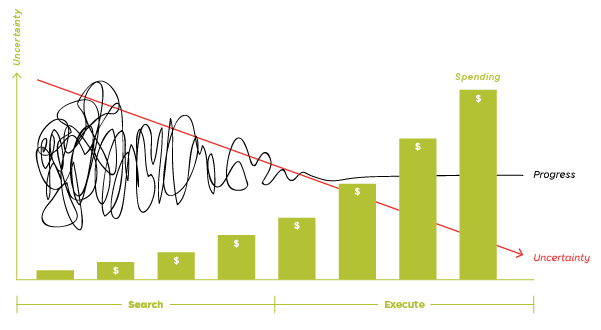

In structuring a team for MVP, we should consider the following: there is a massive number of uncertainties. We have to work with assumptions and bets.

The goal for the business is to find a good enough solution for a reasonable budget: _ROI_. It's vital to have the fastest feedback loop to prevent dramatic waste.

## Here is how I see the team structure:

- [Project Manager / Owner](#pm)
- [Designer](#designer)
- [Developers: 2 Fullstack and 1 Frontend](#developers)

## Product Manager / Owner

They define the product's vision, so the rest of the team will follow. 

One of their functions is to communicate with all the product stakeholders (sponsors, developers, designers, customers).

They relay the vision and goals of the product to the team, so everyone follows the direction.

Helps with verifications and controlling the quality.

## UI/UX Designer

The designers are responsible for designing the interactions between users and the product.

They conduct experiments and do research. They interview users, potential users, and stakeholders.

They create user interfaces that work great and are also pleasing to look at.

## Developers

The developers write the code that delivers new behaviors.

They decompose big requests into small atomic chunks.

Make architectural decisions.

They aim to make the product error-free. Onboard _Continuous Delivery_ by using automations, tests and code review.

They monitor performance because speed is a feature of every application.

