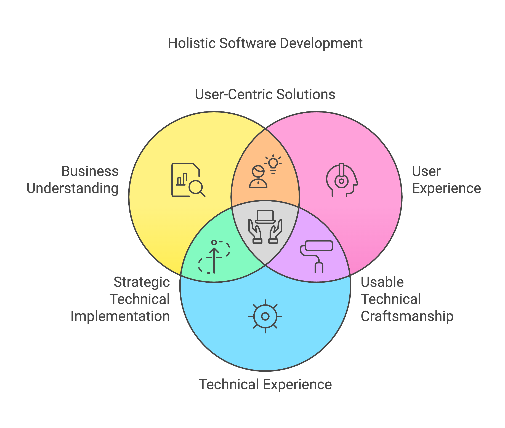
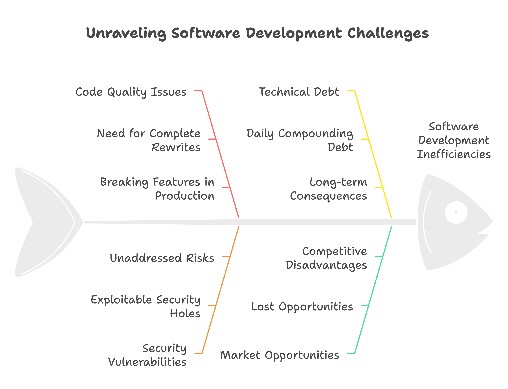

Here's my twenty years of battling bullshit practices in software development consulting. Every month, I meet founders who've been burned by outsourcing agencies promising unicorns and delivering donkeys.

## Reality Check

Let me be clear: most development outsourcing is broken. Not just "needs improvement" broken, but fundamentally, structurally broken.

I saw this firsthand at JetThoughts when Agent Inbox came to us. They'd spent a year with an agency that promised "senior developers at competitive rates." What they got was a GitHub repository full of copy-pasted Stack Overflow answers and a codebase that would make any self-respecting developer quit on the spot.

## The Talent Mirage

After founding three successful R&D departments and working with over 160 companies, I'll tell you what these agencies won't: Quality developers don't want to work for them.

Think about it. Why would any skilled developer choose:
- Zero ownership over the product
- Being treated like a code-typing machine
- Half the market rate
- Random projects they can't put on their resume
- "Management" by non-technical PMs who've never written a line of code

They won't. That's why these agencies are stuck with junior developers pretending to be seniors.

## The Economics of Bad Code

"But Paul," founders tell me, "the rates are so much lower!"

Sure, just like that "Rolex" you can buy for $50. Let me show you what Agent Inbox got for their "bargain" development:
- Zero test coverage
- Security vulnerabilities you could sail a yacht through
- Database queries that would make PostgreSQL have an existential crisis
- Technical debt that would make a loan shark blush

## The Culture Gap

Here's what really pisses me off: These agencies sell coding like it's data entry. As if great software just magically appears when you type enough lines of code.

Spoiler alert: It doesn't.

Real software development needs:
- Deep understanding of the business problem
- Genuine care about user experience
- Pride in craftsmanship
- Strong opinions about quality
- Actual technical experience (not just buzzwords)

At [JetThoughts](https://jetthoughts.com), we rebuilt Agent Inbox's platform in 60 days. Not because we're wizards, but because we didn't waste time writing garbage code we'd have to throw away.

## The Hidden Costs

Want to know the real price of cheap development? Here's what I've seen across hundreds of projects:
- Codebases so bad they need complete rewrites
- Features that break in production
- Security holes waiting to be exploited
- Technical debt that compounds daily
- Lost market opportunities

One of my clients learned this the hard way. Their "cost-effective" offshore team ended up costing them a year of market time and triple the original budget.

## A Better Approach

After seeing hundreds of projects succeed and fail, here's what actually works:

1. Start with a brutally simple MVP
2. Find developers who ask "why?" before writing code
3. Pay for quality (it's cheaper in the long run)
4. Trust your developers' technical judgment
5. Focus on outcomes, not hourly rates

## The Way Forward

The software industry needs to grow up. We need to stop pretending that development is like ordering widgets from a factory.

Quality software is crafted, not assembled. It requires thought, experience, and pride in the work. Anyone telling you different is selling something - and it's probably junk.

## What Now?

If you're stuck with outsourced code you're not happy with, stop throwing good money after bad. Step back, simplify your requirements, and find people who actually give a damn about your product's success.

Remember: Every line of code is a liability. Choose carefully who writes yours.

---

Want to continue this conversation? Let's connect at [JetThoughts](https://jetthoughts.com). As a fractional CTO, I help founders avoid these expensive mistakes every day.

P.S. If you found this valuable, visit our [case studies](https://jetthoughts.com/cases) where I share more hard truths about building successful software products.