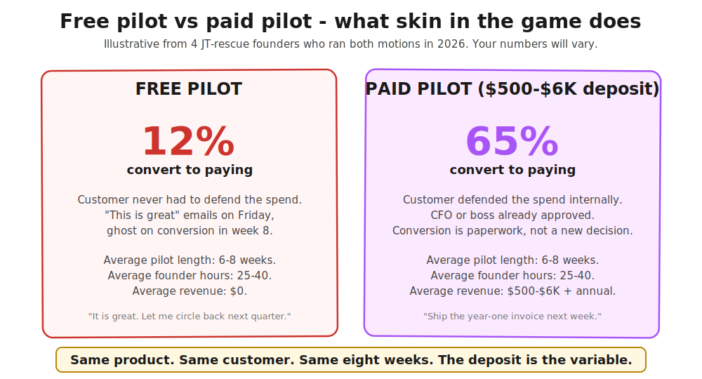
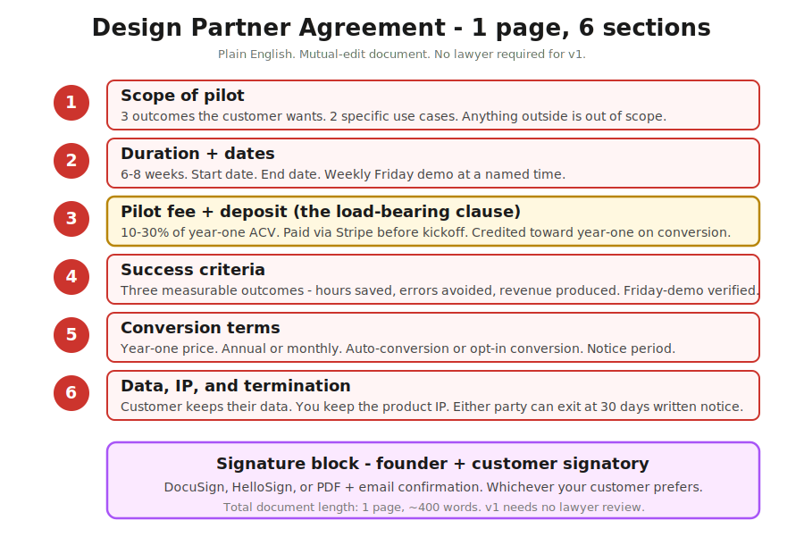
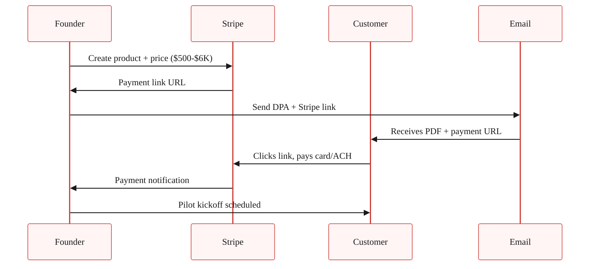

> **Module 7 · Step 3 of 4** · [Tech for Non-Technical Founders 2026](/blog/tech-for-non-technical-founders-2026/) course.
> Input: 3-5 warm leads from Chapter 7.2. Output: 1 signed paid pilot before any new code ships.

In late 2025 a HealthTech founder ran a six-week free pilot with a 40-bed clinic she had met at a conference. The clinic loved it. The shared Slack channel had 47 messages of enthusiasm before week 4. The day the pilot ended she sent the year-one contract. The reply came back three weeks later: "We're going to revisit at the next budget cycle." There was no next budget cycle - the clinic moved on, and she shipped the same product to a paid-pilot customer in March 2026 and closed the year-one contract on day one. Same product. Same buyer profile. The difference was a $1,200 deposit at the start of the pilot, not the end.

Below is the playbook the second founder followed: a one-page Design Partner Agreement, a 15-minute Stripe Checkout setup, and the pricing math that puts the founder in the conversation instead of the agency.

## Why free pilots almost never convert

Free pilots feel collaborative. The customer says yes. You build for six weeks. They show up to the Friday demo each Friday and say "this is great." Week 8 lands and you send the proposal for the year-one contract. The customer says "this is great, let me circle back to my CFO." The CFO has never heard of you. The CFO did not approve the pilot. The CFO has no internal justification for the line item. The conversation dies in a forwarded email thread.

That is the recurring mechanic. Four 2026 B2B founders ran pilots through the JetThoughts rescue queue in the last six months. The three who ran free pilots all hit the same wall - "this is great" emails on Friday, ghost on conversion in week 8. The one who insisted on a 20% deposit before kickoff cleared the conversion in week 7 without negotiation. Her customer's CFO had already approved the spend in week 0; the conversion was paperwork, not a new decision.

The non-technical founder out of a dev-shop burn has a specific reason to find this hard. After six months of paying an agency, the muscle memory is "everyone keeps asking me for money." Asking your customer for money first feels like joining the side that hurt you. The instinct is wrong but understandable. Reframe: you are not asking for money. You are asking the customer to defend the spend internally. The defense is the test of whether the pilot is real.

## The Design Partner Agreement, in one page

The Design Partner Agreement (DPA) is a one-page LOI that names the customer as a design partner, defines the pilot scope, sets the deposit, and converts to year-one on success. It is mutual-edit, in plain English, and v1 does not need a lawyer. The reason it stays short: every line in the document is a load-bearing clause, and every line that would not load-bear is removed.

The structure has six sections plus signatures.

Section by section:

**1. Scope of pilot.** Three outcomes the customer wants from the product in the pilot window. Two specific use cases. Anything outside this list is out of scope until conversion. This section anchors the Friday demos - if a demo does not advance one of the three outcomes, the demo is off-scope and you say so.

**2. Duration + dates.** Six to eight weeks. A specific start date (signing day plus seven). A specific end date. A weekly Friday demo at a named time, named attendee on the customer side. Friday demo cadence is the same rhythm from the [Friday demo chapter](/blog/friday-demo-rule-founder-progress/) - the demo is the proof of work and the conversion-prep call.

**3. Pilot fee and deposit.** The load-bearing clause. The deposit is 10-30% of projected year-one annual contract value (ACV). Paid via Stripe before pilot kickoff. Credited dollar-for-dollar against year-one invoice on conversion. Forfeited if the customer cancels before week 4 (the customer's commitment); the founder refunds 100% if the founder cancels for any reason (your commitment). The math is in the pricing section below.

**4. Success criteria.** Three measurable outcomes - hours saved per week, errors avoided per month, revenue produced per quarter, or whatever sectors your product. These are the conversion triggers. If two of three are hit by week 6, the year-one contract auto-converts unless the customer opts out in writing. If fewer than two are hit, both parties walk and the founder retains the deposit as paid consideration for the pilot work.

**5. Conversion terms.** The year-one price (in dollars, not "TBD"). Annual or monthly billing. Auto-conversion (recommended) or opt-in conversion. 30-day notice period after year one. These are the numbers the customer's CFO needs in week 0 to approve the deposit.

**6. Data, IP, and termination.** The customer keeps their data. The founder keeps the product IP. Either party can exit at 30 days written notice during the pilot. The customer's data stays exportable for 90 days after termination. The shorter the section, the more obvious the answers; v1 needs no further detail.

Plus signature block. Total document: one page, around 400 words. DocuSign, HelloSign, or PDF-and-email-confirmation. Whichever the customer prefers.

## The pricing math

The deposit number is not arbitrary. It is anchored to projected year-one ACV and to what a typical CFO will sign without a procurement review. The bands by sector:

| Sector | Year-1 ACV | Pilot fee (10-30%) | Pilot fee notes |
|---|---|---|---|
| B2B SaaS (per-seat, 5-10 seats) | $5K-$12K | $500-$3K | The CFO approves the deposit on email. No procurement involved. |
| B2B SaaS (mid-market, 50-200 seats) | $20K-$80K | $2K-$24K | Above $10K, expect a 1-week procurement review. Plan for it. |
| B2B Services / consultancy | $10K-$40K | $1K-$6K | Service deposit is normal in the sector. Customer expects to pay. |
| Rails MVP-as-a-service | $15K-$60K | $1.5K-$6K | This is the JT-rescue band. Founder is buying back control. |

**The minimum: $500.** Below $500, the deposit does not work as a commitment device - the customer can write it off as a Friday-impulse purchase and ghost the same way they would on a free pilot. The point of the deposit is that it lives in next month's accounting cycle, which means it gets justified.

**The maximum without procurement review: typically $10K.** Above $10K, even at small companies, finance starts asking questions. If your pilot fee is $10K+, expect a 1-2 week procurement window between handshake and signature, and price the timeline into the conversation - the deposit clears in week 2, not week 0.

**Always credit toward year-one.** The pilot fee is not separate revenue. It is "year-one ACV, pre-paid." The customer's CFO is approving year-one revenue brought forward, not a discretionary line item. Naming it correctly changes the conversation entirely.

## The Stripe Checkout setup (15 minutes, no engineer)

You will spend more time renaming the Stripe product than building the payment page. Stripe Checkout is hosted - you do not build a payment form, you just generate a checkout URL and email it to your customer.

The five-minute path:

1. Create or sign in to your Stripe account. [stripe.com/login](https://dashboard.stripe.com/login)
2. Go to Products. Create a new product called "[Your Product Name] - Design Partner Pilot".
3. Add a one-time price for the deposit amount ($500, $2K, $6K, whatever your math).
4. Hit "Payment link" on the product detail page. Stripe generates a hosted checkout URL.
5. Paste the URL into your DPA email. Customer clicks, pays card or ACH, you get the Stripe notification.

That is the entire setup. No webhook, no Rails controller, no Django view, no Laravel route. If you want to log paid pilots into your existing app, you can - but you do not have to. The CSV export from Stripe is enough for a Module 7 first-pilot motion.

If you do want to wire the payment into a Rails app for record-keeping later, the Stripe Ruby gem (`gem 'stripe'`) takes a `Stripe::Checkout::Session.create` call to generate the same URL programmatically. Django uses `stripe.checkout.Session.create` via the `stripe-python` package. Laravel uses `Stripe\Checkout\Session::create()` from `stripe/stripe-php`. All three produce the same hosted URL. Do not build this until after your first paid pilot ships.

## The conversation script

You have a warm lead from [Chapter 7.2](/blog/first-ten-customers-personal-network/). They booked a 20-minute demo. The demo went well. They said something close to "yes, I would love to try this with my team." This is the moment. Most founders soften here. The 15-second script:

> "Glad it resonates. Quick word on how I am setting up pilots - I am running them as paid design partnerships, so the customer has skin in the game and I have a real signal. The deposit is [$500-$6K], credited toward year one on conversion. Refunded in full if I cannot deliver on the success criteria. Want me to send the one-pager?"

Three things to notice. First, you did not apologize for asking for money. The phrasing presents the deposit as your standard, not a negotiation. Second, you anchored the conversation in mutual signal - they get the founder time, you get a real customer commitment. Third, you ended with a low-friction next step - the one-pager, not the signed contract.

The customer's response tells you everything. "Send the one-pager" means you are close to a paid pilot. "Can we start free and convert later?" means they are still hedging - reframe and clarify the deposit is credit, not cost. "Let me think about it" means they are not ready - check back in seven days, but the warm lead just got colder. "We do not do paid pilots" means they are not in your must-have segment for now - thank them and move on.

## When founders should not insist on a paid pilot

Three cases.

**Champion conversion.** If a champion from your Module 7.2 list is willing to come into the pilot for free in exchange for a co-marketing case study and a Loom testimonial at the end, that trade is sometimes worth more than the deposit. The case study and the testimonial are your conversion assets for the next 10 customers. Limit this to 1-2 champions out of your first 10 pilots, and only when the case study is contractually committed.

**True early-MVP founder.** If your MVP is genuinely 30% built, a paid pilot misrepresents what you can deliver. Do the free pilot honestly, ship the product to the agreed scope, and turn the second customer into the paid one. The honesty signal is itself a commitment device of a different kind.

**Pre-investment-grade product.** If your product is 12 months from being differentiable, the customer is buying a relationship, not a product. The relationship motion has its own playbook (see the [Paul Graham "Do Things That Don't Scale"](http://paulgraham.com/ds.html) Stripe Collison example). The paid pilot returns once the product is actually doing the job.

## What to do this week

Monday morning:

1. Write your one-page DPA in a Google Doc. The template in the [First-Paying-Customer Operating Kit](/blog/first-paying-customer-operating-kit/) is fill-in-the-blank.
2. Set up the Stripe product and payment link. 15 minutes.
3. Pick the deposit number for your sector using the table above.

By Wednesday:

4. Send the DPA and Stripe link to 1-2 warm leads from Chapter 7.2 who booked demos last week.
5. Be ready for two follow-up calls. One will ask procurement questions. The other will sign.

By Friday:

6. Bank your first deposit. Schedule the kickoff for the following Monday. Schedule the first Friday demo for the Friday after that.

If you do not have warm demos to convert this week, your work is still in [Chapter 7.2](/blog/first-ten-customers-personal-network/). The DPA is the wrong sprint for an empty pipeline.

## Advanced (optional sidebar)

Founders who have closed 2-3 paid pilots and want to layer on contract rigor can read the [Common Paper Design Partner Agreement template](https://commonpaper.com/standards/design-partner-agreement/) (a vetted v2 LOI used by hundreds of YC companies), [SaaStr's "Should we charge for pilots"](https://www.saastr.com/should-you-charge-for-a-pilot/) (Jason Lemkin's thirty-second answer is yes, always), and Ash Rust's ["Startup Sales: How to Get Pilot Customers to Pay"](https://medium.com/sharp-spear/startup-sales-how-to-get-pilot-customers-to-pay-7a9b7a48eedf) for the conversation tactics. The one-page DPA in this chapter is enough through your first 10 pilots. The advanced versions matter once you start hearing the words "procurement" and "MSA" in pilot conversations.

## Further reading

- Common Paper, [Design Partner Agreement template](https://commonpaper.com/standards/design-partner-agreement/) - a vetted, modern LOI used by hundreds of YC companies. The companion to your one-pager when conversations move toward MSAs.
- SaaStr, [Should you charge for a pilot?](https://www.saastr.com/should-you-charge-for-a-pilot/) - Jason Lemkin's case for charging and the conversion-rate data behind the recommendation.
- Ash Rust, [Startup Sales: How to Get Pilot Customers to Pay](https://medium.com/sharp-spear/startup-sales-how-to-get-pilot-customers-to-pay-7a9b7a48eedf) - tactical conversation script and pricing-band data from a former Sequoia-backed founder.
- Steve Blank, [The Four Steps to the Epiphany](https://steveblank.com/2010/01/06/the-four-steps-to-the-epiphany/) - the foundational text on Customer Validation that names paid pilots as the canonical validation instrument.
- Stripe, [Payment Links documentation](https://stripe.com/docs/payment-links) - the official Stripe Checkout setup. 15-minute integration with no engineering work required.
- Lenny Rachitsky, [How to win your first 10 B2B customers](https://www.lennysnewsletter.com/p/how-to-win-your-first-10-b2b-customers) - the 7-step playbook including the design-partner pricing model from B2B founders.
