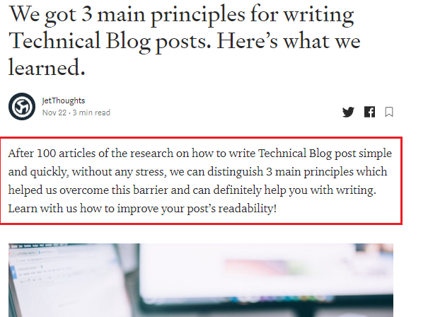

*Are you struggling with the introduction as it’s absolutely annoying thing that has to be written? It simply summarises the main points of your article. So why so much noise about it?*

If your introduction is weak, it’ll discourage the reader from reading further — even if the title was captivating. You have just a few seconds to catch your reader’s attention.

Let’s go!

 on [Unsplash](https://unsplash.com/s/photos/writer?utm_source=unsplash&utm_medium=referral&utm_content=creditCopyText)](file_0.jpeg)

The introduction is referred to as a lead, which simply means the opening paragraph of a news story, essay, or article.

There are 3 important elements of a good introduction. Let’s briefly look at them:

* ***Hook:*** This is what pulls the reader into your blog entry. Make it specific, brief, and interesting. It can be a single sentence, a phrase, or even a word. Your hook could be a question.

* ***Transition:*** The hook grabs your attention and then leads the reader into the transition. The transition is usually a sentence that connects the hook to the body of the post and clarifies the title. This is how you lead people through your blog entry.

* ***Thesis:*** The last element of an introduction is the thesis. It summarizes the topic and strengthens the reason why the reader should continue with your blog post idea. If you do a great job at the transition stage, the thesis will likely fall into place and make a great blog post.

Anyway, a catchy introduction provides the reader with a brief overview of your topic and an explanation of your thesis. The successful introduction is fresh, engaging, and enjoyable.

Good luck!
**Ruslana** is a Lead Generation Manager at [JetThoughts](https://www.jetthoughts.com/). Follow her on [LinkedIn](https://www.linkedin.com/in/ruslana-brykaliuk-970016135/).
>  If you enjoyed this story, we recommend reading our [latest tech stories](https://jtway.co/latest) and [trending tech stories](https://jtway.co/trending).
