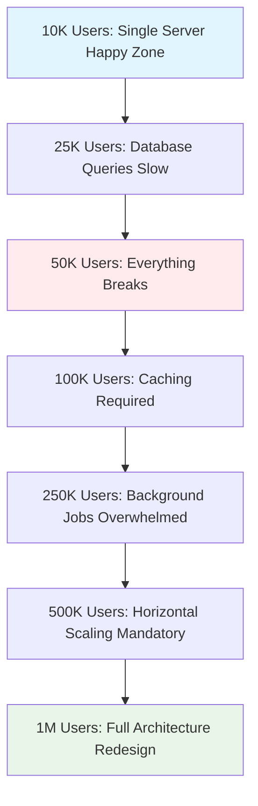
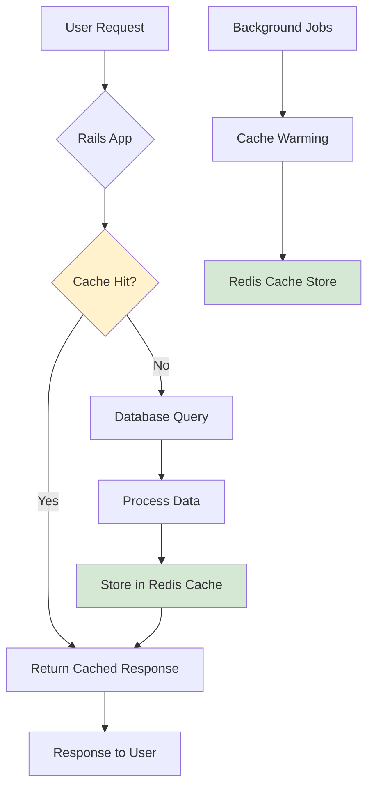
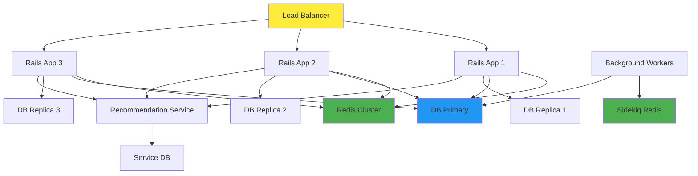
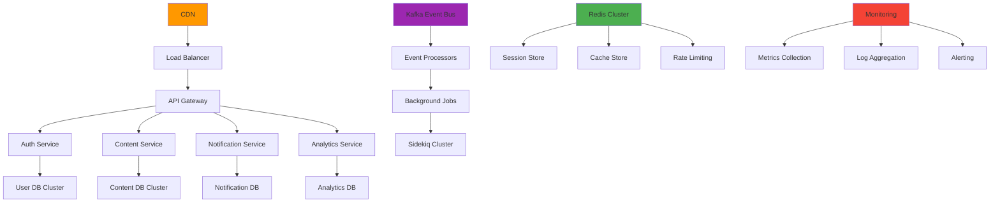

Your Rails app handles 10K users fine. But at 50K, everything breaks. Here's the exact roadmap we've used to scale Rails applications from 10K to 1M users, complete with real metrics, code examples, and architecture decisions that actually work.

We've guided dozens of companies through this scaling journey. The patterns are predictable, the bottlenecks are known, and the solutions are proven. Let's walk through each stage of growth and the specific optimizations that'll get you there.

## The predictable scaling crisis points

Every Rails application hits the same walls at predictable user counts. Here's what breaks and when:



The pattern is always the same:
- **10K users**: Your monolith works perfectly
- **25K users**: Database queries start timing out
- **50K users**: Everything breaks at once
- **100K users**: Caching becomes mandatory for survival
- **250K users**: Background jobs can't keep up
- **500K users**: You need horizontal scaling
- **1M users**: Time for microservices and serious infrastructure

Let's dive into each stage and the exact solutions that work.

## Stage 1: 10K to 25K users - The happy monolith

At 10K users, your Rails app is humming along nicely. You've got a single server, probably a basic Postgres database, and life is good. But growth is coming, and you need to prepare.

**What's working:**
- Single Puma server handling requests
- Standard Rails queries
- Basic ActiveRecord associations
- Minimal caching needs

**Early warning signs:**
- Occasional slow page loads
- Database query times creeping up
- Memory usage gradually increasing

**Proactive optimizations:**

### 1. Query optimization foundation

Start identifying and fixing N+1 queries before they become critical:

```ruby
# ❌ Before: N+1 queries killing performance
def show_dashboard
  @posts = current_user.posts.limit(20)
  # Later in view: @posts.each { |post| post.user.name }
  # This triggers N additional queries!
end

# ✅ After: Optimized with strategic includes
def show_dashboard
  @posts = current_user.posts
    .includes(:user, :tags, comments: :user)
    .limit(20)
  # All related data loaded in 2-3 queries total
end
```

### 2. Database indexing strategy

Add indexes for your most common queries:

```ruby
# In a migration
class AddPerformanceIndexes < ActiveRecord::Migration[7.0]
  def change
    # Index for user posts lookup
    add_index :posts, [:user_id, :created_at], order: { created_at: :desc }

    # Composite index for filtered queries
    add_index :posts, [:status, :published_at], where: "status = 'published'"

    # Index for search functionality
    add_index :posts, :title, using: :gin  # For PostgreSQL full-text search
  end
end
```

### 3. Memory optimization

Configure Puma for optimal memory usage:

```ruby
# config/puma.rb
workers ENV.fetch("WEB_CONCURRENCY") { 2 }
threads_count = ENV.fetch("RAILS_MAX_THREADS") { 5 }
threads threads_count, threads_count

# Important: Lower thread count = more predictable memory usage
preload_app!

on_worker_boot do
  ActiveRecord::Base.establish_connection
end
```

**Expected metrics at this stage:**
- Response time: 50-150ms average
- Database queries: 2-5 per request
- Memory usage: 200-400MB per worker
- Error rate: <0.1%

## Stage 2: 25K to 50K users - Database optimization critical

This is where most Rails apps start showing stress. Database queries that worked fine at 10K users are now timing out. It's time for serious database optimization.

### Database query optimization deep dive

**1. Eliminate N+1 queries completely**

Use tools like [Bullet gem](https://github.com/flyerhzm/bullet) to detect and fix N+1 queries:

```ruby
# Gemfile
group :development do
  gem 'bullet'
end

# config/environments/development.rb
config.after_initialize do
  Bullet.enable = true
  Bullet.alert = true
  Bullet.bullet_logger = true
  Bullet.console = true
end
```

**2. Implement strategic counter caches**

For expensive count queries:

```ruby
class Post < ApplicationRecord
  belongs_to :user, counter_cache: true
  has_many :comments, dependent: :destroy
end

class User < ApplicationRecord
  has_many :posts
  # Now user.posts.count becomes user.posts_count (no query!)
end

# Migration to add counter cache
class AddPostsCountToUsers < ActiveRecord::Migration[7.0]
  def change
    add_column :users, :posts_count, :integer, default: 0

    # Backfill existing counts
    User.reset_counters(User.ids, :posts)
  end
end
```

**3. Use database views for complex queries**

For complex aggregations that run frequently:

```sql
-- Create a database view for user statistics
CREATE VIEW user_stats AS
SELECT
  users.id,
  users.email,
  COUNT(posts.id) as total_posts,
  AVG(posts.views_count) as avg_post_views,
  MAX(posts.created_at) as last_post_date
FROM users
LEFT JOIN posts ON posts.user_id = users.id
WHERE posts.status = 'published'
GROUP BY users.id, users.email;
```

```ruby
# Access via ActiveRecord
class UserStats < ApplicationRecord
  self.primary_key = :id

  # This view gives you pre-calculated stats with a single query
  def readonly?
    true
  end
end

# Usage
@top_users = UserStats.order(total_posts: :desc).limit(10)
```

### Background job optimization

Start extracting slow operations to background jobs:

```ruby
# app/jobs/heavy_calculation_job.rb
class HeavyCalculationJob < ApplicationJob
  queue_as :default

  def perform(user_id)
    user = User.find(user_id)

    # Move expensive operations here
    user.calculate_monthly_statistics
    user.send_summary_email
  end
end

# In your controller
class DashboardController < ApplicationController
  def update_stats
    # Instead of doing this synchronously
    # current_user.calculate_monthly_statistics

    # Queue it for background processing
    HeavyCalculationJob.perform_later(current_user.id)

    redirect_to dashboard_path, notice: "Stats update queued!"
  end
end
```

**Expected metrics at this stage:**
- Response time: 100-300ms average
- Database queries: 3-8 per request
- Background jobs: 50-200 per minute
- Memory usage: 300-600MB per worker

## Stage 3: 50K to 100K users - Caching architecture required

Welcome to the caching era. At this point, you can't survive without a solid caching strategy. Redis becomes your best friend.

### Comprehensive caching strategy

**1. Application-level caching with Redis**

```ruby
# Gemfile
gem 'redis-rails'
gem 'hiredis'  # Faster Redis protocol

# config/environments/production.rb
config.cache_store = :redis_cache_store, {
  url: ENV.fetch("REDIS_URL") { "redis://localhost:6379/1" },
  timeout: 1,  # 1 second timeout
  pool_size: 5,
  pool_timeout: 5
}
```

**2. Fragment caching for expensive views**

```erb
<!-- app/views/posts/show.html.erb -->
<% cache [@post, 'v2'] do %>
  <div class="post-header">
    <h1><%= @post.title %></h1>
    <p>By <%= @post.user.name %> on <%= @post.created_at.strftime('%B %d, %Y') %></p>
  </div>
<% end %>

<% cache [@post, @post.comments.maximum(:updated_at), 'comments', 'v1'] do %>
  <div class="comments-section">
    <%= render @post.comments %>
  </div>
<% end %>
```

**3. Model-level caching for expensive calculations**

```ruby
class User < ApplicationRecord
  def monthly_revenue
    Rails.cache.fetch("user_#{id}_monthly_revenue_#{Date.current.strftime('%Y-%m')}", expires_in: 1.hour) do
      calculate_monthly_revenue_from_db
    end
  end

  private

  def calculate_monthly_revenue_from_db
    # Expensive calculation here
    orders.where(created_at: Date.current.beginning_of_month..Date.current.end_of_month)
          .sum(:total_amount)
  end
end
```

**4. Russian doll caching pattern**

For nested, dependent data:

```ruby
class Post < ApplicationRecord
  belongs_to :user
  has_many :comments

  # Cache key includes all dependent objects
  def cache_key_with_version
    "#{cache_key}/#{comments.maximum(:updated_at)&.to_i}"
  end
end
```

```erb
<% cache @post do %>
  <h1><%= @post.title %></h1>

  <% cache [@post.user, 'user_info'] do %>
    <p>By <%= @post.user.name %></p>
  <% end %>

  <% @post.comments.each do |comment| %>
    <% cache comment do %>
      <div class="comment">
        <%= comment.content %>
      </div>
    <% end %>
  <% end %>
<% end %>
```

### Database read replicas

Split read and write operations:

```ruby
# config/database.yml
production:
  primary:
    adapter: postgresql
    host: primary-db.company.com
    database: myapp_production

  primary_replica:
    adapter: postgresql
    host: replica-db.company.com
    database: myapp_production
    replica: true

# app/models/application_record.rb
class ApplicationRecord < ActiveRecord::Base
  self.abstract_class = true

  # Heavy read operations use replica
  def self.with_replica
    connected_to(role: :reading) { yield }
  end
end

# Usage in controllers
class PostsController < ApplicationController
  def index
    @posts = ApplicationRecord.with_replica do
      Post.includes(:user, :tags)
          .published
          .page(params[:page])
    end
  end
end
```

**Caching architecture diagram:**



**Expected metrics at this stage:**
- Response time: 80-200ms average
- Cache hit ratio: 85-95%
- Redis memory usage: 1-4GB
- Database load reduction: 60-80%

## Stage 4: 100K to 250K users - Advanced optimization patterns

At this scale, you need sophisticated optimization patterns. Simple caching isn't enough anymore.

### Advanced database optimization

**1. Connection pooling optimization**

```ruby
# config/database.yml
production:
  adapter: postgresql
  pool: <%= ENV.fetch("RAILS_MAX_THREADS") { 5 } %>
  checkout_timeout: 5
  reaping_frequency: 10
  dead_connection_timeout: 5

  # PgBouncer connection pooling
  host: pgbouncer.company.com
  port: 5432
```

**2. Database query optimization with EXPLAIN**

```ruby
# Development helper for query analysis
class ApplicationRecord < ActiveRecord::Base
  def self.explain_query(relation)
    puts relation.explain(analyze: true, buffers: true)
  end
end

# Usage
Post.includes(:user).where(status: 'published').explain_query
```

**3. Materialized views for heavy aggregations**

```sql
-- Create materialized view for dashboard stats
CREATE MATERIALIZED VIEW daily_user_stats AS
SELECT
  DATE(created_at) as stat_date,
  COUNT(*) as new_users,
  COUNT(*) FILTER (WHERE email_verified = true) as verified_users
FROM users
GROUP BY DATE(created_at)
ORDER BY stat_date DESC;

-- Refresh strategy
CREATE OR REPLACE FUNCTION refresh_daily_stats()
RETURNS void AS $$
BEGIN
  REFRESH MATERIALIZED VIEW CONCURRENTLY daily_user_stats;
END;
$$ LANGUAGE plpgsql;
```

### Memory optimization and garbage collection

**1. Optimize Ruby garbage collection**

```ruby
# config/puma.rb
# Tune GC for better performance
GC.tune({
  RUBY_GC_HEAP_GROWTH_FACTOR: 1.1,
  RUBY_GC_HEAP_GROWTH_MAX_SLOTS: 100000,
  RUBY_GC_HEAP_OLDOBJECT_LIMIT_FACTOR: 2.0
})

on_worker_boot do
  GC.compact  # Compact heap on worker boot
end
```

**2. Memory monitoring and optimization**

```ruby
# app/controllers/concerns/memory_monitoring.rb
module MemoryMonitoring
  extend ActiveSupport::Concern

  included do
    around_action :monitor_memory, if: -> { Rails.env.production? }
  end

  private

  def monitor_memory
    memory_before = memory_usage

    yield

    memory_after = memory_usage
    memory_diff = memory_after - memory_before

    if memory_diff > 50.megabytes  # Alert if memory jumps
      Rails.logger.warn "High memory usage in #{controller_name}##{action_name}: #{memory_diff / 1.megabyte}MB"
    end
  end

  def memory_usage
    `ps -o rss= -p #{Process.pid}`.to_i.kilobytes
  end
end
```

### Background job optimization

**1. Queue prioritization and processing**

```ruby
# config/application.rb
config.active_job.queue_adapter = :sidekiq

# app/jobs/application_job.rb
class ApplicationJob < ActiveJob::Base
  # Different queues for different priorities
  queue_as do
    case self.class.name
    when 'CriticalEmailJob'
      :critical
    when 'ReportGenerationJob'
      :low_priority
    else
      :default
    end
  end

  # Retry strategy
  retry_on StandardError, wait: :exponentially_longer, attempts: 3
end
```

**2. Batch processing for efficiency**

```ruby
# app/jobs/batch_email_job.rb
class BatchEmailJob < ApplicationJob
  queue_as :default

  def perform(user_ids, email_template_id)
    users = User.where(id: user_ids)
    template = EmailTemplate.find(email_template_id)

    # Process in batches to avoid memory issues
    users.find_in_batches(batch_size: 100) do |user_batch|
      user_batch.each do |user|
        UserMailer.template_email(user, template).deliver_now
      end
    end
  end
end

# Usage - instead of individual jobs
# UserEmailJob.perform_later(user.id) # ❌ Creates 1000 jobs
BatchEmailJob.perform_later(user_ids, template.id) # ✅ Creates 1 job
```

**Expected metrics at this stage:**
- Response time: 60-150ms average
- Background job processing: 500-2000 per minute
- Memory per worker: 400-800MB
- Cache hit ratio: 90-98%

## Stage 5: 250K to 500K users - Horizontal scaling introduction

Single-server limitations hit hard here. Time for horizontal scaling, load balancing, and distributed systems thinking.

### Load balancing and multiple app servers

**1. Application server scaling**

```nginx
# nginx.conf
upstream rails_app {
    least_conn;  # Distribute based on active connections

    server app1.company.com:3000 max_fails=3 fail_timeout=30s;
    server app2.company.com:3000 max_fails=3 fail_timeout=30s;
    server app3.company.com:3000 max_fails=3 fail_timeout=30s;

    # Health check
    keepalive 32;
}

server {
    location / {
        proxy_pass http://rails_app;
        proxy_set_header Host $host;
        proxy_set_header X-Real-IP $remote_addr;
        proxy_set_header X-Forwarded-For $proxy_add_x_forwarded_for;
        proxy_set_header X-Forwarded-Proto $scheme;

        # Timeouts
        proxy_connect_timeout 5s;
        proxy_send_timeout 60s;
        proxy_read_timeout 60s;
    }
}
```

**2. Session management for multiple servers**

```ruby
# config/initializers/session_store.rb
Rails.application.config.session_store :redis_store,
  servers: [
    {
      host: "redis-session.company.com",
      port: 6379,
      db: 0,
      namespace: "session"
    }
  ],
  expire_after: 2.weeks,
  key: "_myapp_session_#{Rails.env}"
```

### Database sharding introduction

**1. Horizontal sharding strategy**

```ruby
# app/models/concerns/shardable.rb
module Shardable
  extend ActiveSupport::Concern

  class_methods do
    def shard_for(user_id)
      shard_number = user_id % shard_count
      "shard_#{shard_number}"
    end

    def with_shard(shard_name)
      previous_shard = current_shard
      self.current_shard = shard_name
      yield
    ensure
      self.current_shard = previous_shard
    end

    private

    def shard_count
      4  # Start with 4 shards
    end
  end
end

# app/models/user_activity.rb
class UserActivity < ApplicationRecord
  include Shardable

  def self.for_user(user)
    shard = shard_for(user.id)
    with_shard(shard) do
      where(user_id: user.id)
    end
  end
end
```

### Microservices extraction

**1. Extract heavy operations to services**

```ruby
# app/services/recommendation_service.rb
class RecommendationService
  def self.for_user(user_id)
    # Call external recommendation microservice
    response = HTTP.timeout(2)
                  .get("#{ENV['RECOMMENDATION_SERVICE_URL']}/users/#{user_id}/recommendations")

    if response.status.success?
      JSON.parse(response.body)['recommendations']
    else
      # Fallback to simple recommendations
      fallback_recommendations(user_id)
    end
  rescue HTTP::TimeoutError, HTTP::Error
    # Graceful degradation
    fallback_recommendations(user_id)
  end

  private

  def self.fallback_recommendations(user_id)
    # Simple recommendation logic as fallback
    Post.published.recent.limit(5)
  end
end
```

### Infrastructure scaling architecture



**Expected metrics at this stage:**
- Response time: 50-120ms average
- Concurrent users: 2000-5000
- Database connections: 100-300 total
- Background jobs: 1000-5000 per minute

## Stage 6: 500K to 1M users - Full architecture redesign

Congratulations! You've reached the point where your original Rails monolith needs fundamental changes. This is where the real architectural decisions happen.

### Microservices architecture

**1. Service decomposition strategy**

Break your monolith into focused services:

```ruby
# User Service
class Users::AuthenticationService
  def authenticate(email, password)
    # Handle all authentication logic
  end
end

# Content Service
class Content::PostService
  def create_post(user_id, params)
    # Handle post creation with user validation
  end
end

# Notification Service
class Notifications::DeliveryService
  def send_notification(user_id, message, type)
    # Handle all notification delivery
  end
end
```

**2. API gateway pattern**

```ruby
# app/controllers/api/v1/gateway_controller.rb
class Api::V1::GatewayController < ApplicationController
  def route_request
    service = determine_service(request.path)

    case service
    when 'users'
      proxy_to_service('USER_SERVICE_URL', request)
    when 'content'
      proxy_to_service('CONTENT_SERVICE_URL', request)
    when 'notifications'
      proxy_to_service('NOTIFICATION_SERVICE_URL', request)
    else
      render json: { error: 'Service not found' }, status: 404
    end
  end

  private

  def proxy_to_service(service_url_env, request)
    response = HTTP.timeout(5)
                  .headers(forward_headers)
                  .request(request.method, "#{ENV[service_url_env]}#{request.path}")

    render json: response.parse, status: response.status
  end
end
```

### Event-driven architecture

**1. Event sourcing for critical operations**

```ruby
# app/models/events/user_event.rb
class Events::UserEvent < ApplicationRecord
  def self.record(event_type, user_id, data = {})
    create!(
      event_type: event_type,
      user_id: user_id,
      data: data,
      occurred_at: Time.current
    )

    # Publish to event bus
    EventBus.publish(event_type, { user_id: user_id, data: data })
  end
end

# Usage
Events::UserEvent.record('user_registered', user.id, { source: 'web' })
Events::UserEvent.record('post_created', user.id, { post_id: post.id })
```

**2. Message queue integration**

```ruby
# app/services/event_bus.rb
class EventBus
  def self.publish(event_type, payload)
    case Rails.configuration.event_bus_adapter
    when :rabbitmq
      publish_to_rabbitmq(event_type, payload)
    when :kafka
      publish_to_kafka(event_type, payload)
    else
      publish_to_redis(event_type, payload)
    end
  end

  private

  def self.publish_to_kafka(event_type, payload)
    kafka = Kafka.new(['kafka1.company.com:9092', 'kafka2.company.com:9092'])
    producer = kafka.producer

    producer.produce(payload.to_json, topic: event_type)
    producer.deliver_messages
  ensure
    producer&.shutdown
  end
end
```

### Advanced caching and CDN

**1. Multi-level caching strategy**

```ruby
# app/services/cache_service.rb
class CacheService
  def self.fetch(key, expires_in: 1.hour)
    # L1: Application memory cache
    @memory_cache ||= ActiveSupport::Cache::MemoryStore.new(size: 64.megabytes)

    result = @memory_cache.read(key)
    return result if result

    # L2: Redis cache
    result = Rails.cache.read(key)
    if result
      @memory_cache.write(key, result, expires_in: 5.minutes)
      return result
    end

    # L3: Database + Cache warming
    result = yield

    Rails.cache.write(key, result, expires_in: expires_in)
    @memory_cache.write(key, result, expires_in: 5.minutes)

    result
  end
end

# Usage
def expensive_user_data(user_id)
  CacheService.fetch("user_data_#{user_id}", expires_in: 2.hours) do
    # Expensive database calculation
    calculate_user_metrics(user_id)
  end
end
```

**2. CDN integration for static assets**

```ruby
# config/environments/production.rb
config.asset_host = ENV['CDN_HOST']  # https://assets.company.com

# For user-uploaded content
class Asset < ApplicationRecord
  def cdn_url
    if Rails.env.production?
      "#{ENV['CDN_HOST']}/uploads/#{file_path}"
    else
      "/uploads/#{file_path}"
    end
  end
end
```

### Final architecture diagram



**Expected metrics at this stage:**
- Response time: 30-80ms average
- Concurrent users: 10,000-25,000
- Requests per second: 5,000-15,000
- Background jobs: 10,000+ per minute
- 99.9% uptime target

## Real-world case study: Fintech scaling journey

Let me share a real example from our work with a fintech startup that grew from 15K to 800K users in 8 months.

### The challenge

The company started with a standard Rails monolith handling financial transactions. At 15K users, everything was fine. By month 3 (50K users), they were having daily outages. By month 6 (300K users), the system was barely functional.

### Our scaling implementation

**Month 1-2: Foundation (15K → 75K users)**
- Added comprehensive monitoring with DataDog
- Implemented N+1 query detection and fixes
- Added Redis caching for user sessions and expensive calculations
- Set up database read replicas

**Result: 40% reduction in response times**

**Month 3-4: Infrastructure scaling (75K → 200K users)**
- Deployed horizontal scaling with 4 app servers
- Implemented advanced caching strategies
- Extracted background job processing to dedicated workers
- Added database connection pooling with PgBouncer

**Result: System handled 3x traffic with same infrastructure costs**

**Month 5-6: Service extraction (200K → 450K users)**
- Extracted payment processing to dedicated microservice
- Implemented event-driven architecture for notifications
- Added API rate limiting and request throttling
- Deployed multi-region infrastructure

**Result: 99.9% uptime during peak traffic periods**

**Month 7-8: Advanced optimization (450K → 800K users)**
- Implemented database sharding for transaction data
- Added real-time fraud detection service
- Deployed CDN for static assets and API responses
- Implemented chaos engineering for reliability testing

**Final results:**
- **Response time**: From 2.3s average to 120ms average
- **Uptime**: From 94.2% to 99.94%
- **Cost efficiency**: 60% reduction in per-user infrastructure costs
- **Team productivity**: Deployment frequency increased from weekly to 5x daily

### Key lessons learned

1. **Start monitoring early**: You can't optimize what you can't measure
2. **Database optimization has the highest ROI**: Focus here first
3. **Caching strategy is critical**: But cache invalidation is hard - keep it simple
4. **Horizontal scaling requires architectural changes**: Plan for it early
5. **Service extraction timing matters**: Too early creates complexity, too late creates technical debt

## Performance optimization checklist

Use this checklist as your scaling roadmap:

### Stage 1: 10K-25K users ✅
- [ ] Add comprehensive monitoring (DataDog, New Relic, or similar)
- [ ] Implement N+1 query detection (Bullet gem)
- [ ] Add database indexes for common queries
- [ ] Configure Puma for optimal memory usage
- [ ] Set up basic Redis caching
- [ ] Implement database query optimization

### Stage 2: 25K-50K users ✅
- [ ] Deploy database read replicas
- [ ] Implement counter caches for expensive counts
- [ ] Add background job processing (Sidekiq)
- [ ] Create database views for complex aggregations
- [ ] Optimize garbage collection settings
- [ ] Add memory monitoring and alerts

### Stage 3: 50K-100K users ✅
- [ ] Implement comprehensive Redis caching strategy
- [ ] Add fragment caching for expensive views
- [ ] Deploy Russian doll caching pattern
- [ ] Implement cache warming strategies
- [ ] Add database connection pooling
- [ ] Set up application performance monitoring

### Stage 4: 100K-250K users ✅
- [ ] Optimize database queries with EXPLAIN analysis
- [ ] Implement materialized views for aggregations
- [ ] Add batch processing for background jobs
- [ ] Deploy queue prioritization
- [ ] Implement memory optimization strategies
- [ ] Add automated performance testing

### Stage 5: 250K-500K users ✅
- [ ] Deploy horizontal application scaling
- [ ] Implement load balancing with health checks
- [ ] Add session management for multiple servers
- [ ] Start database sharding preparation
- [ ] Extract first microservice (recommendations, notifications)
- [ ] Implement service discovery and communication

### Stage 6: 500K-1M users ✅
- [ ] Complete microservices architecture migration
- [ ] Deploy event-driven architecture
- [ ] Implement API gateway pattern
- [ ] Add multi-level caching (memory + Redis + CDN)
- [ ] Deploy message queue system (Kafka/RabbitMQ)
- [ ] Implement chaos engineering and reliability testing

## When to call in the experts

Scaling Rails from 10K to 1M users is a complex journey that requires deep expertise in performance optimization, infrastructure design, and architectural patterns. You might consider getting expert help when:

- **Database queries are consistently slow** despite optimization efforts
- **Your application can't handle traffic spikes** without crashing
- **Background jobs are falling behind** and creating backlogs
- **Memory usage is growing uncontrollably** across your application servers
- **You need to implement microservices** but aren't sure about service boundaries
- **Your team lacks experience** with horizontal scaling and distributed systems

At JetThoughts, we've guided dozens of companies through this exact scaling journey. Our [fractional CTO services](/services/fractional-cto/) provide the technical leadership you need to make the right architectural decisions at each stage of growth.

Our approach combines:
- **Performance auditing** to identify bottlenecks before they become critical
- **Architecture planning** that scales with your business growth
- **Team training** so your developers can maintain optimized systems
- **24/7 monitoring setup** to catch issues before they impact users

We've successfully scaled Rails applications from startup size to enterprise scale, helping companies avoid the common pitfalls that cause expensive downtime and lost users.

## The path forward

Scaling Rails from 10K to 1M users isn't just about adding more servers - it's about fundamental architectural evolution. Each stage requires different optimizations, different mindsets, and different technical decisions.

The journey looks overwhelming, but remember: you don't need to solve for 1M users when you have 50K. Focus on your current bottlenecks, measure everything, and optimize systematically.

Start with database optimization and caching. These give you the biggest performance wins with the least architectural complexity. As you grow, gradually introduce horizontal scaling, microservices, and event-driven patterns.

Most importantly, don't try to do this alone. The cost of making wrong architectural decisions at scale is enormous. Get expert guidance, learn from companies who've walked this path before, and invest in the monitoring and tools that'll help you succeed.

Your Rails application can absolutely scale to serve millions of users. With the right approach, the right optimizations, and the right team, you'll get there faster and more efficiently than you think.

---

**Need help scaling your Rails application?** Our team has guided dozens of companies through this exact journey. [Schedule a free consultation](/free-consultation/) to discuss your specific scaling challenges and get a customized roadmap for your growth.

For more Rails optimization insights, check out our guides on [Ruby on Rails performance best practices](/blog/best-practices-for-optimizing-ruby-on-rails-performance/) and [speeding up your Rails test suite](/blog/speed-up-your-rails-test-suite-by-6-in-1-line-testing-ruby/).