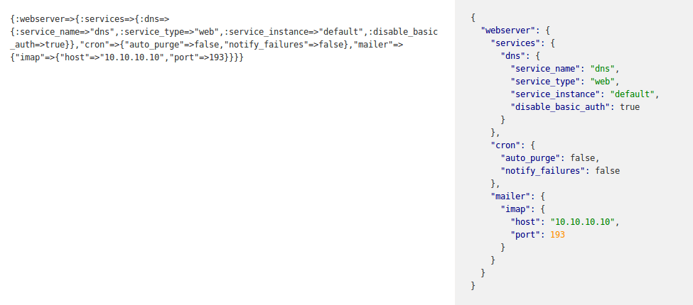

You want to keep some data but do not want to create the new column in the database? Your data should be stored in a form different from the one the user got to deal with?

The virtual attributes could help you! Let’s look at the main cases that come to our aid.

 on[ Unsplash](https://unsplash.com/?utm_source=unsplash&utm_medium=referral&utm_content=creditCopyText)](file_0.jpeg)

### What is ‘Virtual Attribute’?

The Virtual Attribute is a class attribute, which has no representation in the database. It becomes available after object initialization and remains alive while the object itself is available (like the instance methods). We defined some cases, where virtual attributes are useful and make the code and development more understandable.

Let’s check out how we use them in code samples below.

### Simple feature flag

For example, after submitting the form, the attribute has a value (a checkbox was marked). Depending on it, the specific scenario should be chosen. In other words, the virtual attribute could be used for running a hook.
```ruby
    class Post < ActiveRecord::Base
      attr_accessor :simple_feature_flag

      before_validation if: :simple_feature_flag do
        self.archived = true
      end
    end
```
This case has a feature — the virtual attribute can take any type of value.

Supporting the multiple types for the same variable could lead to a code smell. In Rails 5, ActiveRecord has an [attribute](https://api.rubyonrails.org/classes/ActiveRecord/Attributes/ClassMethods.html) class method. This method makes virtual attribute look like persistent model attribute, defines the type and allows being under [dirty tracking](https://api.rubyonrails.org/classes/ActiveModel/Dirty.html).
```ruby
    class Post < ActiveRecord::Base
     * *attribute :virtual_attribute_with_type_cast, :boolean
    end

    # Tests
    class VirtualAttributesUseCase < Minitest::Test
      def test_attribute_api
        post = Post.new virtual_attribute_with_type_cast: '1'
        assert_equal(
          true, 
          post.virtual_attribute_with_type_cast, 
          'type casting works'
        )
        assert(
          post.virtual_attribute_with_type_cast_changed?, 
          'dirty module has been enabled'
        )
      end
    end
```
### Decorator for storing the composite values

One of the most common usages of virtual attributes is decorating several model attributes in one parameter and splitting it back as it was originally used in the database. For example, the virtual attribute we use in the code sample below — ***author_full_name*** is stored as 2 separate columns in the DB table — ***author_first_name*** and ***author_last_name***, but here and now — we use these 2 columns together in ***author_full_name***.
```ruby
    class Post < ActiveRecord::Base
      def author_full_name
        [author_first_name, author_last_name].join(' ')
      end

      def author_full_name=(name)
        split = name.split(' ', 2)
        self.author_first_name = split.first
        self.author_last_name = split.last
      end
    end

    
    # Test
    class VirtualAttributesUseCase < Minitest::Test
      def test_virtual_attribute_with_custom_processing
        post = Post.create! author_full_name: 'John Doe'
        assert_equal 'John', post.author_first_name
        assert_equal 'Doe', post.author_last_name

        post = Post.create!(
          author_first_name: 'John',
          author_last_name: 'Doe'
        )
        assert_equal 'John Doe', post.author_full_name
      end
    end
```
### The transition from one data type to another, and vice versa

Let’s reproduce the situation when both user and a database are dealing with one format (e.g JSON) and business logic is dealing with another one (e.g. Hash).



Ideally, we need to register a new data type and add a virtual attribute of this type. In this way, it will take over all the work on the data: validation, transformation, and saving.

In our case let’s try to avoid the creation of new data type.
```ruby
    class Post < ActiveRecord::Base
      # input data should come in JSON format
      attribute :metadata_raw_json

      # transform to Hash format
      serialize :metadata, Hash
    ...
```
Let’s take a look at the conversion between data, which user sent from the form, and data, which could be stored in the database.
```ruby
    ...
    def metadata_raw_json=(value)
      # define instance variable to validate new data
      @metadata_raw_json = value

      self.metadata = build_metadata_from(@metadata_raw_json)
    end

    private

    # returns parsed data or nil
    def build_metadata_from(json)
      try_parse_metadata!(json)

      rescue JSON :: ParserError
      nil
    end

    # raise JSON::ParserError
    def try_parse_metadata!(value)
      ActiveSupport::JSON.decode(value)
    end
    ...
```
When the user entered an invalid parameter, the application should not save an object. The user should get back the error with the invalid parameter to be fixed. Important: the validation errors should be associated with attribute the user deals with ( e.g. ***metadata_raw_json*** we used here).
```ruby
    *...
    *validate: metadata_raw_json_valid_format, if: -> { 
      @metadata_raw_json.present? 
    }

    private

    def metadata_raw_json_valid_format
      errors.add(:metadata_raw_json, 'invalid JSON') unless 
        json(@metadata_raw_json)
    end

    def json(raw_json)
      try_parse_metadata!(raw_json)

      rescue JSON::ParserError
      false
    end
    *...*
```
Let’s play the scenario when data is rendered for a user. There are two options:

* data which is taken from the user (for example invalid data)

* data which is taken from the database (e.g. the first form rendering)
```ruby
    ...

    # returns new data or data which stores in DB
    def metadata_raw_json
      @metadata_raw_json || metadata.to_json
    end
    ...
```
### Conclusion

The virtual attribute is a good helper when you need a quick and easy solution creating the form fields which are not related to the database. They allow having more flexibility in user interface customizations. The great thing is that the developer is not limited to attributes backed by a database, but he can use virtual attributes as well.

**Sergey Sviridov** is a Software Engineer at [JetThoughts](https://www.jetthoughts.com/). Follow him on [LinkedIn](https://www.linkedin.com/in/sergey-sviridov-83007199) or [GitHub](https://github.com/SviridovSV).

**Roman Tershak** is a Software Engineer at **[JetThoughts](https://www.jetthoughts.com)**. Follow him on[ ](https://twitter.com/ChrisKeathley)[LinkedIn](https://www.linkedin.com/in/roman-tershak-0b3958103/) *or [GitHub](https://github.com/rtershak).*
>  *If you enjoyed this story, we recommend reading our [latest tech stories](https://jtway.co/latest) and [trending tech stories](https://jtway.co/trending).*
