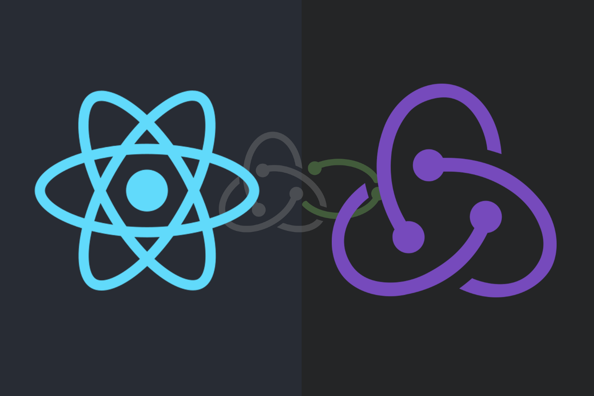

Are you familiar with the situation when the user clicks on a Load Data button 2 consecutive times at a rapid rate, the 2nd click will dispatch a request while the fetch fired on the first one hasn’t yet terminated? Then this blog post is for you.



In this post, we do not dive into what the [Redux-Saga](https://redux-saga.js.org/) is and how it works. This blog is already for those who know and know how to work with the Saga but encountered the problem of concurrent requests.

## Effects

To create Effects, you use the functions provided by the library in the redux-saga/effects package.

For example, suppose we have a Saga that watches a METRIC_REQUESTED action. On each matching action, it starts a task to fetch a list of products from a server.
```javascript
    import { takeEvery } from `redux-saga/effects`

    function* fetchMetric(action) {
      ...
    }

    function* watchFetchMetric() {
      yield takeEvery('METRIC_REQUESTED', fetchMetric)
    }
```
You will say that you can use the takeLatest effects of redux-saga. And you will be right because for sagas that are not asynchronous and so there is no reason to cancel them. takeLatest would work here as well but it might give a false indication when reading code that there is something to cancel.

An action might differ in some way with each invocation. E.g. imagine you have a metric and you are adding some filter with date range. Each time the action is triggered you get a different date range, even though it is the same action type. The user can add filters quicker than you get a response from the server. But just because you added multiple filters quickly doesn’t mean you want to stop the saga by adding the previous one.

So we need to avoid concurrent fetch requests with the same IDs.

## Let’s start!

Firstly, import required effects:
```javascript
    import { call, takeEvery, join, cancel, fork } from 'redux-saga/effects'
```
Add a function where they will fetch every action to Redux-Saga:
```javascript
    const takeLatestPerId = (pattern, worker, keySelector, ...args) => {
      return fork(function* () {
        let tasks = {}    yield takeEvery(pattern, function* (action) {
          const key = yield call(keySelector, action)      tasks[key] = yield fork(worker, ...args, action)      yield join(tasks[key])
        })
      })
    }
```
And all we have to do is add are some checks.

When a request by ID is already running:
```javascript
    if (tasks[key]) {
      yield cancel(tasks[key])
    }
```
When a task hasn’t yet returned or thrown an error:
```javascript
    if (tasks[key] && !tasks[key].isRunning()) {
      delete tasks[key]
    }
```
Now when Redux-Saga receives several queries with the same IDs we will fetch only the last concurrent request with the latest applied filters.
```javascript
    const takeLatestPerId = (pattern, worker, keySelector, ...args) => {
      return fork(function* () {
        let tasks = {}    yield takeEvery(pattern, function* (action) {
          const key = yield call(keySelector, action)      if (tasks[key]) {
            yield cancel(tasks[key])
          }      
          
          tasks[key] = yield fork(worker, ...args, action)      yield join(tasks[key])      if (tasks[key] && !tasks[key].isRunning()) {
            delete tasks[key]
          }
        })
      })
    }
```
The function call will look something like this:
```javascript
    yield all([
      takeLatestPerId(
        Actions.METRIC_REQUESTED,
        fetchMetric,
        ac => ac.payload.metric.id
      ),
    ])
```
## Consultation

That’s all and without any magic. I hope you found this post useful. Good luck and prosper!

**Andriy Parashchuk** is a Software Engineer at [JetThoughts](https://www.jetthoughts.com/). Follow him on [LinkedIn](https://www.linkedin.com/in/andriy-parashchuk-3aa56468/) or [GitHub](https://github.com/andriyParashchuk).
>  *If you enjoyed this story, we recommend reading our [latest tech stories](https://jtway.co/latest) and [trending tech stories](https://jtway.co/trending).*
