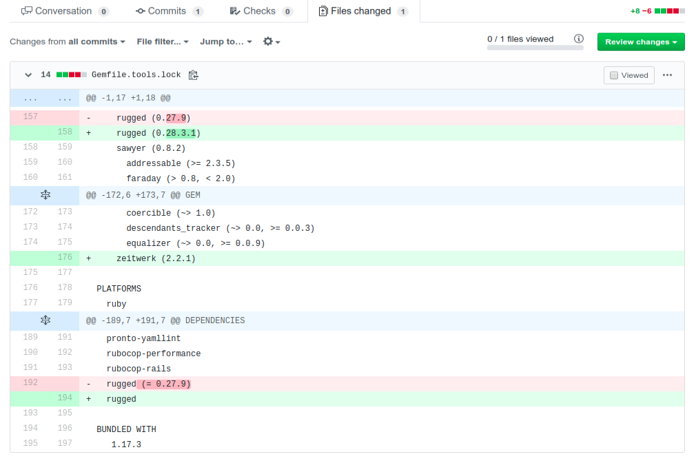

> ### Resolving the auto-upgrade issue will allow having edge gems versions with little to no effort. How could you achieve this with CI (specifically CircleCI)?



## Automatic update idea

CircleCI provides [scheduling](https://support.circleci.com/hc/en-us/articles/115015481128-Scheduling-jobs-cron-for-builds-) jobs and workflows. So you need to configure it to run updating script, which also needs to be prepared. That’s all!

## Updating Script

What the script has to do, step by step:

 1. Create and switch to the new branch with an informative title.

```bash
#!/usr/bin/env bash

current_date=`date +"%Y%m%d%H%M"`
new_branch_name="auto-upgrade-gemfile-dependencies-${current_date}"

git checkout -b $new_branch_name
```

2. Update gems (could be only preselected, that based on you) and return update results with messages.

```bash
#!/usr/bin/env bash

if bundle update; then
  echo 'Updated successfully'
  exit 0
else
  echo 'Failed to update\n'
  exit 1
fi
```

3. Create Pull Request for the new updates.

```bash
#!/usr/bin/env bash

git commit -am "Upgrades Gemfile dependencies"

git push https://$GITHUB_TOKEN@github.com/$CIRCLE_PROJECT_USERNAME/$CIRCLE_PROJECT_REPONAME.git -f 

curl -X POST                                                                                                             \  
  -H "Authorization: token ${GITHUB_TOKEN}"                                                                              \  
  -d '{"title":"Upgrade gemfile dependencies", "base":"master", "head":"'$CIRCLE_PROJECT_USERNAME':'$new_branch_name'"}' \  
  https://api.github.com/repos/$CIRCLE_PROJECT_USERNAME/$CIRCLE_PROJECT_REPONAME/pulls
```

*CIRCLE_PROJECT_USERNAME and CIRCLE_PROJECT_REPONAME* — it is CircleCI [built-in environment variables](https://circleci.com/docs/2.0/env-vars/#built-in-environment-variables).

*GITHUB_TOKEN* — this variable should be stored manually like [CircleCI Environment Variable.](https://circleci.com/docs/2.0/env-vars/)

Provide GitHub User name and email (they could have fake values) to have the ability to commit:

    git config user.name "jt-deployments"  
    git config user.email "circleci.bot@example.com"

Finally, the script will look like:

```bash
#!/usr/bin/env bash

set -e

echo "-----Create and switch to new branch-----"

current_date=`date +"%Y%m%d%H%M"`
new_branch_name="auto-upgrade-gemfile-dependencies-${current_date}"
git checkout -b $new_branch_name

echo "-----Run Gemfile update-----"

if bundle update; then
  echo 'Updated successfully'

  git config user.name "jt-deployments"
  git config user.email "circleci.bot@example.com"

  git commit -am "Upgrades Gemfile dependencies"
  git push https://$GITHUB_TOKEN@github.com/$CIRCLE_PROJECT_USERNAME/$CIRCLE_PROJECT_REPONAME.git -f

  curl -X POST                                                                                                           \
    -H "Authorization: token ${GITHUB_TOKEN}"                                                                            \
    -d '{"title":"Upgrade gemfile dependencies","base":"master","head":"'$CIRCLE_PROJECT_USERNAME':'$new_branch_name'"}' \
    https://api.github.com/repos/$CIRCLE_PROJECT_USERNAME/$CIRCLE_PROJECT_REPONAME/pulls
  exit 0
else
  echo 'Failed to update\n'
  exit 1
fi
```

## CircleCI configuration

For example, set the script to be invoked once a month at ten o’clock:

```bash
workflows:
  version: 2
  auto_upgrade_tools:
    triggers:
      - schedule:
          cron: "0 10 1 * *"
          filters:
            branches:
              only:
                - master
    jobs:
      - upgrade_gemfile
jobs:
  upgrade_tools:
    docker:
      - image: circleci/ruby:2.6-stretch-node
    steps:
      - checkout
      - run:
          name: Install Bundler
          command: |
            echo 'export BUNDLER_VERSION=$(cat Gemfile.lock | tail -1 | tr -d " ")' >> $BASH_ENV
            source $BASH_ENV
            gem install bundler:$BUNDLER_VERSION
      - run: sudo apt-get install cmake
      - run:
          name: Run Gemfile update in separate branch
          command: |
            ./bin/circleci-auto_upgrade_tools
```

## Automate everything possible

This way you can not worry about updating the dependencies. Trying to automate such activity helps to save time and increase your productivity. It is good to have more time for creative work.

## Link to complete script

You can find this script as well as other optimization tricks in our repository [jetthoughts/jt_tools](https://github.com/jetthoughts/jt_tools/blob/master/lib/install/bin/circleci-auto_upgrade_tools).

**Sergey Sviridov** is a Software Engineer at [JetThoughts](https://www.jetthoughts.com/). Follow him on [LinkedIn](https://www.linkedin.com/in/sergey-sviridov-83007199) or [GitHub](https://github.com/SviridovSV).
>  *If you enjoyed this story, we recommend reading our [latest tech stories](https://jtway.co/latest) and [trending tech stories](https://jtway.co/trending).*
