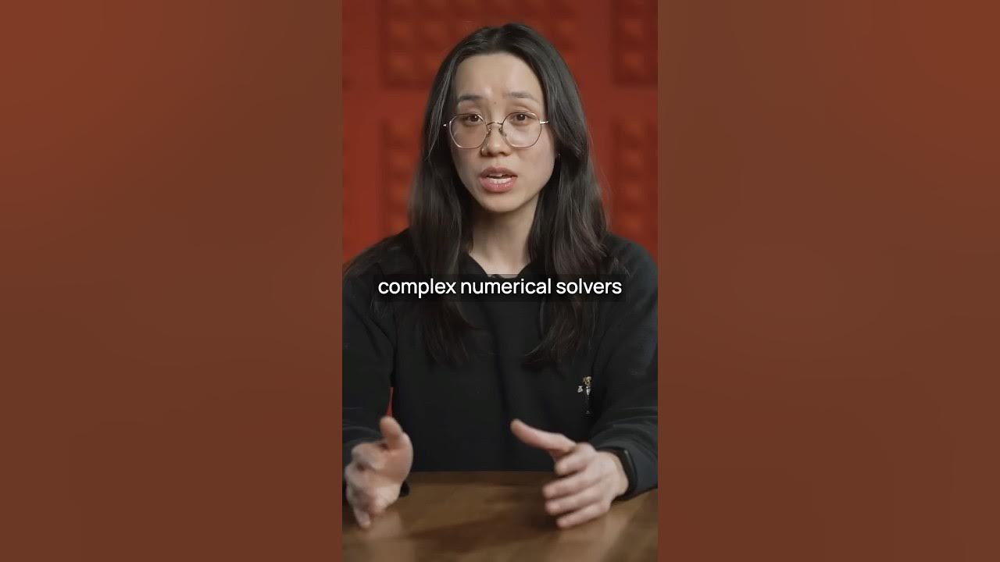

Engineering tools have been stuck in a time warp for decades. Think about it: CAD software for mechanical design, EDA tools for circuit design, and CFD tools for fluid analysis. They all rely on complex numerical solvers and physics simulations. These tools are not just old; they are also **computationally expensive** and often require a PhD to use effectively. But what if that could change?

We believe the next generation of **AI-powered tools** will transform the engineering landscape. Imagine a world where engineers can design and build physical systems like planes, buildings, circuits, and satellites faster and better than ever before. This is not just a dream; it’s a future we are eager to see unfold.

### Key Takeaways

*   Current engineering tools are outdated and complex.
*   AI can simplify and enhance engineering processes.
*   The future holds promise for faster and better designs.

### The Current State of Engineering Tools

Engineering tools have barely evolved in decades. Here’s a quick rundown of the main types:

*   **CAD (Computer-Aided Design)**: Used for mechanical design.
*   **EDA (Electronic Design Automation)**: Used for circuit design.
*   **CFD (Computational Fluid Dynamics)**: Used for fluid and thermal analysis.

These tools are essential, but they come with a steep learning curve. Many engineers spend years mastering them. This complexity can slow down innovation and creativity.

### The Role of AI in Engineering

AI is changing the game. With new AI models, we can integrate **reasoning capabilities** that can solve math and physics problems. This means:

1.  **Simplified Processes**: Engineers won’t need to be experts in complex numerical methods.
2.  **Faster Prototyping**: Designs can be tested and modified quickly.
3.  **Enhanced Creativity**: Engineers can focus on innovative solutions rather than getting bogged down in technical details.

### What’s Next?

We are excited to see founders step up and create AI-aided engineering tools. These tools will not only drive transformation but also empower engineers to push boundaries. Here’s what we hope to see:

*   **User-Friendly Interfaces**: Tools that anyone can pick up and use without years of training.
*   **Integration of AI**: Seamless incorporation of AI to assist in design and analysis.
*   **Collaboration Features**: Tools that allow teams to work together more effectively, regardless of location.

### Conclusion

The future of engineering is bright with AI. We are on the brink of a revolution that will change how we design and build. The next generation of engineering tools will not just be about solving problems; they will be about unleashing creativity and innovation.

So, if you’re a founder with a vision for AI-aided engineering tools, now is the time to act. Let’s build a future where engineering is accessible, efficient, and exciting!
