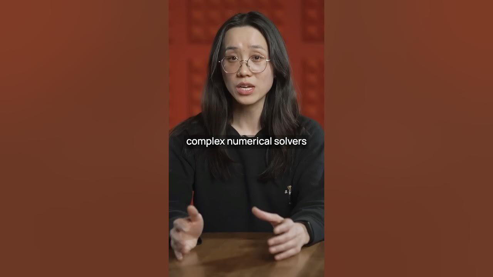

Engineering tools for the physical world have seen little change over the years. Traditional software like CAD, CAM, and EDA still depend on complex numerical solvers and physics simulations. These methods are not only costly but also require extensive training, often demanding a PhD to use effectively.

However, the future looks bright. We believe that the next generation of **AI-powered tools** will transform the engineering landscape. Imagine a world where engineers can design and build physical systems—like planes, buildings, circuits, chips, and satellites—faster and better than ever before.

### Key Takeaways

*   Traditional engineering tools are outdated and complex.
*   AI can simplify and enhance engineering processes.
*   The future of engineering lies in AI-aided tools.

### The Current State of Engineering Tools

Engineering tools have barely evolved in decades. Here’s a quick look at some of the traditional tools:

*   **CAD (Computer-Aided Design)**: Used for mechanical design.
*   **CAM (Computer-Aided Manufacturing)**: Helps in manufacturing processes.
*   **EDA (Electronic Design Automation)**: Used for circuit and ship design.
*   **CFD (Computational Fluid Dynamics)**: For fluid and thermal analysis.

These tools rely heavily on complex numerical solvers and physics simulations. They are computationally expensive and require a steep learning curve.

### The Need for Change

The engineering world is changing. As technology advances, the tools we use must evolve too. Here’s why:

1.  **Cost**: Traditional tools can be expensive to run and maintain.
2.  **Accessibility**: Not everyone has the time or resources to get a PhD in engineering.
3.  **Speed**: Engineers need to work faster to keep up with demands.

### Enter AI: The Game Changer

AI is set to revolutionize engineering tools. Here’s how:

*   **Simplified Processes**: AI can automate complex calculations, making it easier for engineers to focus on design.
*   **Enhanced Capabilities**: New AI models can solve math and physics problems more efficiently.
*   **Faster Prototyping**: Engineers can create and test designs quickly, reducing time to market.

### The Future of AI-Aided Engineering Tools

We are excited to see founders step up and build these AI-aided engineering tools. The potential is enormous. With AI, we can:

*   **Unleash Creativity**: Engineers can explore new designs without being bogged down by complex calculations.
*   **Improve Collaboration**: Teams can work together more effectively with tools that are easier to use.
*   **Drive Innovation**: Faster and better designs can lead to groundbreaking advancements in technology.

In conclusion, the next generation of engineering tools powered by AI is on the horizon. This transformation will not only change how we design and build but also open up new possibilities for innovation. The future is bright, and we can’t wait to see what’s next!
