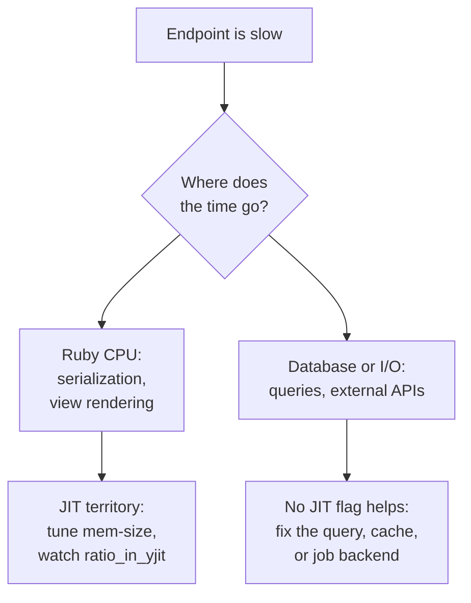

> **Updated August 2026.** This guide originally covered YJIT on Ruby 3.4. [Ruby 4.0 shipped on December 25, 2025](https://www.ruby-lang.org/en/news/2025/12/25/ruby-4-0-0-released/) with a second JIT compiler, so the advice below now covers both.

Ruby 4.0 ships two JIT compilers in the same binary. YJIT is the one your Rails app is probably already running without you having configured anything. ZJIT is its successor, and the release notes that introduce it also tell you not to deploy it.

If you're mid-upgrade, that combination reads as a contradiction. Sorting it out takes about ten minutes of checking and, on most apps, zero new flags.

## You may already be running YJIT

Every Rails 8 app has YJIT on out of the box whenever it boots on Ruby 3.3 or newer - the default [arrived back in Rails 7.2](https://rubyonrails.org/2024/8/10/Rails-7-2-0-has-been-released) as [a one-line initializer inside the framework defaults](https://github.com/rails/rails/pull/49947), and it lands silently for anyone who upgrades and runs `load_defaults` at 7.2 or later.

So before tuning anything, check:

```bash
bin/rails runner 'puts RubyVM::YJIT.enabled?'
```

If that prints `false` on Ruby 3.3+, the usual culprit is an app that climbed to Rails 8 through upgrades without ever adopting the newer framework defaults. Set `config.yjit = true` in `config/application.rb`, or enable it late in boot:

```ruby
# config/initializers/enable_yjit.rb
RubyVM::YJIT.enable
```

Enabling after boot skips a cost the `--yjit` flag pays: initializer and boot-time code runs once, and compiling it wastes JIT memory. On Ruby 4.0, `RubyVM::YJIT.enable` also accepts `mem_size:` and `call_threshold:` keywords, [added in the 4.0 release](https://www.ruby-lang.org/en/news/2025/12/25/ruby-4-0-0-released/), so you can tune it without touching command-line flags.

Plenty of upgrade checklists end right here: it was already on.

## What YJIT is worth in 2026

On the official benchmark suite at [speed.ruby-lang.org](https://speed.ruby-lang.org/) (numbers as of August 2026 - it's a live dashboard, so expect drift), current YJIT runs the headline benchmarks at roughly 2x interpreter speed, and `railsbench` at about 2.2x. The same dashboard shows YJIT on the 4.x line beating YJIT 3.4.7 by 8.4% geomean, with railsbench 17.1% faster, so the 3.4 to 4.0 upgrade is itself a performance change even if you touch nothing else.

The benchmark says 2x; your app may measure a single-digit gain. Both numbers are honest. Railsbench is CPU-bound Ruby; your checkout endpoint spends most of its time waiting on Postgres and Stripe, and no JIT speeds up waiting. The Rails team's own framing when they made YJIT the default was [15-25% latency improvement](https://rubyonrails.org/2024/8/10/Rails-7-2-0-has-been-released) on real applications. The win lands on Ruby-heavy paths like serialization and view rendering, not on I/O.

The same logic applies in reverse: a database-bound endpoint needs database work, not a JIT flag. Cheaper wins usually live in the infrastructure around Ruby - [moving jobs to Solid Queue](/blog/rails-8-solid-queue-migration-guide/), [dropping Redis for Solid Cache](/blog/rails-8-solid-cache-performance-redis-migration/), or [switching to Falcon when the bottleneck is waiting on I/O](/blog/falcon-web-server-async-ruby-production/).



YJIT costs memory. Compiled machine code and its metadata are capped by `--yjit-mem-size`, [128 MiB by default](https://github.com/ruby/ruby/blob/master/doc/jit/yjit.md), on top of your app's normal footprint. On a 512 MB container that is not a rounding error, and it is the first number to revisit when a post-upgrade pod starts flirting with its memory limit.

## The two flags that matter

YJIT exposes a dozen options. Two of them earn attention on a production Rails app, per [the official YJIT documentation](https://github.com/ruby/ruby/blob/master/doc/jit/yjit.md):

- `--yjit-mem-size` (default 128 MiB) - the soft cap on everything YJIT allocates. Raise it if stats show compilation stopping early; lower it on small containers.
- `--yjit-call-threshold` (default 30, rising automatically to 120 on apps with over 40k ISEQs) - how many calls before a method compiles. Most apps never need to touch it.

To see whether any of this is working, run with `--yjit-stats=quiet` and read the counters:

```ruby
stats = RubyVM::YJIT.runtime_stats
stats[:ratio_in_yjit]   # % of instructions run as machine code; healthy apps sit near 99
stats[:code_region_size] # bytes of generated code, your mem-size budget in action
stats[:side_exit_count]  # how often compiled code fell back to the interpreter
```

A `ratio_in_yjit` in the low 90s usually means the memory cap bit before compilation finished. Raise `mem_size:` and measure again.

Compiled code dies with the process. A worker-killer that recycles Pumas every 30 minutes throws away every compiled block and re-pays the warmup, so [the YJIT docs recommend](https://github.com/ruby/ruby/blob/master/doc/jit/yjit.md) letting processes live as long as memory allows. If you added aggressive worker recycling years ago to mask a leak, it is now taxing your JIT too.

## ZJIT: the successor you should test, not deploy

Ruby 4.0's second compiler is [ZJIT, built by the same Shopify team as the next generation of YJIT](https://railsatscale.com/2025-12-24-launch-zjit/). Where YJIT compiles small basic blocks lazily, ZJIT compiles whole methods through an SSA intermediate representation - a deliberately textbook design that, per the launch post, exists so more compiler engineers can contribute to it. The same post details what the bigger compilation unit buys: inline versions of well-known C methods, and register spilling that lets it handle enormous functions. When its type assumptions break, it side-exits back to the interpreter.

What it cannot do yet is beat YJIT. The release notes are blunt: ZJIT is faster than the interpreter but not as fast as YJIT, and the stated goal for [Ruby 4.1 is to make ZJIT faster than YJIT and production-ready](https://www.ruby-lang.org/en/news/2025/12/25/ruby-4-0-0-released/). The launch post goes further: "You should expect crashes and wild performance degradations (or, perhaps, improvements)."

Trying it takes one flag on a canary or staging box:

```bash
ruby --zjit myscript.rb
# or
RUBY_ZJIT_ENABLE=1 bin/rails server
# or at runtime
RubyVM::ZJIT.enable
```

Building Ruby from source with ZJIT needs Rust 1.85.0 or newer; a prebuilt binary only includes it if it was compiled that way, which official releases are.

ZJIT's team improves it against reports from real workloads, and a staging box that mirrors your traffic produces exactly those reports.

## When not to enable a JIT

Short-lived processes rarely repay compilation. A rake task that runs for 40 seconds spends its life below the call threshold or throwing away code it just compiled.

Watch the trap here: a `config/initializers/` enable runs for rake tasks and `rails runner` too, not just the server - initializers execute whenever the Rails environment loads. If your cron boxes are memory-tight, guard the call or move it somewhere only the server executes, like Puma's config file. Otherwise leave the framework default on and size memory for it.

Test suites are a judgment call. Spec processes are short-lived and restart constantly, so the warmup often costs more than the speedup returns; if CI time matters, benchmark one run with YJIT disabled before assuming the default helps you there.

And on memory-starved containers, do the arithmetic first. The JIT's headroom has to come from somewhere, and an OOM-killed worker is slower than interpreted Ruby. CPU spent inside Ruby is also worth auditing before you tune the compiler that runs it - [compression settings on encrypted columns](/blog/ruby-on-rails-8-custom-compression-for-encrypted-data/) are a classic example of cores burning where no JIT flag fixes anything.

## The short version

Check `RubyVM::YJIT.enabled?` before changing anything, because Rails has probably already decided for you. Upgrade to Ruby 4.0 and take the free 17% on Rails-shaped workloads. Leave ZJIT out of production this year, but give it a staging box and file what you find - Ruby 4.1 is where the successor is supposed to overtake its parent.

If you want a second pair of eyes on a Rails app whose response times stopped making sense, our [Rails development team](/services/app-web-development/) does this work: profiling first, JIT flags only when the profile says Ruby CPU is the bottleneck.

**Further reading:**

- [Ruby 4.0.0 release notes](https://www.ruby-lang.org/en/news/2025/12/25/ruby-4-0-0-released/) - the primary source for what changed
- [ZJIT launch post on Rails at Scale](https://railsatscale.com/2025-12-24-launch-zjit/) - architecture and roadmap from the team building it
- [speed.ruby-lang.org](https://speed.ruby-lang.org/) - continuously updated JIT benchmarks
- [Official YJIT documentation](https://github.com/ruby/ruby/blob/master/doc/jit/yjit.md) - every flag and counter referenced above
- [Rails 7.2 release announcement](https://rubyonrails.org/2024/8/10/Rails-7-2-0-has-been-released) - the change that made YJIT a default

<!-- Reference cadence: thoughtbot -->
