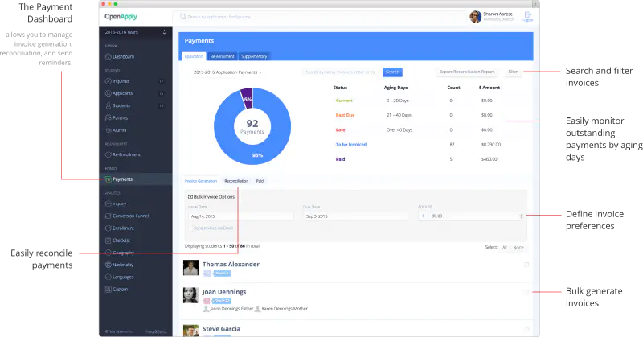

OpenApply is a smart software platform that makes admissions and enrollment easier for students worldwide. They aim to provide a smooth, paperless online experience that benefits students and schools.

With rapid growth, OpenApply needed help from JetThoughts to fix code problems, enhance user experience, add new features, and improve their internal workflows.

## Vision

OpenApply had a clear mission: to overhaul its tech operations. It aimed to reduce bugs, upgrade its user interface, speed up development times, and improve software quality. To meet growing demand, it needed to upgrade both its software and processes.

## Problem

After a successful launch, OpenApply faced significant challenges as its user base grew. The company's product wasn't built to handle this increase, leading to:

- An outdated user interface
- Numerous bugs
- Limited features

They realized major changes were necessary to keep customers satisfied.

## Solution

To tackle these issues, JetThoughts provided a part-time Fractional Chief Technology Officer (CTO) to lead the project and two full-time developers to support OpenApply's team. Additionally, we assigned a project advisor to ensure clear communication and alignment with OpenApply's leadership.

## Approach

From the start, JetThoughts delivered valuable technical guidance based on years of experience. We met to set clear expectations, learn about the current software, and outline our plan.

1. **Stabilizing Code:** We focused on fixing existing bugs while implementing analytics and coding standards to prevent future issues.
   
2. **User Interface Redesign:** Collaborating with OpenApply, we redesigned the user interface and upgraded the Ruby on Rails backend.

3. **Optimizing Development Processes:** We streamlined internal development processes to boost efficiency.

## Outcome

JetThoughts successfully transformed OpenApply's challenges into triumphs!

- Improved from F to A on Code Climate, making it more reliable for the future.
- Reduced from 2 minutes to 25 seconds, speeding up debugging.
- Decreased from 2 minutes to 20 seconds, boosting user satisfaction.
- Improved from 3 to 0.2 seconds, leading to faster page loads.
- Onboarding time was cut from 2 weeks to 20 minutes.

## Business Impact

With increased customer demand, having stable and reliable software became crucial for OpenApply. JetThoughts addressed immediate issues and laid the foundation for future growth.

We rewrote significant parts of the code, allowing new features to be rolled out in just two days—down from two weeks. This change dramatically reduced costs and sped up response times for customer needs.

## Final Thoughts

JetThoughts' partnership with OpenApply stabilized their product and set the groundwork for future success. With an empowered internal team, upgraded software, and streamlined processes, OpenApply is now fully equipped to enhance the admissions experience for students and schools—making the process smoother and less stressful for everyone involved.

If you're ready to transform your software and tackle your challenges, JetThoughts is here to help! Let's connect and discuss how we can support your journey toward innovative solutions and sustainable growth. Reach out to us today!