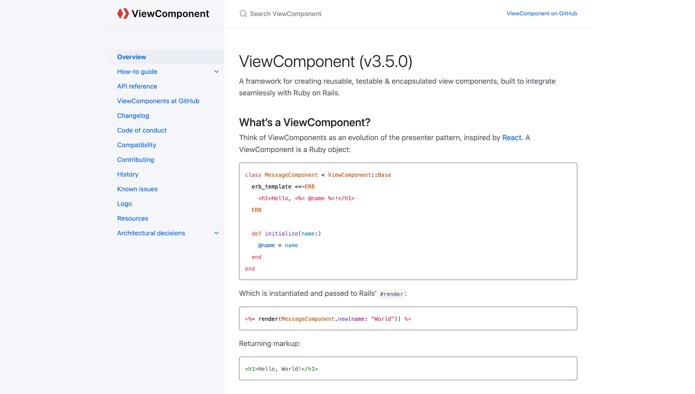
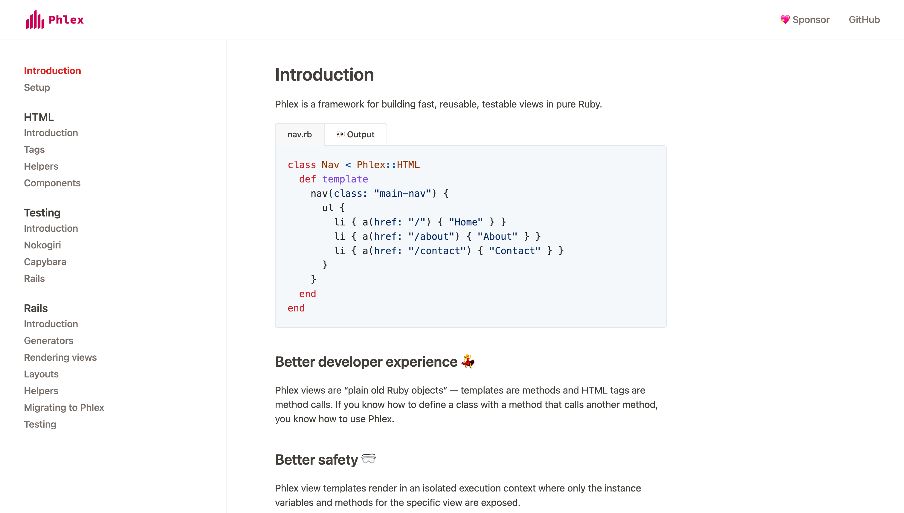
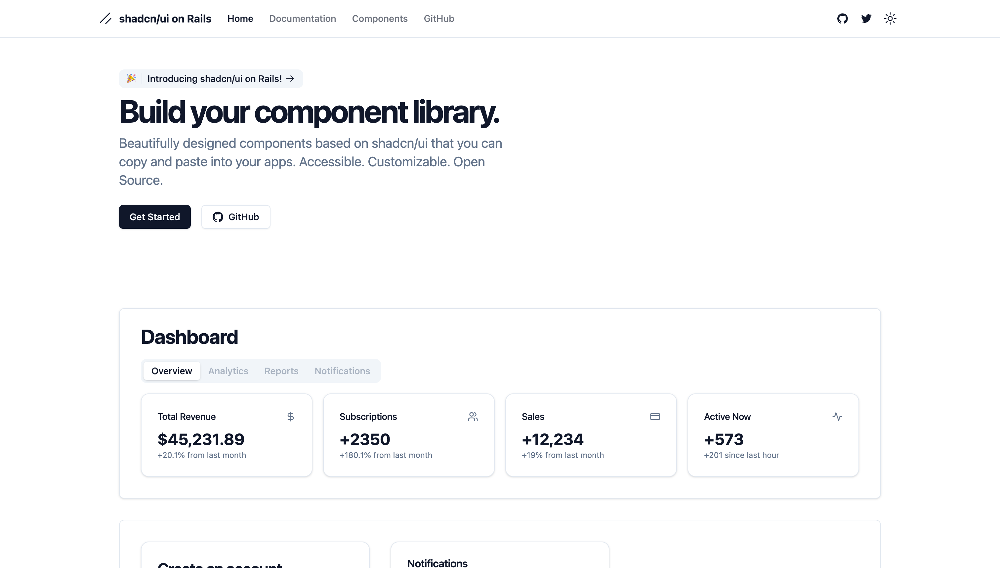
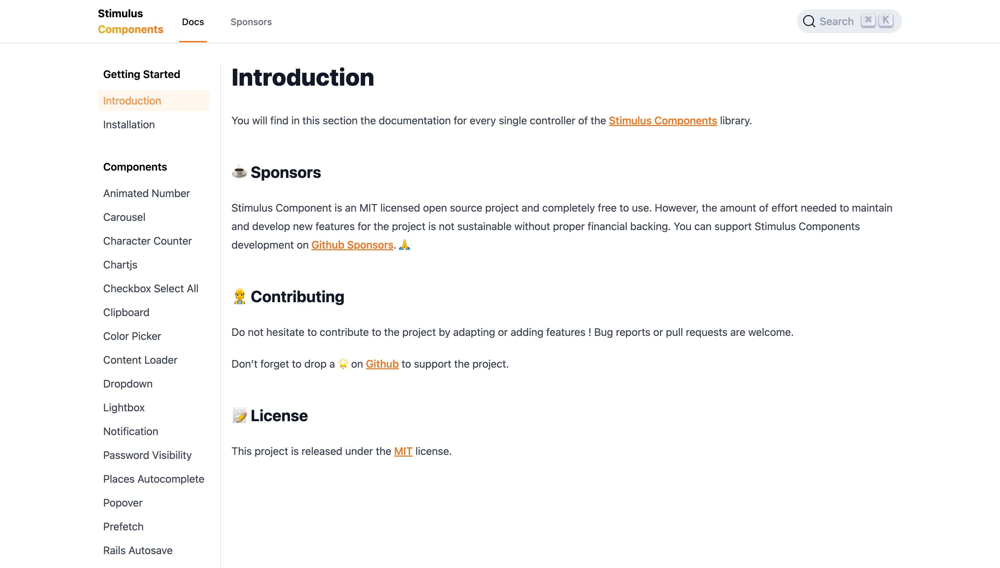
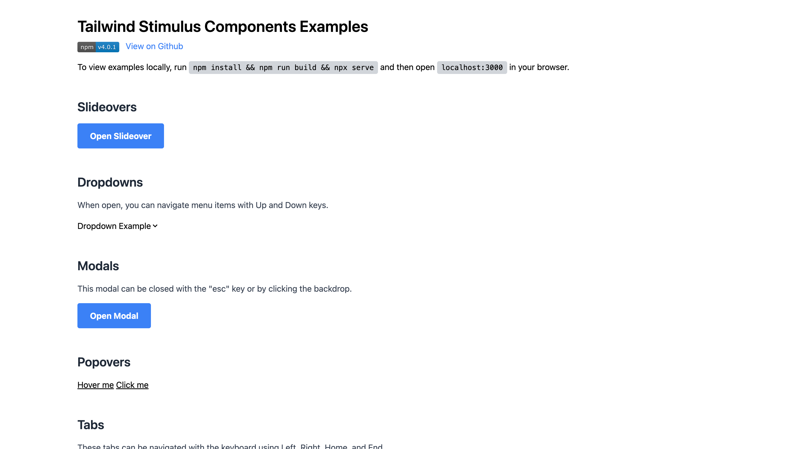
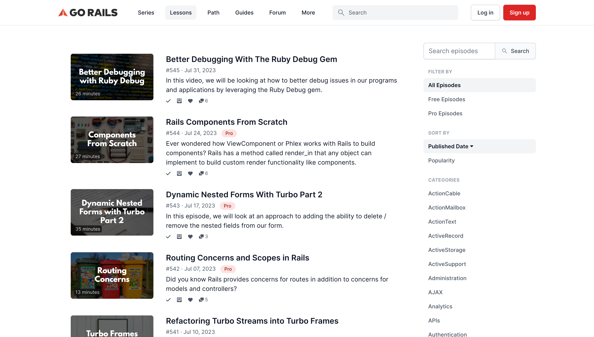
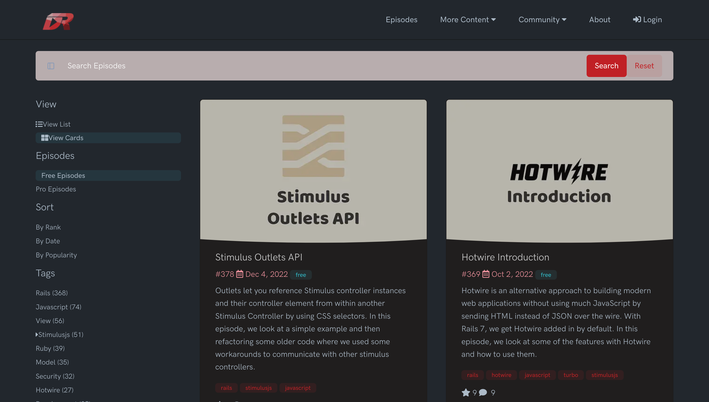
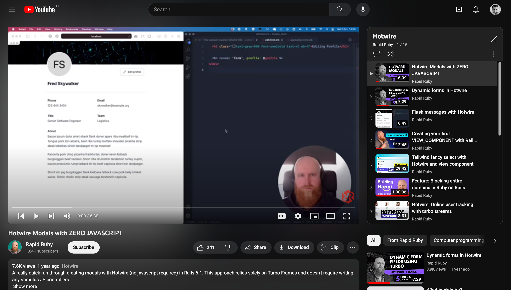
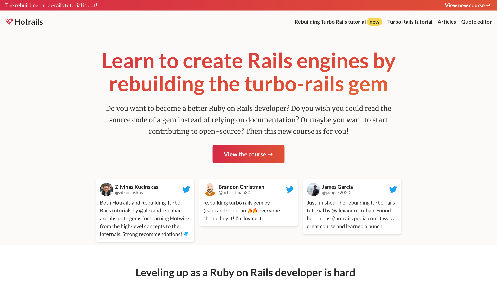

🚀 Excited to share some awesome resources to help front-end developers onboard into the Ruby on Rails Views kitchen! 🎉

1️⃣ **ViewComponent:** If you're looking for a powerful way to build Rails views, look no further! Check out ViewComponent, the first component-based library in the Rails world. It allows you to break down complex UIs into reusable and manageable components, making your codebase cleaner and more maintainable. Head over to https://viewcomponent.org to dive into the magic of component-driven development in Rails.

2️⃣ **Phlex:** Another excellent alternative to explore is Phlex, a versatile component library for Rails. It offers a unique approach to building UIs, and you can find more about it at https://www.phlex.fun. Pick the one that suits your project best and get started building amazing user interfaces!

3️⃣ **Shadcn Rails Components Approach:** If you prefer a convention-based approach without relying on any external libraries, Shadcn Rails Components is a great choice. It provides good ideas to follow while crafting your Rails views. Check out the documentation at https://shadcn.rails-components.com/docs/helpers to learn how to create clean and structured views.

## 🎈 But wait, there's more! Let's talk about Stimulus Components:

**Stimulus Components:** Want to add interactivity to your Rails views? Stimulus is the way to go! Explore a variety of Stimulus components at https://www.stimulus-components.com and supercharge your UIs with minimal JavaScript.

**TailwindCSS Stimulus Components:** For those who love using TailwindCSS, there's an awesome collection of TailwindCSS-based Stimulus components created by @excid3. Check them out on GitHub: https://github.com/excid3/tailwindcss-stimulus-components and level up your frontend game.

## 💡 Now, let's tackle Hotwire solutions:

**GoRails Screencasts:** Join the Hotwire journey with the comprehensive screencasts from GoRails. They offer practical insights and hands-on tutorials to help you make the most of Hotwire in your Rails projects. Start learning here: https://gorails.com/episodes/tagged/Hotwire

**Drift Screencasts:** DriftingRuby also has a fantastic selection of screencasts focused on Hotwire and Stimulus. Dive into the world of interactivity and see how Stimulus can enhance your Rails views. Check out the collection at https://www.driftingruby.com/episodes?pro=false&query%5Bname%5D=&tag=stimulusjs

**Rapid Ruby Screencasts:** Looking for a quick way to understand Hotwire's capabilities? Rapid Ruby offers a concise and insightful introduction to Hotwire. Get started with this playlist: https://www.youtube.com/watch?v=WK16FeBfbxI&list=PL2OcwqOUtdpCqddncOH61f0phQKtum3yQ

**[Hotrails.dev](https://hotrails.dev):** For a compilation of various Hotwire tutorials, hotrails.dev is the place to go! Find a treasure trove of resources to master the art of building interactive Rails views.

---

🌟 There you have it! With these resources, you'll be well-equipped to dive into Ruby on Rails Views and Hotwire. Happy coding and feel free to reach out if you have any questions or need further guidance. Remember, you've got this! 💪 

---

**Paul Keen** is an Open Source Contributor and a Chief Technology Officer at [JetThoughts](https://www.jetthoughts.com). Follow him on [LinkedIn](https://www.linkedin.com/in/paul-keen/) or [GitHub](https://github.com/pftg).

If you enjoyed this story, we recommend reading our [latest tech stories](https://jtway.co/latest) and [trending tech stories](https://jtway.co/trending).

