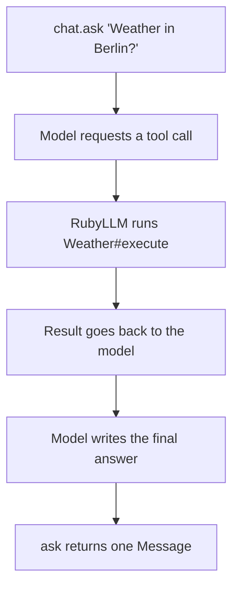

Adding a second LLM provider is where the wrapper class dies. The OpenAI client you wrote in an afternoon buries its text under `choices[0].message.content`; Anthropic shapes its responses differently and streams differently, so your service object grows a case statement and then a retry matrix. Six months in, you're maintaining a worse version of a gem that already exists.

[RubyLLM](https://rubyllm.com) gives Rails one interface for all of it. `RubyLLM.chat` speaks to OpenAI, Anthropic, Gemini, Ollama, and any OpenAI-compatible endpoint through the same handful of methods, and the whole thing rests on [three dependencies: Faraday, Zeitwerk, and Marcel](https://github.com/crmne/ruby_llm).

The gem sits at [version 1.16.0 as we write this](https://rubygems.org/gems/ruby_llm) - and there are still jobs where we'd skip it entirely.

## One interface, three dependencies

Install is a Gemfile line; Ruby 3.1.3 or newer is required, per the gemspec.

```ruby
# Gemfile
gem "ruby_llm"
```

Configuration lives in an initializer, and you only set keys for the providers you actually use:

```ruby
# config/initializers/ruby_llm.rb
RubyLLM.configure do |config|
  config.openai_api_key = ENV["OPENAI_API_KEY"]
  config.anthropic_api_key = ENV["ANTHROPIC_API_KEY"]
end
```

That's enough for a working conversation:

```ruby
chat = RubyLLM.chat
response = chat.ask "Rank these three error messages by clarity: ..."
response.content
```

Want a different model? Pass `model:` to `RubyLLM.chat` and nothing else in your code changes - swapping OpenAI for Anthropic during a provider outage becomes a config change instead of a rewrite.

RubyLLM also speaks Ollama, so the same interface reaches models running on your own hardware; if self-hosting is the direction you're leaning, start with our [guide to running local LLMs in Rails](/blog/working-with-llms-in-ruby-on-rails-simple-guide-llm/).

## Persistence: chat rows and message rows

Homegrown wrappers usually fall apart at persistence. RubyLLM's [Rails generator](https://rubyllm.com/rails/) creates migrations for chats, messages, tool calls, and a model registry, then hooks ActiveRecord models onto them (`load_models` fills that registry - the table tracking which models exist and what they can do):

```bash
bin/rails generate ruby_llm:install
bin/rails db:migrate
bin/rails ruby_llm:load_models
```

```ruby
class Chat < ApplicationRecord
  acts_as_chat
end

class Message < ApplicationRecord
  acts_as_message
end
```

From there, calling `ask` on a `Chat` record persists both sides of the exchange without any code from you: the user message saves first, an empty assistant message appears when the response starts, and that row fills in as the answer completes. When the API call fails, the gem destroys the empty assistant row instead of leaving half a conversation behind.

You never call `save` yourself.

One gotcha is documented but easy to blow past: don't add `validates :content, presence: true` to your `Message` model. Assistant rows are created empty by design, so that validation quietly breaks the persistence flow.

## Tools: the model calls your Ruby

LLM features start earning their keep when the model can touch live data - a price lookup, an account query - instead of guessing from its training set. A [tool in RubyLLM](https://rubyllm.com/tools/) is a plain class:

```ruby
class Weather < RubyLLM::Tool
  description "Gets current weather for a location"

  param :latitude, desc: "Latitude of the location"
  param :longitude, desc: "Longitude of the location"

  def execute(latitude:, longitude:)
    # call your weather service here
  end
end
```

The `param` lines are optional. Since v1.15, RubyLLM [infers the JSON schema](https://rubyllm.com/tools/) straight from `execute`'s keyword arguments, so a simple tool is just a description and a method.

Attach it and ask:

```ruby
chat.with_tool(Weather).ask "What's the weather in Berlin?"
```

Here's the round trip the gem runs for you:



All six steps happen inside a single `ask` call; you only define `execute`.

For recoverable failures the documented convention is returning `{ error: "Location too short" }` so the model can react and retry, while real bugs like missing configuration should raise.

Treat every argument the model passes to `execute` as untrusted form input: skip `eval`, and never interpolate it into SQL.

## Streaming into a Turbo view

Eight seconds of spinner is a long time in a chat UI, so pass a block to `ask` and RubyLLM hands you [normalized chunks as they arrive](https://rubyllm.com/streaming/) - every provider, no server-sent-event parsing on your side:

```ruby
chat.ask "Draft a welcome email" do |chunk|
  print chunk.content
end
```

The block receives fragments while `ask` still returns the complete `RubyLLM::Message` at the end, so persistence keeps working.

In Rails this belongs in a background job. Your controller enqueues the job with the user's question; the job appends it to the chat, then calls `chat.complete` - RubyLLM's "generate the reply to whatever is pending" method - and broadcasts each chunk over Turbo Streams:

```ruby
class ChatStreamJob < ApplicationJob
  def perform(chat_id, question)
    chat = Chat.find(chat_id)
    chat.messages.create!(role: "user", content: question)
    chat.complete do |chunk|
      next unless chunk.content
      Turbo::StreamsChannel.broadcast_append_to(
        "chat_#{chat.id}",
        target: "chat_#{chat.id}_response",
        html: ERB::Util.html_escape(chunk.content)
      )
    end
  end
end
```

That `html_escape` is not optional: model output is the same trust boundary as the tool arguments above, and it can quote user-supplied text containing markup. Escaped chunks keep the demo honest; a production version accumulates into the message row and renders a partial.

Subscribe in the view and the tokens land as they're generated:

```html
<%= turbo_stream_from "chat_#{@chat.id}" %>
<div id="chat_<%= @chat.id %>_response"></div>
```

Caveats before this hits production. Action Cable doesn't guarantee ordering under concurrent processing, so chunks can render out of order; the RubyLLM docs suggest client-side reordering or AnyCable when that bites. ActiveJob retries after a mid-stream failure will re-append chunks, so cap retries or make the job idempotent.

Streamed responses also hold a connection open for the life of the generation, which changes your server math once many users chat at once. We did that arithmetic in [Ruby fibers for LLM streaming](/blog/fibers-async-ruby-llm-streaming-rails/), and the production server side lives in [our Falcon post](/blog/falcon-web-server-async-ruby-production/).

## When NOT to use RubyLLM

Skip it when plain HTTP would do. If you're calling one provider at one endpoint with no conversation state, a small Faraday client and one test cover it - a gem with four migrations and a model registry is more machinery than the job needs.

If your feature is a pipeline - prompt templates feeding output parsers feeding a vector store - you want an orchestration library rather than a clean client, and that's [LangChain.rb territory](/blog/getting-started-langchain-ruby-complete-guide/), which brings its own surface area to maintain.

New provider features lag behind any abstraction. When OpenAI or Anthropic ships a beta API, RubyLLM wraps it after a release cycle rather than the day of the announcement, so a product that depends on the newest knob should call that one endpoint directly and keep RubyLLM for the rest.

For retrieval-augmented generation, RubyLLM covers the embeddings call and nothing else - chunking, storage, and search design stay your problem. Our [pgvector RAG guide](/blog/building-rag-applications-rails-pgvector/) covers that half of the build.

## Where to start

Pick the smallest feature in your backlog that touches an LLM - a summarizer, a support-reply drafter - and build it with plain `RubyLLM.chat` before touching the Rails generator. Add persistence and streaming after the plain version proves the feature.

Test it like any HTTP dependency. Stub `RubyLLM.chat` at the boundary in unit tests and record one cassette for the integration path, because a CI suite that hits a paid API is a flaky bill.

If you're adding AI features to a Rails product and want a team that has shipped the whole loop in production - persistence, streaming, and the boring parts included - our [app and web development team](/services/app-web-development/) does exactly that.

Further reading:

- [RubyLLM documentation](https://rubyllm.com) - the guides are short and current
- [Rails integration guide](https://rubyllm.com/rails/) - generator, `acts_as_chat`, broadcasting
- [Tools guide](https://rubyllm.com/tools/) - schema inference, error conventions, security notes
- [Streaming guide](https://rubyllm.com/streaming/) - chunk anatomy and mid-stream errors
- [ruby_llm on GitHub](https://github.com/crmne/ruby_llm) - source, changelog, issues

<!-- Reference cadence: thoughtbot -->
