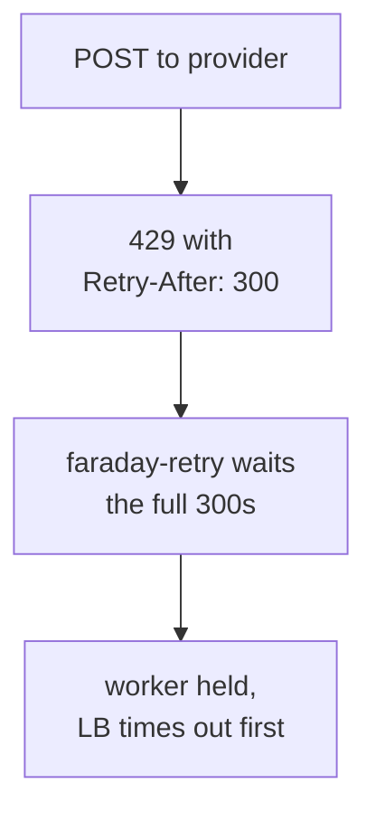

One line in `ruby_llm` and one option it never sets decide how your app behaves when a provider is having a bad day, and neither is visible from your own code.

The line is in `connection.rb`:

```ruby
methods: Faraday::Retry::Middleware::IDEMPOTENT_METHODS + [:post],
```

Faraday's list is `delete get head options put`. POST is absent by design, because a retried POST can do the thing twice. `ruby_llm` adds it back, and it has to - every chat completion is a POST, so a gem that respected Faraday's default would never retry a single completion.

## What actually triggers a retry

Nine conditions, from `connection.rb`:

| Kind | Conditions |
|---|---|
| Network | `Errno::ETIMEDOUT`, `Timeout::Error`, `Faraday::TimeoutError`, `Faraday::ConnectionFailed` |
| Provider | `RateLimitError`, `ServerError`, `ServiceUnavailableError`, `OverloadedError` |
| Protocol | `Faraday::RetriableResponse` - dormant, see below |

A 400 for a malformed request is not there, and should not be. Neither is an auth failure. Those are yours to fix, and retrying them just spends three round trips confirming it.

The ninth is listed but never fires. `Faraday::RetriableResponse` is only raised for statuses in `retry_statuses`, and `ruby_llm` never sets that option, so it defaults to empty. Source-true, behaviour-inert.

The defaults around them:

```ruby
max_retries              3
retry_interval           0.1
retry_backoff_factor     2
retry_interval_randomness 0.5
```

Three retries at roughly 0.1s, 0.2s and 0.4s, with jitter. That schedule is built for a dropped connection, and for a dropped connection it is right.

## The 429 case

A 429 is in the retry list, and rate limits do not clear in 0.4 seconds.

They do not have to. `faraday-retry` reads `Retry-After` and the rate-limit reset header, takes whichever is larger, and waits that long instead of using its own backoff. So a provider that says "come back in 30 seconds" gets 30 seconds, not 0.4.

That is correct behaviour, and it is what you want a client to do. It also has no ceiling:

```ruby
def max_interval
  (self[:max_interval] ||= Float::MAX).to_f
end
```

`Float::MAX`. `ruby_llm` does not set `max_interval`, so the guard that would abandon an over-long wait never fires. A provider returning `Retry-After: 300` parks that call for five minutes, and it can do it three times.

Inside a Sidekiq job that is fine. Inside a Rails request, one rate-limited call can hold a web worker for longer than your load balancer will wait, and the failure your users see is a timeout with no LLM error in it.



## Reducing the worst case

Start with the knob you have:

```ruby
RubyLLM.configure do |config|
  config.max_retries = 2
  # everything else stays at the gem's defaults
end
```

Two retries instead of three drops one attempt and one wait from the worst case. The other knob worth knowing is `request_timeout`, which `RubyLLM.configure` does expose and which defaults to **300 seconds**. It bounds how long a single attempt can hang, not how long the gem sleeps between them.

Those are different ceilings, and with the defaults they stack: four attempts at up to 300 seconds each, plus up to three `Retry-After` waits in between. The honest worst case is well over half an hour, not the five minutes a single `Retry-After: 300` suggests.

What would cap the sleeping is `max_interval`, and `RubyLLM.configure` does not expose it. Which is the argument for keeping the call off the request path rather than tuning your way out.

A job is not a free pass either. In [our own fan-out](/blog/multi-agent-llm-rails-rubyllm/), a scoring call wrapped in `with_connection` held a database connection for the length of the model's reply, and fifteen fibers starved a pool of ten. Moving a slow call off the request path only helps if it stops holding the resources it does not use.

## The retried POST is a real trade

Retrying a POST means a request that succeeded server-side but lost its response gets sent again. You are billed twice and, for anything non-deterministic, you may get two different completions.

`ruby_llm` takes that trade deliberately, and for chat completions it is the right one - a failed request usually produced nothing. It stops being right the moment your call has a side effect: a tool call that writes a row, an agent step that sends mail. Those want idempotency keys or a job with its own dedupe.

## What none of this covers

Retries handle a provider that is down. They do nothing about a provider that is up and answering differently than it did last week - [a model stopped answering the way it used to](/blog/debugging-rubyllm-agents-rails/) and every VCR cassette still replayed green.

They also do nothing about spend. A large prompt that times out after the provider already served it gets billed for every attempt, up to four with the defaults, and the gem's own `Cost` object is what tells you which token class grew - the [difference between RubyLLM and langchainrb](/blog/rubyllm-vs-langchainrb-rails-llm-stack/) is partly that langchainrb gives you counts and leaves the money to you.

For the outbound side of this - limiting how many calls you make at once rather than what happens when one fails - [fibers and Falcon](/blog/fibers-async-ruby-llm-streaming-rails/) is the other half.

## Sources

- [ruby_llm connection.rb](https://github.com/crmne/ruby_llm/blob/main/lib/ruby_llm/connection.rb) - the retry setup and exception list
- [ruby_llm configuration](https://rubyllm.com/configuration/) - the options exposed on `RubyLLM.configure`
- [faraday-retry](https://github.com/lostisland/faraday-retry) - `IDEMPOTENT_METHODS`, `Retry-After` handling, `max_interval`
- [Faraday middleware docs](https://lostisland.github.io/faraday/#/middleware/included/retry) - how the retry middleware composes

Whether a given provider actually sends `Retry-After` or a rate-limit reset header on a 429 is worth checking against your own provider's docs before you rely on the wait being bounded by anything sensible. The behaviour above is the client's; the header is theirs.

<!-- Reference cadence: thoughtbot -->
