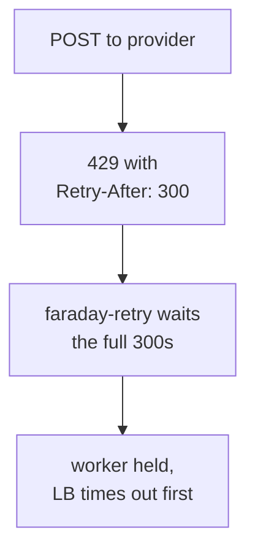

When a provider starts failing, two things decide what your app does. One is a line in `ruby_llm`. The other is a setting `ruby_llm` never touches. You will not find either by reading your own code.

Here is the line, in `connection.rb`:

```ruby
methods: Faraday::Retry::Middleware::IDEMPOTENT_METHODS + [:post],
```

Faraday's list is `delete get head options put`. POST is missing on purpose, because sending a POST twice can do the thing twice. `ruby_llm` puts it back, and it has no choice - every chat completion is a POST, so sticking to Faraday's list would mean never retrying a completion at all.

## What actually triggers a retry

Nine conditions, from `connection.rb`:

| Kind | Conditions |
|---|---|
| Network | `Errno::ETIMEDOUT`, `Timeout::Error`, `Faraday::TimeoutError`, `Faraday::ConnectionFailed` |
| Provider | `RateLimitError`, `ServerError`, `ServiceUnavailableError`, `OverloadedError` |
| Protocol | `Faraday::RetriableResponse` - dormant, see below |

A 400 for a bad request is not on that list, and should not be. Nor is a failed API key. Those are yours to fix, and retrying them just burns three round trips telling you so.

The ninth one never actually fires. `Faraday::RetriableResponse` only gets raised for statuses you put in `retry_statuses`, and `ruby_llm` never sets that option, so the list is empty. It is in the code, but nothing reaches it.

The defaults around them:

```ruby
max_retries              3
retry_interval           0.1
retry_backoff_factor     2
retry_interval_randomness 0.5
```

Three retries, at roughly 0.1s, 0.2s and 0.4s, with a little jitter. Those gaps are sized for a dropped connection, and for a dropped connection they are about right.

## The 429 case

A 429 is on the retry list too, and a rate limit does not clear in 0.4 seconds.

It does not have to. `faraday-retry` looks for `Retry-After` and the rate-limit reset header, takes the bigger of the two, and waits that long instead of using its own timings. A provider that says "come back in 30 seconds" gets 30 seconds.

That is the right thing to do, and you would want a client to do it. What it does not have is an upper limit:

```ruby
def max_interval
  (self[:max_interval] ||= Float::MAX).to_f
end
```

`Float::MAX`. `ruby_llm` never sets `max_interval`, so the check that would give up on a very long wait can never trigger. If a provider sends back `Retry-After: 300`, that call sits there for five minutes. Then it can do it twice more.

In a Sidekiq job, fine. In a web request, one rate-limited call can hold a worker longer than your load balancer is willing to wait. Your users get a timeout, and there is no LLM error anywhere in it to explain why.



## Reducing the worst case

Start with the knob you have:

```ruby
RubyLLM.configure do |config|
  config.max_retries = 2
  # everything else stays at the gem's defaults
end
```

Two retries instead of three drops one attempt and one wait from the worst case. The other knob worth knowing is `request_timeout`, which `RubyLLM.configure` does expose and which defaults to **300 seconds**. It bounds how long a single attempt can hang, not how long the gem sleeps between them.

Those two limits cover different things, and they add up. With the defaults you can get four attempts of up to 300 seconds each, plus up to three `Retry-After` waits in between. That is over half an hour in the worst case, not the five minutes one `Retry-After: 300` might suggest.

The setting that would cap the waiting is `max_interval`, and `RubyLLM.configure` does not give you access to it. Which is really an argument for getting the call out of the web request instead of trying to tune it.

Moving it to a job is not a free pass either. In [our own fan-out](/blog/multi-agent-llm-rails-rubyllm/), a scoring call wrapped in `with_connection` held a database connection for as long as the model took to reply, and fifteen fibers drained a pool of ten. Getting a slow call out of the request only helps if it also stops holding things it is not using.

## The retried POST is a real trade

Sometimes a request works on the provider's side and the response gets lost on the way back. Retrying sends it again. You pay for both, and if the call is not deterministic you can get two different answers.

`ruby_llm` makes that trade on purpose, and for a chat completion it is the right call - a request that failed usually produced nothing to pay for. It stops being right as soon as your call does something: a tool that writes a row, an agent step that sends an email. For those you want an idempotency key, or a job that checks whether it already ran.

## What none of this covers

Retries deal with a provider that is down. They do nothing about a provider that is up and answering differently than it did last week. That happened to us: [the model stopped answering the way it used to](/blog/debugging-rubyllm-agents-rails/), and every VCR cassette still replayed green.

They do nothing about the bill, either. If a big prompt times out after the provider has already generated the answer, you pay for each attempt - up to four with the defaults. The `Cost` object is what shows you which kind of token grew, and that is one of the [differences between RubyLLM and langchainrb](/blog/rubyllm-vs-langchainrb-rails-llm-stack/): langchainrb counts tokens and leaves the pricing to you.

This post is about what happens when a call fails. Limiting how many you make at once is the other half of the problem, and that lives in [fibers and Falcon](/blog/fibers-async-ruby-llm-streaming-rails/).

All of this is from [`connection.rb`](https://github.com/crmne/ruby_llm/blob/main/lib/ruby_llm/connection.rb) in ruby_llm 1.16.0 and [faraday-retry](https://github.com/lostisland/faraday-retry) 2.4.0. Check the versions you have installed before trusting the numbers.

One thing to confirm on your side: whether your provider actually sends `Retry-After` or a rate-limit reset header on a 429. Everything above describes what the client does with that header. Sending it is up to them.

<!-- Reference cadence: thoughtbot -->
