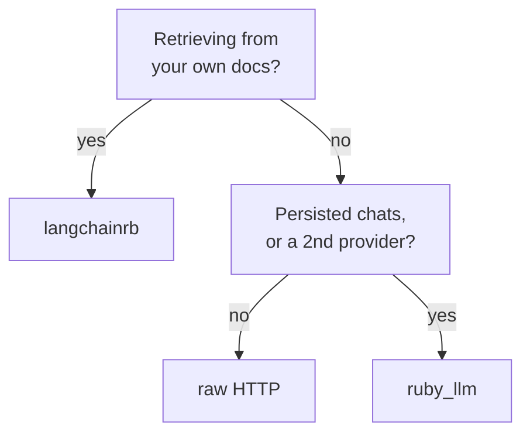

`ruby_llm` 1.16.0 ships `chat.rb`, `agent.rb`, `embedding.rb`, `cost.rb`, a model registry and an ActiveRecord integration. `langchainrb` 0.19.5 ships `vectorsearch/`, `chunker/`, `loader.rb`, `output_parsers/` and `evals/`.

`ruby_llm` talks to models. `langchainrb` finds your documents first, then hands them to a model. Work out which of those you need and the rest of the choice gets easy.



## What each one ships

| | ruby_llm 1.16.0 | langchainrb 0.19.5 |
|---|---|---|
| Providers shipped | 13 | 13 |
| Rails integration | generators, `acts_as`, Railtie | `langchainrb_rails`, a second gem |
| Cost in money | yes, per token class | token counts only |
| Vector search | no | 9 backends |
| Document loading + chunking | no | yes |

There is a third option, plain HTTP, and it is not in the table because every cell would say "you write it". It gets its own section further down.

Both ship thirteen providers, so that row will not help you choose.

Neither one gives you upgrades for free. `langchainrb` is on 0.19.5, so it makes no promise about breaking your code. `ruby_llm` is past 1.0, but four of its minor releases changed the database schema - it ships `upgrade_to_v1_7`, `v1_9`, `v1_10` and `v1_14` generators to migrate you, and an `acts_as_legacy` shim so the old API keeps working. Expect migrations either way.

## The Rails gap

`ruby_llm` ships `lib/generators/ruby_llm/` with `install`, `agent`, `chat_ui`, `schema` and `tool`, plus an `acts_as` concern and a Railtie. The install generator writes five migrations and four model classes, because a persisted chat needs `Model`, `Message` and `ToolCall` records behind it. Once they exist, marking the model is two lines:

```ruby
class Chat < ApplicationRecord
  acts_as_chat
end

chat = Chat.create!(model: "claude-sonnet-4-5")
chat.ask("Summarise this ticket")   # persisted, with messages
```

For langchainrb you need a second gem, `langchainrb_rails`, currently on 0.1.12. It also ships four generators - `pgvector`, `pinecone`, `chroma` and `prompt` - plus an ActiveRecord hook and a Railtie.

Now compare what those generators build. `ruby_llm` sets up a conversation. `langchainrb_rails` sets up a vector store. Each gem brought the thing it is good at into Rails, and neither one tried to do the other's job.

## Cost tracking, by token class

`ruby_llm`'s `Cost` object breaks spend down by token class - input, output, `cache_read`, `cache_write`, and `thinking`. Cached prompts and reasoning tokens bill at different rates from ordinary completion tokens.

This matters when your bill goes up and you need to know why. One total only tells you that you spent more. The breakdown can tell you that a prompt you edited stopped hitting the cache.

langchainrb counts tokens but does not price them. On the mainstream adapters you get `prompt_tokens`, `completion_tokens` and `total_tokens`, plus running totals on `Assistant`. Not on all of them, though - the Hugging Face, llama.cpp and Replicate responses never override those methods, so they inherit the base class and raise `NotImplementedError`.

Where the counts do arrive, there is still no price list in the gem, and no separate figure for cached or thinking tokens. You add those yourself.

## When langchainrb wins

If you are answering questions from your own documents, langchainrb already has the parts. Loaders to read the files, chunkers to split them, output parsers, an evals module, and vector search that works with pgvector out of the box - plus eight other backends if you ever move off it.

Pick `ruby_llm` instead and you will write the chunking and the pgvector wrapper yourself. That is a lot of work to end up with a worse version of a gem you could have installed. Our [LangChain in Ruby guide](/blog/getting-started-langchain-ruby-complete-guide/) walks through that setup.

## When raw HTTP wins

You are making one call, to one provider, and you do not plan to add another. A `Net::HTTP` POST to the endpoint is about fifteen lines, and there is no gem upgrade to worry about later.

What you write yourself is the dull but necessary part: retries, parsing streamed chunks, counting tokens, and changing provider later by editing every place you call one. That is fine for a single feature. It is a bad foundation for a product.

## Using both

You can run both, and plenty of apps do. langchainrb finds the documents, `ruby_llm` runs the conversation and tracks what it costs.

One rule keeps that tidy: only one gem should make the actual model call. If both are building their own requests to the same provider, you have two sets of retry rules and two streaming parsers, and when the request format changes you get to debug both.

That kind of change is easy to miss. We moved all nine schemas in one pipeline onto a different schema library, so every request body we sent changed shape - and [all 1549 tests stayed green](/blog/debugging-rubyllm-agents-rails/), because VCR matches on method and URI, and neither of those changed. Add a second gem building its own requests and there are twice as many places for that to hide.

Add something that scores the answers early. [Checking agent output](/blog/evaluating-rubyllm-agents-rails/) is how you find out whether a change to your retrieval helped. Without it you tweak a chunk size, read four answers, decide they look better, and ship.

Everything above comes from reading [ruby_llm](https://github.com/crmne/ruby_llm) 1.16.0 and [langchainrb](https://github.com/patterns-ai-core/langchainrb) 0.19.5. Both move quickly, so check the version you are actually installing before you take any of these counts as current.

<!-- Reference cadence: thoughtbot -->
